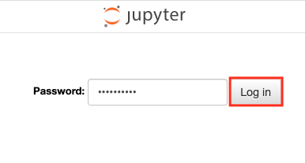
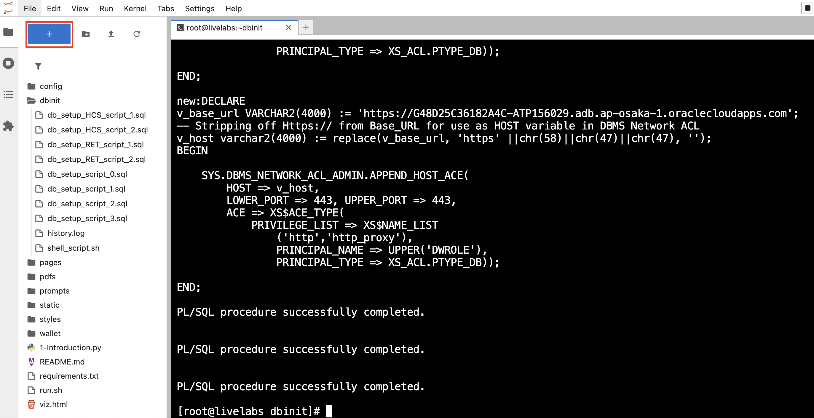
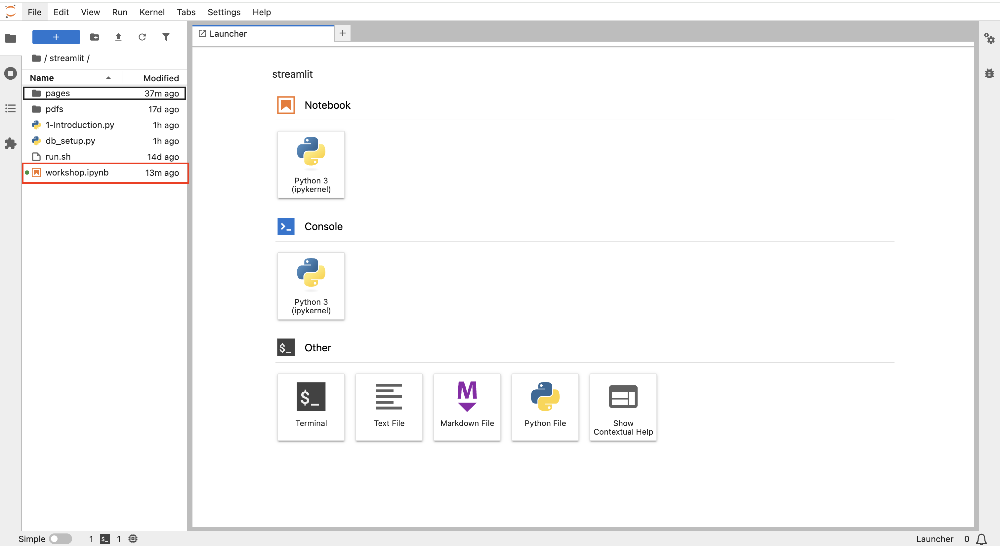
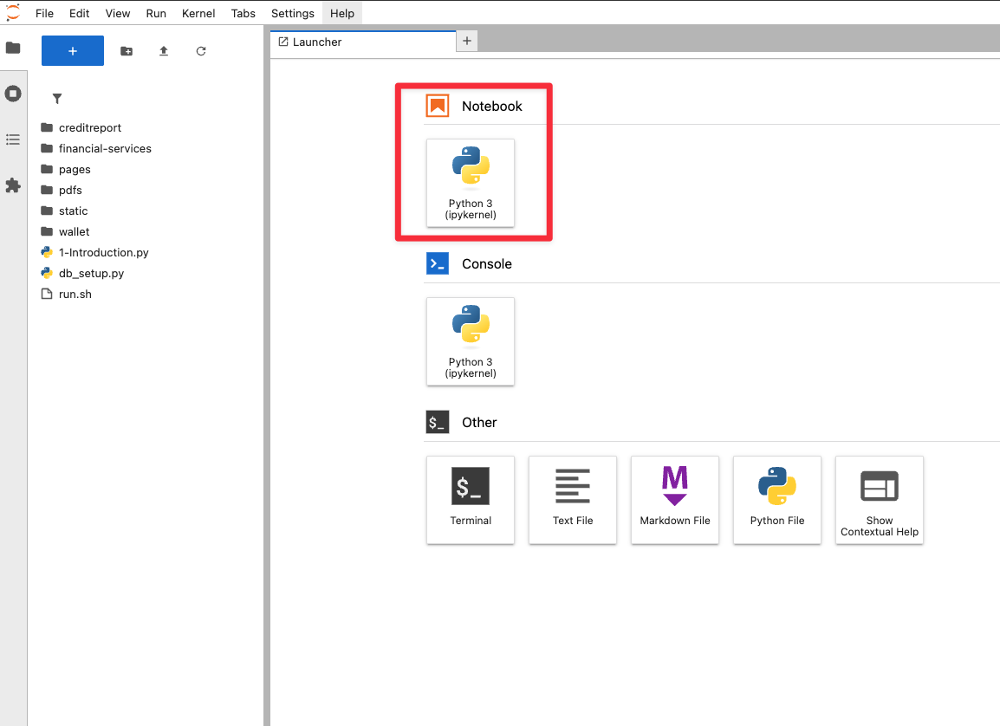
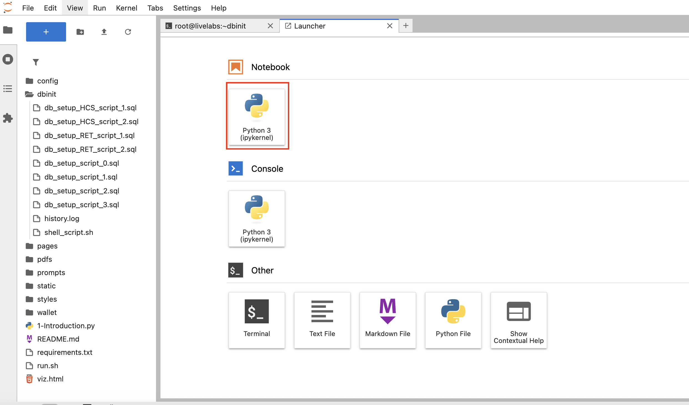

# Lab 1: Access the Notebook Environment

## Introduction

In this lab, you will prepare the Jupyter environment used throughout the workshop. You will confirm that JupyterLab opens correctly, select the right Python kernel, and install the packages required for Oracle connectivity, embeddings, retrieval, and agents.

This setup matters because every later lab depends on the same runtime. A clean start here saves time when you begin loading data, building indexes, and running agents.

Estimated Time: 20 minutes

### Objectives

In this lab, you will:

- sign in to a Jupyter environment
- open the workshop notebook in JupyterLab
- verify the Python kernel
- install the notebook dependencies

### Prerequisites

This lab assumes you have:

- a working JupyterLab environment on the same machine, or on a host that can reach your Oracle AI Database instance
- a terminal available inside JupyterLab or on the same host

## Task 1: Log In to JupyterLab

This task establishes the workspace for the rest of the workshop. You are confirming that you can reach the environment where you will install packages, run Python code, and keep state across labs.

1. Open your JupyterLab URL or start your local Jupyter session.

    If you are running JupyterLab locally, a common entry point is:

    ```text
    http://localhost:8888/lab
    ```

2. If Jupyter prompts for a password or token, enter the value for your environment and sign in.

    

3. Confirm that JupyterLab opens to the main file browser before you continue.

4. Do not continue until you can see the Jupyter interface and navigate between the file browser and Launcher.

## Task 2: Open the Workshop Notebook

In this task, you will open the notebook used throughout the workshop. Opening the correct file now keeps the setup, retrieval, and agent sections aligned with the lab flow.

1. If the `oracle-ai-developer-hub` repository is not already present on your machine, clone it in a terminal:

    ```bash
    <copy>
    git clone https://github.com/oracle-devrel/oracle-ai-developer-hub.git
    cd oracle-ai-developer-hub/notebooks
    </copy>
    ```

2. In JupyterLab, open the Launcher if it is not already visible.

    

3. Browse to the notebook file used by this workshop:

    - repo path: `oracle-ai-developer-hub/notebooks/oracle_rag_agents_zero_to_hero.ipynb`
    - workshop copy: `files/oracle_rag_agents_zero_to_hero.ipynb`

4. Open the notebook in the file browser.

5. Verify that the `Oracle RAG Agents: Zero to Hero` title is visible at the top before you execute anything.

    

## Task 3: Verify the Kernel and Install Dependencies

This task prepares the Python runtime. The packages you install here support Oracle connectivity, dataset streaming, embedding generation, and agent execution.

1. If JupyterLab asks you to choose a kernel, select **Python 3 (ipykernel)**.

2. If you need a fresh Python session or want to verify what the Launcher options look like, create a temporary notebook from the JupyterLab Launcher.

    

3. Run the dependency install cell near the top of the workshop notebook:

    ```python
    <copy>
    ! pip install -Uq oracledb pandas sentence-transformers datasets einops "numpy<2.0"
    </copy>
    ```

4. Before you reach the agent sections later in the workshop, install the agent packages in the active kernel as well:

    ```python
    <copy>
    %pip install -Uq --no-cache-dir openai openai-agents
    </copy>
    ```

5. Use the notebook output to confirm that package installation finished without hard failures.

    

6. Restart the kernel if the install output recommends it, then save the notebook.

## Learn More

- [JupyterLab Documentation](https://jupyterlab.readthedocs.io/en/stable/)
- [Oracle AI Developer Hub notebooks](https://github.com/oracle-devrel/oracle-ai-developer-hub/tree/main/notebooks)

## Acknowledgements

* **Author** - Richmond Alake
* **Contributor** - Linda Foinding
* **Last Updated By/Date** - Linda Foinding, April 2026
