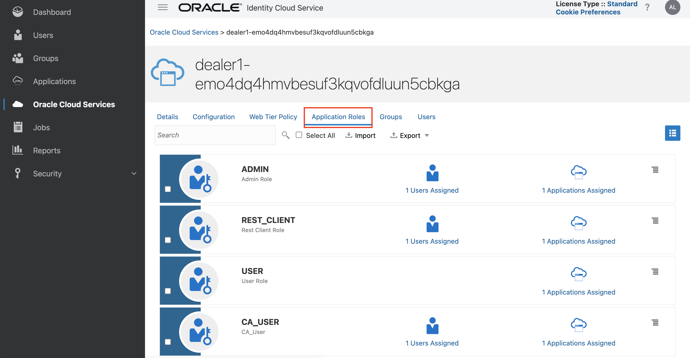

# Create a Blockchain Network connecting 3 Organizations

## Introduction

Oracle Blockchain Platform is based on the Hyperledger Fabric project from the Linux Foundation, and it extends the open-source version of Hyperledger Fabric in many ways.

As a preassembled PaaS, Oracle Blockchain Platform includes all the dependencies required to provision and manage a blockchain network: compute, storage, containers, identity services, event services, and management services. Oracle Blockchain Platform also includes the blockchain network console to support integrated operations. This helps you start developing applications within minutes.

*Estimated Lab Time:* 20 minutes

Watch the video below for a quick walk-through of the lab.
[Create a Blockchain Network connecting 3 Organizations](videohub:1_9ze86gbw)

### Objectives

- Create a permissioned network that consists of 1 founder and 2 partner blockchain instances

### Prerequisites
This lab assumes you have:
- An Oracle Cloud account
- You have completed:
    - Lab: Prepare Setup (*Free-tier* and *Paid Tenants* only)
    - Lab: Environment Setup


## Task 1: Environment Setup

This environment comes in the form of a virtual machine instance and includes a configured version of Blockchain App Builder, which you will use to deploy your first chaincode on Oracle Blockchain Platform.

You will also need to create a new [Compartment](https://docs.oracle.com/en-us/iaas/Content/Identity/Tasks/managingcompartments.htm) for this workshop. This will allow you to organize and isolate your OCI resources.

1. Now with access to your remote desktop session as shown below, fill in your tenancy/account name and click *Next*
    

2. Click on the down arrow next to *Oracle Cloud Infrastructure Direct Sign-in* to expand and reveal the login input fields, then provide your OCI credentials and click *Sign-in*. Make sure you select oracle idenity cloud service.
    

3. In the OCI services menu, select 'Identity & Security' and click on 'Compartments' to view all compartments available in your tenancy.

  

4. Click 'Create Compartment' and fill out the form as shown:
    - **Name** your compartment (e.g. Blockchain LiveLabs).
    - Add an optional **Description**.
    - Select a **Parent Compartment**. This is the 'root' compartment by default.

  

5. Click 'Create Compartment'.

  

## Task 2: Create a Blockchain Network Founder Instance

1. In the OCI services menu, select 'Developer Services' and click on 'Blockchain Platform.'

  

2. Ensure that the right **Compartment** is selected and click on 'Create Blockchain Platform.'

  

3. Give your platform a **Display Name** (e.g. 'marketplace'), optionally add a **Description**, and keep the remaining default selections. Click 'Create'.

  

4. Once the platform instance is 'Active' as shown, you can access the 'Service Console' to begin managing your blockchain network as the founder.

  


## Task 3: Create Participant Instances

1. Repeat the previous task twice, this time to create 2 participant instances.
    - Name your instances 'dealer1' and 'dealer2'
    - For both instances, select 'Join an existing network' under **Platform Role**
    - This task takes 10 minutes. During this time setup, configure, generate chaincode (*Tasks 4,5,6,7,8*) using  Blockchain App Builder

## Task 4: Open Blockchain App Builder in VSCode 

You will be using Oracle's Blockchain App Builder extension, accessible through Visual Studio Code, for this lab. First you will need to set up environments for each of the 3 blockchain platform instances you created in previous tasks above.

1. Open Terminal --> Enter code --> This opens VSCode

  
  

2. In Visual Studio Code, click on the **O** icon on the left-hand menu to use the Blockchain App Builder Extension.


## Task 5: Import Marketplace YAML Specification File

The flow for developing smart contracts begins with creating a [specification file](https://docs.oracle.com/en/cloud/paas/blockchain-cloud/usingoci/input-configuration-file.html) that describes car marketplace assets being maintained on the blockchain ledger.

[`Car_Marketplace.yml`](files/Car_Marketplace.yml) describes [marketplace assets](https://docs.oracle.com/en/cloud/paas/blockchain-cloud/usingoci/input-configuration-file.html): Car, Dealer, Invoice, and Purchase Order (PO). Each object has properties that characterize the assets, data types and validations. You can see sample specification files (and write your own specifications) in either YAML or JSON using the Blockchain App Builder package.

1. Locate the sample specification, [`Car_Marketplace.yml`](files/Car_Marketplace.yml?download=1), in the **Samples** folder.

2. In Visual Studio Code, click on the **O** icon on the left-hand menu to use the Blockchain App Builder Extension.

3. Hover over the **Specifications** pane, click on the three dots, and then **Import Specification**. Alternatively, copy the path of the specification file and import manually.

4. Click on the yml specification imported. You can see the specficiations defined for each object and attribute. If you want change any specification of an attribute, you can do so. For example: Change line number 102 to - format: ["PO%1%t", "recipient"]. [Specifications Help](https://docs.oracle.com/en/cloud/paas/blockchain-cloud/usingoci/input-configuration-file.html)

  Make sure the **Details** of your specification read:

  


## Task 6: Generate Marketplace Chaincode Project

The specification file is then used to scaffold a smart contract project ('`car_marketplace_cc`') and generate source code for models and controllers.

1. Hover over the **Chaincodes** pane, click on the **+**, and fill out the form as follows:
    - **Name** your chaincode (e.g. `car_marketplace_cc`).
    - Select Go as the **Language**.
    - Select `Car_Marketplace.yml` as the **Specification**.
    - Choose a **Go Domain** (e.g. Samples).

  


2. Click 'Create' and wait for the chaincode to generate. Check the 'Output' pane at the bottom for more details.

  

3. Select '`car_marketplace_cc`.model.go' under '`car_marketplace_cc`/src/model'. The Model file contains the property definitions of all the assets defined in the spec file.
Select '`car_marketplace_cc`.controller.go' under '`car_marketplace_cc`/src/controller.' The Controller file defines all the behavior and methods for those assets. '`Car_Marketplace.yml`' spec file allows defining additional custom methods that users implement to provide business logic of smart contracts.

## Task 7: View Custom Methods in Marketplace

1. Open the Car Marketplace specification file and scroll to the bottom. This is where your customMethods are listed.

2. First, add the imports needed for the custom methods.

     ```
    <copy>
    "encoding/json"
    "fmt"
    "time"
    "example.com/car_marketplace_cc/lib/util/date"
    </copy>

    ```


3. We've modified existing CRUD operations and defined custom methods for the following functions:
  - 'CreateCar': Adds car to dealer's inventory. Copy and paste these custom methods in the controller file, overwriting the stubs for these methods. The function retrieves dealer from blockchain, appends the car to dealer's inventory and records car on ledger.

    ```
    <copy>
    func (t *Controller) CreateCarWrapper(asset Car) (interface{}, error) {
        //Verify dealer exists
        owner, err := t.GetDealerById(asset.OwnerId)
        if err != nil {
          return nil, fmt.Errorf("dealer with id: %s does not exist", asset.OwnerId)
        }

        //append car to owner's inventory
        owner.Inventory = append(owner.Inventory, asset.Vin)

        //Update and commit dealer inventory to blockchain
        t.UpdateDealer(owner)


        return t.Ctx.Model.Save(&asset)
 

    }
    </copy>
    ```

  - 'CreatePO': Creates purchase order once buyer places order on vehicle. The function verifies car exists on ledger, places car off the market, and records purchase order on ledger.

    ```
    <copy>
    func (t *Controller) CreatePOWrapper(asset PO) (interface{}, error) {

        //Verify that car exists
        car, err := t.GetCarById(asset.Vin)
        if err != nil {
          return nil, fmt.Errorf("car with id: %s does not exist", asset.Vin)
        }

        //Car no longer on sale as purchase order is created
        car.ForSale = false
        t.UpdateCar(car)
        

        return t.Ctx.Model.Save(&asset)

    }
    </copy>
    ```

  - 'UpdatePO': Updates purchase order. If order status is:
    - 'Delivered': Car is successfully delivered to buyer, an invoice is generated, and custom function 'CarTransfer' is invoked.
    - 'Rejected': Order is canceled, and car is placed back on the market.

    ```
    <copy>
    func (t *Controller) UpdatePOWrapper(asset PO) (interface{}, error) {

        //Verifies purchase order exists
        _, err := t.GetPOById(asset.PO)
        if err != nil {
          return nil, fmt.Errorf("po with id: %s does not exist", asset.PO)
        }

        //If vehicle is delivered to buyer
        if asset.OrderStatus == "Delivered" {

          var invoiceObject Invoice

          //Verify car exists in ledger
          car, err := t.GetCarById(asset.Vin)
          if err != nil {
            return nil, fmt.Errorf("car with id: %s does not exist", asset.Vin)
          }

          car.ForSale = true

          t.UpdateCar(car)

          //Create invoice sent to buyer
          invoiceObject.Vin = asset.Vin
          invoiceObject.Po_number = asset.PO
          invoiceObject.Price = car.Price
          invoiceObject.Recipient = asset.Purchaser
          invoiceObject.Status = false

          invoiceObject.InvoiceId = asset.InvoiceId

          t.CreateInvoice(invoiceObject)

          currentTime := time.Now().String()

          var ts_formatted string

          for i, c := range currentTime {
            fmt.Printf("Start Index: %d Value:%s\n", i, string(c))

            if string(c) == " " {
              fmt.Println(ts_formatted)
              break
            }
            ts_formatted += string(c)
          }

          //Invoke Custom Method: Car Transfer
          t.CarTransfer(asset.Vin, asset.Purchaser, car.OwnerId, asset.PO, car.Price, ts_formatted)

        }

        //If vehicle is rejected by buyer
        if asset.OrderStatus == "Rejected" {

          car, err := t.GetCarById(asset.Vin)
          if err != nil {
            return nil, fmt.Errorf("car with id: %s does not exist", asset.Vin)
          }

          //Set car for sale back to true
          car.ForSale = true
          t.UpdateCar(car)

        }
        return t.Ctx.Model.Update(&asset)

    }
    </copy>
    ```

  - 'CarTransfer': Transfer vehicle ownership from one dealer to another. Validations are written to check that car being sold and dealer receiving vehicle exist in ledger and that the owner isn't selling a vehicle to themselves. We update car object properties to reflect the new owner of the vehicle, removing the car from the seller's inventory, adding it to the buyer's inventory. Finally, we commit car and dealer changes to the ledger.

    ```
    <copy>
    func (t *Controller) CarTransfer(vin string, buyerId string, sellerId string, PO string, price int, dateString string) (interface{}, error) {

        //Date formatting and handling
        dateBytes, err := json.Marshal(dateString)
        if err != nil {
          return nil, fmt.Errorf("error in marshalling %s", err.Error())
        }

        var dateValue date.Date
        err = json.Unmarshal(dateBytes, &dateValue)
        if err != nil {
          return nil, fmt.Errorf("error in unmarshalling the date %s", err.Error())
        }

        if buyerId == sellerId {
          return nil, fmt.Errorf(`buyer and seller cannot be same`)
        }

        //Verify car exists
        car, err := t.GetCarById(vin)
        if err != nil {
          return nil, err
        }

        //Verify dealer exists
        buyer, err := t.GetDealerById(buyerId)
        if err != nil {
          return nil, err
        }

        if car.OwnerId != sellerId {

          return nil, fmt.Errorf("car with vin %s does not belong to the seller %s", vin, sellerId)
        }
        if car.OwnerId == buyerId {

          return nil, fmt.Errorf("car with vin %s already exist with owner %s", vin, buyerId)
        }

        //Update car object properties

        car.OwnerId = buyerId
        car.Price = price
        car.LastSold = dateValue

        buyer.Inventory = append(buyer.Inventory, vin)

        seller, err := t.GetDealerById(sellerId)
        if err != nil {
          return nil, err
        }

        //Remove car from seller's inventory
        for i := 0; i < len(seller.Inventory)-1; i++ {
          if seller.Inventory[i] == vin {
            seller.Inventory = append(seller.Inventory[:i], seller.Inventory[i+1:]...)
          }
        }

        //Commit changes to the ledger
        t.UpdateDealer(seller)
        t.UpdateCar(car)
        t.UpdateDealer(buyer)

        return nil, err

    }
    </copy>
    ```

## Task 8: Deploy Marketplace Chaincode in local Environment

Blockchain App Builder chaincode deployment starts the Hyperledger Fabric basic network, other services, and installs and instantiates the chaincode for you.

1. In the **Chaincode Details** pane, select 'Deploy.'

2. In the deployment wizard:
    - Ensure the correct chaincode is selected.
    - Select your target environment. In this case, choose **Local Environment**.
    - Select the channel you want to deploy to. A channel named **mychannel** is created by default with the extension's installation, and can be used for testing.

3. Ensure that your form reads as shown and click 'Deploy.'

  

  If you receive an error message in the **Output** console window (located at the bottom of your Visual Studio window), open the Docker Desktop app and copy/paste the given command into your terminal to start the Docker daemon. Restart Visual Studio and repeat steps 1-3 as necessary.


## Task 9: Add Participant Organizations to Network - Task4 Continuation

Blockchain instances should have been created by now (Task4).  Configure the Blockchain Instances (Step3) to join the partner organizations to your network, you need to export their settings and import them into the founder.

1. Access the 'Service Console' from the 'dealer1' instance. You will see a wizard and steps 'To join a network':

  

2. Click on **2** and then 'Export' to download this organization's certificates to a JSON file.

  

3. Now, repeat steps 1 and 2 from the 'dealer2' instance.

4. In the 'marketplace' instance, navigate to **Network** and click 'Add Organizations.'

  

5. Upload the certificate for 'dealer1,' click on the '+' button, and upload the certificate for 'dealer2.' Then click 'Add.'

  

6. Ensure that the organizations were successfully added and click 'Export Orderer Settings,' then 'Finish.'

  

7. Now, in the 'dealer1' instance, click on **3** and then 'Import' the Orderer Settings file you just exported from 'marketplace.'

  

8. Go through **4** to complete the wizard and repeat for 'dealer2.'

9. In 'marketplace,' under **Network**, click on the refresh button on the right-hand side. You should see 'dealer1' and 'dealer2' show up as organizations.

  

10. Switch the view from table to topology, where you should find that the dealers and marketplace are joined at the organization level.

  


## Task 10: Create a Channel

We now need to join the organizations at the channel level to allow communication between the founder and participants.

1. From the founder ('marketplace') console, select the **Channels** tab. Click 'Create a New Channel.'

  

2. Fill out the form as shown and click 'Submit.'
    - Set 'car-marketplace' as your **Channel Name**
    - Check both boxes next to 'dealer1' and 'dealer2'
    - Select both 'peer0' and 'peer1' under **Peers to Join Channel**

  

3. Click 'Yes' to confirm.

  

4. Check that the channel table displays the new channel. Click on 'car-marketplace' to view channel details.

  

5. Note that all 3 necessary organizations are listed.

  


## Task 11: Join Participant Organizations - Peer Nodes to Channel

You're almost done setting up your blockchain network! Simply use the participant instances to join the channel created in the previous step.

1. Go to the 'dealer1' console and select the **Channels** tab. Click the hamburger icon on the right-hand side of the 'car-marketplace' row and select 'Join Peers to Channel.'

  

3. Select both 'peer0' and 'peer1' to join the channel and click 'Join.'

  

4. Repeat Steps 1-3 from the 'dealer2' console.


## Task 12: Set Anchor Peers

Each member using a channel (whether founder or participant) must designate at least one anchor peer. Anchor peers are primary network contact points, and are used to discover and communicate with other network peers on the channel.

1. Go to the founder ('marketplace') console and select the **Channels** tab. Click 'car-marketplace' under the channel table.

  

2. Click 'Peers' in the left-hand pane.

  

3. Locate 'peer0' and ensure that the 'Anchor Peer' box is selected.

  

4. Click 'Set Anchor Peer' to save changes.

  

5. Repeat for both participant organizations, 'dealer1' and 'dealer2'.


## Task 13: Create Dealership Accounts

Use IDCS to create and add both 'john_\dealer1' and 'sam_\dealer2' users, and then assign them roles to control usage of their OBP instances: 'dealer1' and 'dealer2'.

1. From the OCI dashboard, select the user icon in the top right-hand corner and click on **Service User Console**.

  

2. Under **My Oracle Services**, search 'identity' and select **Admin Console**.

  

3. You will be re-directed to the IDCS Dashboard. Click on the hamburger menu in the top left-hand corner.

  

4. Select **Users**.

  

5. Click on **Add**.

  

6. Deselect **Use the email address as the user name**, provide the dealership name (e.g. 'john\_dealer1') for **Last Name** and **User Name**, as well as the **Email** associated to your OCI account and select **Finish**

  

7. 'john\_dealer1' is added successfully.

  

8. Open your email and activate the 'john\_dealer1' account.

  

9. You will be asked to reset your password. Note: Password reset will fail if OCI sessions are still running, please sign out of your OCI account.

  

10. Once the account password for 'john\_dealer1' is reset, please close the window.

  

11. Open a new tab and navigate to the [OCI login page](cloud.oracle.com). Provide your tenancy account name and select **Next**. Sign-in with your admin (*not* the 'john\_dealer1') credentials.

  

12. Navigate to IDCS (follow steps 1-3), select **Oracle Cloud Services** and click on your OBP instance that begins with 'john\_dealer1' followed by a trail of characters.

  

13. Click on application roles to grant 'john\_dealer1' **ADMIN** and **REST_CLIENT** privileges. Doing so will give 'john\_dealer1' access to call all REST proxy endpoints available on the REST proxy node along with any necessary admin access control. Please see the [OBP documentation](https://docs.oracle.com/en/cloud/paas/blockchain-cloud/administeroci/set-users-and-application-roles.html#GUID-CF1B1C71-2EFF-456F-B557-7EA07573B373) to learn more.

  

14. Click on the hamburger icon in the right-hand corner to assign both the **ADMIN** and **REST_CLIENT** roles to 'john\_dealer1'.

  

15. In the search box, look for the 'john\_dealer1' OBP instance, select the user and click on **OK** to assign role.

  

16. Repeat tasks 1-16 to create the 'sam\_dealer2' user and add to the 'dealer2' instance.

17. Repeat tasks 1-16 to create the 'marketplace' user and add to the 'marketplace' instance. Assign john\_dealer1 and sam\_dealer2 roles to marketplace REST\_CLIENT.


You may now proceed to the next lab.


## Acknowledgements
* **Author** - Oracle Blockchain Product Management
* **Contributors** - Amal Tyagi, Dev Sony  Teodora Gheorghe, Adrien Lhemann, Diego Morales, Lokeswara Nushisarva, Siddesh C. Prabhu Dev Ujjni, Rene Fontcha
* **Last Updated By/Date** - Rene Fontcha, September 2022
