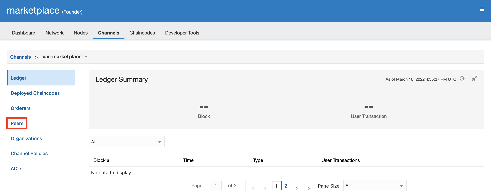

# Car Dealer Marketplace 

## Introduction: Oracle Blockchain Platform (OBP)

Oracle Blockchain Platform is based on the Hyperledger Fabric project from the Linux Foundation, and it extends the open-source version of Hyperledger Fabric in many ways.

As a preassembled PaaS, Oracle Blockchain Platform includes all the dependencies required to provision and manage a blockchain network: compute, storage, containers, identity services, event services, and management services. Oracle Blockchain Platform also includes the blockchain network console to support integrated operations. This helps you start developing applications within minutes.

Estimated Lab Time: 45 minutes

## Objectives

In Lab 1, you will:
* Create a permissioned network that consists of 1 founder and 2 partner blockchain instances

## Task 1: Environment Setup

Before continuing this workshop, confirm that you have access to the pre-configured environment provided by LiveLabs administrators. This environment comes in the form of a virtual machine instance and includes a configured version of Blockchain App Builder, which you will use to deploy your first chaincode on Oracle Blockchain Platform.

You will also need to create a new [Compartment](https://docs.oracle.com/en-us/iaas/Content/Identity/Tasks/managingcompartments.htm) for this workshop. This will allow you to organize and isolate your OCI resources.

1. In the OCI services menu, select 'Identity & Security' and click on 'Compartments' to view all compartments available in your tenancy. 

  

2. Click 'Create Compartment' and fill out the form as shown:
    - **Name** your compartment (e.g. Blockchain LiveLabs).
    - Add an optional **Description**.
    - Select a **Parent Compartment**. This is the 'root' compartment by default.

  

3. Click 'Create Compartment'. 

  

## Task 2: Create a Blockchain Network Founder Instance

1. In the OCI services menu, select 'Developer Services' and click on 'Blockchain Platform.'

  

2. Ensure that the right **Compartment** is selected and click on 'Create Blockchain Platform.' 

  

3. Give your platform a **Display Name** (e.g. 'marketplace'), optionally add a **Description**, and keep the remaining default selections. Click 'Create'.

  

4. Once the platform instance is 'Active' as shown, you can access the 'Service Console' to begin managing your blockchain network as the founder.

  

## Task 3: Create Participant Instances

1. Repeat the previous task twice, this time to create 2 participant instances.
    - Name your instances 'dealer1' and 'dealer2'
    - For both instances, select 'Join an existing network' under **Platform Role**

*Go To AppBuilder*********

## Task 4: Add Participant Organizations to Network

To join the partner organizations to your network, you need to export their settings and import them into the founder.

1. Access the 'Service Console' from the 'dealer1' instance. You will see a wizard and steps 'To join a network':

  

2. Click on **2** and then 'Export' to download this organization's certificates to a JSON file. 

  

3. Now, repeat steps 1 and 2 from the 'dealer2' instance.

4. In the 'marketplace' instance, navigate to **Network** and click 'Add Organizations.'

  

5. Upload the certificate for 'dealer1,' click on the '+' button, and upload the certificate for 'dealer2.' Then click 'Add.'

  

6. Ensure that the organizations were successfully added and click 'Export Orderer Settings,' then 'Finish.'

  

7. Now, in the 'dealer1' instance, click on **3** and then 'Import' the Orderer Settings file you just exported from 'marketplace.'

  

8. Go through **4** to complete the wizard and repeat for 'dealer2.'

9. In 'marketplace,' under **Network**, click on the refresh button on the right-hand side. You should see 'dealer1' and 'dealer2' show up as organizations.

  

10. Switch the view from table to topology, where you should find that the dealers and marketplace are joined at the organization level.

  

## Task 5: Create a Channel

We now need to join the organizations at the channel level to allow communication between the founder and participants. 

1. From the founder ('marketplace') console, select the **Channels** tab. Click 'Create a New Channel.' 
  
  

2. Fill out the form as shown and click 'Submit.'
    - Set 'car-marketplace' as your **Channel Name**
    - Check both boxes next to 'dealer1' and 'dealer2'
    - Select both 'peer0' and 'peer1' under **Peers to Join Channel**

  

3. Click 'Yes' to confirm.

  

4. Check that the channel table displays the new channel. Click on 'car-marketplace' to view channel details.

  

5. Note that all 3 necessary organizations are listed.

  

## Task 6: Join Participant Organizations to Channel

You're almost done setting up your blockchain network! Simply use the participant instances to join the channel created in the previous step.

1. Go to the 'dealer1' console and select the **Channels** tab. Click the hamburger icon on the right-hand side of the 'car-marketplace' row and select 'Join Peers to Channel.'

  

3. Select both 'peer0' and 'peer1' to join the channel and click 'Join.'

  

4. Repeat Steps 1-3 from the 'dealer2' console.

## Task 7: Set Anchor Peers

Each member using a channel (whether founder or participant) must designate at least one anchor peer. Anchor peers are primary network contact points, and are used to discover and communicate with other network peers on the channel.

1. Go to the founder ('marketplace') console and select the **Channels** tab. Click 'car-marketplace' under the channel table.

  

2. Click 'Peers' in the left-hand pane.

  

3. Locate 'peer0' and ensure that the 'Anchor Peer' box is selected.

  

4. Click 'Set Anchor Peer' to save changes.

  

5. Repeat for both participant organizations, 'dealer1' and 'dealer2'.

## Task 8: Create Dealership Accounts

Use IDCS to create and add both 'john_\dealer1' and 'sam_\dealer2' users, and then assign them roles to control usage of their OBP instances: 'dealer1' and 'dealer2'.

1. From the OCI dashboard, select the user icon in the top right-hand corner and click on **Service User Console**.

  

2. Under **My Oracle Services**, search 'identity' and select **Admin Console**. 

  

3. You will be re-directed to the IDCS Dashboard. Click on the hamburger menu in the top left-hand corner.

  

4. Select **Users**.

  

5. Click on **Add**.

  

6. Deselect **Use the email address as the user name**, provide the dealership name (e.g. 'john\_dealer1') for **Last Name** and **User Name**, as well as the **Email** associated to your OCI account and select **Finish** 

  

7. 'john\_dealer1' is added successfully. 

  

8. Open your email and activate the 'john\_dealer1' account.

  

9. You will be asked to reset your password. Note: Password reset will fail if OCI sessions are still running, please sign out of your OCI account.

  

10. Once the account password for 'john\_dealer1' is reset, please close the window.

  

11. Open a new tab and navigate to the [OCI login page](cloud.oracle.com). Provide your tenancy account name and select **Next**. Sign-in with your admin (*not* the 'john\_dealer1') credentials.

  

12. Navigate to IDCS (follow steps 1-3), select **Oracle Cloud Services** and click on your OBP instance that begins with 'john\_dealer1' followed by a trail of characters.

  

13. Click on application roles to grant 'john\_dealer1' **ADMIN** and **REST_CLIENT** privileges. Doing so will give 'john\_dealer1' access to call all REST proxy endpoints available on the REST proxy node along with any necessary admin access control. Please see the [OBP documentation](https://docs.oracle.com/en/cloud/paas/blockchain-cloud/administeroci/set-users-and-application-roles.html#GUID-CF1B1C71-2EFF-456F-B557-7EA07573B373) to learn more.

  

14. Click on the hamburger icon in the right-hand corner to assign both the **ADMIN** and **REST_CLIENT** roles to 'john\_dealer1'.

  

15. In the search box, look for the 'john\_dealer1' OBP instance, select the user and click on **OK** to assign role.

  

16. Repeat tasks 1-16 to create the 'sam\_dealer2' user and add to the 'dealer2' instance.

## Learn More

## Acknowledgements
* **Author** - Amal Tyagi, Cloud Engineer
* **Contributors** -  Teodora Gheorghe, Adrien Lhemann, Diego Morales, Lokeswara Nushisarva, Siddesh C. Prabhu Dev Ujjni
* **Last Updated By/Date** - Amal Tyagi, 06-22