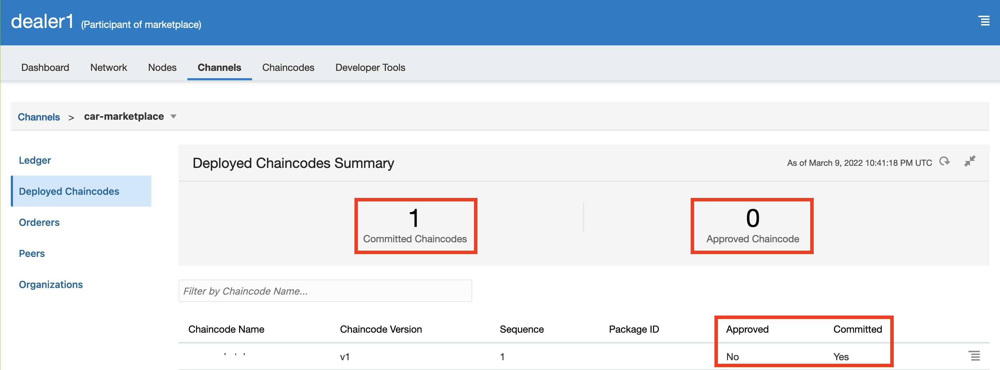
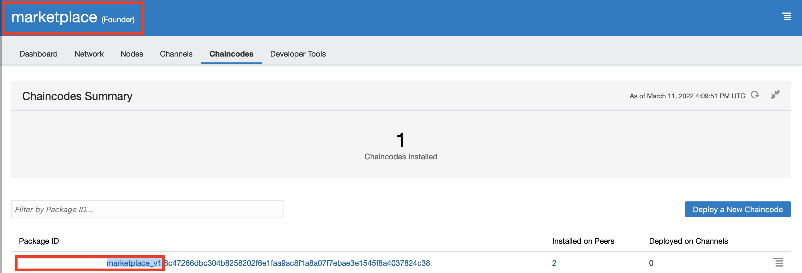
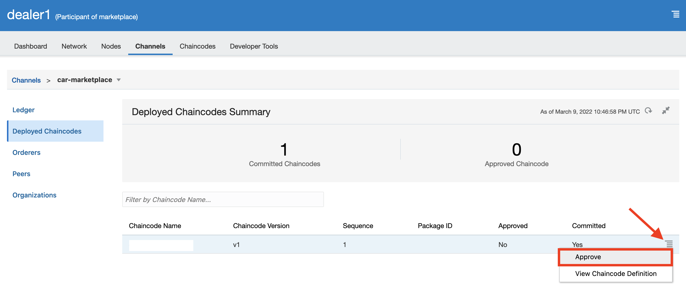

# Car Dealer Marketplace 

## Provisioning App Builder Compute VM

Image##

## Connect to VM

## Introduction: Oracle Blockchain App Builder

Blockchain App Builder is a tool set that assists Oracle Blockchain Platform users with rapid development, testing, debugging, and deployment of chaincode on Oracle Blockchain Platform networks. Blockchain App Builder is accessible through Visual Studio Code as an extension and through a lightweight command line interface. 

Estimated Lab Time: 

## Objectives

In this lab, you will:
* Scaffold a chaincode application from a YAML specification file, write custom code, and instantiate a chaincode (smart contract) on peer nodes

## Task 1: Environment Setup

You will be using Oracle's Blockchain App Builder extension, accessible through Visual Studio Code, for this lab. First you will need to set up environments for each of the 3 blockchain platform instances you created in Lab 1.

1. In Visual Studio Code, click on the **O** icon on the left-hand menu to use the Blockchain App Builder Extension. 

2. Hover over the **Environments** pane, click on the '+' button, and fill out the form as follows:
    - Add a **Name** (e.g. Marketplace).
    - Optionally, add a **Description**.
    - Paste the **Remote URL** of your marketplace founder instance, which you can find using the OCI services console.
    - Enter your local **User Name** (e.g. 'local.user') and then enter the **Password**.

3. Click 'Save' and repeat for the two participant instances (e.g. Dealer1 and Dealer2).

  

## Task 2: Import YAML Specification File

The flow for developing smart contracts begins with creating a [specification file](https://docs.oracle.com/en/cloud/paas/blockchain-cloud/usingoci/input-configuration-file.html) that describes car marketplace assets being maintained on the blockchain ledger. 

'Car_Marketplace.yml' describes marketplace assets: Car, Dealer, Invoice, and Purchase Order (PO). Each object has properties that characterize the assets, data types and validations. You can see sample specification files (and write your own specifications) in either YAML or JSON using the Blockchain App Builder package. 

Explain the CarMarketplace yaml - Hover

1. Locate the sample specification, Car_Marketplace.yml, in the **Samples** folder.

2. In Visual Studio Code, click on the **O** icon on the left-hand menu to use the Blockchain App Builder Extension. 

3. Hover over the **Specifications** pane, click on the three dots, and then **Import Specification**. Alternatively, copy the path of the specification file and import manually. 

Make sure the **Details** of your specification read:

  

## Task 3:Generate Chaincode Project

The specification file is then used to scaffold a smart contract project ('car_marketplace_cc') and generate source code for models and controllers. 

1. Hover over the **Chaincodes** pane, click on the **+**, and fill out the form as follows: 
    - **Name** your chaincode (e.g. car_marketplace_cc).
    - Select Go as the **Language**.
    - Select Car_Marketplace.yml as the **Specification**.
    - Choose a **Go Domain** (e.g. Samples).

2. Click 'Create' and wait for the chaincode to generate. Check the 'Output' pane at the bottom for more details.

3. Click 'Create' and wait for the chaincode to generate. Check the 'Output' pane at the bottom for more details. 

4. Select 'car_marketplace_cc.model.go' under 'car_marketplace_cc/src'. The Model file contains the property definitions of all the assets defined in the spec file.
Select 'car_marketplace_cc.controller.go' under 'car_marketplace_cc/src.' The Controller file defines all the behavior and methods for those assets. 'Car_Marketplace.yml' spec file allows defining additional custom methods that users implement to provide business logic of smart contracts. 

## Task 4: View Custom Methods

1. Open the Car Marketplace specification file and scroll to the bottom. This is where your customMethods are listed.

2. We've modified existing CRUD operations and defined custom methods for the following functions:
  - 'CreateCar': Adds car to dealer's inventory. The function retrieves dealer from blockchain, appends the car to dealer's inventory and records car on ledger.
  - 'CreatePO': Creates purchase order once buyer places order on vehicle. The function verifies car exists on ledger, places car off the market, and records purchase order on ledger.
  - 'UpdatePO': Updates purchase order. If order status is:
    - 'Delivered': Car is successfully delivered to buyer, an invoice is generated, and custom function 'CarTransfer' is invoked.
    - 'Rejected': Order is canceled, and car is placed back on the market.
  - 'CarTransfer': Transfer vehicle ownership from one dealer to another. Validations are written to check that car being sold and dealer receiving vehicle exist in ledger and that the owner isn't selling a vehicle to themselves. We update car object properties to reflect the new owner of the vehicle, removing the car from the seller's inventory, adding it to the buyer's inventory. Finally, we commit car and dealer changes to the ledger.

3. Copy and Paste the custom Methods. - Location and details - Use the feature in the Lively MD Verbatim

## Task 5: Deploy Chaincode on Peer Nodes Partitioned by Channels -- check whether Docker is installed on image; else create local env

Blockchain App Builder chaincode deployment starts the Hyperledger Fabric basic network, other services, and installs and instantiates the chaincode for you.

1. In the **Chaincode Details** pane, select 'Deploy.' 

2. In the deployment wizard: 
    - Ensure the correct chaincode is selected.
    - Select your target environment. In this case, choose **Local Environment**.
    - Select the channel you want to deploy to. A channel named **mychannel** is created by default with the extension's installation, and can be used for testing.

3. Ensure that your form reads as shown and click 'Deploy.' 

  

If you receive an error message in the **Output** console window (located at the bottom of your Visual Studio window), open the Docker Desktop app and copy/paste the given command into your terminal to start the Docker daemon. Restart Visual Studio and repeat steps 1-3 as necessary.

If you get a user session error, you may need to log into the 'Marketplace' environment by hovering over 'Marketplace' (lower-left corner) and clicking on the 'i' details icon.

## Task 6: Invoke and Query Ledger using App Builder

Once your chaincode project is running on a local network, you can test it.

Blockchain App Builder contains a built-in wizard to assist you with invoking or querying your chaincode.

1. Select your chaincode project in the **Chaincodes** pane. In the **Chaincode Details** pane, select **Execute**.

2. In the deployment wizard: 
    - Ensure the correct chaincode name is selected.
    - Select your target environment. In this case, choose Local Environment.
    - The channel will default to **mychannel**.
    - In the **Function** field, select **addCar** from the drop-down list. Every method available in the chaincode is listed.
    - In the **Parameters** field, select the **More Actions** (…) button. This will launch a window with available properties for your selected method. Enter sample properties as shown and click **Save**.

    

3. Click **Invoke**. --> Test Some sample invoke methods - App Builder

4. Display Request and Response - Request/Response.

## Import chaincode package from app builder -- Steps need to be added

## Deploy Chaincode on All Instances --don't need to deploy from App Builder

## Task 7: Deploy to Founder Instance

Now that we have tested our project locally, we can connect to our remote instances.

1. In the OCI services menu, select 'Developer Services' and click on 'Blockchain Platform.'

2. Ensure that the right **Compartment** is selected and click on the 'Marketplace' founder instance. 

3. Access the 'Service Console' and copy the URL of this platform instance.

4. Now, repeat Tasks 5 and 6, changing the target environment from 'Local Environment' to 'Marketplace.' Also change the channel to 'car-marketplace' as set in Lab 1, Task 5. 

## Task 8: Install and Deploy onto Participant Instances

To install and re-deploy the chaincode on partner instances, we need to export the chaincode as a package and then approve the chaincode definition from the partner instances (in this case, 'dealer1' and 'dealer2').

1. Right-click the directory containing your chaincode and click 'Package.' Make note of your **Output Folder**; in this case we exported 'car_marketplace_cc.zip' into the **Samples** folder. 

2. Access the 'Service Console' for the 'dealer1' instance.

3. Click the **Channels** tab and then the 'car-marketplace' channel.

4. Select on 'Deployed Chaincodes' on the left-hand navigation pane. You will see that 1 chaincode has been committed to the channel, but has not yet been approved by the participant organization.

5. Now click the **Chaincodes** tab and then 'Deploy a New Chaincode.'

6. Select 'Advanced Deployment.'

7. Fill out the form as follows:
    - For **Package Label**, open up the 'Service Console' for the 'Marketplace' founder instance, click the **Chaincodes** tab, and copy the text as shown. You may use car_marketplace_cc_car-marketplace_v1, or any other name, but make sure to use the same name when repeating these steps for 'dealer2.'

    

    - Keep 'GoLang' as the **Chaincode Language**.
    - Select both available peers as the **Target Peers**.
    - Upload the package .zip file you exported from the App Builder VS Code extension. We stored this in the **Samples** folder.

8. Click 'Close.' We will only be installing (not deploying) the chaincode onto the participant instances.

9. Now click 'Channels,' then the 'car-marketplace' channel, and navigate to 'Deployed Channels' as you did in steps 3 and 4. 

10. Find and click on the hamburger icon on the right of the row containing your chaincode. Select 'Approve.'

11. Simply select the **Package ID** as shown and click 'Approve.' 

12. Check that the chaincode has now been approved by the current participant. 

13. Repeat steps 2-12 for 'dealer2.'

## Task 9: Read About OBP Tokenization

1. Tokenization is a process where physical or digital assets are represented by tokens, which can be transferred, tracked, and stored on a blockchain. By representing assets as tokens, you can use the blockchain ledger to establish the state and ownership of an asset and use standard blockchain platform functions to transfer ownership of an asset.

2. You can use the Blockchain App Builder Extension to manage the complete life cycle of a token. You can tokenize existing assets and automatically generate token classes and methods to use for token lifecycle management. 

3. This lab incorporates tokenization, enabling our car marketplace administrator to initialize, mint, and transfer fungible, fractional tokens to and from john_dealer1 and sam_dealer2. 

4. The tokenization feature uses an account/balance model to represent tokenized assets as balances in accounts, john_dealer1 and sam_dealer2. The balance of their accounts is tracked globally, to ensure that transaction amounts are valid when buying/selling cars. The on-hold balance and transaction history are also tracked.

5. Feel free to learn more about [Tokenization support with OBP](https://docs.oracle.com/en/cloud/paas/blockchain-cloud/usingoci/tokenization-support.html).

## Task 10: Administrator Enrollment 

Oracle Blockchain Platform supports enrollments to the REST proxy. You use enrollments with token chaincodes to ensure the identities of the users completing token transactions. To do this, when you add enrollments for token use cases, specify a user ID for each enrollment (founder ID in this case), and specify one and only one user for each enrollment.

1. While logged into the marketplace founder instance, navigate to Nodes in OBP console.

2. Click on the hamburger menu besides restproxy and select 'View or manage enrollments.'
  

3. Select Create New Enrollment.

  

4. Input enrollment information. See sample enrollment as example. 
  
  

5. Click Enroll.

## Task 11: Deploy Tokenization Chaincode

The flow for developing smart contracts for tokenization begins with creating a specification file that describes our fiat token. 'Car_Tokenization.yml' describes our FiatToken structure: AssetType, Token_id, Token_name, Token_desc, Token_type, and behavior. The specification file is then used to scaffold a smart contract project ('car_tokenization_cc') and generate source code for models and controllers.

Select 'car_tokenization_cc.model.go' under 'car_tokenization_cc/src'. The Model file contains the property definitions of all the assets defined in the spec file.

Select 'car_tokenization_cc.controller.go' under 'car_tokenization_cc/src.' The Controller file defines all the behavior and methods for those assets.

1. Repeat Tasks 1-7, this time using 'Car_Tokenization.yml' as the specification file and 'car_tokenization_cc' as the sample chaincode. In Tasks 4 and 6, add the following **Initial Parameters** to your chaincode deployment:

  

Task - Post Install on Laptop or Image  - Replace Postman with app Builder

## Task 12: Initialization and Issuance of Car Marketplace Fiat Token - Run It with App Builder. Save Input.

1. Import the Marketplace Tokenization Postman collection (Marketplace_Tokenization.postman_collection.json) and assign variable definitions as shown.

  
  

2. Repeat for the Postman Environment 'Tokenization' (tokenization_environment.postman_environment.json) and assign variable definitions. Some sample definitions are shown below.

  

3. Open tokenization collection Marketplace_Tokenization, and run integrations as described in steps 0 – 6 by clicking Send:

    a. Step 0 - Init: Called when chaincode is instantiated. Token Admin is identified by user_id and org_id. 
  

    b. Step 1 – Initialize Token: This method creates a token and initializes the token properties. The asset and its properties are saved in the state database. This method can be invoked only by the Token Admin of the chaincode. 
  

    c. Step 2, 3, 4 – Create Accounts:  This method creates an account for a specified user and token. An account must be created for any user who will have tokens at any point. Accounts track balances, on-hold balances, and transation history. 
  

    d. Step 5, 6 – Add Role: This method adds a role to a specified user and token. This method can be called only by the Token Admin of the chaincode. 
  

    - Minter Role: mints a quantity of tokens, which are then owned by the caller of the method.
    - Escrow Role: notary account is specified, which is responsible to either complete or release the hold. When the hold is created, the specified token balance from the payer is put on hold. A held balance cannot be transferred until the hold is either completed or released.

    e. Step 7 – Issue Tokens: This method mints tokens, which are then owned by the caller of the method. The caller must have an account and the minter role. 
  

## Learn More

[Tokenization support with OBP](https://docs.oracle.com/en/cloud/paas/blockchain-cloud/usingoci/tokenization-support.html)

## Acknowledgements
* **Author** - Amal Tyagi, Cloud Engineer
* **Contributors** -  Teodora Gheorghe, Adrien Lhemann, Diego Morales, Lokeswara Nushisarva, Siddesh C. Prabhu Dev Ujjni
* **Last Updated By/Date** - Amal Tyagi, 03-22