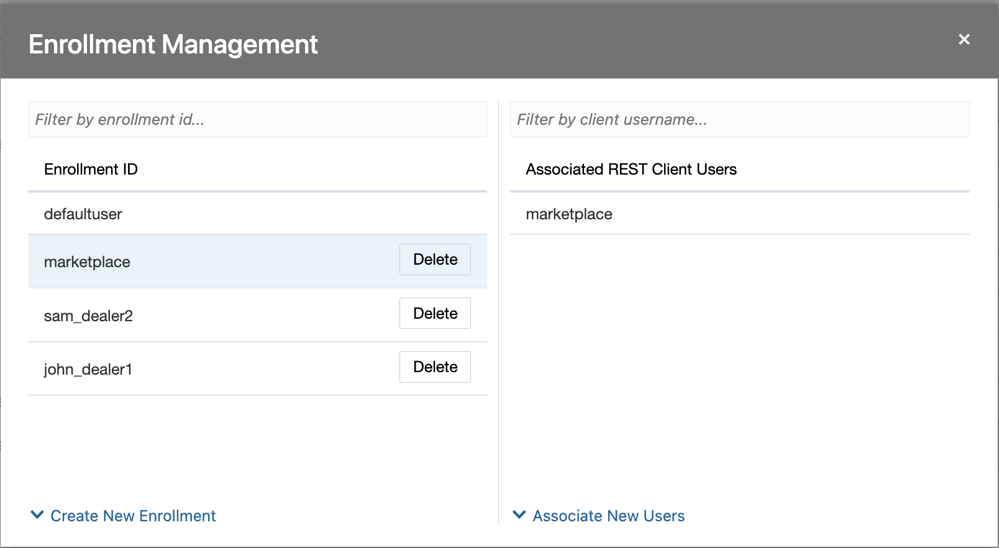
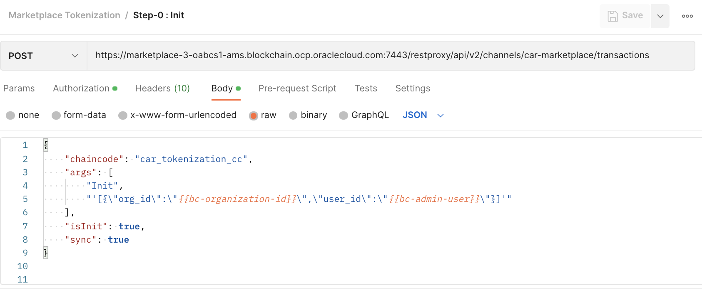
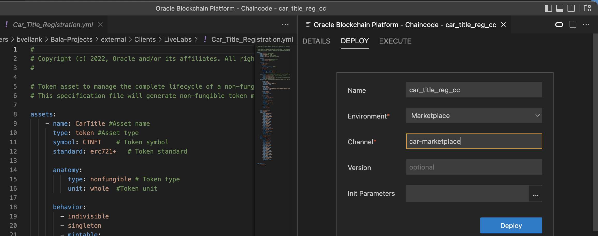
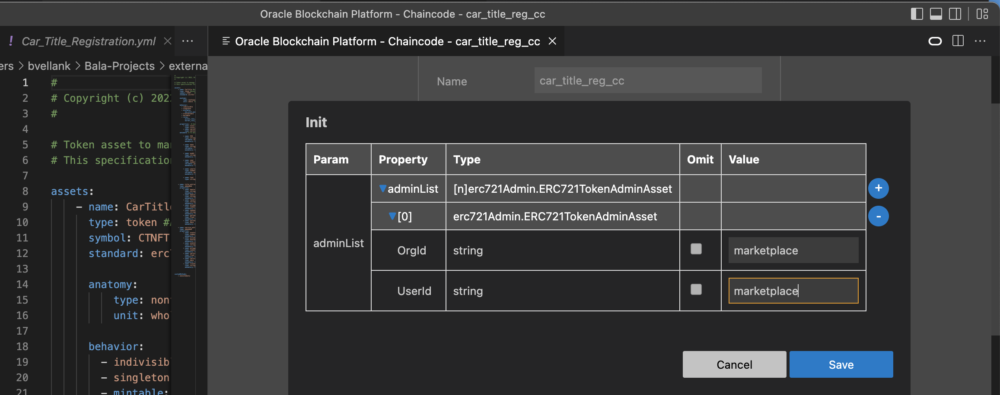
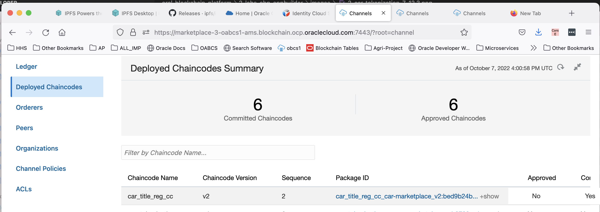
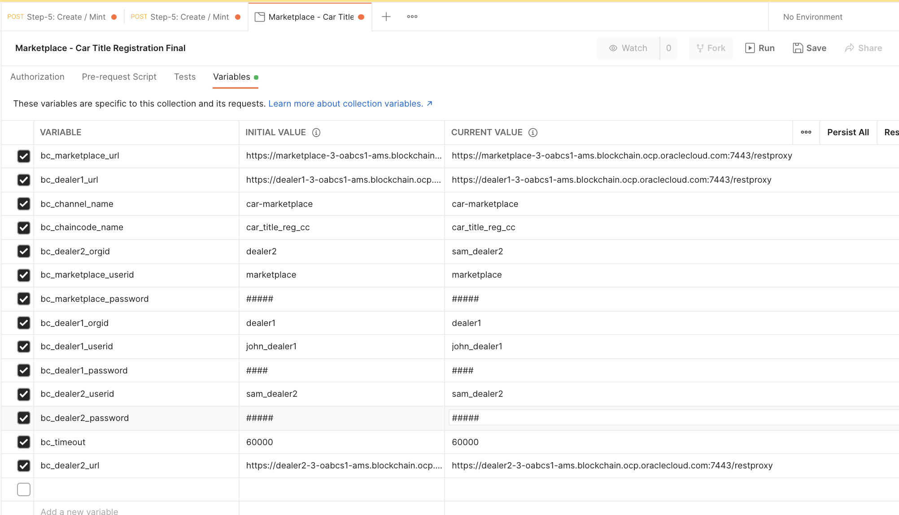

# Deploy, Test Smart Contracts using Blockchain App Builder & Oracle Blockchain Admin Console

## Introduction

Blockchain App Builder is a tool set that assists Oracle Blockchain Platform users with rapid development, testing, debugging, and deployment of chaincode on Oracle Blockchain Platform networks. Blockchain App Builder is accessible through Visual Studio Code as an extension and through a lightweight command line interface. Blockchain App Builder to manage the complete life cycle of a token. Developers can tokenize existing assets and automatically generate token classes and methods to use for token lifecycle management.

*Estimated Lab Time:* 25 minutes

### About OBP Tokenization

1. Tokenization is a process where physical or digital assets are represented by tokens, which can be transferred, tracked, and stored on a blockchain. By representing assets as tokens, you can use the blockchain ledger to establish the state and ownership of an asset and use standard blockchain platform functions to transfer ownership of an asset.

2. You can use the Blockchain App Builder Extension to manage the complete life cycle of a token. You can tokenize existing assets and automatically generate token classes and methods to use for token lifecycle management.

3. This lab incorporates tokenization, enabling our car marketplace administrator to initialize, mint, and transfer fungible, fractional tokens to and from `john_dealer1` and `sam_dealer2`.

4. The tokenization feature uses an account/balance model to represent tokenized assets as balances in accounts - `john_dealer1` and `sam_dealer2`. The balance of their accounts is tracked globally, to ensure that transaction amounts are valid when buying/selling cars. The on-hold balance and transaction history are also tracked.

5. Feel free to learn more about [Tokenization support with OBP](https://docs.oracle.com/en/cloud/paas/blockchain-cloud/usingoci/tokenization-support.html).

### Objectives

In this lab, you will:
* Scaffold Project, Generate Chaincode, Deploy Smart Contracts locally, Test &  Debug Smart Contract, Package & Deploy Smart Contracts to OBP

### Prerequisites
This lab assumes you have:
- An Oracle Cloud account
- You have completed:
    - Lab: Prepare Setup (*Free-tier* and *Paid Tenants* only)
    - Lab: Environment Setup
    - Lab: Create a Blockchain Network connecting 3 Organizations & Configuring Oracle Blockchain App Builder
    

## Task 1: Invoke and Query Ledger marketplace chaincode from App Builder in local environment

  Blockchain App Builder contains a built-in wizard to assist you with invoking or querying your chaincode.

1. Open Terminal --> Enter code --> This opens VSCode

  
  


2. Select your chaincode project in the **Chaincodes** pane. In the **Chaincode Details** pane, select **Deploy**.

3. In the deployment wizard:
    - Ensure the correct chaincode name is selected.
    - Select your target environment. In this case, choose Local Environment.
    - The channel will default to **mychannel**.
    - In the **Function** field, select **createCar** from the drop-down list. Every method available in the chaincode is listed.
    - In the **Parameters** field, select the **More Actions** (…) button. This will launch a window with available properties for your selected method. Enter sample properties as shown and click **Save**.

  

4. Click **Invoke**. Test Some sample invoke methods - App Builder

5. Display Request and Response - Request/Response.


## Task 2: Deploy Car Marketplace Smart Contract (Chaincode) to Founder Instance (Marketplace) from Blockchain App Builder

  Now that we have tested our project locally, we can connect to our remote instances.

1. In the OCI services menu, select 'Developer Services' and click on 'Blockchain Platform'

2. Ensure that the right **Compartment** is selected and click on the 'Marketplace' founder instance.

3. Click the 'Service Console' -->Go to Markplace Blockchain Instance Dashboard.

4. Navigate to Nodes tab and copy the rest proxy url.

  

5. Hover over the **Environments** pane, click on the '+' button, and fill out the form as follows:
    - Add a **Name** (e.g. Marketplace).
    - Optionally, add a **Description**.
    - Paste the **Marketpalce rest proxy url from step3** of your marketplace founder instance.
    - Enter your **User Name** (e.g. 'username') and then enter the **Password**.

  

6. Now, changing the target environment from 'Local Environment' to 'Marketplace' in App Builder. Obtain the channel name as set in *Lab1 - Task 5 (car-marketplace)* 

  

## Task 3: Import Car Marketplace chaincode package from App Builder

1. In Visual Studio Code, click on the **O** icon on the left-hand menu to use the Blockchain App Builder Extension.

2. Hover over the **Chaincodes** pane, Right Click on the chaincode to be packaged --> Select the directory to save the chaincode package file.

  

## Task 4: Install and Deploy Marketplace chaincode package onto Participant Instances using Oracle Cloud Blockchain Platform Console(dealer1 & dealer2)

  To install and re-deploy the chaincode on partner instances, use the package in Task3 (above) and then approve the chaincode definition from the partner instances (in this case, 'dealer1' and 'dealer2').

1. Access the 'Service Console' for the 'dealer1' instance.

  

2. Click the **Channels** tab and then the 'car-marketplace' channel.

  

3. Select on 'Deployed Chaincodes' on the left-hand navigation pane. You will see that 1 chaincode has been committed to the channel, but has not yet been approved by the participant organization.

  

4. Now click the **Chaincodes** tab and then 'Deploy a New Chaincode'

  

5. Select 'Advanced Deployment.'

  

6. Fill out the form as follows:
    - For **Package Label**, open up the 'Service Console' for the 'Marketplace' founder instance, click the **Chaincodes** tab, and copy the text as shown. You may use `car_marketplace_cc_car-marketplace_v1`, or any other name, but make sure to use the same name when repeating these steps for 'dealer2'

    

    - Keep 'GoLang' as the **Chaincode Language**.
    - Select both available peers as the **Target Peers**.
    - Upload the package .zip file you exported from the App Builder VS Code extension. We stored this in the **Samples** folder.
    - Click 'Next'

  

7. Click 'Close.' We will only be installing (not deploying) the chaincode onto the participant instances.

  

8. Now click 'Channels,' then the 'car-marketplace' channel, and navigate to 'Deployed Chaincodes' as you did in steps 3 and 4.

9. Find and click on the hamburger icon on the right of the row containing your chaincode. Select 'Approve.'

  


10. Assign the [Endorsement policy](https://docs.oracle.com/en/cloud/paas/blockchain-cloud/usingoci/specify-endorsement-policy.html) by selecting signature under the endorsement policy. Add the policy of performing an endorsement signature by one of the organizations in the network. You can add an endorsement policy when you instantiate a chaincode. An endorsement policy specifies the members with peers that must approve, or properly endorse, a chaincode transaction before it’s added to a block and submitted to the ledger. 

Now assign the endorsement policy by by selecting the signature policy and click on 'Upgrade'

    ```
    <copy>
    OR('dealer1.member','dealer2.member')
    </copy>
    ```

  

  

11. Check that the chaincode has now been approved by the current participant.

  

12. Repeat steps 1-10 for 'dealer2' instance

13. Now, Go to marketplace founder Instance --> Channels --> car-marketplace --> Deployed Chaincodes --> car-marketplace-cc2 --> Approve

  [Check Approved Field](images/2-car-marketplace-7-13.1.png)
  [Check Approved Field](images/2-car-marketplace-7-13.2.png)
  [Check Approved Field](images/2-car-marketplace-7-13.4.png)
  [Check Approved Field](images/2-car-marketplace-7-13.5.png)

## Task 5: User Enrollment - Perform on All nodes (marketplace, dealer1, dealer2)

  Oracle Blockchain Platform supports enrollments to the REST proxy. You use enrollments with token chaincodes to ensure the identities of the users completing token transactions. To do this, when you add enrollments for token use cases, specify a user ID for each enrollment (founder ID in this case), and specify one and only one user for each enrollment.

1. While logged into the marketplace founder instance, navigate to Nodes in OBP console.

2. Click on the hamburger menu besides restproxy and select 'View or manage enrollments.'
  

3. Select Create New Enrollment.

  

4. Input enrollment information. See sample enrollment as example. Enrollment user had to be created in idcs. In this example 'marketplace','dealer1','dealer2' is used. Make sure the user has REST_Client role assoicated with the Blockchain instance.
    - For marketplace Instance

  

    - For dealer1 Instance

  

    - For dealer2 Instance

  

5. Click Enroll.

## Task 6: Create Fiat Tokenization Specifications

The flow for developing smart contracts for tokenization begins with creating a specification file that describes our fiat token. `Car_Tokenization.yml` describes our FiatToken structure: AssetType, `Token_id`, `Token_name`, `Token_desc`, `Token_type`, and behavior.  

The specification file is then used to scaffold a smart contract project ('`car_tokenization_cc`') and generate source code for models and controllers. Each object has properties that characterize the assets, data types and validations.

You can see sample specification files (and write your own specifications) in either YAML or JSON using the Blockchain App Builder package. [FiatToken Structure](https://docs.oracle.com/en/cloud/paas/blockchain-cloud/usingoci/input-specification-file-fungible-tokens.html)

1. Download the sample specification, [Car_Tokenization.yml](files/Car_Tokenization.yml?download=1)

2. In Visual Studio Code, click on the **O** icon on the left-hand menu to use the Blockchain App Builder Extension.

3. Hover over the **Specifications** pane, click on the three dots, and then **Import Specification**. Alternatively, copy the path of the specification file and import manually.

  Make sure the **Details** of your specification read:
  

## Task 7: Generate FiatToken Chaincode

The specification file is then used to scaffold a smart contract project ('`car_tokenization_cc`') and generate source code for models and controllers.

1. Hover over the **Chaincodes** pane, click on the **+**, and fill out the form as follows:
    - **Name** your chaincode (e.g. `car_tokenization_cc`).
    - Select Go as the **Language**.
    - Select `Car_Tokenization.yml` as the **Specification**.
    - Choose a **Go Domain** (e.g. Samples).

  


2. Click 'Create' and wait for the chaincode to generate. Check the 'Output' pane at the bottom for more details.

3. Select '`car_tokenization_cc`.model.go' under '`car_tokenization_cc`/src/model'. The Model file contains the property definitions of all the assets defined in the spec file.
Select '`car_tokenization_cc`.controller.go' under '`car_tokenization_cc`/src/controller.' The Controller file defines all the behavior and methods for those assets. '`Car_Tokenization.yml`' spec file allows defining additional custom methods that users implement to provide business logic of smart contracts.

## Task 8: Deploy Fiat Tokenization chaincode to Founder Instance

1. In the OCI services menu, select 'Developer Services' and click on 'Blockchain Platform'

2. Ensure that the right **Compartment** is selected and click on the 'Marketplace' founder instance.

3. Click on the 'Service Console' -->  Go to 'Nodes' tab from the Blockchain Admin Console Dashboard --> copy the REST Proxy URL of this platform instance.
  

4. Changing the target environment in Blockchain AppBuilder to 'Marketplace.' Also change the channel to 'car-marketplace'. Add the Init Parameters needed (org\_id: marketplace, user\_id: marketplace)

  
  

 <!-- ## Task 7: Import Tokenization chaincode package from app builder

1. In Visual Studio Code, click on the **O** icon on the left-hand menu to use the Blockchain App Builder Extension.

2. Hover over the **Chaincodes** pane, Right Click on the chaincode to be packaged Select the directory  to save the chaincode package file. 

    -->

## Task 9: Approve the chaincode on Participant Instances

Approve the chaincode definition from the partner instances (in this case, 'dealer1' and 'dealer2').

1. Access the 'Service Console' for the 'dealer1' instance.

  

2. Click the **Channels** tab and then the 'car-marketplace' channel.

  

3. Select on 'Deployed Chaincodes' on the left-hand navigation pane. You will see that 1 chaincode has been committed to the channel, but has not yet been approved by the participant organization.

  

<!-- 4. Now click the **Chaincodes** tab and then 'Deploy a New Chaincode.'

  

5. Select 'Advanced Deployment.'

  

6. Fill out the form as follows:

   - For **Package Label**, open up the 'Service Console' for the 'Marketplace' founder instance, click the **Chaincodes** tab, and copy the text as shown. You may use `car_tokenization_v1`, or any other name, but make sure to use the same name when repeating these steps for 'dealer2.'

  

   - Keep 'GoLang' as the **Chaincode Language**.
   - Select both available peers as the **Target Peers**.
   - Upload the package .zip file you exported from the App Builder VS Code extension. We stored this in the **Samples** folder.
  
  

7. Click 'Close.' We will only be installing (not deploying) the chaincode onto the participant instances.

   -->

<!-- 8. Now click 'Channels,' then the 'car-marketplace' channel, and navigate to 'Deployed Chaincodes' as you did in steps 2,3 and 4. -->


4. Find and click on the hamburger icon on the right of the row containing your chaincode. Select 'Approve.'

  
  

<!-- 10. Simply select the **Package ID** as shown and click 'Approve.'

  

 11. Assign the Endorsement policy by selecting signature under the endorsement policy. Add the policy of performing an endorsement signature by one of the organizations in the network.
    ```
    <copy>
    OR ('dealer1.member', dealer2.member)
    </copy>
    ```

   -->

5. Check that the chaincode has now been approved by the current participant.

  

6. Repeat steps 1-5 for 'dealer2.'


## Task 10: Initialization and Issuance of Car Marketplace FiatToken

1. Click on Postman on the VNC Desktop --> Import the Marketplace Tokenization Postman collection [Marketplace Tokenization](files/Marketplace_Tokenization_Final.postman_collection.json?download=1) and assign variable definitions as shown.

  
  

2. Enter the environment setup variables in Postman Environment 'Tokenization' (`tokenization_environment.postman_environment.json`) and assign variable definitions. Some sample definitions are shown below.

  

3. Open tokenization collection Marketplace_Tokenization, and run integrations as described in steps 0 – 6 by clicking Send:

    - Step 0 - Init: Called when chaincode is instantiated. Token Admin is identified by `user_id` and `org_id`.

  

    - Step 1 – Initialize Token: This method creates a token and initializes the token properties. The asset and its properties are saved in the state database. This method can be invoked only by the Token Admin of the chaincode.

  
  

    - Step 2, 3, 4 – Create & Associate Accounts(Token User1, Token User2):  This method creates an account for a specified user and token. An account must be created for any user who will have tokens at any point. Accounts track balances, on-hold balances, and transation history. 

  
  
    - Copy the account id received when creating the account. Substitute the accountid while associating the account as shown.

  

    - Repeate the tasks create and associate token accounts for user Token User1 and Token User2

  

    - Step 5, 6 – Add Role: This method adds a role to a specified user and token. This method can be called only by the Token Admin of the chaincode.

  

    - Minter Role: mints a quantity of tokens, which are then owned by the caller of the method.
    - Escrow Role: notary account is specified, which is responsible to either complete or release the hold. When the hold is created, the specified token balance from the payer is put on hold. A held balance cannot be transferred until the hold is either completed or released.

    - Step 7 – Issue Tokens: This method mints tokens, which are then owned by the caller of the method. The caller must have an account and the minter role.

  

## Task 11: Create Car Title Registration NFT Specificaitons

This flow is for developing smart contracts to create a NFT for Car Title Registrations which begins with creating a specification file that describes our NFT. `Car_Title_Registration.yml` describes our NFT structure: `AssetType`, `Token_id`, `Token_name`, `Token_desc`, `Token_type`,  `behavior` and metadata.  

The specification file is then used to scaffold a smart contract project ('`car_title_registration.cc`') and generate source code for models and controllers. Each object has properties that characterize the assets, data types and validations.

You can see sample specification files (and write your own specifications) in either YAML or JSON using the Blockchain App Builder package. [NFT Structure](https://docs.oracle.com/en/cloud/paas/blockchain-cloud/usingoci/input-specification-file-fungible-tokens.html)

1. Download the sample specification, [Car_Title_Registration.yml](files/Car_Title_Registration.yml?download=1)

2. In Visual Studio Code, click on the **O** icon on the left-hand menu to use the Blockchain App Builder Extension.

3. Hover over the **Specifications** pane, click on the three dots, and then **Import Specification**. Alternatively, copy the path of the specification file and import manually.

  Make sure the **Details** of your specification read:
  

## Task 12: Generate Car Title RegistrationNFT Chaincode

The specification file is then used to scaffold a smart contract project ('`car_title_registration_cc`') and generate source code for models and controllers.

1. Hover over the **Chaincodes** pane, click on the **+**, and fill out the form as follows:
    - **Name** your chaincode (e.g. `car_title_registration_cc`).
    - Select Go as the **Language**.
    - Select `Car_Title_Registration.yml` as the **Specification**.
    - Choose a **Go Domain** (e.g. Samples).

  


2. Click 'Create' and wait for the chaincode to generate. Check the 'Output' pane at the bottom for more details.

  

3. Select '`car_title_registration_cc`.model.go' under '`car_title_registration_cc`/src/model'. The Model file contains the property definitions of all the assets defined in the spec file.
Select '`car_title_registration_cc`.controller.go' under '`car_title_registration_cc`/src/controller.' The Controller file defines all the behavior and methods for those assets. '`Car_Title_Registration.yml`' spec file allows defining additional custom methods that users implement to provide business logic of smart contracts.

## Task 13: View Custom Methods in Marketplace

1. Open the Car Marketplace specification file and scroll to the bottom. This is where your customMethods are listed. Go to `car_title_registration_cc`.controller.go' under '`car_title_registration_cc`/src/controller' to make the changes mentioned below. 

2. Add the imports needed for the custom methods.

    ```
      <copy>
      func (t *Controller) UpdateTitle(tokenId string, dealerno string,dealername string,dealerloc string,mileage int,newowner string,purchaseprice float64,dateString string) (interface{}, error) {

        var tokenAsset CarTitle
        _, err := t.Ctx.ERC721Token.Get(tokenId, &tokenAsset)

        if err != nil {
          return nil, fmt.Errorf("Token with id: %s does not exist", tokenId)
        }

        dateBytes, err := json.Marshal(dateString)
        if err != nil {
          return nil, fmt.Errorf("error in marshalling %s", err.Error())
        }

        var dateValue date.Date
        err = json.Unmarshal(dateBytes, &dateValue)
        if err != nil {
          return nil, fmt.Errorf("error in unmarshalling the date %s", err.Error())
        }


        newTitle := Title_entries {
          Dealernumber:  dealerno, 
          Dealership: dealername,
          Location: dealerloc,
          Mileage: mileage,
          Newowner:newowner,
          Purchaseprice:purchaseprice,
          Purchasedate: dateValue,
        }


        tokenAsset.Title = append(tokenAsset.Title, newTitle)
        
        
        _, err = t.UpdateCarTitleToken(tokenAsset)
          if err != nil {
          return nil, err
        }

        msg := fmt.Sprintf("Title Updated")
        return msg, nil
      }
      </copy>

      ```

## Task 14: Deploy Car Title Registration NFT chaincode to Founder Instance

1. In the OCI services menu, select 'Developer Services' and click on 'Blockchain Platform'

2. Ensure that the right **Compartment** is selected and click on the 'Marketplace' founder instance.

3. Click on the 'Service Console' -->  Go to 'Nodes' tab from the Blockchain Admin Console Dashboard --> copy the REST Proxy URL of this platform instance.
  

4. Changing the target environment in Blockchain AppBuilder to 'Marketplace' Also change the channel to 'car-marketplace'. Add the Init Parameters needed (org\_id: marketplace, user\_id: marketplace)

  
  

## Task 15: Approve the chaincode on Participant Instances

Approve the chaincode definition from the partner instances (in this case, 'dealer1' and 'dealer2').

1. Access the 'Service Console' for the 'dealer1' instance.

  

2. Click the **Channels** tab and then the 'car-marketplace' channel.

  

3. Select on 'Deployed Chaincodes' on the left-hand navigation pane. You will see that 1 chaincode has been committed to the channel, but has not yet been approved by the participant organization.

  

<!-- 4. Now click the **Chaincodes** tab and then 'Deploy a New Chaincode.'

  

5. Select 'Advanced Deployment.'

  

6. Fill out the form as follows:

   - For **Package Label**, open up the 'Service Console' for the 'Marketplace' founder instance, click the **Chaincodes** tab, and copy the text as shown. You may use `car_tokenization_v1`, or any other name, but make sure to use the same name when repeating these steps for 'dealer2.'

  

   - Keep 'GoLang' as the **Chaincode Language**.
   - Select both available peers as the **Target Peers**.
   - Upload the package .zip file you exported from the App Builder VS Code extension. We stored this in the **Samples** folder.
  
  

7. Click 'Close.' We will only be installing (not deploying) the chaincode onto the participant instances.

   -->

<!-- 8. Now click 'Channels,' then the 'car-marketplace' channel, and navigate to 'Deployed Chaincodes' as you did in steps 2,3 and 4. -->


4. Find and click on the hamburger icon on the right of the row containing your chaincode. Select 'Approve.'

  
  
  

<!-- 10. Simply select the **Package ID** as shown and click 'Approve.'

  

 11. Assign the Endorsement policy by selecting signature under the endorsement policy. Add the policy of performing an endorsement signature by one of the organizations in the network.
    ```
    <copy>
    OR ('dealer1.member', dealer2.member)
    </copy>
    ```

   -->

5. Check that the chaincode has now been approved by the current participant.

  

6. Repeat steps 1-5 for 'dealer2.'


## Task 16: Initialization and Issuance of Car Title Registration NFT

1. Import the Car Title Registration NFT Postman collection [CarTitle NFT](files/Marketplace_CarTitleRegistration_Final.postman_collection.json?download=1) and assign variable definitions as shown.

  
  

2. Enter the environment setup variables in Postman Environment 'CarTitle NFT' (`tokenization_environment.postman_environment.json`) and assign variable definitions. Some sample definitions are shown below. Update the passwords and URL's based on your setup and configuration.

  

3. Open tokenization collection Marketplace_CarTitleRegistration, and run integrations as described in steps 0 – 6 by clicking Send:

    - Step 1, 2, 3, 4 – Create & Add Role (Minter) to Car Title Registration NFT Accounts (Dealer1 Account, Dealer2 Account) for creating a Car Title NFT's to trade vehicles between dealer1 & dealer2:  These methods creates an account for a specified user and add role to trade a NFT's between dealer1 and dealer2. An account must be created for any user who will have tokens at any point. Accounts are created to track Car tile NFT's for each vehicle created and traded. 
    - Minter Role: mints a quantity of tokens, which are then owned by the caller of the method. This method mints tokens, which are then owned by the caller of the method. The caller must have an account and the minter role.

  
  
  
  


You may now proceed to the next lab.

## Learn More

[Tokenization support with OBP](https://docs.oracle.com/en/cloud/paas/blockchain-cloud/usingoci/tokenization-support.html)

## Acknowledgements
* **Author** - Oracle Blockchain Product Management
* **Contributors** - Amal Tyagi, Teodora Gheorghe, Adrien Lhemann, Diego Morales, Lokeswara Nushisarva, Siddesh C. Prabhu Dev Ujjni, Rene Fontcha
* **Last Updated By/Date** - Rene Fontcha, September 2022
