# Car Dealer Marketplace 

## Introduction: Oracle API Gateway

The API Gateway service enables you to publish APIs with private endpoints that are accessible from within your network, and which you can expose with public IP addresses if you want them to accept internet traffic. The endpoints support API validation, request and response transformation, CORS, authentication and authorization, and request limiting.

In this lab, you will be introduced to API Gateway. The gateway is necessary for configuring Oracle Blockchain Platform REST API endpoints on the front-end application.

Estimated Lab Time: --find out--

## Objectives

In this lab, you will:
* Create and configure REST endpoints to be accessed by front-end applications

## Task 1: Setup VCN and Subnet

1. In the OCI services menu, select 'Networking' and click 'Virtual Cloud Networks.'

  

2. Click 'Start VCN Wizard.'

  

3. Keep the default selection and click 'Start VCN Wizard.'

  

4. Fill out the 'Configuration' form as follows:
    - Choose a **VCN Name** (e.g. Car Marketplace VCN).
    - Ensure the correct **Compartment** is selected (e.g. Blockchain LiveLabs).
    - Keep the remaining default fields.
  
  

5. Click 'Next' and then 'Create.'

  

6. Once your VCN is available, click 'Create Subnet.'

  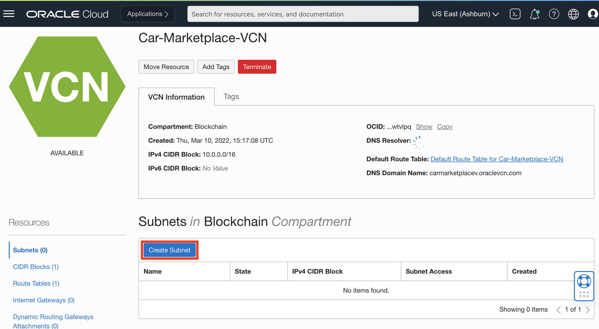

7. Fill out the 'Create Subnet' form as follows:
    - **Name** your subnet (e.g. Public Subnet for Car Marketplace VCN).
    - Ensure the correct **Compartment** is selected (e.g. Blockchain LiveLabs).
    - Scroll to the bottom and set 'Default DHCP Options for Car Marketplace VCN' as the **DHCP Options Compartment**.
    - Similarly, set 'Default Security List for Car Marketplace VCN' as the **Security List Compartment**.

  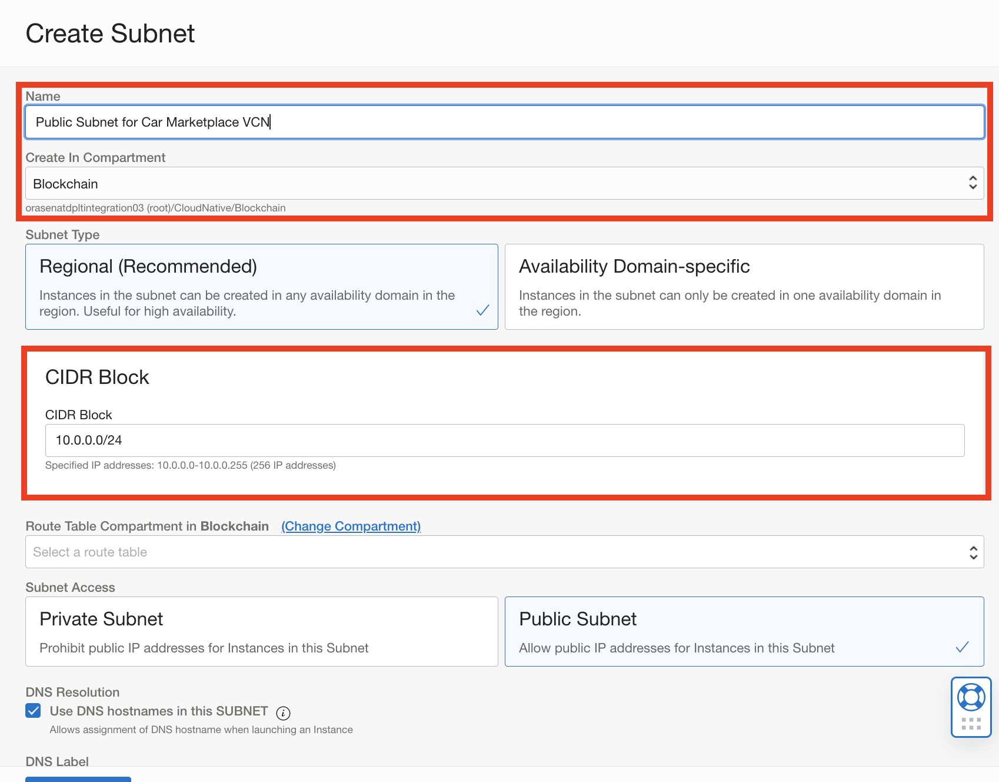
  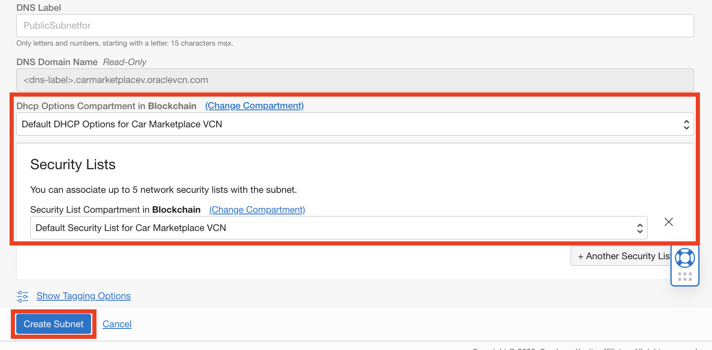

8. Click 'Create Subnet' and see that the subnet has been successfully created.
  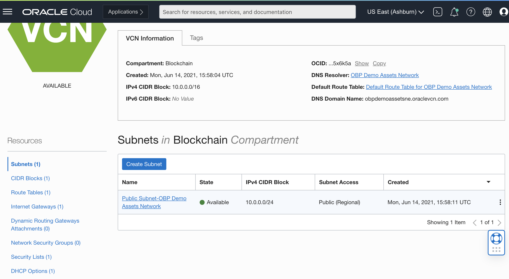

## Task 2: Configure VCN

1. Select 'DHCP Options' on the left-hand side menu and then 'Edit' the default options.

  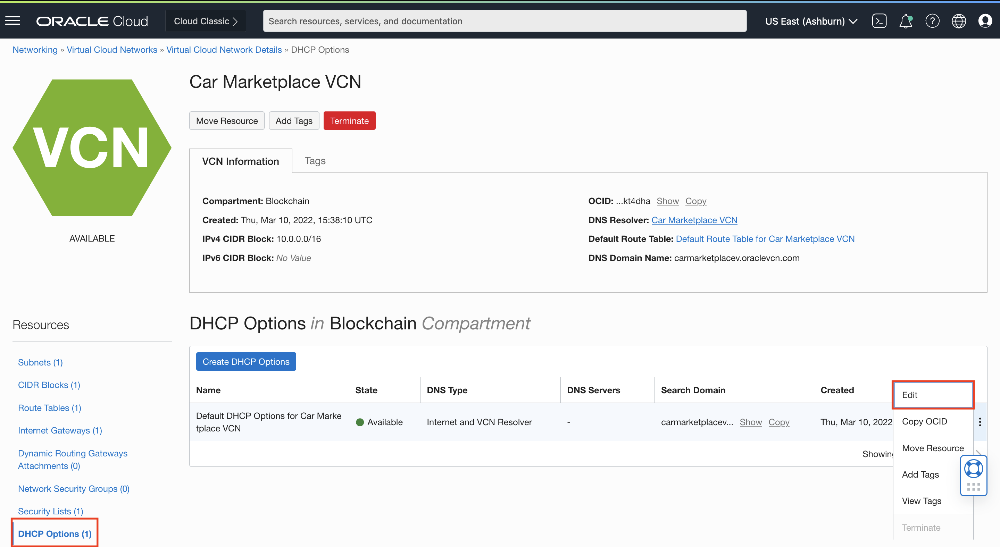

2. Ensure that your options match those on the form below and click 'Save Changes.'

  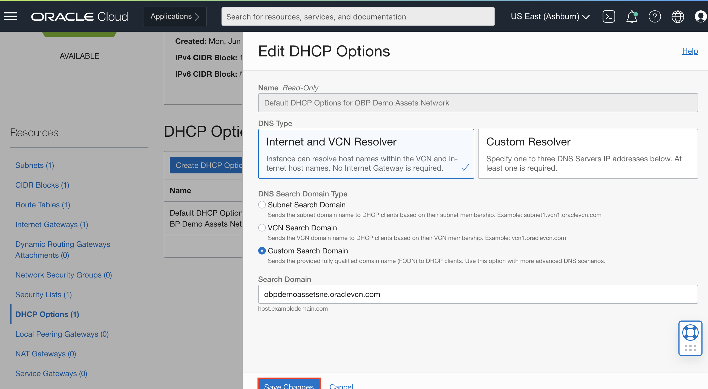

3. Now, select 'CIDR Blocks' on the left-hand side menu and click 'Add CIDR Block' to match the screenshot below.

  

4. Next, select 'Route Tables' on the left-hand side menu and click 'Default Route Table for Car Marketplace VCN.'

  

5. Click 'Add Route Rules.'

  

6. Fill out the form as follows and click on 'Add Route Rules.'

  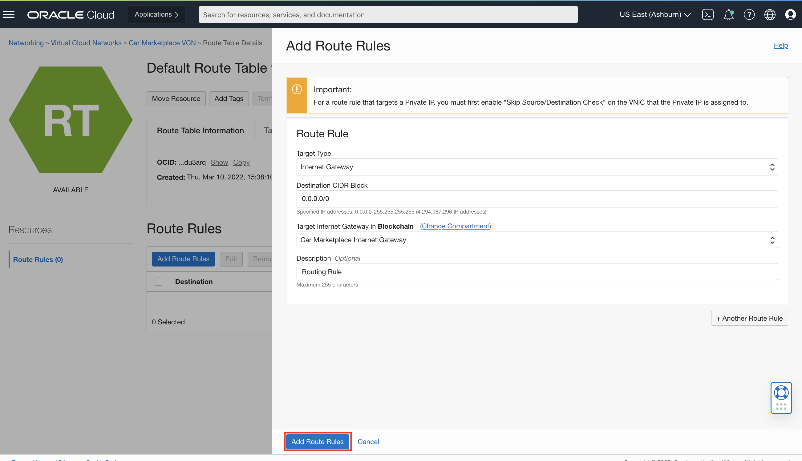

7. Next, select 'Security Lists' on the left-hand side menu and click 'Default Security List for Car Marketplace VCN.'

  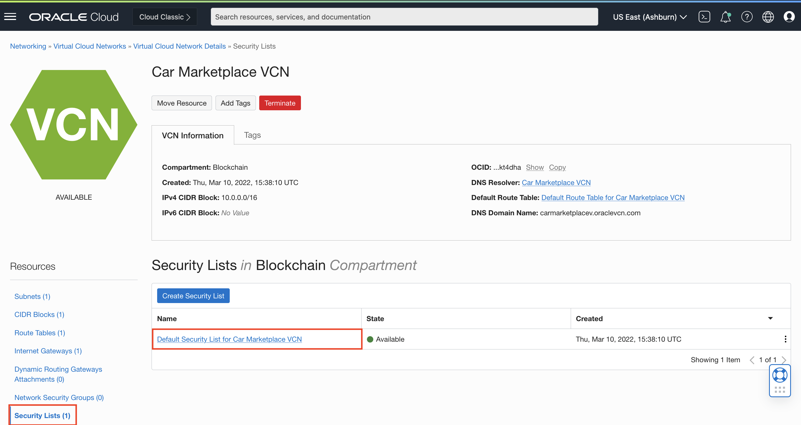

8. Click 'Add Ingress Rules.'

  

9. Fill out the form as follows and click on 'Add Ingress Rules.'

  

10. Repeat Steps 8-9 four more times so your Ingress Rules match the screenshot below:

  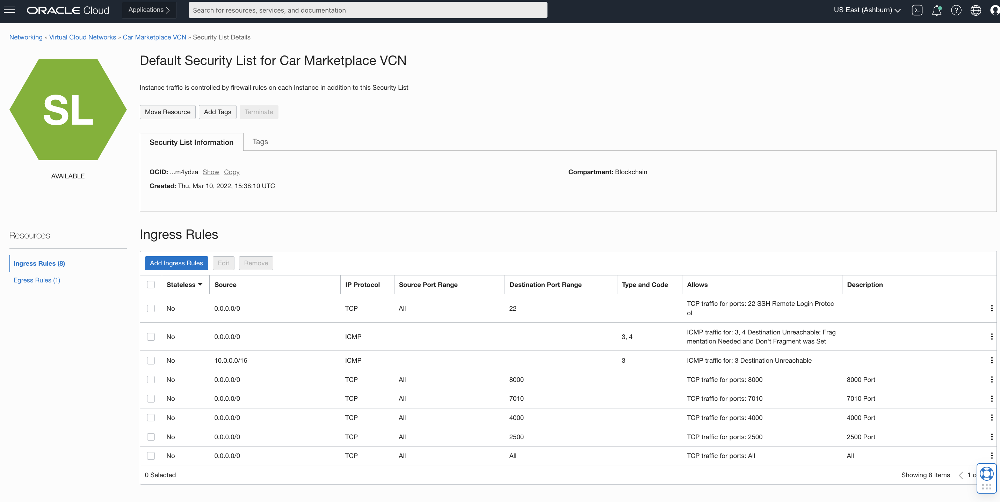

## Task 3: Create API Gateway

1. From the OCI services mennu, search for 'Gateways' and find the service listed under **API Management**.
  

2. Click on 'Create Gateway.'

  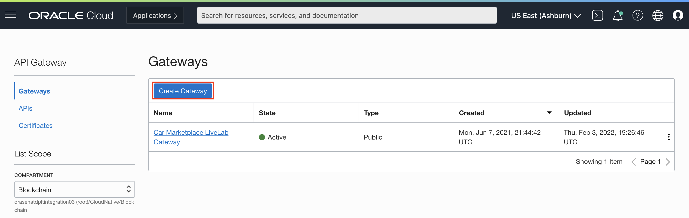

3. Fill out the form as follows and click 'Create Gateway.'
    - Give your gateway a **Name** (e.g. Car Marketplace LiveLab Gateway).
    - Scroll down and select the **Virtual Cloud Network** and **Subnet** you just created.

  

## Task 4: Create Gateway Deployment

1. After ensuring the right **Compartment** is selected, find and click on the the gateway corresponding to this LiveLab (e.g. Car Marketplace LiveLab Gateway).
  

2. Click on 'Deployments' in the **Resources** pane and click 'Create Deployment.'
  

3. You will be deploying a custom API 'From Scratch.' Fill out the form as follows:
    - Give your deployment a **Name** (e.g. car-marketplace)
    - Optionally, enter a **Path Prefix** (e.g. /v1)
    - Ensure that the right **Compartment** is selected and click on 'Next'
  

4. Next in your deployment, you need to add 4 routes: 1 for each participant instance and 2 for the founder instance. Under 'Routes', fill out the form for your first route as follows:
    - Enter a **Path**. For Route 1, this will be /dealer-1/transactions
    - Select 'POST' under **Methods**
    - Specify 'HTTP' as the **Type**
    - Enter the **URL** to serve as a REST endpoint. For Route 1, this will be https://forddealer-orasenatdpltintegration03-iad.blockchain.ocp.oraclecloud.com:7443/restproxy/api/v2/channels/car-marketplace-livelab/chaincode-queries
    - For **Connection Establishment**, **Request Transmit**, and **Reading Response** timeouts, enter 60, 10, and 10 respectively
  

5. Click the '+ Another Route' button and repeat Step 2 for the remaining 3 routes as shown:
  
  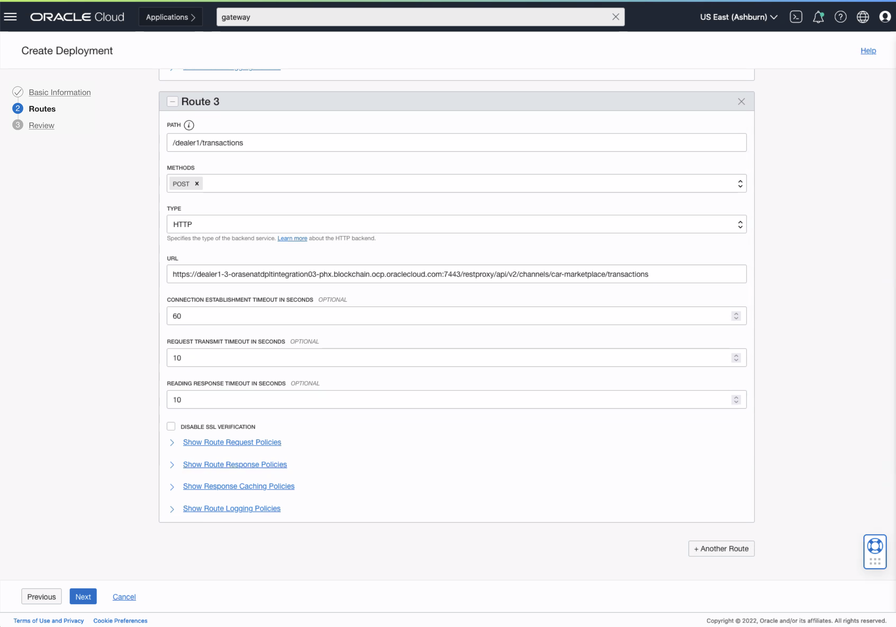
  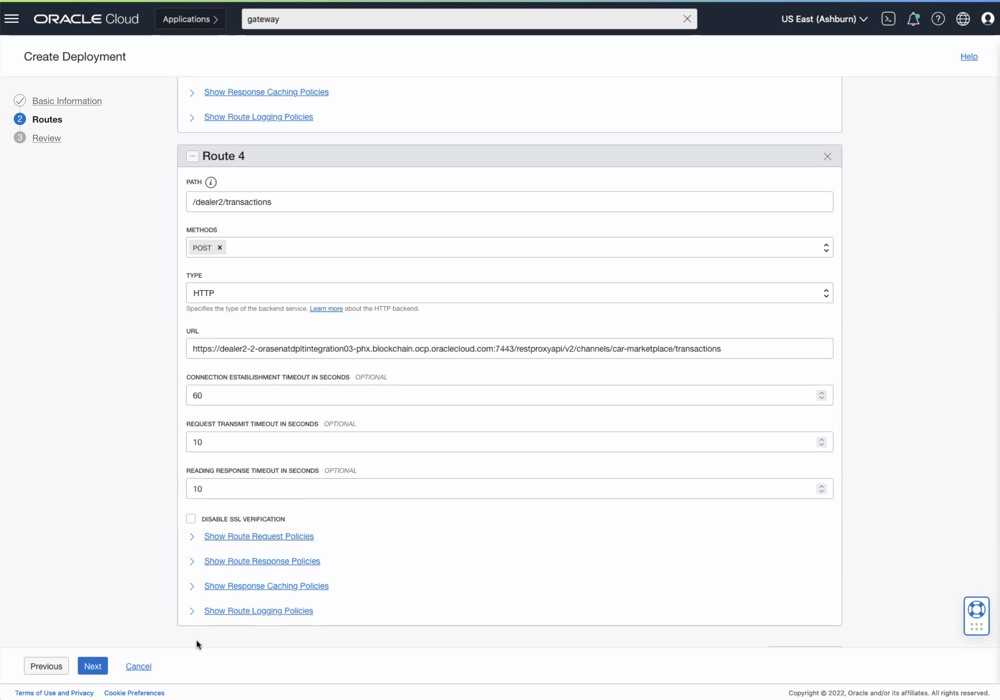

6. 'Review' the deployment information and click 'Create.'
  

## Task 5: Prefix Query and Invoke Endpoint During Configuration

Once active, the deployment can be used to make REST API calls between APEX and OBP.

1. Find the **Deployment Information** pane and the **Endpoint** as shown.
  

2. --complete after above is confirmed--

## Acknowledgements
* **Author** - Amal Tyagi, Cloud Engineer
* **Contributors** -  Teodora Gheorghe, Adrien Lhemann, Diego Morales, Lokeswara Nushisarva, Siddesh C. Prabhu Dev Ujjni
* **Last Updated By/Date** - Amal Tyagi, 03-22