# Create & Setup API Gateway to connect with Smart Contract API's

## Introduction

The API Gateway service enables you to publish APIs with private endpoints that are accessible from within your network, and which you can expose with public IP addresses if you want them to accept internet traffic. The endpoints support API validation, request and response transformation, CORS, authentication and authorization, and request limiting.

In this lab, you will be introduced to API Gateway. The gateway is necessary for configuring Oracle Blockchain Platform REST API endpoints on the front-end application.

*Estimated Lab Time:* 15 minutes

Watch the video below for a quick walk-through of the lab.
[Create & Setup API Gateway to connect with Smart Contract API's](videohub:1_w01l6lxc)

### Objectives

In this lab, you will:
* Create and configure REST endpoints to be accessed by front-end applications

### Prerequisites
This lab assumes you have:
- An Oracle Cloud account
- You have completed:
    - Prepare Setup (*Free-tier* and *Paid Tenants* only)
    - Environment Setup
    - Lab1: Create a Blockchain Network connecting 3 Organizations & Configuring Oracle
    - Lab2: Deploy, Test Smart Contracts using Blockchain App Builder & Oracle Blockchain Admin Console

## Task 1: Setup VCN and Subnet

1. In the OCI services menu, select 'Networking' and click 'Virtual Cloud Networks.'

  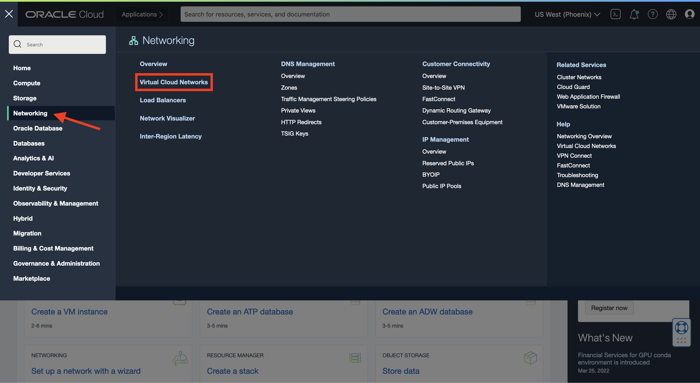

2. Click 'Start VCN Wizard.'

  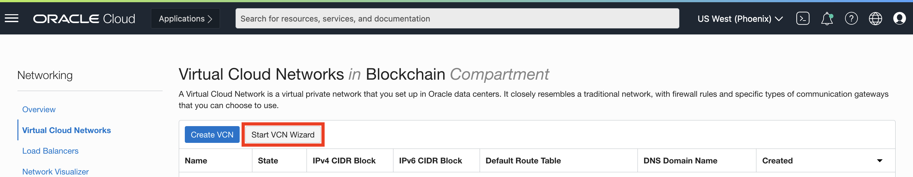

3. Keep the default selection and click 'Start VCN Wizard.'

  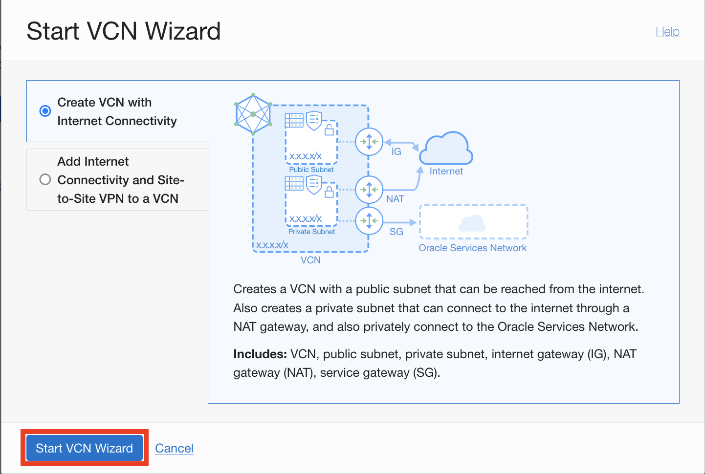

4. Fill out the 'Configuration' form as follows:
    - Choose a **VCN Name** (e.g. Car Marketplace VCN).
    - Ensure the correct **Compartment** is selected (e.g. Blockchain LiveLabs).
    - Keep the remaining default fields.

  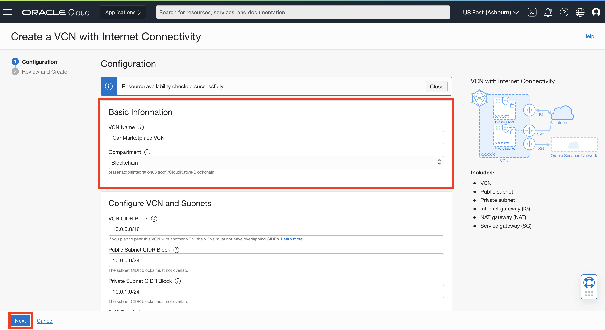

5. Click 'Next' and then 'Create.'

  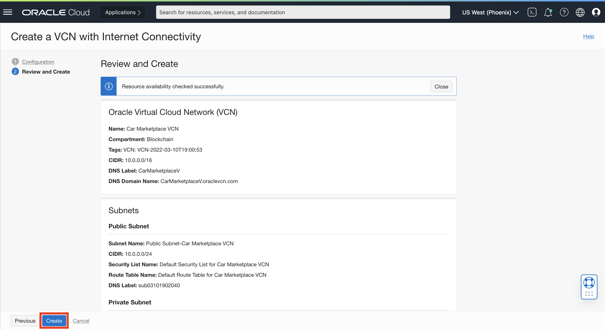

 ## Task 2: Configure Ingress Rules 

1. Click 'Add Ingress Rules.'

  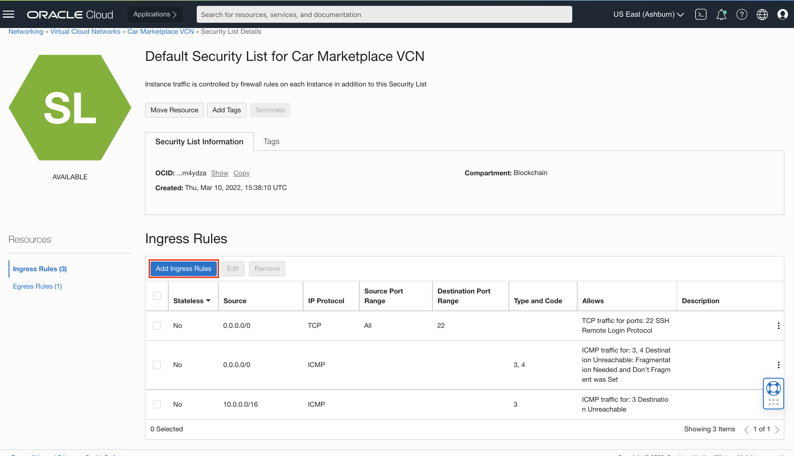

2. Fill out the form as follows and click on 'Add Ingress Rules.'

  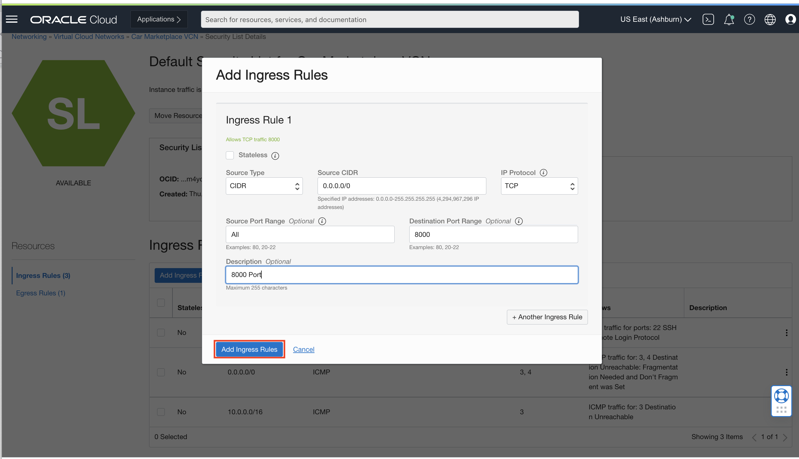

## Task 3: Create API Gateway

1. From the OCI services mennu, search for 'Gateways' and find the service listed under **API Management**.
  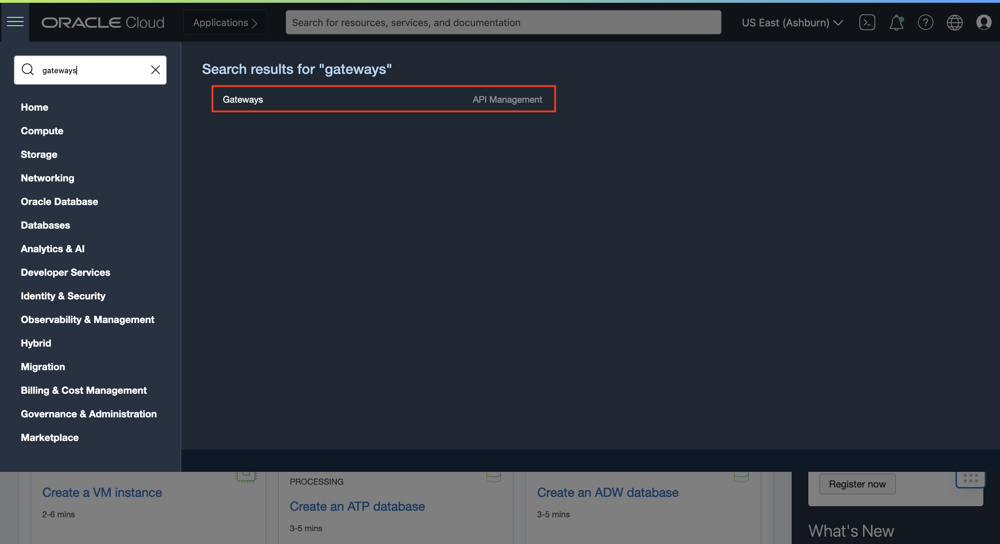

2. Fill out the form as follows and click 'Create Gateway.'
    - Give your gateway a **Name** (e.g. Car Marketplace LiveLab Gateway).
    - Scroll down and select the **Virtual Cloud Network** and **Subnet** you just created.

  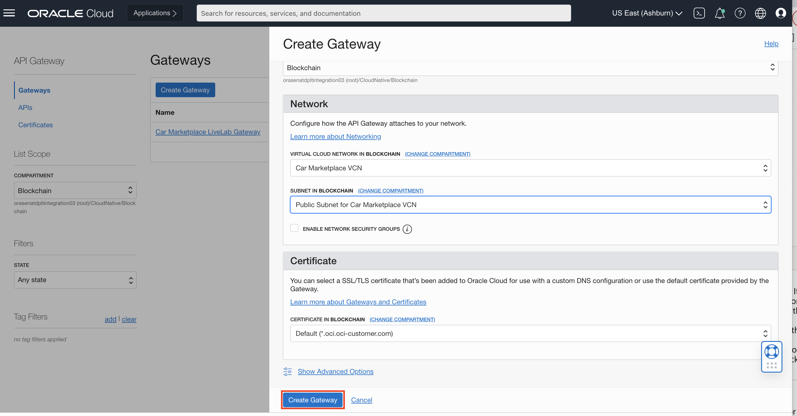

## Task 4: Create Gateway Deployment

1. After ensuring the right **Compartment** is selected, find and click on the the gateway corresponding to this LiveLab (e.g. Car Marketplace LiveLab Gateway).

2. Click on 'Deployments' in the **Resources** pane and click 'Create Deployment.'
  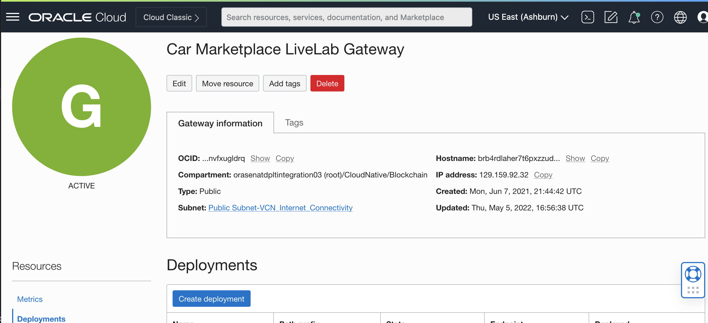

3. You will be deploying a custom API 'From Scratch.' Fill out the form as follows:
    - Give your deployment a **Name** (e.g. car-marketplace)
    - Optionally, enter a **Path Prefix** (e.g. /v0)
    - Ensure that the right **Compartment** is selected and click on 'Next'

  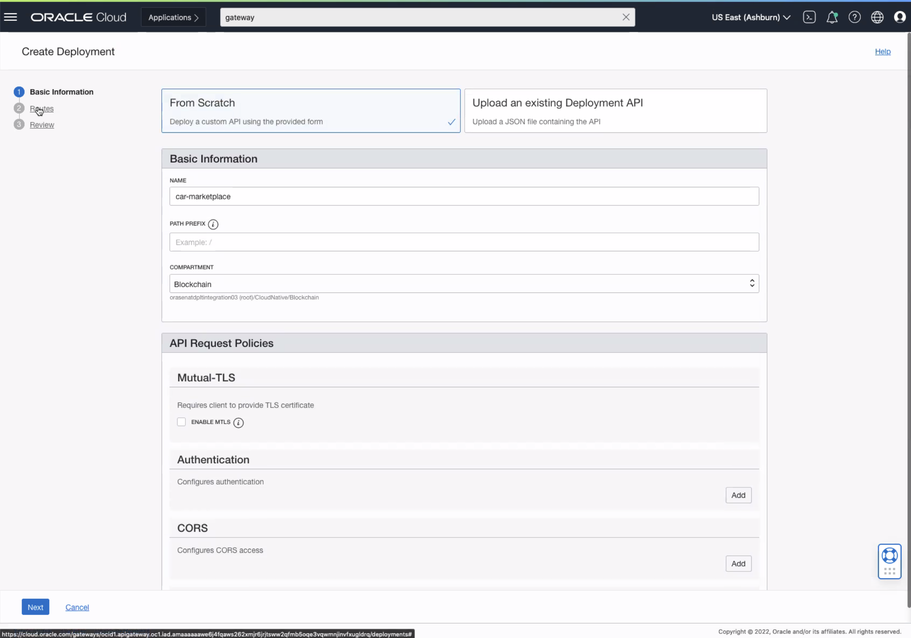
  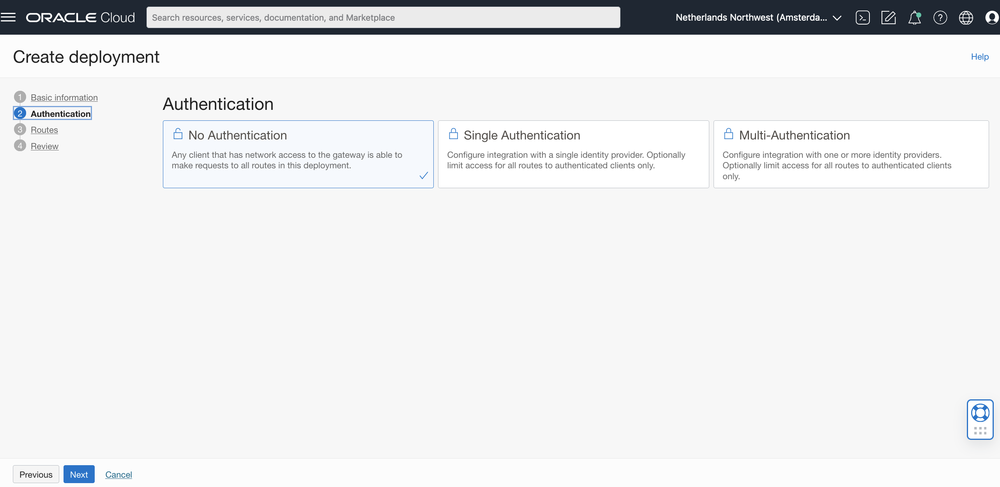
   
## Task 5: Create Routes

1. Next, start creating a new routes by adding new routes
2. Add 6 routes: 2 for each instance , 1 founder instance and 2 participant instances. Each instance will have two routes
    - One route to perform `transactions`:'insert' and 'update'
    - Second route to perform `chaincode-queries`:'query a transactions or transactions'
    - To create the routes click routes --> Under 'Routes', fill out the form for your first route as follows:
    - Enter a **Path**. For Route 1, this will be /marketplace/transactions
    - Select 'POST' under **Methods**
    - Specify 'HTTP' as the **Type**
    - Enter the **URL** to serve as a REST endpoint. For Route 1, this will be https://marketplace-2-oabcs1-iad.blockchain.ocp.oraclecloud.com:7443/restproxy/api/v2/channels/car-marketplace/transactions
    - How to Construct Route URL:
        - From the Blockchain Admin Dashboard --> Click on Nodes --> Navigate to restproxy (bottom of the screen) --> Copy the URL

  

        - Append to URL --> [api/v2/channels/car-marketplace/transactions](https://docs.oracle.com/en/cloud/paas/blockchain-cloud/restoci/op-restproxy-api-v2-channels-channelname-transactions-post.html)

      
    - For **Connection Establishment**, **Request Transmit**, and **Reading Response** timeouts, enter 60, 10, and 10 respectively

  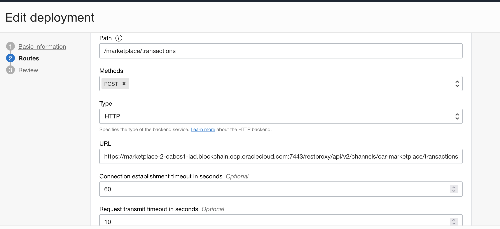

  
2. Click the '+ Another Route' button and repeat Step 2 for the remaining 5 routes based on the blockchain instances as shown:

  
  
    - Marketplace Routes
      - marketplace transactions prefix  Path: /dealer1/transactions
      - marketplace URL: Example - https://marketplace-3-oabcs1-iad.blockchain.ocp.oraclecloud.com:7443/restproxy/api/v2/channels/car-marketplace/transactions
      - marketplace chaincode queries prefix  Path: /dealer1/chaincode-queries
      - marketplace URL: Example - https://marketplace-3-oabcs1-iad.blockchain.ocp.oraclecloud.com:7443/restproxy/api/v2/channels/car-marketplace/chaincode-queries

  
  

    - dealer1 routes
      - dealer1 transactions prefix  Path: /dealer1/transactions
      - dealer1 URL: Example - https://dealer1-3-oabcs1-iad.blockchain.ocp.oraclecloud.com:7443/restproxy/api/v2/channels/car-marketplace/transactions
      - dealer2 chaincode queries prefix  Path: /dealer1/chaincode-queries
      - dealer2 URL: Example - https://dealer1-3-oabcs1-iad.blockchain.ocp.oraclecloud.com:7443/restproxy/api/v2/channels/car-marketplace/chaincode-queries

  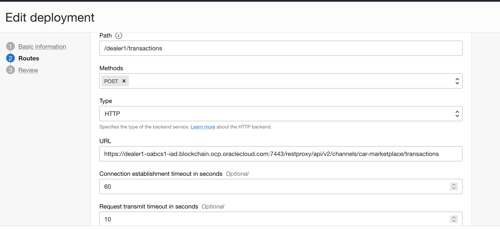
  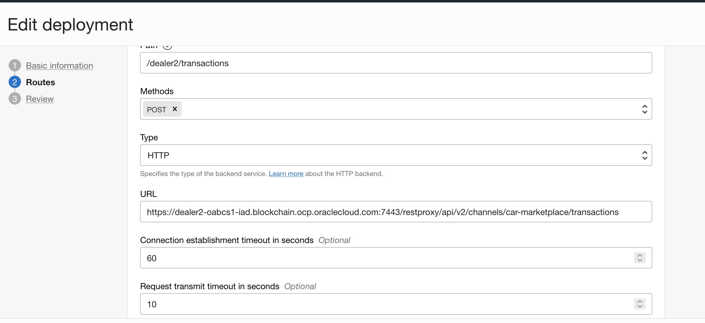

    - dealer2 routes
      - dealer2 transactions prefix  Path: /dealer2/transactions
      - dealer2 URL: Example - https://dealer2-3-oabcs1-iad.blockchain.ocp.oraclecloud.com:7443/restproxy/api/v2/channels/car-marketplace/transactions
      - dealer2 chaincode queries prefix  Path: /dealer2/chaincode-queries
      - dealer2 URL: Example - https://dealer2-3-oabcs1-iad.blockchain.ocp.oraclecloud.com:7443/restproxy/api/v2/channels/car-marketplace/chaincode-queries

  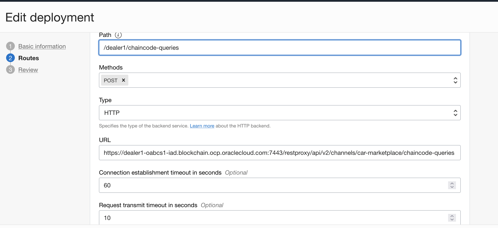
  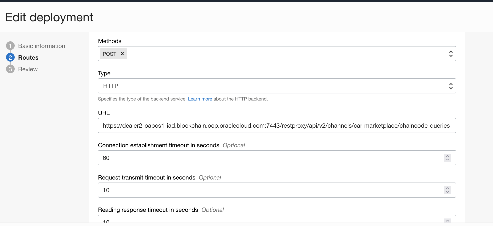

  - Atomic Transaction routes --> marketplace, dealer1, dealer2
      - marketplace transactions prefix  Path: /marketplace/atomicTransactions
      - marketplace URL: Example - https://marketplace-3-oabcs1-iad.blockchain.ocp.oraclecloud.com:7443/restproxy/api/v2/atomicTransactions

  
      - dealer1 transactions prefix  Path: /dealer1/atomicTransactions
      - dealer1 URL: Example - https://dealer1-2-oabcs1-iad.blockchain.ocp.oraclecloud.com:7443/restproxy/api/v2/atomicTransactions

  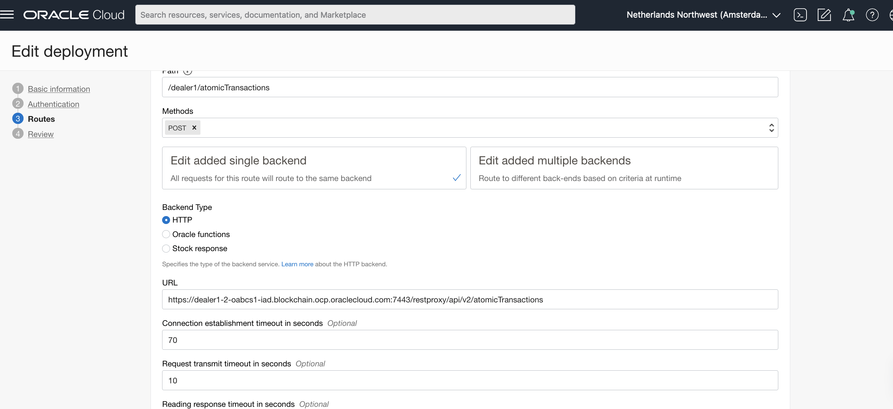
      - dealer2 transactions prefix  Path: /dealer2/atomicTransactions
      - dealer2 URL: Example - https://dealer2-2-oabcs1-iad.blockchain.ocp.oraclecloud.com:7443/restproxy/api/v2/atomicTransactions

  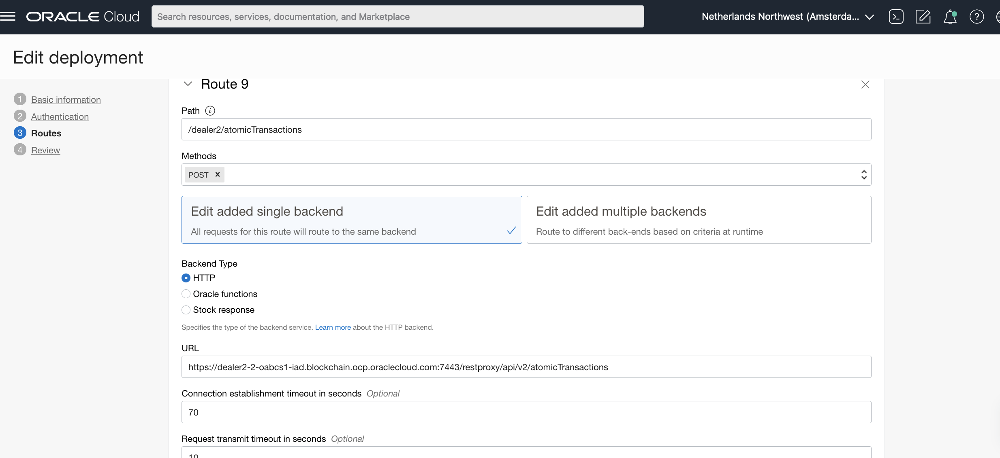

3. 'Review' the deployment information and click 'Create.'
  
  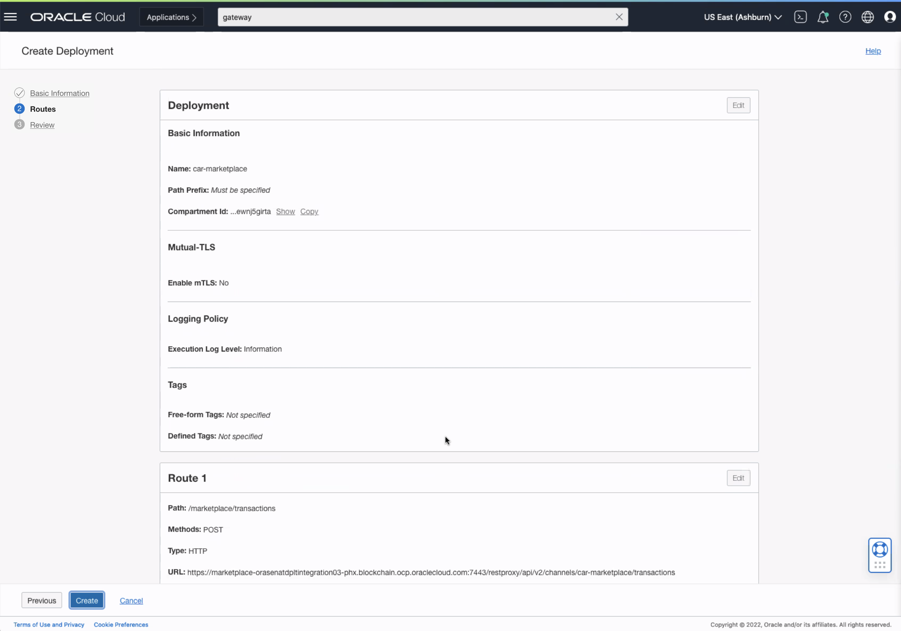

## Task 6: Prefix Query and Invoke Endpoint During Configuration

Once active, the deployment can be used to make REST API calls between APEX and OBP.

1. Find the **Deployment Information** pane and the **Endpoint** as shown.
  
  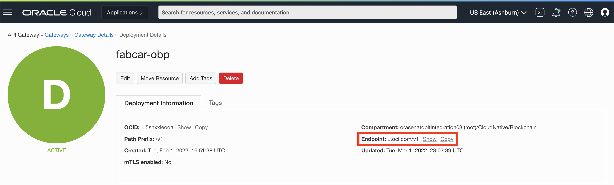

## Acknowledgements
* **Author** - Oracle Blockchain Product Management
* **Contributors** -  Dev Sony, Amal Tyagi, Teodora Gheorghe, Adrien Lhemann, Diego Morales, Lokeswara Nushisarva, Siddesh C. Prabhu Dev Ujjni, Rene Fontcha
* **Last Updated By/Date** - Rene Fontcha, September 2022
