# Create & Setup API Gateway to connect with Smart Contract API's

## Introduction

The API Gateway service enables you to publish APIs with private endpoints that are accessible from within your network, and which you can expose with public IP addresses if you want them to accept internet traffic. The endpoints support API validation, request and response transformation, CORS, authentication and authorization, and request limiting.

In this lab, you will be introduced to API Gateway. The gateway is necessary for configuring Oracle Blockchain Platform REST API endpoints on the front-end application.

*Estimated Lab Time:* 15 minutes

Watch the video below for a quick walk-through of the lab.
[Create & Setup API Gateway to connect with Smart Contract API's](videohub:1_w01l6lxc)

### Objectives

In this lab, you will:
* Create and configure REST endpoints to be accessed by front-end applications

### Prerequisites
This lab assumes you have:
- An Oracle Cloud account
- You have completed:
    - Prepare Setup (*Free-tier* and *Paid Tenants* only)
    - Environment Setup
    - Lab1: Create a Blockchain Network connecting 3 Organizations & Configuring Oracle
    - Lab2: Deploy, Test Smart Contracts using Blockchain App Builder & Oracle Blockchain Admin Console

## Task 1: Download Oracle Resource Manager (ORM) stack zip file to setup APIGateway & VCN
1. Get endpoints for marketplace, dealer1, dealer2 blockchain instances created in Lab1,Task3 and save it in the notepad. Example:
    - https://dealer1-abcd-iad.blockchain.ocp.oraclecloud.com:7443
    - https://dealer2-abcd-iad.blockchain.ocp.oraclecloud.com:7443
    - https://markeptplace-abcd-iad.blockchain.ocp.oraclecloud.com:7443

2. Click on the link below to download the Resource Manager zip file you need to build your environment:
    - Download ORM Stack zip file [`carmkplace-apigateway-vcn.zip`](files/carmkplace_apigateway_vcn.zip?download=1)
3.  Login to Oracle Cloud
4.  Open up the hamburger menu in the left hand corner.  Choose the compartment in which you would like to install.  Under the **Developer Services** submenu, choose **Resource Manager > Stacks**.  

  

  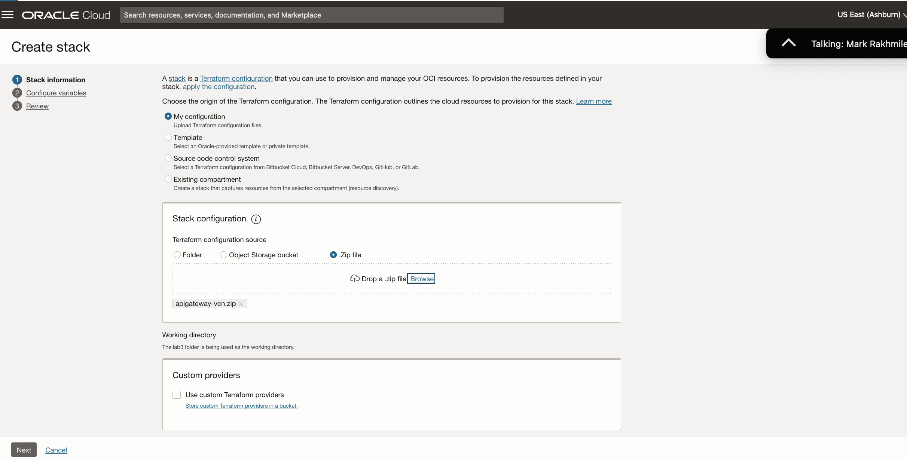

5.  Select **My Configuration**, choose the **.ZIP FILE** button, click the **Browse** link and select the zip file that you downloaded. Click **Select**.

  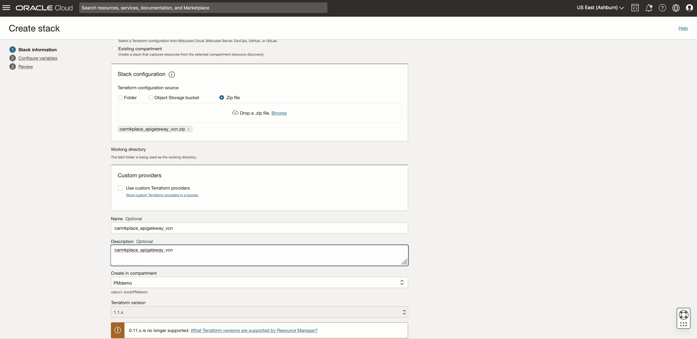

6. Enter the required details for creating API Gateway to invoke blockchain car marketplace API's :
    - Enter **Activity Domain** (e.g. AD1, AD2, AD3) 
    - Enter **Blockchain Channel Name** (e.g. car-marketplace) configured in Lab1 --> Task10 --> Step 1
    - Enter **Endpoints** (Copy from Step1) 
    - Add the appropriate **Instance Name** (e.g. dealer1, dealer2, marketplace) after each endpoint
    - Keep the remaining default fields.

  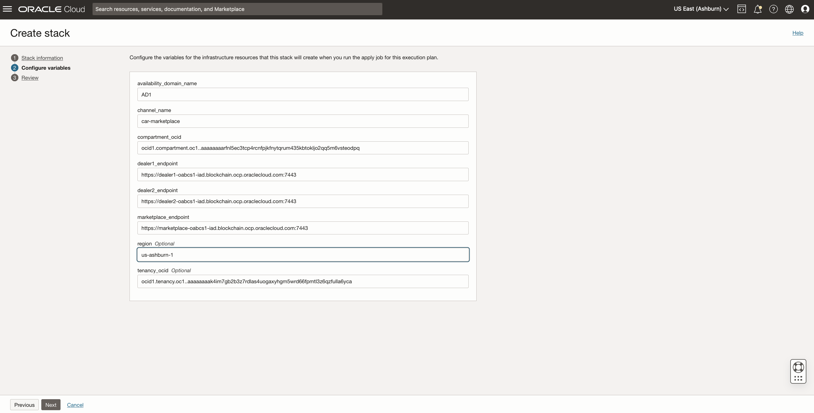

7. Click 'Next' --> 'Create'

  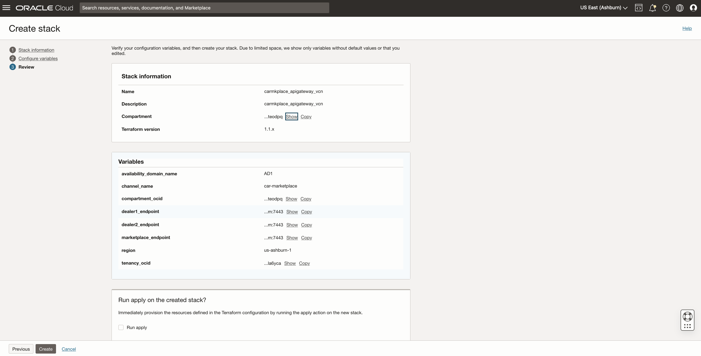

8. Stack is created. Open the stack by clicking on the new stack link.

  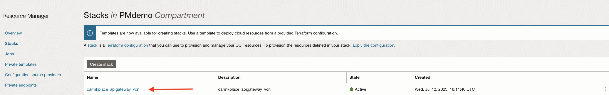

9. Create a plan by clicking on 'Plan' button.

  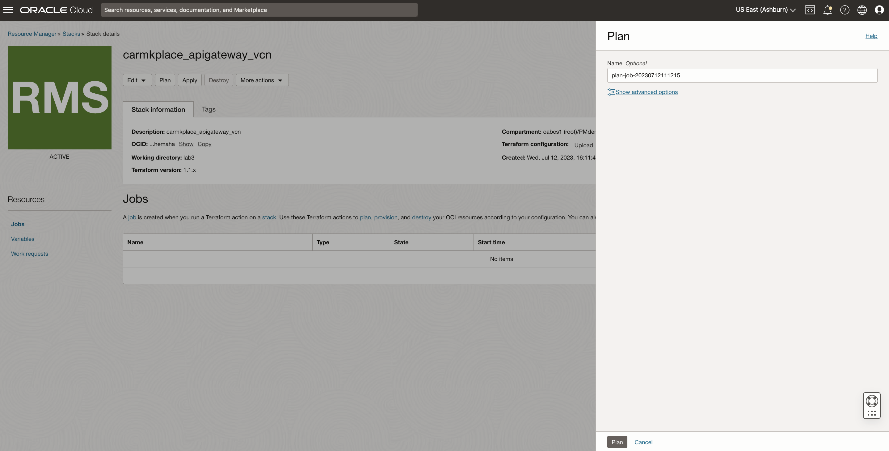
  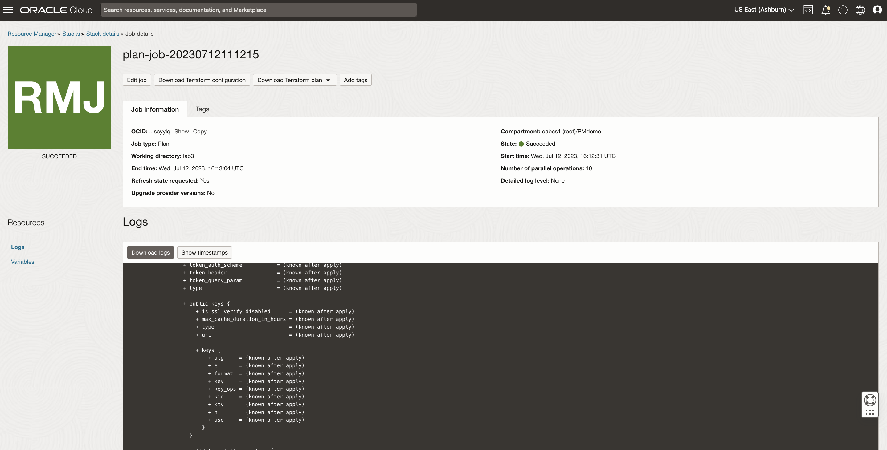

10. After successful completion of Plan, click 'Apply' and select the plan configured in 'Step9'  to create API Gateway.

  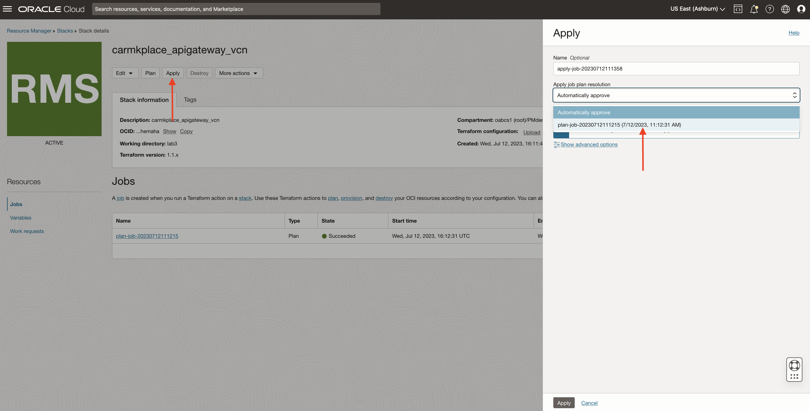
  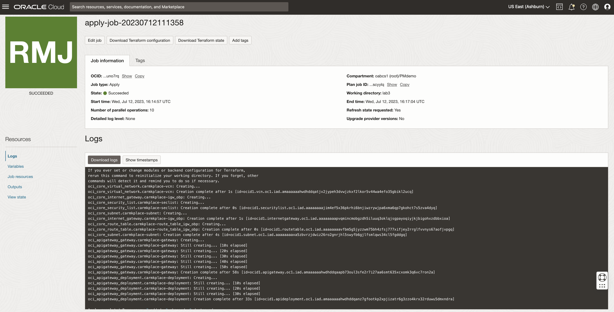

11. Once plan is applied and successful, validate APIGateway created as part of plan execution following steps below. 

  - Under the **Developer Services** submenu, choose **Gateways**

  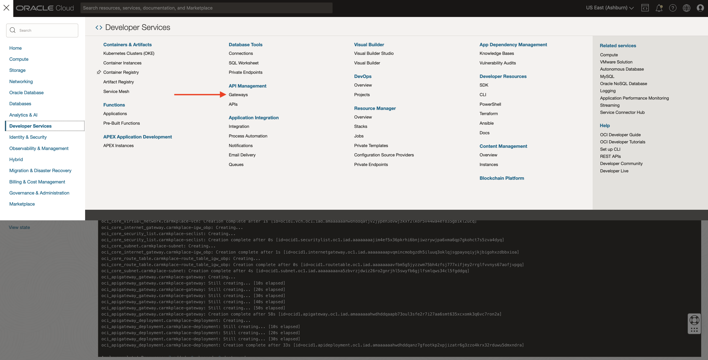
  
  - Click on **carmkplace-blockchain-apigateway**

  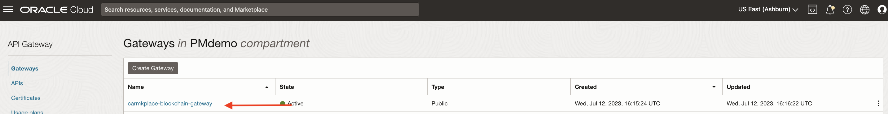

  - On the left nav menu --> Click on **Deployments**

  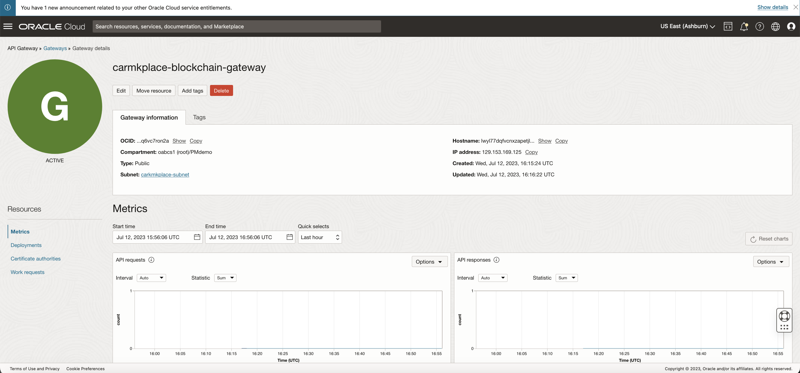

  - View all the routes created by clicking on **Routes** for Apex UI application to communicate with Blockchain REST API's

  
  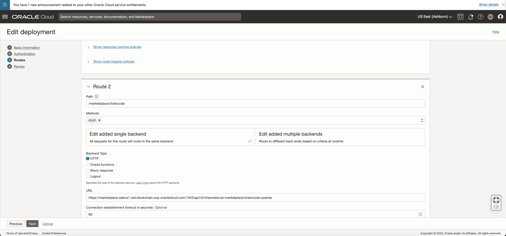

## Acknowledgements
* **Author** - Oracle Blockchain Product Management
* **Contributors** -  Dev Sony, Diego Morales, Jassi Singh, Gourav Sarkar, Rene Fontcha
* **Last Updated By/Date** - Rene Fontcha, July 2023
