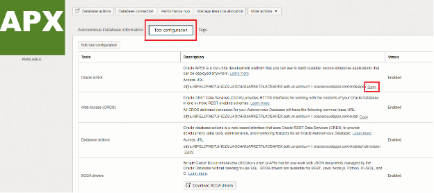
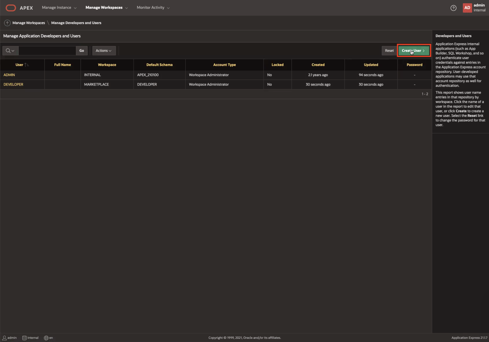
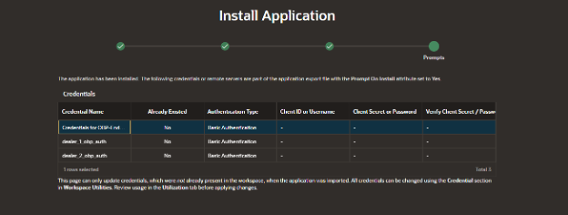
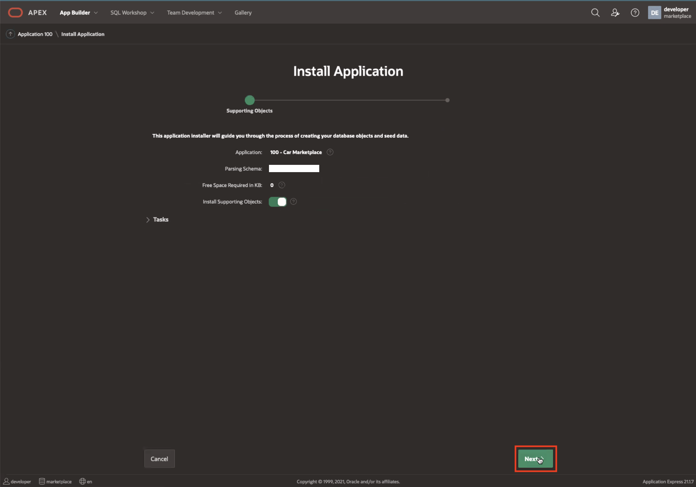
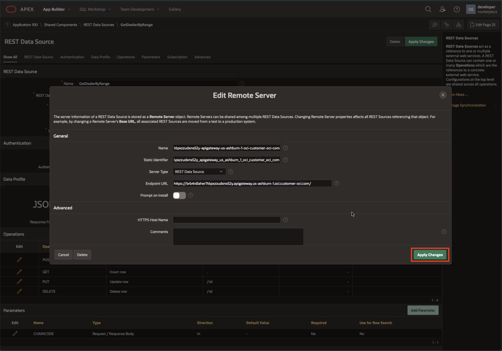

# How to Build User Interface using Oracle APEX and Integrate with Oracle Blockchain Platform 

## Introduction: Oracle Application Express (APEX)

APEX is a low-code development platform that enables you to build scalable, secure enterprise apps, with world-class features, that can be deployed anywhere.

*Estimated Lab Time: 15 minutes*

### Objectives

In this lab, you will:
* Upload an application template and configure APEX data sources to invoke your blockchain network

### Pre-Requisites

This lab assumes you have:
* Completed Lab1 - Create, Deploy & Execute Smart Contracts using Oracle Blockchain App Builder
* Completed Lab2 - Create, Deploy & Execute Smart Contracts using Oracle Blockchain App Builder
* Completed Lab3 - Setup & Configure API Gateway for external applications to connect with Smart Contract API's published by Oracle Blockchain REST Proxy.

## Task 1: Spin Up Autonomous Database Instance

1. In the OCI services menu, select 'Oracle Database' and click on 'Autonomous Database.'

2. Check your **Compartment** is correct and click on 'Create Autonomous Database.'
  

3. In the form, first choose a **Display name** (e.g. CarMarketplaceAPEX), a **Database name** (e.g. CarMarketplace), and then **Choose a workload type** (in this case, APEX) as shown.
  

4. Toggle 'Always Free' as shown.
  

5. Check that your **database version** is 19c.
  

6. **Create administrator credentials** and store these credentials somwhere safe.
  

7. Choose **network access** and **license type** as shown:
  

8. Finally, enter a **Contact Email**.
  

9. Click 'Create Autonomous Database' and wait a few minutes for the database to provision.

## Task 2: Configure Database Schema and User Credentials

1. When your Autonomous Database instance has provisioned, access the 'Service Console.' 

  

2. Enter the ADMIN password you just created.

  

3. Click on the 'Create Workspace' button.

  

4. Fill out the form as follows:
    - Enter 'DEVELOPER' as the **Database User**.
    - Choose a **Password** and copy it somewhere safe.
    - Enter 'DEVELOPER' as the **Workspace Name**.

  

5. From the 'Administration Services' page, click on 'Manage Workspaces.'

  

6. Now click on 'Manage Developers and Users' as shown.

  

7. Click on the green 'Create User' button.

  

8. Fill out the form as follows and click 'Create User' to save:
    - Enter 'john_dealer1' as the **Username**.
    - Enter 'john_dealer1@dealer.com' as the **Email Address**.
    - Select the 'DEVELOPER' **Workspace**.
    - Enter a **Password** and then **Confirm Password**.

  

9. Repeat Steps 7 and 8 to create a second user:
    - Enter 'sam_dealer2' as the **Username**.
    - Enter 'sam_dealer2@dealer.com' as the **Email Address**.
    - Select the 'DEVELOPER' **Workspace**.
    - Enter a **Password** and then **Confirm Password**.

9. After clicking 'Create User' again, check that both new users are displayed on the 'Manage Developers and Users' page as shown. Then click on the APEX logo to return to 'Administration Services.'

  

10. Sign out of ADMIN in the upper-right hand corner.

  

## Task 3: Import APEX App Template

1. 'Return to Sign In Page' and login to 'DEVELOPER' as shown:
    - Enter 'marketplace' as the **Workspace**.
    - Enter 'DEVELOPER' as the **Username**.
    - Enter the **Password** you setup in Task 2, Step 4.

  

2. Click 'Set APEX Account Password.'

  

3. Enter an **Email Address** (e.g. DEVELOPER@dealer.com) and scroll down to enter a **Password**.

  
  

4. Select 'App Builder' as shown.

  

5. Select 'Import' to import an app template.

  

6. 'Drag and Drop' the f100.zip file into the pane and click 'Next.'

  

  ***Link to the Zip file***

7. Click 'Next.'

  

8. Fill out the 'Install Database Application' form as follows:
    - Choose 'DEVELOPER' for the **Parsing Schema**.
    - Select 'Run and Build Application' as the **Build Status**.
    - Keep 'Auto Assign New Application ID' selected and click 'Install Application.'

  

9. Click 'Next.'

  

10. Click 'Next' again.

  

11. Finally, click on 'Install.'

  

12. Click 'Edit Application' and proceed to Task 4 to further configure your APEX app.

  

## Task 4: Configure APEX Data Source with API Gateway Endpoint

1. Now, click on 'Shared Components.' Here you will be able to configure application attributes and data sources. 

  

2. Click on 'Application Definition Attributes,' located under **Application Logic**. 

  

3. Click the 'Substitions' tab as shown.

  

4. Set the following **Substitutions** and 'Apply Changes':
- First, set G\_OCI\_WEB\_CREDENTIAL to OCI\_API\_Credentials.
- Next, set OBP\_MAIN\_INSTANCE\_URL to the URL you found in the **Deployment Information** section in Lab 3. This allows APEX to connect to the Car Marketplace OBP REST API endpoints via the API Gateway deployment. 
- Set FABCAR\_CHAINCODE to car\_marketplace\_cc.
- Set TOKENIZATION\_CHAINCODE to car\_tokenization\_cc.
- Set DEALER\_1\_URL and DEALER\_2\_URL to john_dealer1 and sam_dealer2, respectively. This gives information on API routing.

  

5. Next, scroll towards the bottom of your 'App Builder' homepage and under **Data Sources**, select 'REST Data Sources.'

  

6. Click 'GetDealerByRange' to view information regarding this data source.

 

7. Click the pencil icon **Remote Server**. 

  

8. Make the following updates:
    - Set **Name** to the 'Hostname' found in the Gateway details, accessible from the OCI service console.
  
    - Give your server a  **Static Identifier** (e.g. by changing all punctuation in **Name** to underscores as shown).
    - Set **Endpoint URL** to the same 'Hostname' from the Gateway details.

  

9. Click on 'Apply Changes.'

  

10. Set **URL Path Prefix** to v0/marketplace/chaincode/queries and click 'Apply Changes.'
****Make sure Gateway URL Matches this URL - Update ****

  

11. Now, repeat steps 7-11 for the following REST Sources:
    - 'GetAccountBalance' 
    - 'GetInvoiceByRange'
    - 'GetCarsByRange'
    - 'GetCarHistoryById'
    - 'GetPOByRange'
    -'GetInvoiceByRannge' 

  

## Task 5: Proceed to next lab

<!-- 10. 

5. Proceed to payment by clicking a car in the Marketplace. This car will disappear from the Marketplace when sold.

5. When a transaction begins, it will show up in the 'Orders' tab. Here, you will see that the car you created is currently pending sale.

6. Click on the pencil icon next to this pending order and click 'Process Order.' Here, the car will go back to the dealer who submitted the order. This dealer can **Filter data** by 'Orders Placed' to see that the transaction has processed. They can then 'Accept Receipt' to purchase or simply 'Withdraw Order.'

--describe tokenization-- tokens will be put on hold while transaction is processed and order is confirmed -->

## Acknowledgements
* **Author** - Amal Tyagi, Cloud Engineer
* **Contributors** -  Teodora Gheorghe, Adrien Lhemann, Diego Morales, Lokeswara Nushisarva, Siddesh C. Prabhu Dev Ujjni
* **Last Updated By/Date** - Amal Tyagi, August 2022
