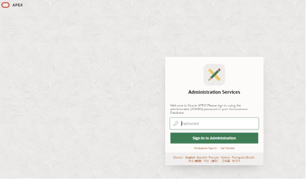
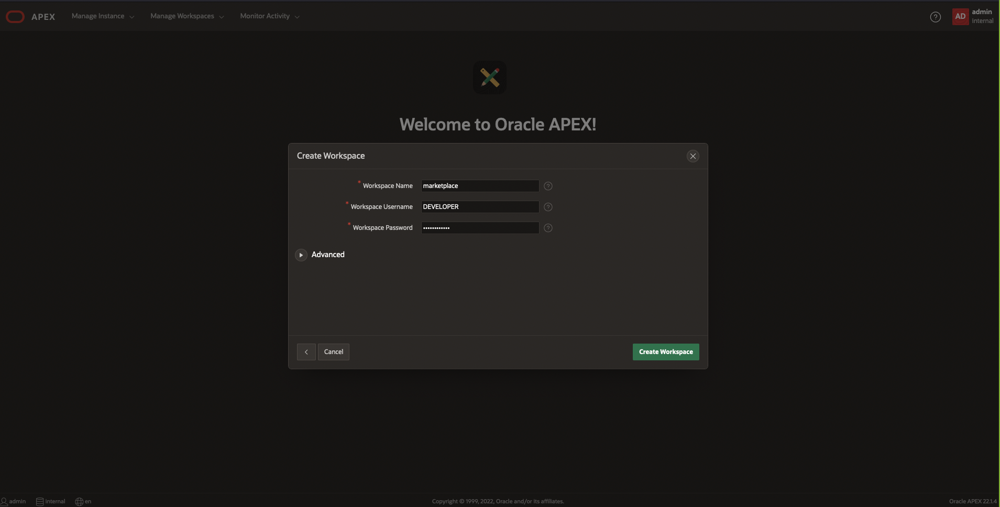
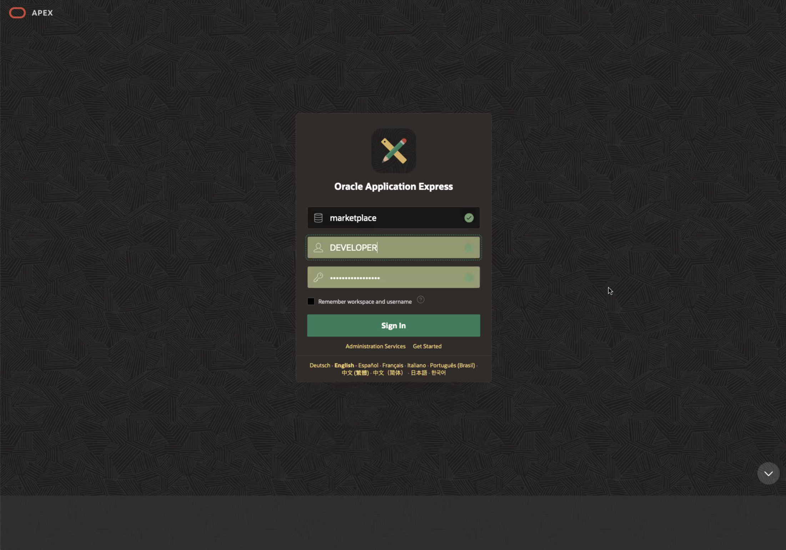
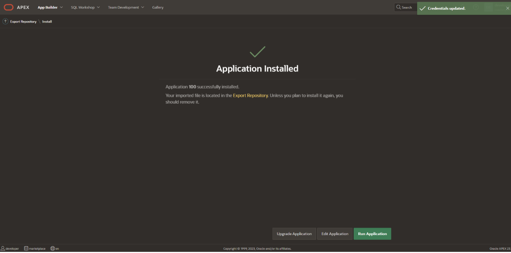
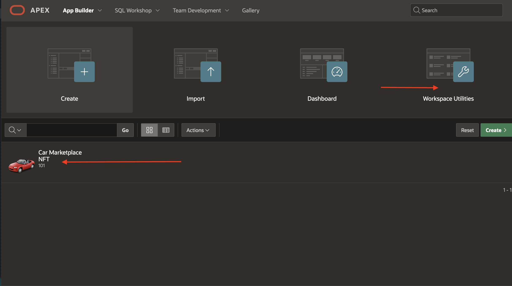
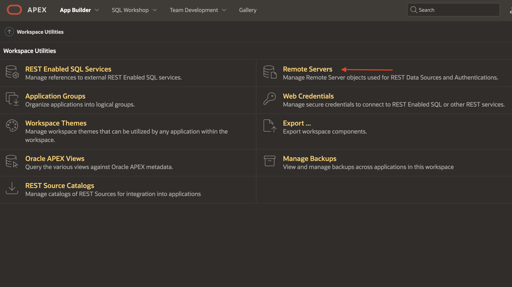

# How to Build User Interface using Oracle APEX and Integrate with Oracle Blockchain Platform

## Introduction

APEX is a low-code development platform that enables you to build scalable, secure enterprise apps, with world-class features, that can be deployed anywhere.

*Estimated Lab Time:* 15 minutes

Watch the video below for a quick walk-through of the lab.
[Building Car Marketplace application using APEX](videohub:1_oqqqhg96)

### Objectives

In this lab, you will:
* Upload an application template and configure APEX data sources to invoke your blockchain network

### Pre-Requisites

### Prerequisites
This lab assumes you have:
- An Oracle Cloud account
- You have completed:
    - Lab: Prepare Setup (*Free-tier* and *Paid Tenants* only)
    - Lab: Environment Setup
    - Lab: Create a Blockchain Network connecting 3 Organizations
    - Lab: Create and Deploy Smart Contracts using Oracle Blockchain App Builder
    - Lab: Create & Setup API Gateway to connect with Smart Contract API's

## Task 1: Spin Up Autonomous Database Instance

1. In the OCI services menu, select 'Oracle Database' and click on 'Autonomous Database.'

2. Check your **Compartment** is correct and click on 'Create Autonomous Database.'
  

3. In the form, first choose a **Displayname** (e.g. CarMarketplaceAPEX - No Spaces), a **Database name** (e.g. CarMarketplaceApex), and then **Choose a workload type** (in this case, APEX) as shown.
  

4. Toggle 'Always Free' as shown
  

5. Check that your **database version** is 19c or above
  

6. **Create administrator credentials** and store these credentials somwhere safe.
  

7. Choose **network access** and **license type** as shown:
  

8. Finally, enter a **Contact Email**.
  

9. Click 'Create Autonomous Database' and wait a few minutes for the database to provision.

## Task 2: Configure Database Schema and User Credentials

1. When your Autonomous Database instance has provisioned, access the 'Tools' --> 'Open APEX' --> 'Open APEX'

  

2. Enter the ADMIN password you just created.

  

3. Click on the 'Create Workspace' button.

  

4. Select 'Create New Schema'

  

5. Fill out the form as follows:
    - Enter 'DEVELOPER' as the **Workspace Username**.
    - Choose a **Password** and copy it somewhere safe.
    - Enter 'marketplace' as the **Workspace Name**.

  

6. From the 'Administration Services' page, click on 'Manage Workspaces.'

  

7. Now click on 'Manage Developers and Users' as shown.

  

8. Click on the green 'Create User' button.

  

9. Fill out the form as follows and click 'Create User' to save:
    - Enter 'john_dealer1' as the **Username**.
    - Enter 'john_dealer1@dealer.com' as the **Email Address**.
    - Select the 'Marketplace' **Workspace**.
    - Enter a **Password** and then **Confirm Password**.

  

10. Repeat Steps 7 and 8 to create a second user:
    - Enter 'sam_dealer2' as the **Username**.
    - Enter 'sam_dealer2@dealer.com' as the **Email Address**.
    - Select the 'Marketplace' **Workspace**.
    - Enter a **Password** and then **Confirm Password**.

  

11. After clicking 'Create User' again, check that both new users are displayed on the 'Manage Developers and Users' page as shown. Then click on the APEX logo to return to 'Administration Services.'

  

11. Sign out of ADMIN in the upper-right hand corner

  

## Task 3: Import APEX App Template

1. 'Return to Sign In Page' and login to 'DEVELOPER' as shown:
    - Enter 'marketplace' as the **Workspace**.
    - Enter 'DEVELOPER' as the **Username**.
    - Enter the **Password** you setup in Task 2, Step 4.

  

2. Select 'App Builder' as shown

  

3. Select 'Import' to import an app template

  

4. 'Drag and Drop' the [Apex Marketplace Template](files/f101.sql?download=1) file into the pane and click 'Next.'

  

5. Click 'Next.'

  

6. Fill out the 'Install Database Application' form as follows:
    - Choose 'WKSP_MARKETPLACE' for the **Parsing Schema**.
    - Select 'Run and Build Application' as the **Build Status**.
    - Keep 'Auto Assign New Application ID' selected and click 'Install Application.'

  

7. Click 'Next.' --> Enter username and password in the respective fields --> Enter username and password in the respective fields

  

8. Click 'Next' again --> Parsing Schema should be 'WKSP_MARKETPLACE'

  

9. Finally, click on 'Install.'

  

10. Click 'Edit Application' and proceed to Task 4 to further configure your APEX app.

  

## Task 4: Configure APEX Data Source with API Gateway Endpoint

1. Go to 'App Builder' on the top left hand corner of the screen --> Click on Car Marketplace  --> Click on 'Shared Components.' Here you will be able to configure application attributes and data sources.

  

2. Click on 'Application Definition' located under **Application Logic**.

  

3. Click the 'Substitions' tab as shown.

  

4. Set the following **Substitutions** and 'Apply Changes':
    - First, set G\_OCI\_WEB\_CREDENTIAL to OCI\_\API_\Credentials.
    - Next, set OBP\_MAIN\_INSTANCE\_URL to the URL you found in the **Deployment Information**  section in the previous lab (Lab: Created & Setup API Gateway to connect with Smart Contract API's). This allows APEX to connect to the Car Marketplace OBP REST API endpoints via the API Gateway deployment. Change OBP\_MAIN\_INSTANCE\_URL, OBP\_DEALER\_1\_URL, OBP\_DEALER\_2\_URL based on the routes configured in *Lab 4*  

    
    

    - Set FABCAR\_CHAINCODE to car\_marketplace\_cc.
    - Set TOKENIZATION\_CHAINCODE to car\_tokenization\_cc.
    - Set DEALER\_1\_URL and DEALER\_2\_URL to john\_dealer1 and sam\_dealer2, respectively. This gives information on API routing.
    - Set MARKETPLACE to marketplace.

  

5. Go back and  Select 'App Builder' as shown.

  

6. Navigate to 'Workspace Utilities'

  

7. Click on to 'Remote Servers'

  

8. Create new remote server cofiguration based on the Gateway configuration in *Lab 3*

  Build Remote server configuration based on *Lab3 Task4*:
    - Set **Name** to the 'Hostname' found in the Gateway details, accessible from the OCI service console.

  
    - Give your server a  **Static Identifier** (e.g. by changing all punctuation in **Name** to underscores as shown).
    - Set **Endpoint URL** to the same https://'Hostname' from the Gateway details.
    - Now, create remote server in Apex and apply changes

  

9. Next, scroll towards the bottom of your 'App Builder' homepage and under **Data Sources**, select 'REST Data Sources.'

  

10. Now, we can see the following REST Sources configured with remote server URL configured:
    - 'GetAccountBalance'
    - 'GetInvoiceByRange'
    - 'GetCarsByRange'
    - 'GetCarHistoryById'
    - 'GetPOByRange'
    - 'GetInvoiceByRannge'
    - 'GetCarTitleToken1
    - 'GetCarTitleToken2'
    - 'GetCarServicesDealer1'
    - 'GetCarServicesDealer2'
    - 'GetCarTitleToken1
    - 'GetCarTitleToken2'
    - 'GetCarServicesDealer1'
    - 'GetCarServicesDealer2'

  

You may now proceed to the next lab.

<!-- 10.

5. Proceed to payment by clicking a car in the Marketplace. This car will disappear from the Marketplace when sold.

5. When a transaction begins, it will show up in the 'Orders' tab. Here, you will see that the car you created is currently pending sale.

6. Click on the pencil icon next to this pending order and click 'Process Order.' Here, the car will go back to the dealer who submitted the order. This dealer can **Filter data** by 'Orders Placed' to see that the transaction has processed. They can then 'Accept Receipt' to purchase or simply 'Withdraw Order.'

--describe tokenization-- tokens will be put on hold while transaction is processed and order is confirmed -->

## Acknowledgements
* **Author** - Oracle Blockchain Product Management
* **Contributors** - Adrien Lhemann, Diego Morales, Lokeswara Nushisarva, Siddesh C. Prabhu Dev Ujjni, Rene Fontcha
* **Last Updated By/Date** - Rene Fontcha, July 2023
