# Car Trading Marketplace using Tokens in Oracle Blockchain Platform and Oracle Application Express (APEX)

## Introduction

APEX is a low-code development platform that enables you to build scalable, secure enterprise apps, with world-class features, that can be deployed anywhere.

*Estimated Lab Time:* 10 minutes

### Objectives

In this lab, you will:
- Trade a Car making payments using Tokens

### Prerequisites
This lab assumes you have:
- An Oracle Cloud account
- You have completed:
    - Lab: Prepare Setup (*Free-tier* and *Paid Tenants* only)
    - Lab: Environment Setup
    - Lab: Create a Blockchain Network connecting 2 Organizations
    - Lab: Create and Deploy Smart Contracts using Oracle Blockchain App Builder
    - Lab: Create & Setup API Gateway to connect with Smart Contract API's
    - Lab: Building Car Marketplace application using APEX
   
## Task 1: Setup APEX Web Credentials opening Apex console

1. 'Open the Apex Application' and login to 'DEVELOPER' as shown:
    - Enter 'marketplace' as the **Workspace**.
    - Enter 'DEVELOPER' as the **Username**.
    - Enter the **Password** you setup in *Lab 4 --> Task 2 -->Step 5*

  

2. On the 'App builder' main page page, click on 'Workspace Utilities.'

  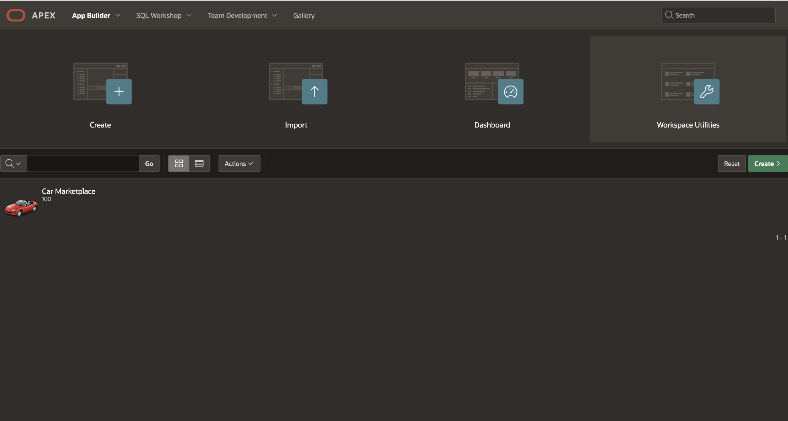

3. Now, click on 'Web Credentials'

  

4. Next, click on 'Credentials for OBP Endpoint.'

  

5. Using the same password used for the founder instance ( marketplace, Lab 1 - Task 12), update the password in 'Client or Password' field and 'Apply Changes'.

  

6. Repeat step 1-4 for the other two web credentials, using the passwords belonging to the Dealership accounts in Lab 1 - Task 12.
  - dealer\_1\_obp\_auth (john\_dealer1 account)
  - dealer\_2\_obp\_auth (sam\_dealer2 account)

## Task 2: Complete Car Marketplace Workshop by Trading a Car - Add a car to dealer1 Inventory

You will now create a car and simulate a transaction between the founder organization and a car dealer partner. When a car is added to the Marketplace, fiat tokens are put on hold in the founder instance and then transacted with partner dealerships as necessary. 

 1. Go to AppBuilder --> Car Marketplace --> Run Application

  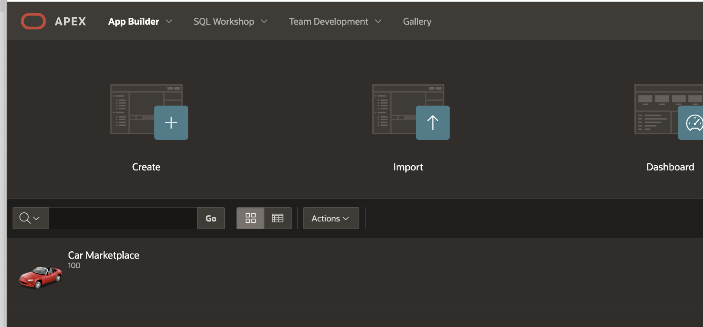

  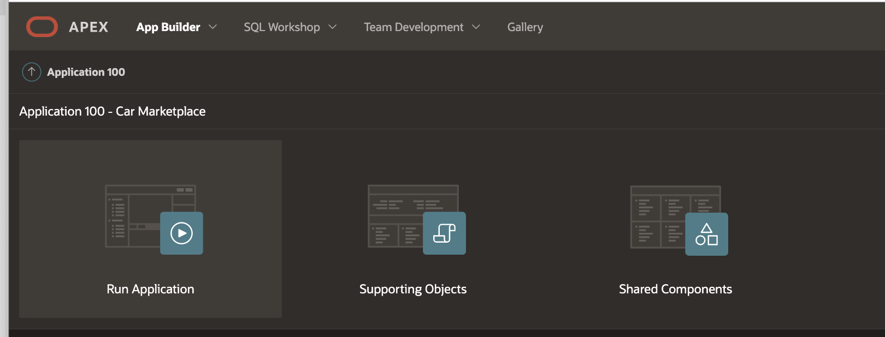
 
 2. Login as a dealer (e.g. john\_dealer1) and land on My Inventory. Use the same password configured for john\_dealer1 in *Lab4* Use the same password configured for john_dealer1 in *Lab4*

  

  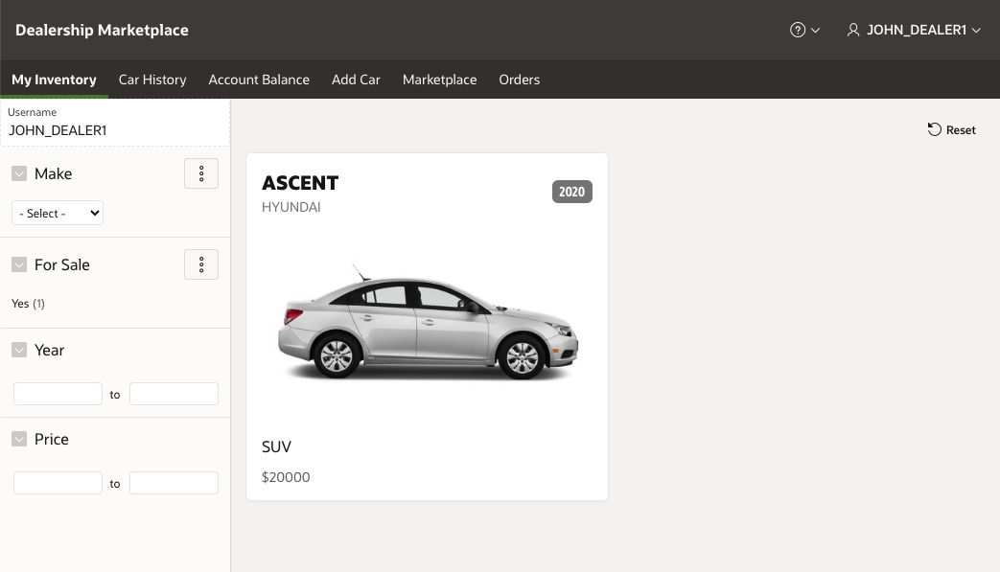

2. Click 'Add Car' and fill out the form to create a car, as shown.
    - Enter Vehicle Vin (Must be 17 characters)
    - Select Vehicle Make
    - Select Year
    - Enter Vehicle model
    - Enter Vehicle Price
    - Enter Vehicle Mileage
    - Select a vehicle type.
    - Set 'For Sale' to true.

  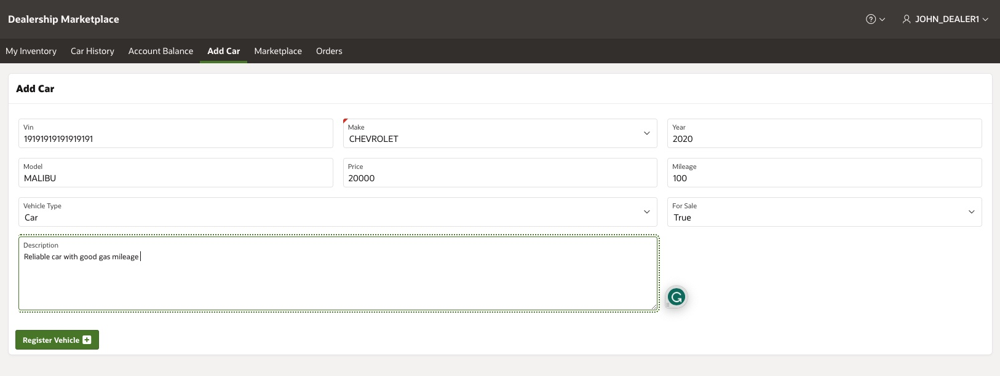

3. Car is now added to the inventory

  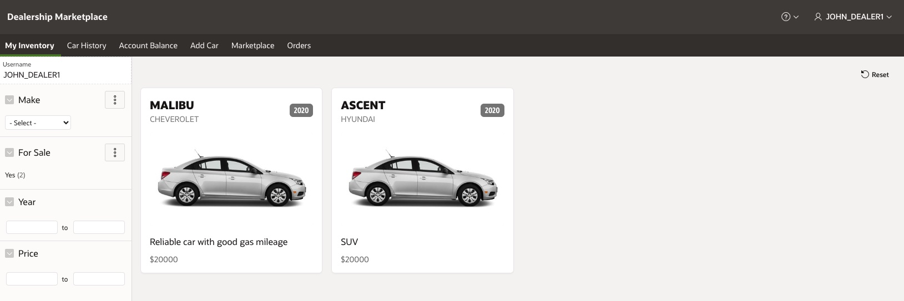

4. Click on the car added in the Inventory

  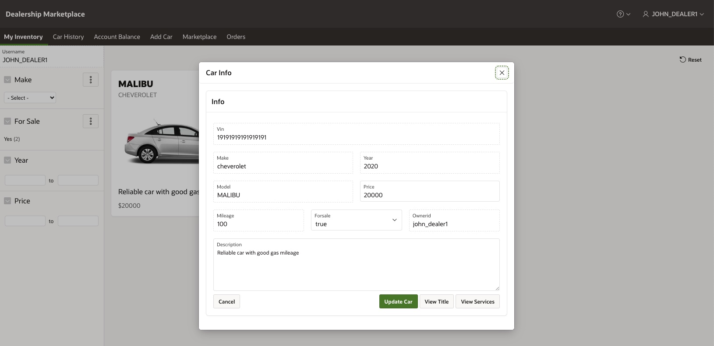

5. Click on the NFT Title Token and Services registered. Creating the car also creates an car title NFT token utilizing the car details. This transaction (Add car) uses 2PC atomic transaction feature provided by the oracle blockchain platform. More details of the [atomic transactions](https://docs.oracle.com/en/cloud/paas/blockchain-cloud/restoci/op-restproxy-api-v2-atomictransactions-post.html)

  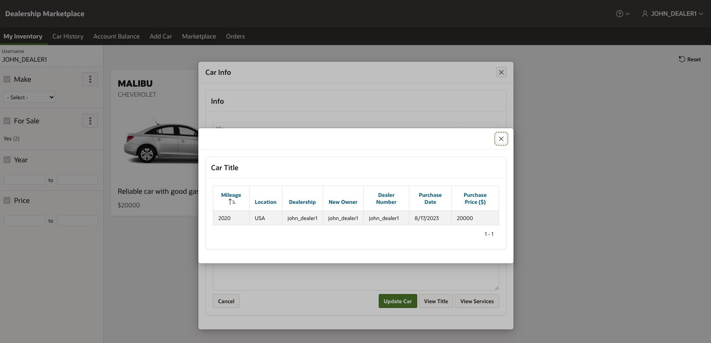
  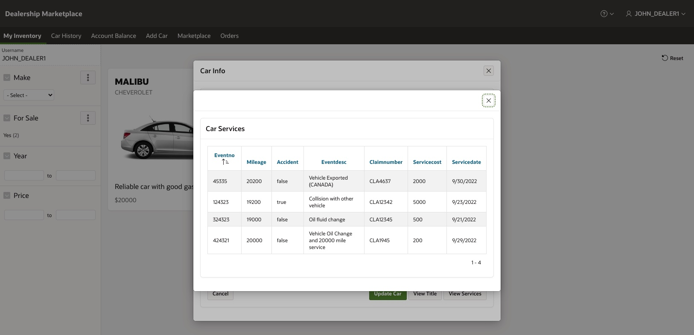

## Task 3: dealer2 - Deposit Tokens in to the account

1. Now login as the other dealer, sam_dealer2.

  

2. Navigate to Account Balance tab.

  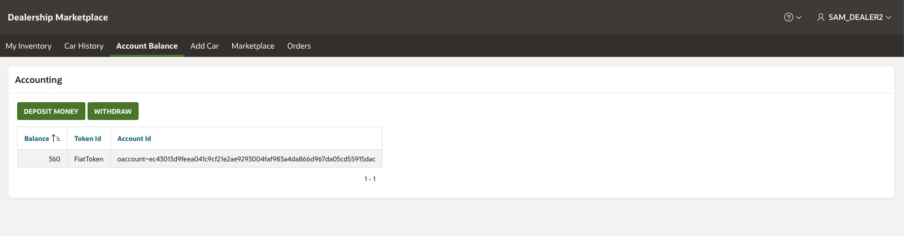

3. Select Deposit Money, and enter desired amount. Account Balance should be updated to reflect amount deposited.

  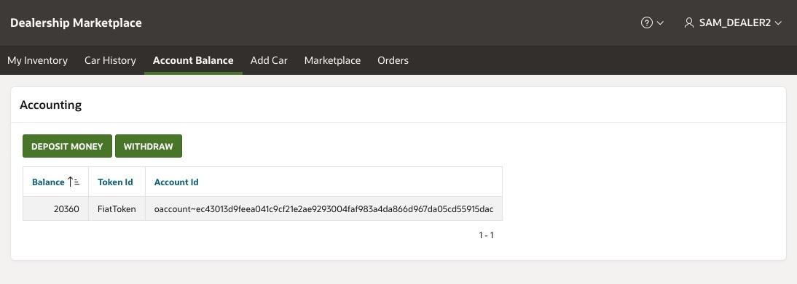

## Task 4: dealer2 - Search Car

1. Navigate to Marketplace

  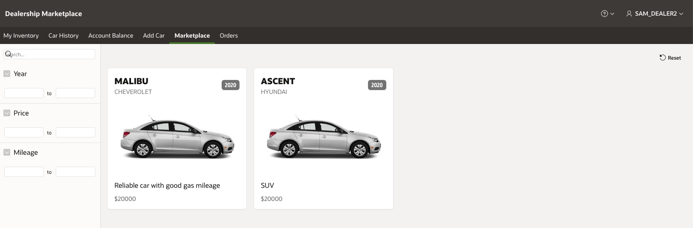

2. Select vehicle to view Car Details & Price

  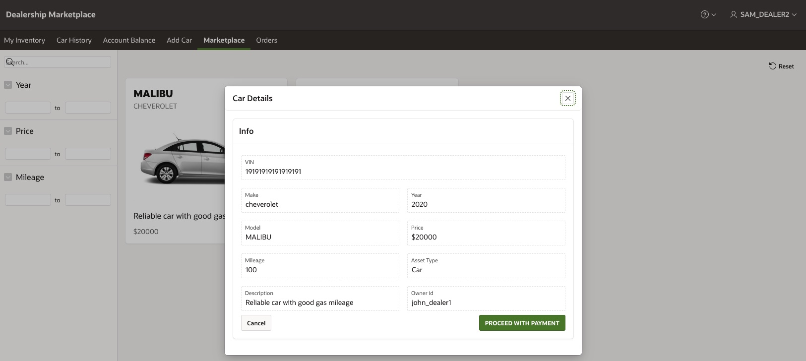

## Task 5: dealer2 - Purchase and Confirm Purchase

1. Confirm vehicle Purchase

  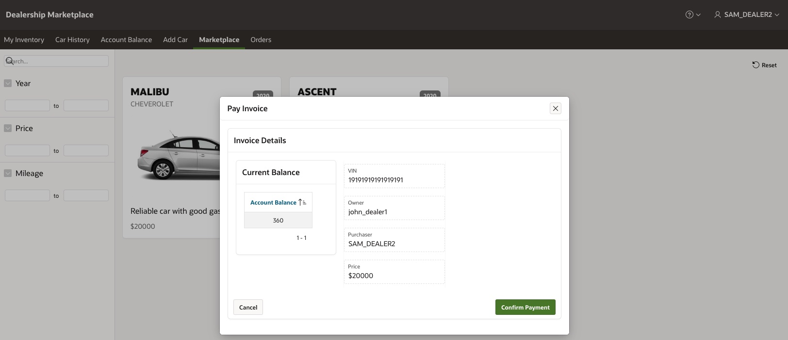

Purchase order will now be created.

## Task 6: dealer1 - Review & Confirm the order placed by dealer2

1. Return to dealer 1's account, and navigate to orders received. You should be able to see the order placed by dealer 2. Select the actions icon (pencil) on the order received and process the order.

  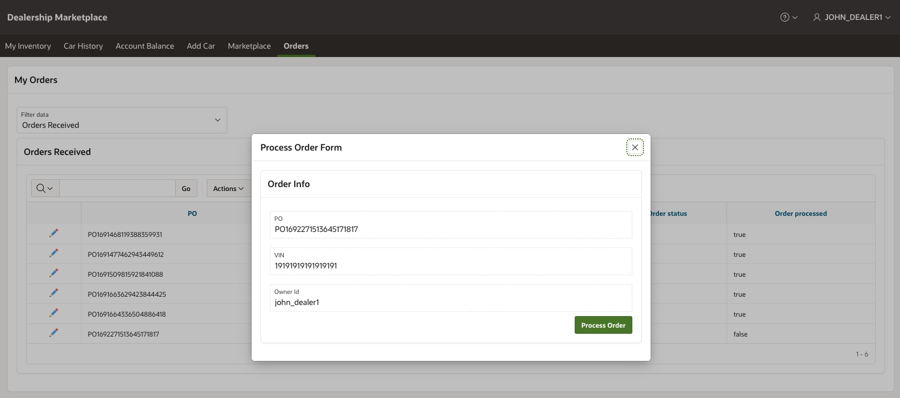

This action confirms the order by the seller.

## Task 7: dealer2 - Order Processed and Accepted

1. Return to dealers 2's account, and navigate to orders placed. You will see the order placed should now be processed and ready to complete the purchase.

  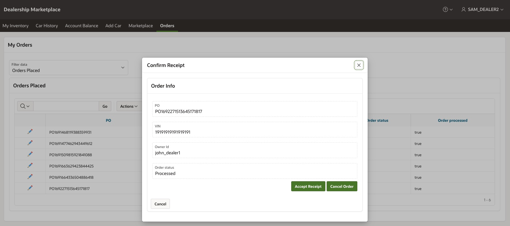

Select "Accept Receipt" to complete order or "Cancel Order" to cancel the order.

## Task 8: dealer2 - Token Transfer & Delivery
1. Once purchaser Accepts receipt, the token transfer will now occur and the vehicle will be delivered to the new owner.

  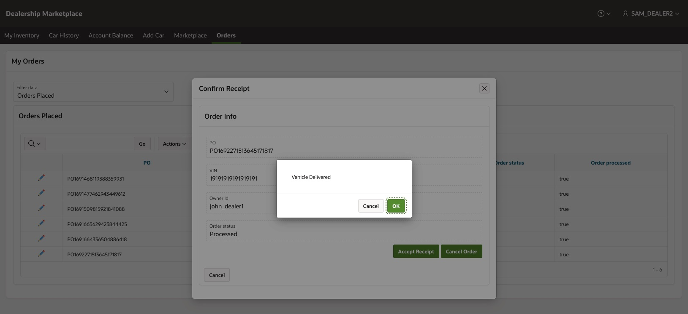

  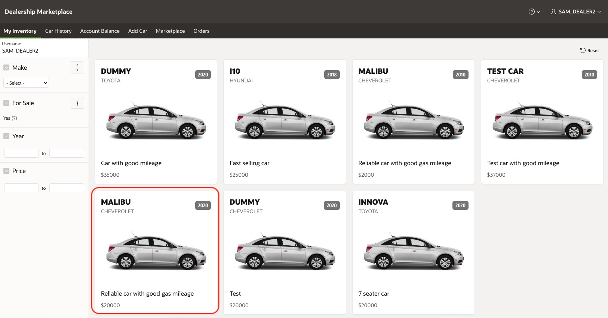

Additionaly, you are able to view the invoice from the purchase in the Orders > Invoice received section

  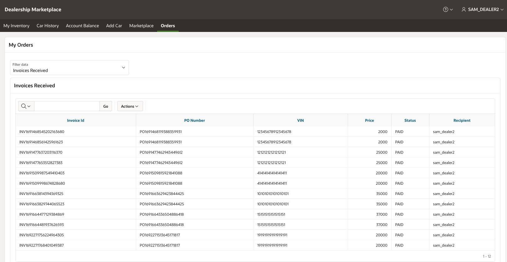

<!-- 10.

5. Proceed to payment by clicking a car in the Marketplace. This car will disappear from the Marketplace when sold.

5. When a transaction begins, it will show up in the 'Orders' tab. Here, you will see that the car you created is currently pending sale.

6. Click on the pencil icon next to this pending order and click 'Process Order.' Here, the car will go back to the dealer who submitted the order. This dealer can **Filter data** by 'Orders Placed' to see that the transaction has processed. They can then 'Accept Receipt' to purchase or simply 'Withdraw Order.'

--describe tokenization-- tokens will be put on hold while transaction is processed and order is confirmed -->

## Acknowledgements
* **Author** - Oracle Blockchain Product Management
* **Contributors** -  Diego Morales, Lokeswara Nushisarva, Siddesh C. Prabhu Dev Ujjni, Rene Fontcha
* **Last Updated By/Date** - Rene Fontcha, July 2023
