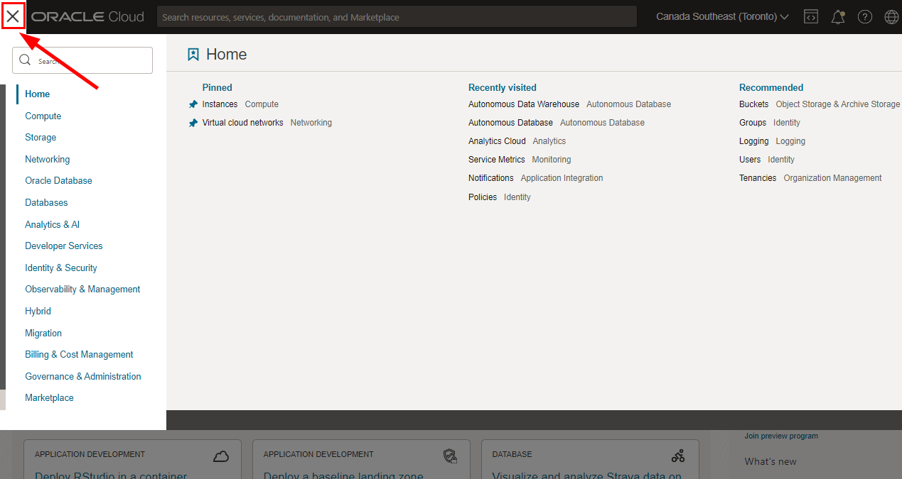
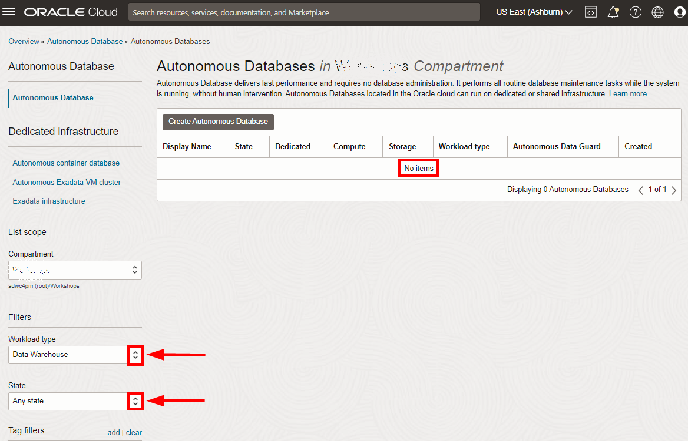
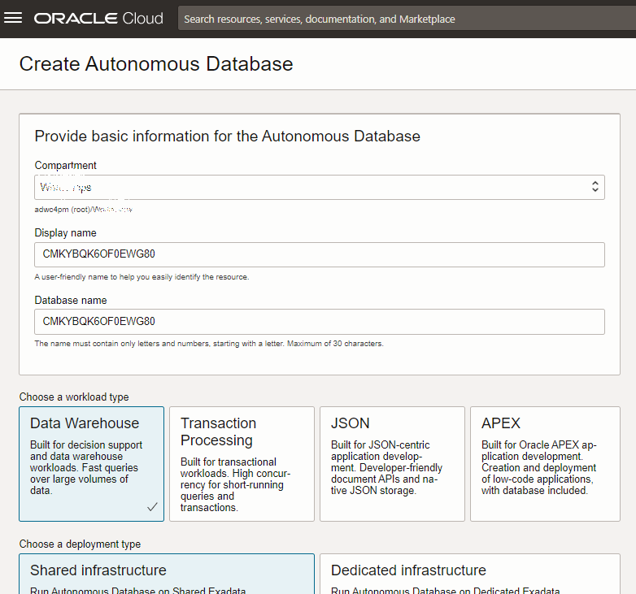
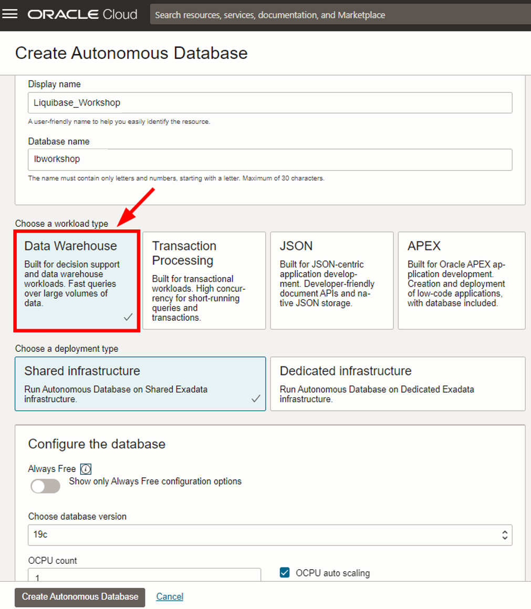
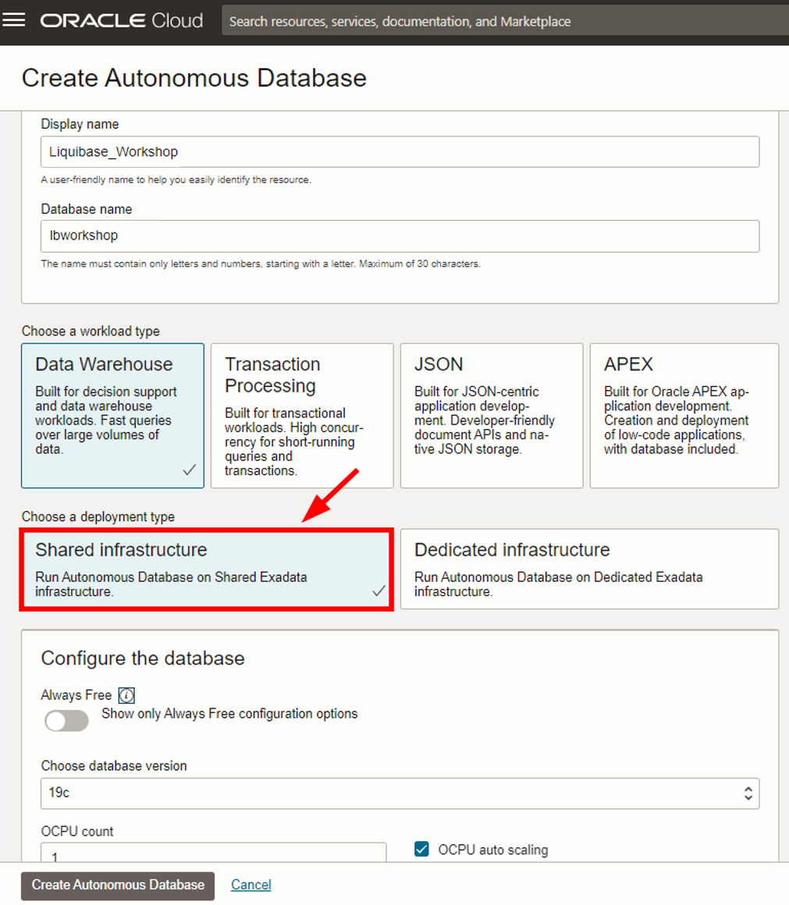
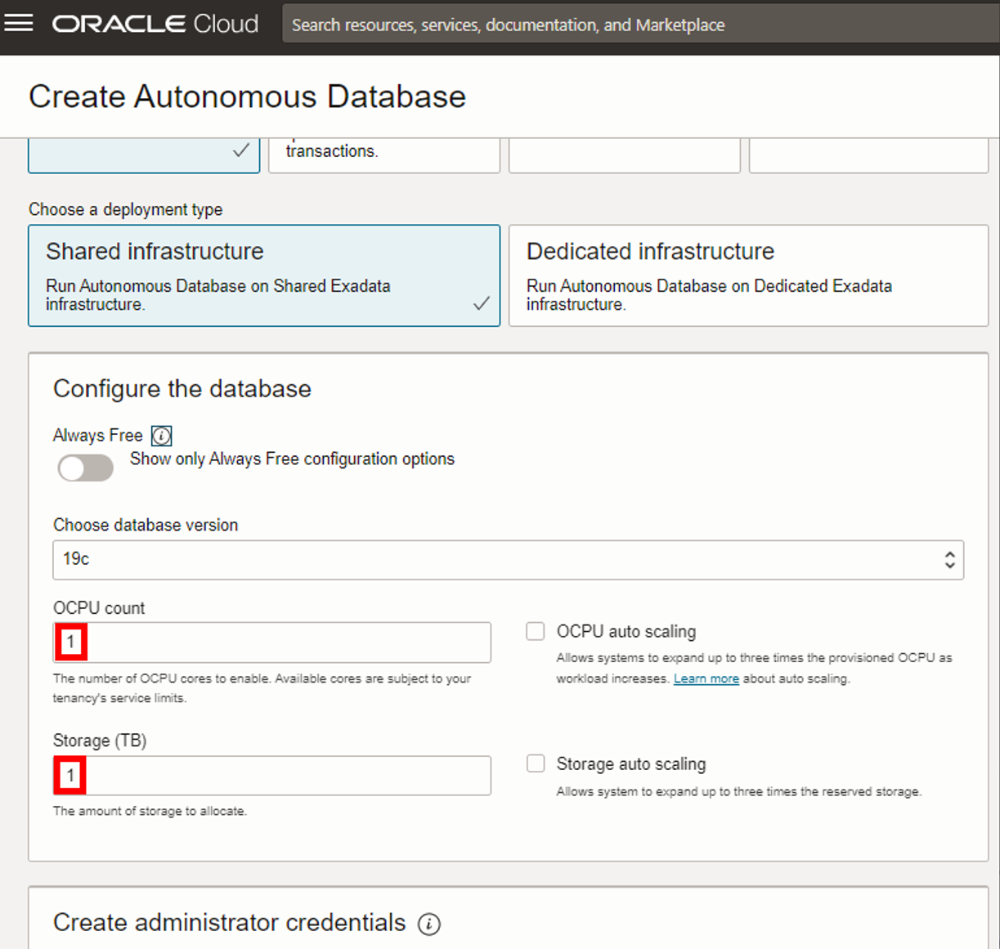

# Provision an Oracle Autonomous Database (ADW and ATP)

## Introduction

This lab walks you through the steps to get started using the Oracle Autonomous Database (Autonomous Data Warehouse [ADW] and Autonomous Transaction Processing [ATP]) on Oracle Cloud. In this lab, you will provision a new ADW instance.

>**Note:** While this lab uses ADW, the steps are the same for creating an ATP database.

Estimated Time: 10 minutes

Watch the video below for a quick walk-through of the lab.
[Provision an ADB Instance](videohub:1_22f82n6x)

### Objectives

In this lab, you will:

-   Learn how to provision a new Autonomous Database

### Prerequisites

- This lab requires completion of the Get Started section in the Contents menu on the left.

## Task 1: Choose ADW or ATP from the services menu
1. Log in to the Oracle Cloud.
2. Once you log in, the cloud services dashboard shows all the services available to you. Click the navigation menu in the upper left to show top level navigation choices.

    > **Note:** You can also directly access your Autonomous Data Warehouse or Autonomous Transaction Processing service in the **Launch resources** section of the dashboard.

    
    

3. The following steps apply similarly to either Autonomous Data Warehouse or Autonomous Transaction Processing. This lab shows provisioning of an Autonomous Data Warehouse database, so click **Oracle Database**, then **Autonomous Data Warehouse**.

    

4. Make sure your Workload Type is __Data Warehouse__ or __All__ to see your Autonomous Data Warehouse instances. Use the __List Scope__ drop-down menu to select a compartment.

    

    <if type="freetier">
    

   > **Note:** Avoid the use of the `ManagedCompartmentforPaaS` compartment, as this is an Oracle default used for Oracle Platform Services.
   </if>

5. This console shows that no databases yet exist. If there were a long list of databases, you could filter the list by the **State** of the databases (Available, Stopped, Terminated). You can also sort by __Workload Type__. In this example, __Data Warehouse__ is the workload type.

    

<if type="freetier">
6. If you are using a Free Trial or Always Free account, and you want to use Always Free Resources, you need to be in a region where Always Free Resources are available. You can see your current default **region** in the top, right hand corner of the page.

    
</if>

## Task 2: Create the Oracle Autonomous Database instance

1. Click **Create Autonomous Database** to start the instance creation process.

    

2.  This brings up the __Create Autonomous Database__ screen where you will specify the configuration of the instance.

    <if type="livelabs">
    
    </if>
    <if type="freetier">
    
    </if>

3. Specify basic information for the autonomous database:

    - __Compartment__ - Choose the compartment assigned to you.
    - __Display Name__ - Assign as __Liquibase\_Workshop__ or enter a memorable name for the database for display purposes. The instructions will use __Liquibase\_Workshop__ as the display name for this workshop.
    - __Database Name__ - Assign as __lbworkshop__ or enter a name of your choice. Use letters and numbers only, starting with a letter. Maximum length is 14 characters. (Underscores not initially supported.) The instructions will use __lbworkshop__ as the database name for this workshop.

    <if type="livelabs">
    
    </if>
    <if type="freetier">
    
    </if>

4. Choose a workload type. Select the workload type for your database from the choices:

    - __Data Warehouse__ - For this lab, choose __Data Warehouse__ as the workload type.
    - __Transaction Processing__ - Additionally, you can also complete the lab with Transaction Processing as the workload type.

    

5. Choose a deployment type. Select the deployment type for your database from the choices:

    - __Shared Infrastructure__ - For this lab, choose __Shared Infrastructure__ as the deployment type.
    - __Dedicated Infrastructure__ - Dedicated Infrastructure allows you to run Autonomous Database on Dedicated Exadata infrastructure. The lab can also be run with this option.

    

6. Configure the database:

    - __Always Free__ - If your Cloud Account is an Always Free account, or your Cloud Account is a paid account but want to avoid any charges, you can select this option to create an *Always Free autonomous database*. An always free database comes with 1 CPU and 20 GB of storage. 
    - __Choose database version__ - Select a database version from the available versions.
    - __OCPU count__ - Number of CPUs for your service. For this lab, specify __1 CPU__. If you choose an Always Free database, it comes with 1 CPU.
    - __Storage (TB)__ - Select your storage capacity in terabytes. For this lab, specify __1 TB__ of storage. Or, if you choose an Always Free database, it comes with 20 GB of storage.
    - __OCPU auto scaling__ - For this lab, there is no need to enable OCPU auto scaling, which enables the system to automatically use up to three times more CPU and IO resources to meet workload demand. 
    - __Storage auto scaling__ - For this lab, there is no need to enable storage auto scaling, which would allow the system to expand up to three times the reserved storage.

    > **Note:** You cannot scale up/down an Always Free autonomous database.

    

7. Create administrator credentials:

    - __Password and Confirm Password__ - Specify the password for ADMIN user of the service instance. The password must meet the following requirements:
    - The password must be between 12 and 30 characters long and must include at least one uppercase letter, one lowercase letter, and one numeric character.
    - The password cannot contain the username.
    - The password cannot contain the double quote (") character.
    - The password must be different from the last 4 passwords used.
    - The password must not be the same password that you set less than 24 hours ago.
    - Re-enter the password to confirm it. Make a note of this password.

    

8. Choose network access:
    - For this lab, accept the default, **Secure access from everywhere**.
    - If you want to allow traffic only from the IP addresses and VCNs you specify - where access to the database from all public IPs or VCNs is blocked, select **Secure access from allowed IPs and VCNs only** in the Choose network access area.
    - If you want to restrict access to a private endpoint within an OCI VCN, select **Private endpoint access only** in the Choose network access area.
    - If the **Require mutual TLS (mTLS) authentication** option is selected, mTLS will be required to authenticate connections to your Autonomous Database. TLS connections allow you to connect to your Autonomous Database without a wallet, if you use a JDBC thin driver with JDK8 or above. See the [documentation for network options](https://docs.oracle.com/en/cloud/paas/autonomous-database/adbsa/support-tls-mtls-authentication.html#GUID-3F3F1FA4-DD7D-4211-A1D3-A74ED35C0AF5) for options to allow TLS, or to require only mutual TLS (mTLS) authentication.

    

<if type="livelabs">
9. Choose a license type. For this lab, choose __Bring Your Own License (BYOL)__. The two license types are:
</if>
<if type="freetier">
9. Choose a license type. For this lab, choose __License Included__. The two license types are:
</if>

    - __Bring Your Own License (BYOL)__ - Select this type when your organization has existing database licenses.
    - __License Included__ - Select this type when you want to subscribe to new database software licenses and the database cloud service. If using an Always Free Autonomous Database, this will be the option you will use.

<if type="livelabs">
    
</if>
<if type="freetier">
    
</if>

10. The **Contact Email** field is optional and allows you to list contacts to receive operational notices and announcements as well as unplanned maintenance notifications.

    

11. Click __Create Autonomous Database__. 

    

12.  Your instance will begin provisioning. In a few minutes, the state will turn from Provisioning to Available. At this point, your Autonomous Data Warehouse database is ready to use! Have a look at your instance's details here including its name, database version, OCPU count, and storage size.

    

You may now **proceed to the next lab**.

## Learn more

Go to [the documentation](https://docs.oracle.com/en/cloud/paas/autonomous-data-warehouse-cloud/user/autonomous-workflow.html#GUID-5780368D-6D40-475C-8DEB-DBA14BA675C3) on the typical workflow for using Autonomous Data Warehouse.

## Acknowledgements

- **Author** - Nilay Panchal, Oracle Autonomous Database Product Management
- **Adapted for Cloud by** - Richard Green, Principal Developer, Database User Assistance
- **Contributors** - Oracle LiveLabs QA Team (Jeffrey Malcolm Jr, Intern | Arabella Yao, Product Manager)
- **Last Updated By/Date** - Richard Green, February 2023
