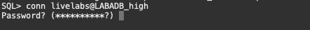
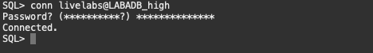
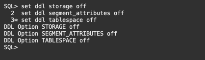
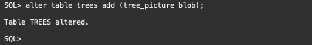
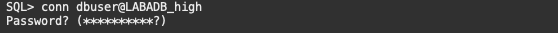
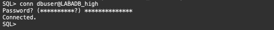
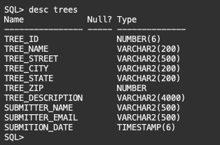
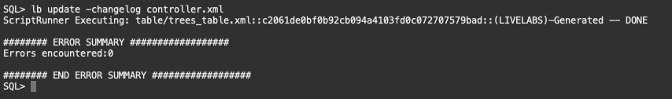
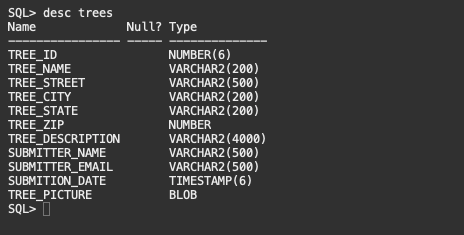
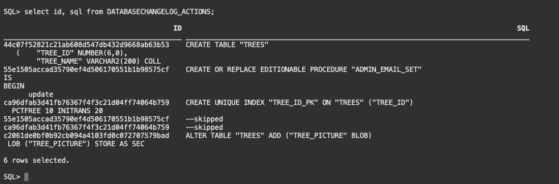

# Create and Apply Database Changes with SQLcl

## Introduction

In this lab you will create a database change and apply it via SQLcl and Liquibase.

Estimated Lab Time: 30-45 minutes

Watch the video for a quick walk through of the lab.

[](youtube:sOWCJCkZi24)


### Objectives

- Create a database change in the livelabs schema
- Export the changes with SQLcl and Liquibase
- Apply a database change to the dbuser schema
- Review the changelog tables
- Merge the branches and commit our change to the main branch

### Prerequisites

- You have completed the [Setups](../setups/setups.md).
- You have completed [Lab 1](../sqlcl/sqlcl.md).

## Task 1: Create a Database Change

1. Start by connect as the livelabs user. Issue the following command at the SQLcl prompt

      ````
      <copy>
      conn livelabs@LABADB_high
      </copy>
      ```` 
      

      And then provide the password we used to create the user at the password prompt.

      ````
      <copy>
      PAssw0rd11##11
      </copy>
      ```` 
      

2. So we don't take any schema specific storage or DDL information, run the following at the SQLcl prompt.

      ````
      <copy>
      set ddl storage off
      set ddl segment_attributes off
      set ddl tablespace off
      </copy>
      ```` 
      

3. We are going to create a simple database change by **adding a column to the trees table**. We can issue the following SQL command at the SQLcl prompt to add the tree_picture column.

      ````
      <copy>
      alter table trees add (tree_picture blob);
      </copy>
      ```` 

      

4. We have completed our ticket/task that was assigned to us, time to generate the schema again using SQLcl and Liquibase. As we did in the previous lab, we are going to issue the **lb genschema -split** command at the SQLcl prompt.

      ````
      <copy>
      lb genschema -split
      </copy>
      ```` 
      


## Task 2: Apply the database change to the dbuser schema

It is now time to apply this change into our dbuser schema simulating how we would apply it to other databases in our enterprise or how a CICD pipeline would apply it to a test environment.

### **Jeff's Tips** SQLcl remembers the commands you ran! Use the up arrow on your keyboard to find the command that you previously used to set the wallet location.

1. Use the following command to **connect to the database** as the dbuser.

      ````
      <copy>
      conn dbuser@LABADB_high
      </copy>
      ```` 
      

      And then provide the password we used to create the user at the password prompt.

      ````
      <copy>
      PAssw0rd11##11
      </copy>
      ```` 
      

2. At the SQLcl prompt, lets look at the TREES table. Issue a **desc trees** at the SQLcl prompt.

      ````
      <copy>
      desc trees
      </copy>
      ```` 
      

      This command will show us the columns in the TREES table
      ```   
      SQL> desc trees
         Name             Null? Type           
         ---------------- ----- -------------- 
         TREE_ID                NUMBER(6)      
         TREE_NAME              VARCHAR2(200)  
         TREE_STREET            VARCHAR2(500)  
         TREE_CITY              VARCHAR2(200)  
         TREE_STATE             VARCHAR2(200)  
         TREE_ZIP               NUMBER         
         TREE_DESCRIPTION       VARCHAR2(4000) 
         SUBMITTER_NAME         VARCHAR2(500)  
         SUBMITTER_EMAIL        VARCHAR2(500)  
         SUBMITION_DATE         TIMESTAMP(6) 
      ```
      And we can see that the new column we created TREE_PICTURE **is not** present.

3. To **apply this change and track it** via SQLcl and Liquibase, we can issue the following command at the SQLcl prompt

      ````
      <copy>
      lb update -changelog controller.xml
      </copy>
      ```` 

      

4. At the SQLcl prompt, lets look at the TREES table again to see if we have the new column. Issue a **desc trees** at the SQLcl prompt.
   
      ````
      <copy>
      desc trees
      </copy>
      ```` 

      

      This command will show us the columns in the TREES table
      ```   
      SQL> desc trees
         Name             Null? Type           
         ---------------- ----- -------------- 
         TREE_ID                NUMBER(6)      
         TREE_NAME              VARCHAR2(200)  
         TREE_STREET            VARCHAR2(500)  
         TREE_CITY              VARCHAR2(200)  
         TREE_STATE             VARCHAR2(200)  
         TREE_ZIP               NUMBER         
         TREE_DESCRIPTION       VARCHAR2(4000) 
         SUBMITTER_NAME         VARCHAR2(500)  
         SUBMITTER_EMAIL        VARCHAR2(500)  
         SUBMITION_DATE         TIMESTAMP(6)
         TREE_PICTURE           BLOB
      ```
      And we can see that the new column we created TREE_PICTURE **is** present.

5. Let's now take a look at the DATABASECHANGELOG_ACTIONS table to see what exactly happened here. Issue the following SQL at the SQLcl prompt.

      ````
      <copy>
      select id, sql from DATABASECHANGELOG_ACTIONS;
      </copy>
      ````

      

      ```  
      SQL> select id, sql from DATABASECHANGELOG_ACTIONS;

                                             ID                                                                                 SQL 
      ___________________________________________ ___________________________________________________________________________________ 
      44c07f52821c21ab608d547db432d9668ab63b53    CREATE TABLE "TREES"
                                                   (    "TREE_ID" NUMBER(6,0),
                                                      "TREE_NAME" VARCHAR2(200) COLL    
      55e1505accad35790ef4d506170551b1b98575cf    CREATE OR REPLACE EDITIONABLE PROCEDURE "ADMIN_EMAIL_SET" 
                                                   IS
                                                   BEGIN
                                                         update    
      ca96dfab3d41fb76367f4f3c21d04ff74064b759    CREATE UNIQUE INDEX "TREE_ID_PK" ON "TREES" ("TREE_ID")
                                                   PCTFREE 10 INITRANS 20    
      55e1505accad35790ef4d506170551b1b98575cf    --skipped                                                                           
      ca96dfab3d41fb76367f4f3c21d04ff74064b759    --skipped                                                                           
      c2061de0bf0b92cb094a4103fd0c072707579bad    ALTER TABLE "TREES" ADD ("TREE_PICTURE" BLOB)
                                                   LOB ("TREE_PICTURE") STORE AS SEC    

      6 rows selected. 
      ```  

      We can see when we initial created the objects in the schema with the first 3 rows. What is of note is the last row. We see that SQLcl and Liquibase saw that the table already existed but that a new column was present. So instead of dropping and recreating the table, it was smart enough to just issue an alter table to add the new column.

## Terminate your ADB (optional)

To terminate your Always Free Autonomous Database, follow [these instructions](https://objectstorage.us-phoenix-1.oraclecloud.com/p/SJgQwcGUvQ4LqtQ9xGsxRcgoSN19Wip9vSdk-D_lBzi7bhDP6eG1zMBl0I21Qvaz/n/c4u02/b/common/o/labs/terminate-adb/terminate-adb.md).


## Acknowledgements

- **Authors** - Jeff Smith, Distinguished Product Manager and Brian Spendolini, Trainee Product Manager
- **Last Updated By/Date** - Brian Spendolini, September 2021