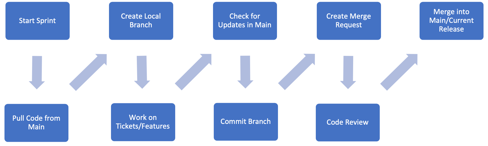
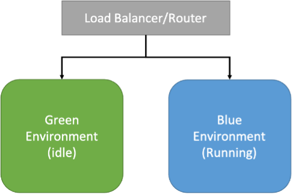
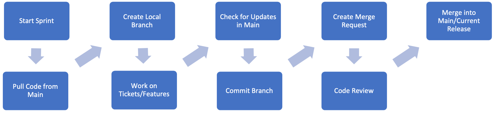

# Oracle Database CI/CD for Developers

## About this Workshop

This workshop will walk you through database change management via CI/CD using SQLcl. You will be using an Autonomous Database to create database objects and see database change tracking via SQLcl and Liquibase. These skills will set the baseline for expanding CI/CD into areas such as repositories, pipelines and automated deployment.

*Estimated Workshop Time:* 1 Hour

<if type="odbw">If you would like to watch us do the workshop, click [here](https://youtu.be/RtcvWhF5iwI).</if>

### Objectives

In this lab you will learn to use SQLcl and git to track and apply changes across databases for CI/CD processes.

- Create an autonomous database, objects and schemas
- Use SQLcl to create a baseline of an Oracle Database schema
- Create and track database object changes with SQLcl
- Apply the changes to a new schema and see how SQLcl and Liquibase manage database change tracking

### Prerequisites
This lab assumes you have:
* Completed the [Getting Started](https://oracle-livelabs.github.io/common/labs/cloud-login/pre-register-free-tier-account.md) lab

## Oracle Database CI/CD for Developers

### **Lab 1:** Use SQLcl for Database Change Management/Tracking

### **Lab 2:** Create and Apply Database Changes with SQLcl

## Learn More

### What is CI/CD

Continuous Integration (CI) and Continuous Delivery/Deployment (CD) are a set of principles or methodologies that empower development teams to deliver code faster, more reliably, and with fewer bugs compared to traditional software development such as the waterfall model. Teams that use CI/CD also usually adhere to some version of the Agile Methodology, working on smaller features as part of a larger overarching requirement in sprints rather than monolithic tasks spanning months or years.

We also have the emergence of DevOps (Developer Operations) as the Agile Methodology collided with the ability to quickly create infrastructure as code in the cloud. As these teams surveyed their new development landscape, it became apparent that they could no longer work in a vacuum, living in their own worlds as they had done in the past. As traditional job roles blurred and more work was done by fewer people, order needed to rise from the chaos of this new complexity.

So, what is CI/CD? What does it do to help with this mess of developers, operations, and stakeholders who need to get features and functions into their software? To answer this, let’s start with the CI of CI/CD, Continuous Integration.

Continuous Integration brings us the ability to have multiple development and operations teams working on different features on a single project simultaneously without stepping all over each other. While this premise sounds too good to be true, there is some truth to be had here.

To have a common thread we can always refer to, this set of posts will be using a common example with real code behind it to illustrate the concepts and processes we will be talking about. So, let’s jump right into it with an example we can reference as we build upon our development process.

Here is our scenario: we have a team of developers working on an application that tracks local trees in a community via a web interface on the city’s web site. A citizen can access this app and enter the information for a historic tree they find in the city. Now this team also uses the Agile Methodology and it’s time for the next sprint. We have a few features we need to get in, mainly the ability to see these trees on a map and the ability to upload a picture with the tree entry form. The tasks are assigned to the developers and the sprint starts.

When does Continuous Integration start? When the tasks are handed out, each developer will copy the code from the latest release in a repository and create their own copy or branch. This latest code release is an exact copy of the code that is currently deployed and running in production. Each developer will also be given a personal development database, more on this later. As the developers finish the tasks they were assigned, they commit their code branch to the repository. Before they create a pull request/merge, they check the current main branch of code in the repository for any changes from other developers merging clean code branches. If found, they will pull these changes down and commit their code again. One of these changes might have affected their code in a negative way and the build process that occurs when a pull request/merge happens will catch this. A code review is scheduled and if accepted, the developer can now create the pull request/merge into the main branch. There is also a build process that occurs every time code is merged into main to catch any bugs or issues that may show up or issues that other developers code may have caused. If so, the issues are addressed, a pull request/merge is created, and the automated testing again happens. Once the testing comes back clean, the code can be merged into the main branch.

Summary Points of the CI/CD Process:

   - Start Sprint
   - Pull Code from Main
   - Create Local Branch
   - Work on Tickets/Features
   - Check for Updates in Main
   - Commit Branch
   - Create Merge Request
   - Code Review
   - Merge into Main/Current Release

What advantages do we gain from this process? First, as we can see throughout this process, we can catch issues before they get into production. By running automated tests on code changes, we can simulate what is going to happen at deployment time and eliminate surprises. This leads to better releases, more confidence in the development team by stakeholders and end users, as well as a higher standard of code from our developers.

Accountability is another advantage. We can see through code commits, merges and reviews exactly what is being put into our code repository and by whom. We can catch any code supply chain issues or hacks because each file and line of code can be reviewed upon a merge. Modern code repositories also track these changes with who and when, so a historical record is always present.

### Stateless vs. Stateful

Continuous Integration works very well with stateless files and deployments; static files such as java classes or JavaScript combined with a stateless container deployment; in with the new and out with the old. It very easy to create a new deployment in a docker container with the latest code and replace the old container if working with stateless files.

We see this with blue-green deployment models. In this model, you have your running application container, the blue. The green is your idle newly deployed application container. As some point you switch to the green and all traffic is now using the new version while the blue one is idle. If you need to roll or switch back, you just change back to the idle blue container.

We quickly see these models are not going to work for database deployments. The database has state, transactions are being committed all the time so unless we can afford downtime to copy the entire database, deploy the changes and then resume operations, this poses a challenge. And because of this challenge, DBA’s and database developers are all too often blamed for these deployment bottlenecks. They are often told that databases can never do DevOps let alone CI/CD, it’s too legacy. Where does this leave the DBA and Database Developer? They will be branded with a legacy stigma and seen as a roadblock to CI/CD.

### Tools of the Trade

While we wish there was a magic wand to make all database deployments easy and drop right into stateless CD/CD flows, we do have to accept that there is some truth with these DevOps concerns. But not all hope is lost! Oracle Database CI/CD can be a reality, but it requires some shifts in traditional methodologies and processes as well as some new tricks using features and functions of the Oracle Database that may have not been used before.

Let’s refer to our process flow and see where we can add database development specific steps:

The sprint starts and we have our database developers pull the latest code from the latest release. Where is this code? What tools can we use to allow developers to have local copies of our database code? We use a Code Repository.
What is a Code Repository?

There are many code repositories available to us such as Git, GitHub, GitLab and BitBucket. These repositories will help us store our files and provide versioning, accountability and visibility into our development process. But we are starting from scratch here, we have no repository or code release to work with. We will need to create a baseline with a Change Management/Tracking tool.
How can I do Change Management/Tracking with Oracle?

### SQLcl and Liquibase

**What’s SQLcl?**

Oracle SQLcl (SQL Developer Command Line) is a small, lightweight, Java-based command-line interface for Oracle Database. SQLcl provides inline editing, statement completion, command recall, and also supports existing SQL*Plus scripts. You can download SQLcl from oracle.com and it is installed in the OCI Cloud Shell by default.

**What’s Liquibase?**

Liquibase is an open-source database-independent library for tracking, managing and applying database schema changes.
How do they work together?

The Liquibase feature in SQLcl enables you to execute commands to generate a changelog for a single object or for a full schema (changeset and changelogs). We also add Oracle specific features and enhancements to Liquibase in SQLcl.

**What Database?**

For this LiveLab, the simplest way to get up and running with an Oracle Database is a free OCI account and an always free Autonomous Database. They come up in minutes and are never going to cost you a dime to use. If you do not have an always free OCI account, you can start [here](https://cloud.oracle.com). Once you are logged into your account, you can create an always free Autonomous Database by following this guide here. For our purposes, an Autonomous Transaction Processing database is fine. Just remember the password you used when creating the database; we will need it later.

**No Really, What Database?**

While we will use a single autonomous database for this LiveLab’s examples, outside of this exercise, you have many choices but the most important take away is that all developers MUST have personal databases to work in; and this point cannot be stressed enough. This can be tricky due to many factors but here are some suggestions on making this step a reality in your development organization.

- **Use Multi-tenant in the Oracle Database**

   Did you know that with 19c and later, you can have up to 3 pluggable databases for free? No need for the multi-tenant license, just create and use. PDBs (pluggable databases) also have the ability to clone just the metadata from an origin PDB. This makes it super simple to create copies of a production code database for all developers. It also aids in the testing automation process. Another quick note is that by installing Oracle REST Data Services (ORDS) on a database enables APIs for cloning and creating PDBs via REST calls.

- **The Autonomous Database in OCI**

   Using ADB in OCI works very similar to multi-tenant where you can create full and metadata only clones of any ADB. And these ADB instances may only need to be up for minutes to weeks. This is what we will be using in this LiveLab.

- **Reusable Instances**

   There are many features in the Oracle Database that will allow you to recover state so that developers have clean slates to work with in non multi-tenant instances. Features such as Guaranteed Restore Points/Flashback Database, RMAN duplicates/clones and Data Pump allow you to have clean instances for each developer as sprints start.

- **Docker/Virtual Machines**

   Either cloud based or local, virtualization technologies can also give developers personal instances to work in with copies of our main code repository within. Developers can also create VM instances of databases in OCI based on the lastet backup of our production instance if need be as well to help with the personal database effort.

## Acknowledgements

- **Authors** - Jeff Smith, Distinguished Product Manager and Brian Spendolini, Trainee Product Manager
- **Last Updated By/Date** - Brian Spendolini, September 2021
