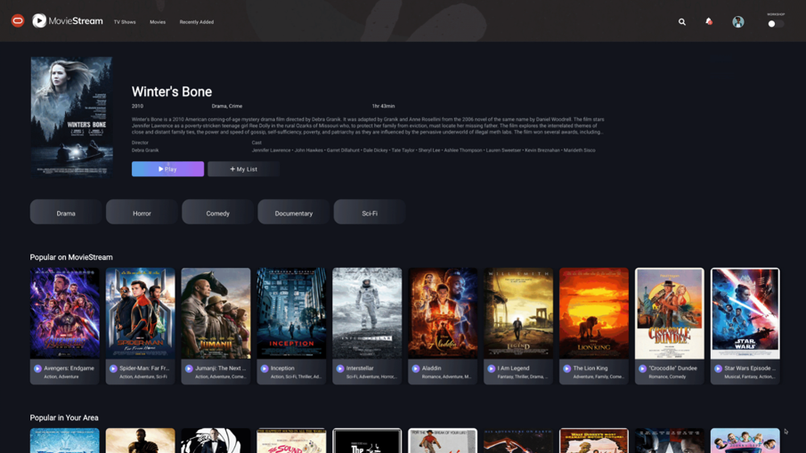
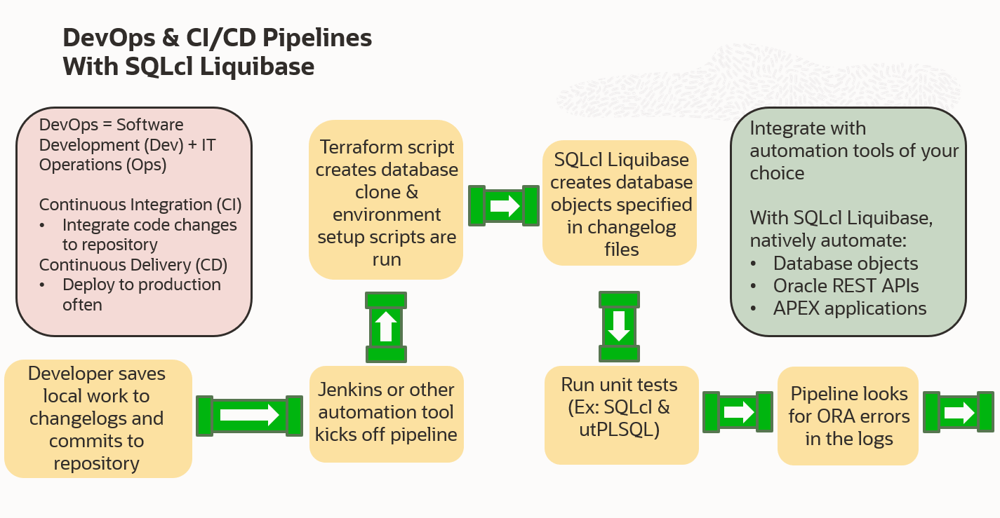

# Introduction

## About this workshop

In this workshop you will follow the story of a new developer at the fictitious venture by Oracle: MovieStream! MovieStream is a fake but fun company that provides a full catalog of movies customers can stream globally, no matter their location.



We will be focusing on our new hire’s use of the latest in database change management technology: SQLcl Liquibase. Using SQLcl Liquibase, our developer and their team will be able to capture, version, and deploy database object changes consistently and automatically.

This will save them invaluable time and energy, and the startup: precious resources.

With SQLcl Liquibase you can integrate database change automation into your larger CI/CD (Continuous Integration/Continuous Delivery) pipeline.


**Note:** Example database section of a CI/CD pipeline utilizing SQLcl Liquibase. Changelogs are the files Liquibase saves database objects to. We'll talk more about them later.

*Estimated Workshop Time:* 1 Hour 15 Minutes


### Objectives
Learn the core functionality of SQLcl Liquibase in this hands-on workshop:
* Learn how to use `liquibase help` for guidance on the tool
* Capture an entire Oracle Database schema into files with `liquibase generate-schema`
* Capture a single database object into a file with `liquibase generate-object`
* Preview the SQL code for review before executing an update with `liquibase update-sql`
* Run `liquibase update` to create database objects from Liquibase files
* Learn how changelog files and tables work
* Create tags bookmarking your database at different states of your Liquibase changes with `liquibase tag`
* Roll your database back to a specified tag with `liquibase rollback`


### Prerequisites
This workshop requires an Oracle Cloud account or your own Oracle Database with SQLcl installed on your computer.

For using your own Oracle Database you may skip any workshop areas that don't apply to you (such as [Create Your Autonomous Database](../workshops/freetier/?lab=adb-provision-conditional)) and simply input your connection credentials into SQLcl.

You may now **proceed to the next section**.

## How this workshop can help you
Working on a software development team isn’t easy. If you’ve been a part of one, at some point or another you’ve probably encountered these overarching themes:
* The expectation of frequent delivery and updates
* Changing requirements and specifications, sometimes even late in the development process
* The ability to deliver quality products that at the end of the day, people enjoy using and bring them value

These themes all point to the need to retain and even improve quality in today’s fast and everchanging world where software is expected to be ever adapting.

This is a pretty tall order and on top of it, more often than not you are additionally managing a war of attrition where you are constantly burning through resources.

Luckily, there are ways to break up this dragon of a task into more manageable chunks that you can then tackle and conquer.

At Oracle, something we wanted to focus on is identifying DevOps challenges database administrators (DBAs), developers, and teams face that we can help solve.

One of the major challenges we found is outside the actual coding, a lot of resources go into getting the development environments themselves set up and all your ducks in a row. Developers need databases configured to have the data objects they work with and with teams constantly committing code to new software builds, their databases need to be consistent and up to date.

This requires a lot of manual work and is prone to human error. If you are a small team, resources are probably stretched thin as is. If you are a large one, it might make you uneasy to think about how much time is taken up on these types of tasks.

So we developed SQLcl Liquibase to solve this problem! In this workshop you will be introduced to the basics of the Liquibase feature for our free Oracle Database tool: SQLcl.

## SQLcl
SQLcl (Structured Query Language command line) is a free tool for the Oracle Database that lets you connect to your database and execute SQL, PL/SQL, and SQL*Plus commands directly from the command line.

It’s a modern replacement to SQL\*Plus, our legacy command line interface solution for working with the Oracle Database. SQLcl contains all of SQL\*Plus’ commands and more.

SQLcl is loaded with features such as:
* Query History
* Formatting Options
* Code Completion
* Customizable Status Bar
* vi & EMACS Support
* Oracle Data Pump
* Liquibase

You can learn more in our [Documentation](https://docs.oracle.com/en/database/oracle/sql-developer-command-line/)

It’s available on Windows, Mac, Linux, and is also automatically embedded in our command prompt for [Oracle Cloud Infrastructure (OCI)](https://www.oracle.com/cloud/), Cloud Shell. You can download it directly from our website [Download Page](https://www.oracle.com/database/sqldeveloper/technologies/sqlcl/download/)

## SQLcl's Liquibase feature
SQLcl Liquibase is a database change management tool that allows you to capture, version, and deploy database changes simply and in an automated fashion. This cuts back on manual work such as recreating tables, making sure database object change scripts are properly working, and rolling back unwanted alterations.

You capture database objects such as tables, procedures, and constraints with one of the ````liquibase generate```` commands which then saves these objects to files called changelogs. Within changelog files are metadata information and changeset sections. Changesets are the actual set of instructions for the database changes being applied. These changeset instructions are the specific information being read when you run the ````liquibase update```` command to populate a new database user schema or update an existing one.

With SQLcl Liquibase, you can capture database objects on one user schema and use the changelogs to recreate these objects on a different user or Oracle Database entirely.

SQLcl Liquibase is built on top of the open-source Liquibase platform and contains all of its great features with much more extended functionality.

We’ve added commands optimized for capturing:
* The entire Oracle Database schema
* Individual database objects
* Objects for APEX ([Our Low Code Development Platform](https://apex.oracle.com/))
* Oracle REST Data Service (ORDS) objects ([Our API Building and Management Tool](https://www.oracle.com/database/technologies/appdev/rest.html))

All of these powerful new additions are exclusively for the Oracle Database.

SQLcl Liquibase is automatically included in our free command line interface tool: [SQLcl](https://www.oracle.com/database/sqldeveloper/technologies/sqlcl)

## DevOps & Continuous Integration/Continuous Delivery (CI/CD)
The main objective of SQLcl Liquibase is to help you save time, energy, and money by freeing yourself of repetitive, tedious, and error prone tasks so that your DevOps and CI/CD processes are more efficient.

DevOps is a combination of software development (Dev) and IT operations (Ops). It is a philosophy aimed at seeking to shorten the software development lifecycle through the investigation and application of tools and practices. Traditionally a DevOps centered mindset seeks to erode the silos between development and operations teams so that better communication, collaboration, and automation can be achieved.

Continuous Integration/Continuous Delivery (CI/CD) falls within the umbrella of DevOps and specifically focuses on the combined practices of continuous integration and continuous delivery.

Continuous Integration (CI) is the act of regularly and frequently integrating your code changes into the main branch of your team’s shared code repository.

Continuous Integration done efficiently and effectively seeks to automate the tasks of:
* Creating new builds when you merge your code changes to your team’s repository
* Running tests against these builds.

While Continuous Integration focuses on automatically creating software builds from your team’s changes and testing them, Continuous Delivery (CD) by extension focuses on streamlining the software release process and seeks to deploy changes to production as early as possible and frequently. This breaks up released software changes into smaller batches making it easier to identify, troubleshoot, and address bugs.

The CD in CI/CD along with referring to Continuous Delivery, can additionally (and less frequently) refer to Continuous Deployment. While groups might vary on their specific interpretations of the difference between Continuous Delivery and Continuous Deployment, it is generally considered that Continuous Delivery is focused on creating simple and repeatable delivery steps to release software, which often includes automating elements of this process, whereas Continuous Deployment is about intentionally seeking to automate the entire release process or as much of it as possible.  


## Learn More
* [Product Page (SQLcl)](https://www.oracle.com/database/sqldeveloper/technologies/sqlcl/)
* [Documentation (SQLcl & SQLcl Liquibase)](https://docs.oracle.com/en/database/oracle/sql-developer-command-line/)
* Blog Posts/Articles
    * [CI/CD With Oracle Database and APEX](https://www.thatjeffsmith.com/archive/2021/04/ci-cd-with-oracle-database-and-apex/)
    * [SQLcl Liquibase in 6 Minutes](https://www.talke.tech/blog/learn-sqlcl-liquibase-in-6-minutes)
    * [Data Definition Language (DDL) Settings with SQLcl & Liquibase](https://www.thatjeffsmith.com/archive/2023/01/physical-properties-in-oracle-table-liquibase-changesets/)
    * [How to Run SQLcl Liquibase Updates in Different Target Schemas](https://www.thatjeffsmith.com/archive/2022/12/run-liquibase-updates-for-a-specific-schema-with-sqlcl/)
    * [Use JSON, XML, and YAML Formats With SQLcl Liquibase](https://www.thatjeffsmith.com/archive/2022/12/how-to-use-json-xml-yaml-liquibase-changesets-in-sqlcl/)
    * [What's The Difference Between An Oracle Database Schema & User](https://www.talke.tech/blog/whats-the-difference-between-a-db-schema-and-db-user)

## Acknowledgements

- **Author** - Zachary Talke, Product Manager
- **Last Updated By/Date** - Zachary Talke, May 2023
