# Lab 1: Liquibase basics - help, generate, and update commands

## Introduction
Welcome to Oracle MovieStream!
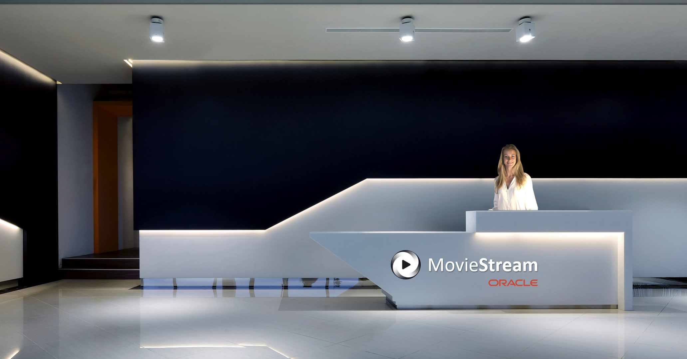

As our newest developer, you will help build new features on the MovieStream website.

Before you start your first project, you are going to need to populate your database schema. This way you have the database objects you will need for your work.

At MovieStream, we use SQLcl Liquibase to make this process simple.

In this lab, you will be replicating the database schema from the MOVIESTREAM\_MANAGER database user into your personal development user: MOVIESTREAM\_DEV.
* To do this, you will be generating Liquibase files from MOVIESTREAM\_MANAGER and running them in MOVIESTREAM\_DEV to automatically recreate the database objects. These files you are going to generate are called changelogs.

**Note:** As an alternative approach, you already have the files from the setup_changelogs folder you received in the [Setup Section](../workshops/freetier/?lab=setup) and could run those directly in MOVIESTREAM\_DEV. The reason you are recapturing the database objects is to learn the `liquibase generate` functionality


*Estimated Time:* 25 Minutes


### Objectives
In this lab you will:
* Connect to the database user MOVIESTREAM_MANAGER.
* Learn how to use the `liquibase help` command.
* Generate Liquibase changelog files to capture your database schema.
* Connect to the database user MOVIESTREAM_DEV, prepare to automatically create your database objects by inspecting the SQL that will run, then create the database objects.


### Prerequisites
Completion of:
* [Introduction](../workshops/freetier/?lab=intro)
* [Getting Started](../workshops/freetier/?lab=cloud-login)
* [Create Your Autonomous Database](../workshops/freetier/?lab=adb-provision-conditional)
* [Setup](../workshops/freetier/?lab=setup)

## Task 1: Connect to MovieStream_Manager
   1. First let’s go to your Cloud Shell command prompt in Oracle Cloud. If Cloud Shell is not open, you can open it by selecting the < > icon in the top right corner of your Oracle Cloud menu and then select “Cloud Shell”.
      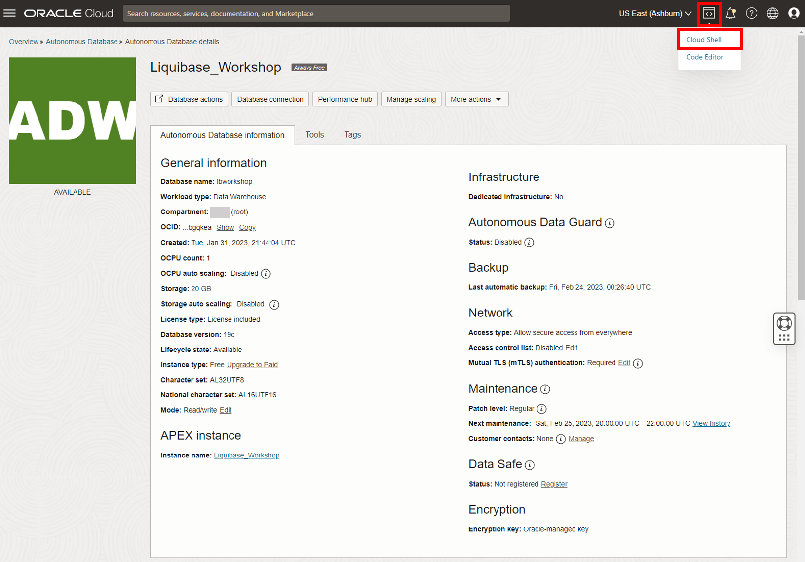

   2. Let’s make sure you are in the root directory with the cd command.
      ```na
      <copy>
      cd ~
      </copy>
      ```

   3. Next let's create a directory for your Liquibase changelog files. When the MOVIESTREAM_MANAGER user generates these files, they'll be saved here. Let's name the directory "moviestream\_changelogs":
      
      ```na
      <copy>
      mkdir moviestream_changelogs
      </copy>
      ```

### **MOVIESTREAM_MANAGER user**
   4. Let’s change your current directory to moviestream\_changelogs and connect to MOVIESTREAM\_MANAGER from SQLcl.
      ```na
      <copy>
      cd moviestream_changelogs
      sql /nolog
      </copy>
      ```

   5. Run the `set cloudconfig` and `connect` commands below and enter the password for MOVIESTREAM\_MANAGER at the prompt. 
      * Before running, replace [OCI CLI Profile Name] with your profile name. This is the name to the left of `@cloudshell` in your command prompt before you logged in to SQLcl
      ```na
      <copy>
      set cloudconfig /home/[OCI CLI Profile Name]/Wallet_lbworkshop.zip
      connect moviestream_manager@lbworkshop_high
      </copy>
      ```

      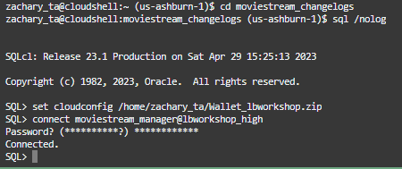

## Task 2: Learn how to use the help command
   1. The quickest way to familiarize yourself with Liquibase is with the `liquibase help` command.
      * This will give you a list of all Liquibase commands and their descriptions.

      ```na
      <copy>
      liquibase help
      </copy>
      ```

      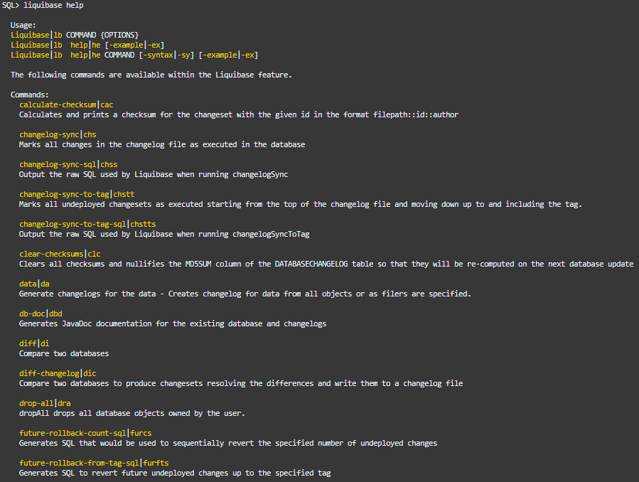

   2. If you want help on a specific Liquibase command, use `liquibase help [command name]` and it will give you the description of the command and all of its available parameters. Let's try this for the `liquibase generate-schema` command you are about to run (pay attention to the `split` and `-sql` optional parameters, you are going to be using them).

      ```na
      <copy>
      liquibase help generate-schema
      </copy>
      ```

      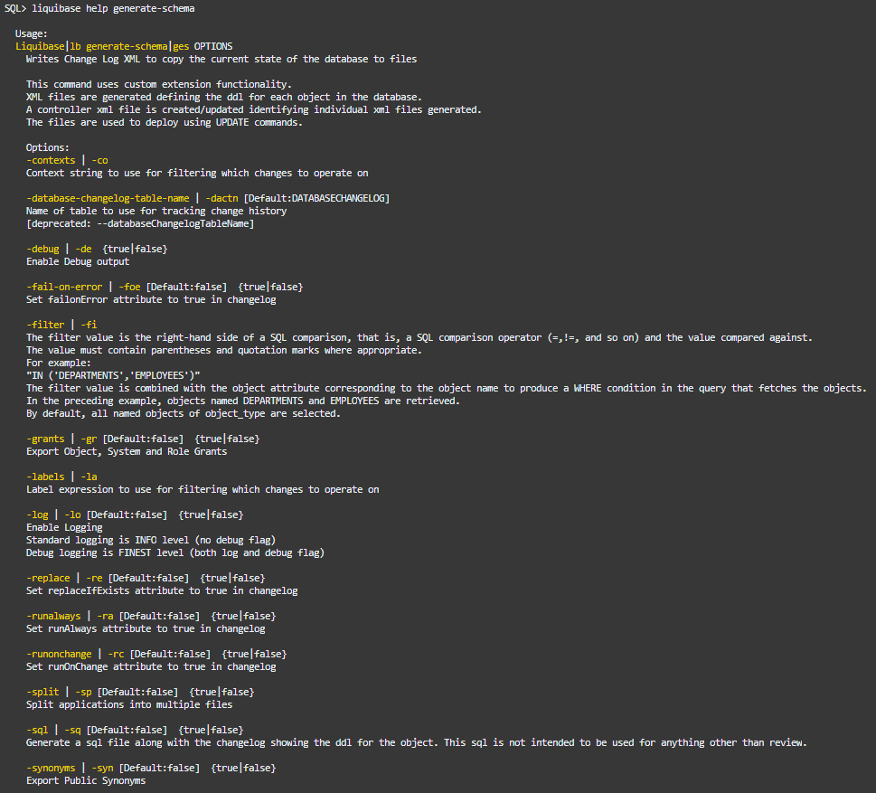

   3. There are also some fun preloaded use case scenarios you can view with the `liquibase help -example` command.

      ```na
      <copy>
      liquibase help -example
      </copy>
      ```

      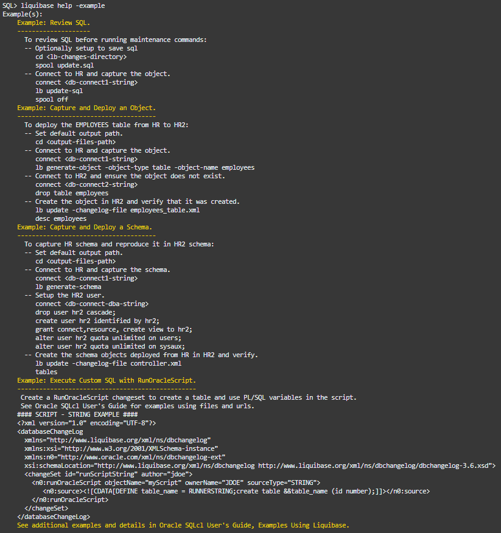

## Task 3: Generate your database schema files

   1. It’s time to capture some database objects! You’ll be using the `liquibase generate-schema` command to do this. This will capture the entirety of the schema’s database objects. You'll be using the following optional parameters alongside this command: 
      * `-split` to neatly organize your created files into folders by object type.
      * `-sql` to create a SQL file alongside each individual object XML changelog file. The SQL file is intended only for review purposes. 


      ```na
      <copy>
      liquibase generate-schema -split -sql
      </copy>
      ```

      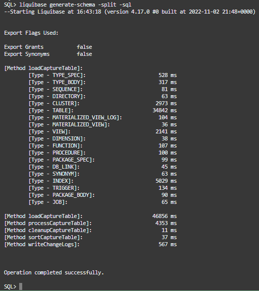

   2. You can see your changelog files and folders have been created in your moviestream\_changelogs directory with the Linux `ls` (list) command. In SQLcl, you can input a command directly to your operating system’s command line by putting a `!` in front of it.
      * Within these folders are the individual changelog files for each database object. The controller.xml file manages these individual changelog files so that they are deployed in the proper order.

      ```na
      <copy>
      !ls
      </copy>
      ```

      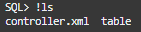

   3. To take a look at one of the SQL review files you created, use `cd table` to change to your table folder, then `!cat customer_table.sql` to view the file for your customer table.

      ```na
      <copy>
      cd table
      !cat customer_table.sql
      </copy>
      ```

      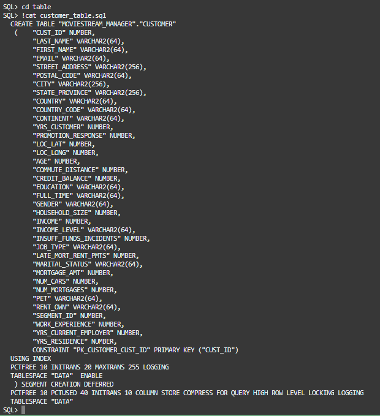

   4. You can now return to the moviestream_changelogs directory.

      ```na
      <copy>
      cd ~/moviestream_changelogs
      </copy>
      ```

   5. To showcase building a table yourself, that you can then deploy with the `liquibase update` command in another user, let's create a table you will need for lab 3:

      ```na
      <copy>
      CREATE TABLE MERCHANDISE
          (
          ID          NUMBER GENERATED ALWAYS AS IDENTITY ( START WITH 1 CACHE 20 ) ,
          NAME        VARCHAR2 (50) ,
          DESCRIPTION VARCHAR2 (200)
          )
          LOGGING ;

      ALTER TABLE MERCHANDISE
          ADD CONSTRAINT MERCHANDISE_PK PRIMARY KEY ( ID )
          USING INDEX LOGGING ;
      </copy>
      ```

   6. Now let's save the table to a Liquibase changelog file which you will run later. Unlike with the `liquibase generate-schema` command you just ran, you will be using the `liquibase generate-object` command to capture just one singular object to one changelog file:
      * `liquibase generate-object` saves an individual database object to a Liquibase file.
         * `-object-type` is a mandatory parameter that specifies the type of object you are saving.
         * `-object-name` is a mandatory parameter that specifies the name of the object you are saving.

      ```na
      <copy>
      liquibase generate-object -object-type table -object-name merchandise
      </copy>
      ```

   7. You can now exit SQLcl and log out of MOVIESTREAM\_MANAGER.

      ```na
      <copy>
      exit
      </copy>
      ```

## Task 4: Connect to MovieStream_Dev, inspect your SQL, and automatically create your database objects
### **MOVIESTREAM_DEV user**
   1. Return back to the moviestream\_changelogs directory if need be and connect to SQLcl.

      ```na
      <copy>
      cd ~/moviestream_changelogs
      sql /nolog
      </copy>
      ```

   2. Let’s now log into your personal database user you’ll use for your development work: MOVIESTREAM\_DEV.
      * Replace [OCI CLI Profile Name] with your profile name. This is the name to the left of `@cloudshell` in your command prompt before you logged in to SQLcl
      * Enter your MOVIESTREAM\_DEV password at the prompt
     
      ```na
      <copy>
      set cloudconfig /home/[OCI CLI Profile Name]/Wallet_lbworkshop.zip
      connect moviestream_dev@lbworkshop_high
      </copy>
      ```

   3. Enter the password and you’ll be logged into this user in SQLcl.
      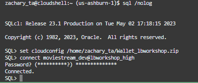

   4. You can see your freshly created MOVIESTREAM\_DEV doesn’t have any tables yet by using the `tables` command.
   
      ```na
      <copy>
      tables;
      </copy>
      ```

      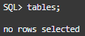

   5. Using SQLcl Liquibase, you can change this in less than a minute with `liquibase update`! Before you do so, you can inspect the SQL code that will execute before you actually run the files by using the command `liquibase update-sql`. This way you can make sure the changelogs will do exactly what you expect them to do. Here are a breakdown of the parameters you will use:
      * -changelog-file [filename]
         * A mandatory parameter. Designates the changelog file to read for the update. With full schema updates, this file will be controller.xml as this is the control file that manages the execution of all the other changelogs. With individual database object updates, your file name will likely look something like customer_table.xml.
      * -output-file [what you want to name the output file that will be created]
         * An optional parameter. Designates the creation of a file that will contain the output of `liquibase update-sql`.
            * This output is the SQL statements for your personal review that will run on the database during the execution of the `liquibase update` command.
            * If `-output-file` is not specified, the output by default will print to your SQLcl command prompt.
      
      ```na
      <copy>
      liquibase update-sql -changelog-file controller.xml -output-file moviestream_update_sql
      </copy>
      ```

   6. You can use `!ls` to see the file you just created and `!more moviestream_update_sql` to review it's contents.

      ```na
      <copy>
      !ls
      !more moviestream_update_sql
      </copy>
      ```

      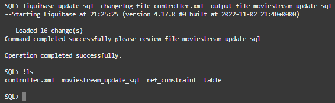

   7. It’s time to populate your database schema! You can now run the `liquibase update` command.
      * Just as with `liquibase update-sql`, `-changelog-file` is a mandatory parameter for `liquibase update` that designates the Liquibase file to be ran.

      ```na
      <copy>
      liquibase update -changelog-file controller.xml
      </copy>
      ```

      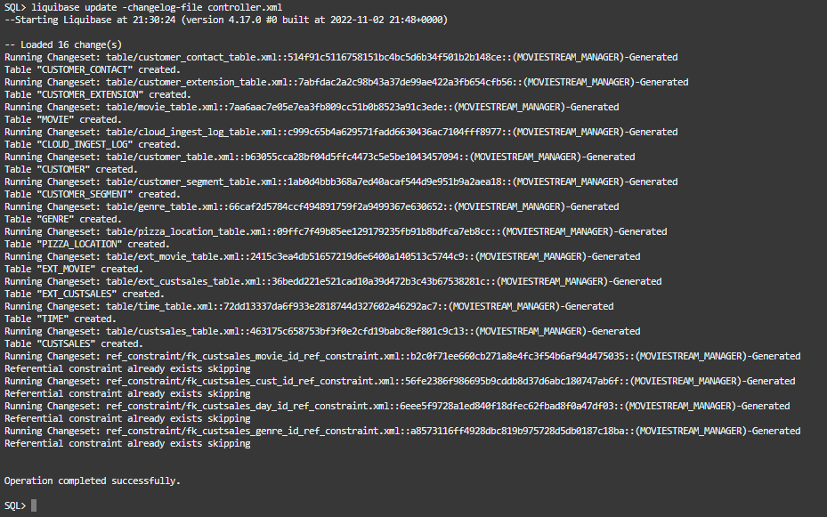

   8. You can take a look at some of the objects you just created with: 
      * The `tables` command to show your new table list.
      * `describe movie` to take a look at the properties of one of the tables you just created.

      ```na
      <copy>
      tables;  
      describe movie;
      </copy>
      ```

      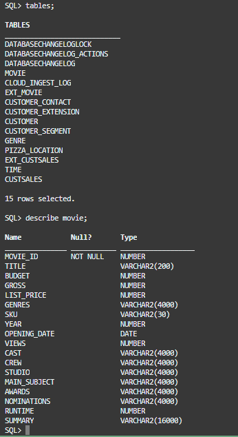

   9. While the objects have been created, these tables don't have any data. You can demonstrate this with `select * from movie`. If you are interested in learning about loading data, expand the tab below.

   <details>
   <summary>[EXPAND] Oracle Data Loading Options</summary>
       * [Oracle Data Pump (Oracle Database 19c Documentation)](https://docs.oracle.com/en/database/oracle/oracle-database/19/sutil/oracle-data-pump-overview.html)
          * Enables very high speed movement of data & metadata from one database to another.
          * Data Pump is also [A Feature Available In SQLcl!](https://docs.oracle.com/en/database/oracle/sql-developer-command-line/22.4/sqcug/using-data-pump.html#GUID-60A99040-20F7-42A1-9544-DEAC0B211C85)
       * [SQL*Loader (Oracle Database 19c Documentation)](https://docs.oracle.com/en/database/oracle/oracle-database/19/sutil/oracle-sql-loader-concepts.html#GUID-A07484AF-4EE8-432F-A587-5E158FF0B4C1)
          * The primary method for quickly populating Oracle tables with data from external files
          * Product manager Jeff Smith has [A Great Article On This](https://www.thatjeffsmith.com/archive/2018/10/yes-sqlloader-is-faster-at-loading-records/)
       * Oracle Cloud
          * Database Actions for Autonomous Database has Data Load and Data Pump options along with Data Load functionality in SQL Worksheet
          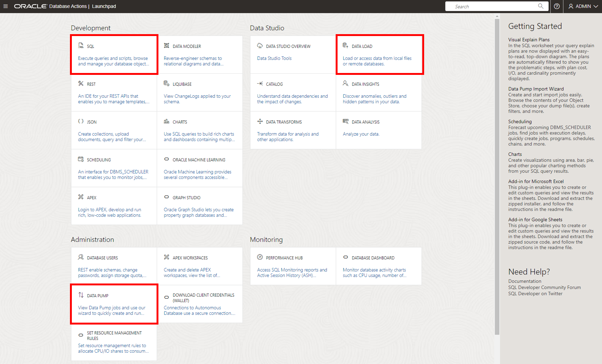
          * On the main Oracle Cloud menu under Developer Services -> Database Tools, the SQL Worksheet there also has Data Load functionality
          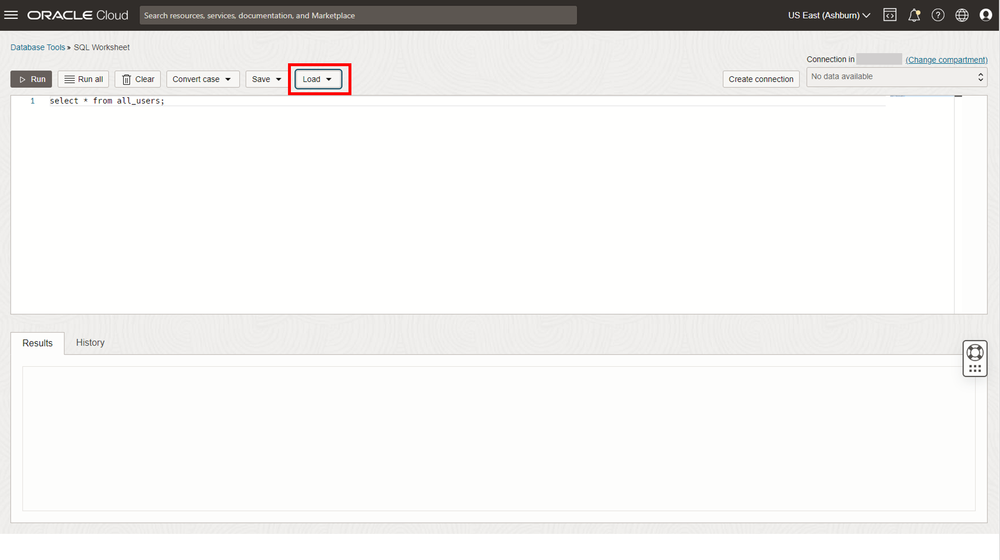
       * SQLcl Load Command
          * A SQLcl command that allows you to load data from a CSV file into your Oracle Database table
          * Another must read by Jeff, this time providing a [Primer To The Load Command](https://www.thatjeffsmith.com/archive/2019/09/sqlcl-and-the-load-csv-command/)
       * [SQL Developer (SQL Developer Documentation)](https://docs.oracle.com/en/database/oracle/sql-developer/22.2/rptug/sql-developer-concepts-usage.html#GUID-4F0C59A8-DAF0-492B-954F-408041E32486)
          * The Import Data option in SQL Developer. Right click the tables folder under your connection.
          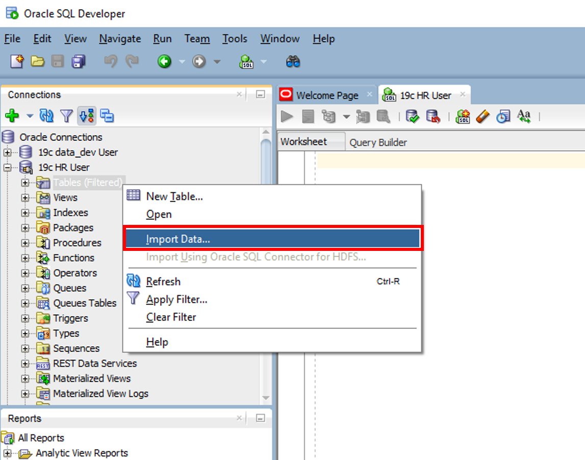
       * SQLcl @ Command
          * Use ````@[url or filename]```` to run a SQL script that inserts records into your table.
       * Manually Add INSERT Statements To Changelogs
          * You can manually edit SQLcl Liquibase changelogs to include SQL `INSERT` statements.
   </details>

      ```na
      <copy>
      select * from movie;
      </copy>
      ```

   10. That’s the first lab! Congratulations! Your MOVIESTREAM\_DEV user is ready for you to load data into and start using for development. In lab 2 you’ll be diving into more foundational concepts of Liquibase and taking a look at some of the files you just created. You may now **proceed to the next lab**.


## Learn More
* [Product Page (SQLcl)](https://www.oracle.com/database/sqldeveloper/technologies/sqlcl/)
* [Documentation (SQLcl & SQLcl Liquibase)](https://docs.oracle.com/en/database/oracle/sql-developer-command-line/)
* Blog Posts/Articles
    * [CI/CD With Oracle Database and APEX](https://www.thatjeffsmith.com/archive/2021/04/ci-cd-with-oracle-database-and-apex/)
    * [SQLcl Liquibase in 6 Minutes](https://www.talke.tech/blog/learn-sqlcl-liquibase-in-6-minutes)
    * [Data Definition Language (DDL) Settings with SQLcl & Liquibase](https://www.thatjeffsmith.com/archive/2023/01/physical-properties-in-oracle-table-liquibase-changesets/)
    * [How to Run SQLcl Liquibase Updates in Different Target Schemas](https://www.thatjeffsmith.com/archive/2022/12/run-liquibase-updates-for-a-specific-schema-with-sqlcl/)
    * [Use JSON, XML, and YAML Formats With SQLcl Liquibase](https://www.thatjeffsmith.com/archive/2022/12/how-to-use-json-xml-yaml-liquibase-changesets-in-sqlcl/)
    * [What's The Difference Between An Oracle Database Schema & User](https://www.talke.tech/blog/whats-the-difference-between-a-db-schema-and-db-user)
## Acknowledgements

- **Author** - Zachary Talke, Product Manager
- **Last Updated By/Date** - Zachary Talke, May 2023
