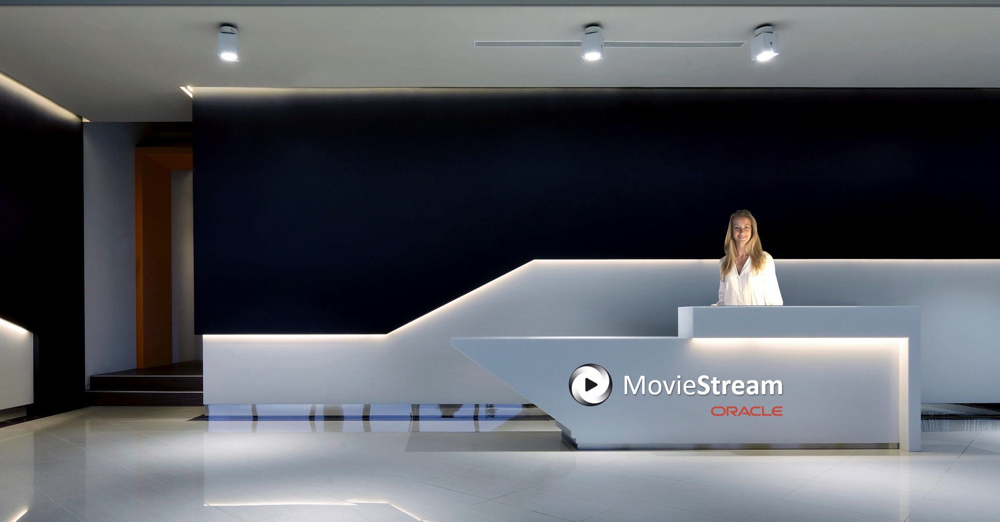
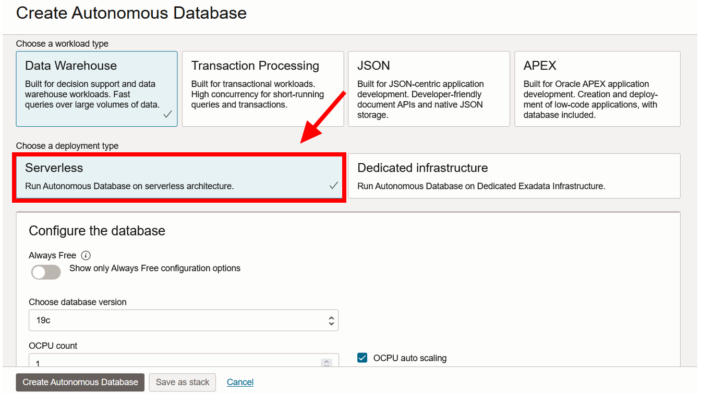
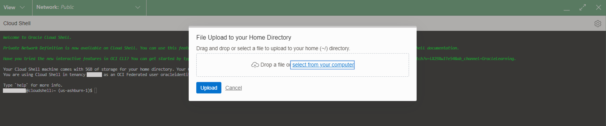
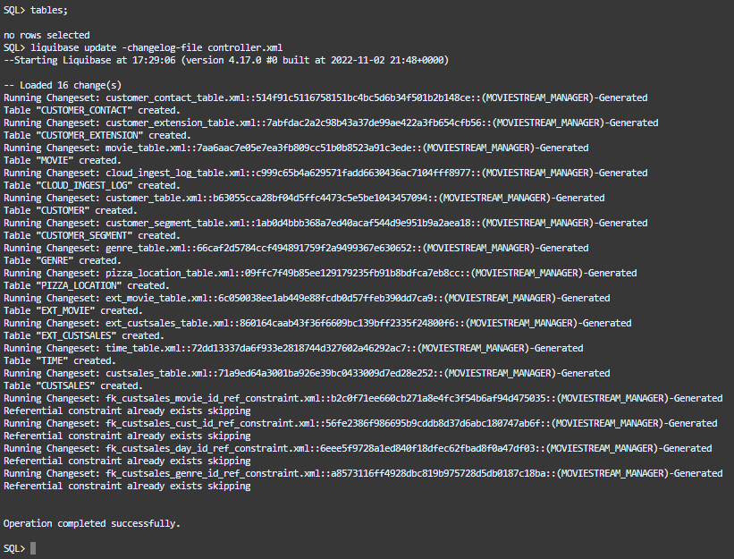

# Lab 1: Setup

## Introduction
Welcome to Oracle MovieStream!


As our newest developer, you will help build new features on the MovieStream website.

Before you start your first project, let's get your environment set up. You will be working with the Oracle Autonomous Database.


>**Note:** This lab walks you through the steps to get started using the Oracle Autonomous Database (Autonomous Data Warehouse [ADW] and Autonomous Transaction Processing [ATP]) on Oracle Cloud. You will provision a new ADW instance. While this lab uses ADW, the steps are the same for creating an ATP database.

Estimated Time: 25 minutes

[Lab 1](videohub:1_bf3hvpmu) 


### Objectives
In this lab, you will:

-   Provision a new Autonomous Database
-   Create two database users.
-   Create the database objects that will be used in the workshop.

### Prerequisites

- This lab requires completion of the [Introduction](../workshops/freetier/?lab=intro) and [Get Started](../workshops/freetier/?lab=cloud-login) sections in the Contents menu on the left.

## Task 1: Choose ADW or ATP from the services menu
1. Log in to the Oracle Cloud.
2. Once you log in, the cloud services dashboard shows all the services available to you. Click the navigation menu in the upper left to show top level navigation choices.

    > **Note:** You can also directly access your Autonomous Data Warehouse or Autonomous Transaction Processing service in the **Launch resources** section of the dashboard.

    
    

3. The following steps apply similarly to either Autonomous Data Warehouse or Autonomous Transaction Processing. This lab shows provisioning of an Autonomous Data Warehouse database, so click **Oracle Database**, then **Autonomous Data Warehouse**.

    

4. Make sure your Workload Type is __Data Warehouse__ or __All__ to see your Autonomous Data Warehouse instances. Use the __List Scope__ drop-down menu to select a compartment.

    


5. This console shows that no databases yet exist. If there were a long list of databases, you could filter the list by the **State** of the databases (Available, Stopped, Terminated). You can also sort by __Workload Type__. In this example, __Data Warehouse__ is the workload type.

    


## Task 2: Create the Oracle Autonomous Database instance

1. Click **Create Autonomous Database** to start the instance creation process.

    

2.  This brings up the __Create Autonomous Database__ screen where you will specify the configuration of the instance.


3. Specify basic information for the Autonomous Database:

    - __Compartment__ - Choose the compartment you would like to use or assigned to you.
    - __Display Name__ - Assign as __Liquibase\_Workshop__ or enter a memorable name for the database for display purposes. The instructions will use __Liquibase\_Workshop__ as the display name for this workshop.
    - __Database Name__ - Assign as __lbworkshop__ or enter a name of your choice. Use letters and numbers only, starting with a letter. Maximum length is 14 characters. (Underscores not initially supported.) The instructions will use __lbworkshop__ as the database name for this workshop.


4. Choose a workload type. Select the workload type for your database from the choices:

    - __Data Warehouse__ - For this lab, choose __Data Warehouse__ as the workload type.
    - __Transaction Processing__ - Additionally, you can also complete the lab with Transaction Processing as the workload type.

    

5. Choose a deployment type. Select the deployment type for your database from the choices:

    - __Serverless__ - For this lab, choose __Serverless__ as the deployment type.
    - __Dedicated Infrastructure__ - Dedicated Infrastructure allows you to run Autonomous Database on Dedicated Exadata infrastructure. The lab can also be run with this option.

    

6. Configure the database:

    - __Always Free__ - If your Cloud Account is an Always Free account, or your Cloud Account is a paid account but you want to avoid any charges, you can select this option to create an *Always Free Autonomous Database*. An always free database comes with 1 CPU and 20 GB of storage. 
    - __Choose database version__ - Select a database version from the available versions.
    - __OCPU count__ - Number of CPUs for your service. For this lab, specify __1 CPU__. If you choose an Always Free database, it comes with 1 CPU.
    - __Storage (TB)__ - Select your storage capacity in terabytes. For this lab, specify __1 TB__ of storage. Or, if you choose an Always Free database, it comes with 20 GB of storage.
    - __OCPU auto scaling__ - For this lab, there is no need to enable OCPU auto scaling, which enables the system to automatically use up to three times more CPU and IO resources to meet workload demand. 
    - __Storage auto scaling__ - For this lab, there is no need to enable storage auto scaling, which would allow the system to expand up to three times the reserved storage.

    > **Note:** You cannot scale up/down an Always Free autonomous database.

    

7. Create administrator credentials:

    - __Password and Confirm Password__ - Specify the password for ADMIN user of the service instance. The password must meet the following requirements:
         - The password must be between 12 and 30 characters long and must include at least one uppercase letter, one lowercase letter, and one numeric character.
         - The password cannot contain the username.
         - The password cannot contain the double quote (") character.
         - The password must be different from the last 4 passwords used.
         - The password must not be the same password that you set less than 24 hours ago.
         - Re-enter the password to confirm it. Make a note of this password.

    

8. Choose network access:
    - For this lab, accept the default, **Secure access from everywhere**.
    - If you want to allow traffic only from the IP addresses and VCNs you specify - where access to the database from all public IPs or VCNs is blocked, select **Secure access from allowed IPs and VCNs only** in the Choose network access area.
    - If you want to restrict access to a private endpoint within an OCI VCN, select **Private endpoint access only** in the Choose network access area.
    - If the **Require mutual TLS (mTLS) authentication** option is selected, mTLS will be required to authenticate connections to your Autonomous Database. TLS connections allow you to connect to your Autonomous Database without a wallet, if you use a JDBC thin driver with JDK8 or above. See the [documentation for network options](https://docs.oracle.com/en/cloud/paas/autonomous-database/adbsa/support-tls-mtls-authentication.html#GUID-3F3F1FA4-DD7D-4211-A1D3-A74ED35C0AF5) for options to allow TLS, or to require only mutual TLS (mTLS) authentication.
         - Either option works for this workshop. These instructions keep it selected.

    

9. Choose a license type. 

    - __Bring Your Own License (BYOL)__ - Select this type when your organization has existing database licenses.
    - __License Included__ - Select this type when you want to subscribe to new database software licenses and the database cloud service. If using an Always Free Autonomous Database, this will be the option you will use.


10. The **Contact Email** field is optional and allows you to list contacts to receive operational notices and announcements as well as unplanned maintenance notifications.

    


11. Click __Create Autonomous Database__. 

    

12.  Your instance will begin provisioning. In a few minutes, the state will turn from Provisioning to Available. At this point, your Autonomous Data Warehouse database is ready to use! Have a look at your instance's details here including its name, database version, OCPU count, and storage size.

    

## Task 3: Create your workshop database users
Let’s create the database users you will need for this workshop. Oracle Cloud and the Autonomous Database make this process simple.

 1. From the dashboard of your freshly created database, select “Database Actions” in the top left.
    
    

 2. This brings you to a page with a list of Autonomous Database features available from your Oracle Cloud user interface (UI). Select “SQL” under Development.
    

 3. From the SQL Worksheet, copy and paste the following script. This will create the two database users you will need for the workshop: MOVIESTREAM\_MANAGER and MOVIESTREAM\_DEV.
    * Before running the script; place it in a text editor, remove the brackets, and add a password for each user in the `CREATE USER` lines after `IDENTIFIED BY`.
       * The password must be between 12 and 30 characters long and must include at least one uppercase letter, one lowercase letter, and one numeric character.
         - The password cannot contain the username.
         - The password cannot contain the double quote (") character.
         - The password must be different from the last 4 passwords used.
         - The password must not be the same password that you set less than 24 hours ago.
    * You can then select the Run Script icon. *Expand the line right below to view the copiable code block*

         <details>
         <summary>[EXPAND] Create MOVIESTREAM\_MANAGER and MOVIESTREAM\_DEV Code</summary>

         ```na

         <copy>
         -- USER SQL
         CREATE USER MOVIESTREAM_MANAGER IDENTIFIED BY [Insert Password];

         -- ADD ROLES
         GRANT CONNECT TO MOVIESTREAM_MANAGER;
         GRANT CONSOLE_DEVELOPER TO MOVIESTREAM_MANAGER;
         GRANT DWROLE TO MOVIESTREAM_MANAGER;
         GRANT GRAPH_DEVELOPER TO MOVIESTREAM_MANAGER;
         GRANT OML_DEVELOPER TO MOVIESTREAM_MANAGER;
         GRANT RESOURCE TO MOVIESTREAM_MANAGER;
         ALTER USER MOVIESTREAM_MANAGER DEFAULT ROLE CONNECT,CONSOLE_DEVELOPER,DWROLE,GRAPH_DEVELOPER,OML_DEVELOPER,RESOURCE;

         -- ENABLE REST
         BEGIN
            ORDS.ENABLE_SCHEMA(
               p_enabled => TRUE,
               p_schema => 'MOVIESTREAM_MANAGER',
               p_url_mapping_type => 'BASE_PATH',
               p_url_mapping_pattern => 'moviestream_manager',
               p_auto_rest_auth=> TRUE
            );
            commit;
         END;
         /

         -- ENABLE GRAPH
         ALTER USER MOVIESTREAM_MANAGER GRANT CONNECT THROUGH GRAPH$PROXY_USER;

         -- ENABLE OML
         ALTER USER MOVIESTREAM_MANAGER GRANT CONNECT THROUGH OML$PROXY;

         -- QUOTA
         ALTER USER MOVIESTREAM_MANAGER QUOTA UNLIMITED ON DATA;

         -- USER SQL
         CREATE USER MOVIESTREAM_DEV IDENTIFIED BY [Insert Password];

         -- ADD ROLES
         GRANT CONNECT TO MOVIESTREAM_DEV;
         GRANT CONSOLE_DEVELOPER TO MOVIESTREAM_DEV;
         GRANT DWROLE TO MOVIESTREAM_DEV;
         GRANT GRAPH_DEVELOPER TO MOVIESTREAM_DEV;
         GRANT OML_DEVELOPER TO MOVIESTREAM_DEV;
         GRANT RESOURCE TO MOVIESTREAM_DEV;
         ALTER USER MOVIESTREAM_DEV DEFAULT ROLE CONNECT,CONSOLE_DEVELOPER,DWROLE,GRAPH_DEVELOPER,OML_DEVELOPER,RESOURCE;

         -- ENABLE REST
         BEGIN
            ORDS.ENABLE_SCHEMA(
               p_enabled => TRUE,
               p_schema => 'MOVIESTREAM_DEV',
               p_url_mapping_type => 'BASE_PATH',
               p_url_mapping_pattern => 'moviestream_dev',
               p_auto_rest_auth=> TRUE
            );
            commit;
         END;
         /

         -- ENABLE GRAPH
         ALTER USER MOVIESTREAM_DEV GRANT CONNECT THROUGH GRAPH$PROXY_USER;

         -- ENABLE OML
         ALTER USER MOVIESTREAM_DEV GRANT CONNECT THROUGH OML$PROXY;

         -- QUOTA
         ALTER USER MOVIESTREAM_DEV QUOTA UNLIMITED ON DATA;


         </copy>

         ```
         </details>

   

 4. You now have both of the database users you will need for the labs created. Return to your `Liquibase_Workshop` Autonomous Database dashboard by selecting the original tab in your web browser and navigating off your Database Actions tab.
    
    * If you accidently closed out of this tab, you can relog in to OCI on the [Sign-in Page](https://www.oracle.com/cloud/sign-in.html) and navigate back to your dashboard
       * Hamburger menu in top left -> Oracle Database -> Autonomous Database -> Liquibase_Workshop
    

## Task 4: Create database objects for the labs
With your database users created, next you will be creating the database objects you will be working with in the labs. Database objects are the different types of “things” you have in your database. Examples include:
   * Tables - the basic way to store data. A grid organized into columns and rows just like an Excel spreadsheet.  
   * Views - custom tables you can create from parts of one or more tables. Helpful for focusing on only certain areas of your data.
   * Constraints - rules you can set on the data in your tables.
   * Triggers - code that executes if a specified event occurs in your database. “If X occurs do Y”.

Just as you can create and have different tables in your database (`employees`, `departments`, etc.), the same applies to the other database object types.

### **Setting up your connection credentials and files**
 1. First let's set up your connection credentials to your database. Cloud Shell makes this easy.
    * Cloud Shell provides a Linux terminal in your Oracle Cloud webpage with a pre-authenticated Oracle Cloud Infrastructure (OCI) Command Line Interface (CLI) connected to it.
    * Select the < > icon in the top right corner of your Oracle Cloud menu and then select “Cloud Shell”
    

 2. On the bottom of your screen you’ll see the Cloud Shell interface appear.
    

 3. You can fetch your wallet with the following command. Before you paste the command in the Cloud Shell command prompt, place it in a text editor and edit the following areas (make sure to remove the brackets):
    * Replace [Insert Password] with a password of your choice for your wallet
         * The wallet password cannot contain special characters such as $
    * Replace [Insert OCID] with your Autonomous Database OCID
         * This can be found under your "Autonomous Database information" tab
   
    

    ```na
    <copy>
    oci db autonomous-database generate-wallet --generate-type ALL --file Wallet_lbworkshop.zip --password [Insert Password] --autonomous-database-id [Insert OCID]
    </copy>
    ```
    

 4. Now you can place the command into Cloud Shell and generate your wallet.
    

 5. Before you connect to your database, let's upload some files you'll need for the workshop. Select the settings gear in the top right of the Cloud Shell interface then click “Upload”.
    

 6. Download [setup_changelogs.zip](https://objectstorage.us-ashburn-1.oraclecloud.com/p/VEaopGvnBQgotbj8iHpFEKSUZQhnszZJtFQpT_EOviGNRWhY21qeq0itQe3f_ykZ/n/c4u04/b/livelabsfiles/o/developer-library/setup_changelogs.zip) by clicking the link.
    * The files in this zip folder will be used to automatically create the database objects you will use in the workshop

 7. Once that zip file has downloaded to your computer, select it in the "File Upload to your Home Directory" menu and click Upload.
    

 8. There will be a notification in the top right “File Transfers” window when the upload is complete.
    

 9. Let’s now unzip the setup_changelogs folder in the Cloud Shell command line using the `unzip` Linux command.
    * `unzip` decompresses your files in the zip folder/directory. The -d option you will use extracts those files and subdirectories to a different directory in the format of `unzip -d [new/existing directory to extract to] [zip file/folder to extract from]`.

    ```na
    <copy>
    unzip -d setup_changelogs setup_changelogs.zip
    </copy>
    ```
    

 10. Next, change your current working directory to the newly created setup\_changelogs folder. You’ll be using the `cd` (change directory) command and entering it twice due to the folder unzipping in such a way that the structure is setup\_changelogs -> setup\_changelogs -> [files]
    * The reason you want to change your directory to setup\_changelogs is because SQLcl Liquibase by default reads and writes files to and from your current directory.

    ```na
    <copy>
    cd setup_changelogs
    cd setup_changelogs
    </copy>
    ```

### **Connect To MOVIESTREAM_MANAGER user and create database objects**
 1. Now that your wallet and setup files are downloaded, it's time to connect to SQLcl.

    ```na
    <copy>
    sql /nolog
    </copy>
    ```

 2. Set cloudconfig to Wallet_lbworkshop.zip so SQLcl knows to read your credentials from this wallet. In the `set cloudconfig` command below replace [OCI CLI Profile Name] with your profile name.
    * This is the name to the left of `@cloudshell` in your command prompt before you logged in to SQLcl.  
   
    ```na
    <copy>
    set cloudconfig /home/[OCI CLI Profile Name]/Wallet_lbworkshop.zip
    </copy>
    ```

    

 3. Use the command `show tns` to show connection information. 
    * Transparent Network Substrate (TNS) is an Oracle networking technology that serves as the foundational component for all of our network products.
   
    ```na
    <copy>
    show tns
    </copy>
    ```
    
    

 4. It is now time to connect to MOVIESTREAM\_MANAGER and create some database objects in this user.
    * Under the "Available TNS Entries" section of the `show tns` command, there are 3 connections by default for Autonomous Data Warehouse (ADW) and 5 for Autonomous Transaction Processing (ATP). The names are designated by `[database name]_[connection level]`.
    * These workshop instructions will use lbworkshop\_high in the command below.
    * If you prefer to use a different connection, simply replace the command with that connection. Enter your MOVIESTREAM\_MANAGER password at the prompt.
         * lbworkshop_high
            * High priority application connection service for reporting and batch operations. All operations run in parallel and are subject to queuing.
         * lbworkshop_medium
            * A typical application connection service for reporting and batch operations. All operations run in parallel and are subject to queuing. Using this service, the degree of parallelism is limited to four.
         * lbworkshop_low
            * A lowest priority application connection service for reporting or batch processing operations. This connection service does not run with parallelism.
         * lbworkshop_tpurgent (ATP only)
            * The highest priority application connection service for time critical transaction processing operations. This connection service supports manual parallelism.  
         * lbworkshop_tp (ATP only)
            * A typical application connection service for transaction processing operations. This connection service does not run with parallelism.

    ```na
    <copy>
    connect moviestream_manager@lbworkshop_high
    </copy>
    ```
    

 5. You are now connected to your moviestream_manager user. If you run the `tables` SQL command you’ll see by the “no rows selected” result that you don’t have any tables yet. So let’s create some database objects to use in your workshop!
    ```na
    <copy>
    tables;
    </copy>
    ```

 6. Run the following command.
    ```na
    <copy>
    liquibase update -changelog-file controller.xml
    </copy>
    ```
    

 7. Congratulations! You just populated an entire Oracle Database schema by running one simple command using SQLcl Liquibase. We’ll break down what you just did there in the next labs! For now, you can check out the tables you just created with the `tables` command.
    ```na
    <copy>
    tables;
    </copy>
    ```
    

 8. You can now log out of SQLcl with the `exit` command.
    ```na
    <copy>
    exit
    </copy>
    ```

 9. You are all set. You may now **proceed to the next lab**.

## Learn more

* [Product Page (SQLcl)](https://www.oracle.com/database/sqldeveloper/technologies/sqlcl/)
* [Documentation (SQLcl & SQLcl Liquibase)](https://docs.oracle.com/en/database/oracle/sql-developer-command-line/)
* Blog Posts/Articles
    * [CI/CD With Oracle Database and APEX](https://www.thatjeffsmith.com/archive/2021/04/ci-cd-with-oracle-database-and-apex/)
    * [SQLcl Liquibase in 6 Minutes](https://www.talke.tech/blog/learn-sqlcl-liquibase-in-6-minutes)
    * [Data Definition Language (DDL) Settings with SQLcl & Liquibase](https://www.thatjeffsmith.com/archive/2023/01/physical-properties-in-oracle-table-liquibase-changesets/)
    * [How to Run SQLcl Liquibase Updates in Different Target Schemas](https://www.thatjeffsmith.com/archive/2022/12/run-liquibase-updates-for-a-specific-schema-with-sqlcl/)
    * [Use JSON, XML, and YAML Formats With SQLcl Liquibase](https://www.thatjeffsmith.com/archive/2022/12/how-to-use-json-xml-yaml-liquibase-changesets-in-sqlcl/)
    * [What's The Difference Between An Oracle Database Schema & User](https://www.talke.tech/blog/whats-the-difference-between-a-db-schema-and-db-user)

## Acknowledgements

- **Author** - Zachary Talke, Senior Product Manager
- **Last Updated By/Date** - Zachary Talke, May 2023
