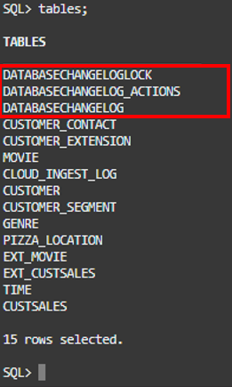
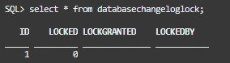
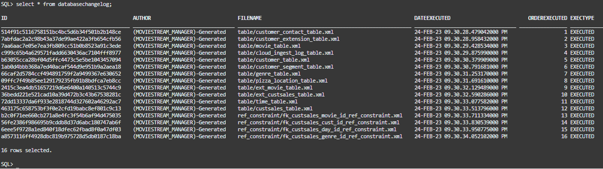
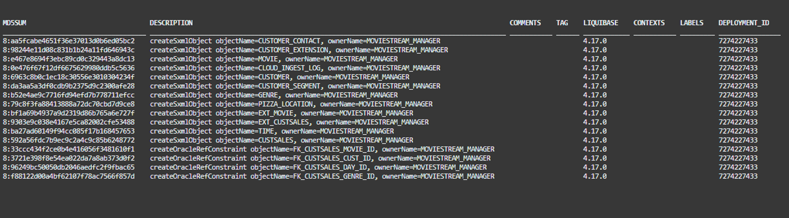
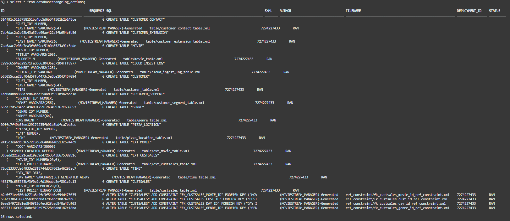
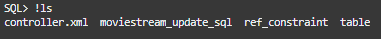
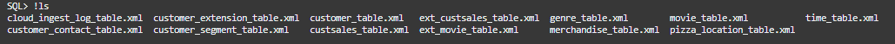
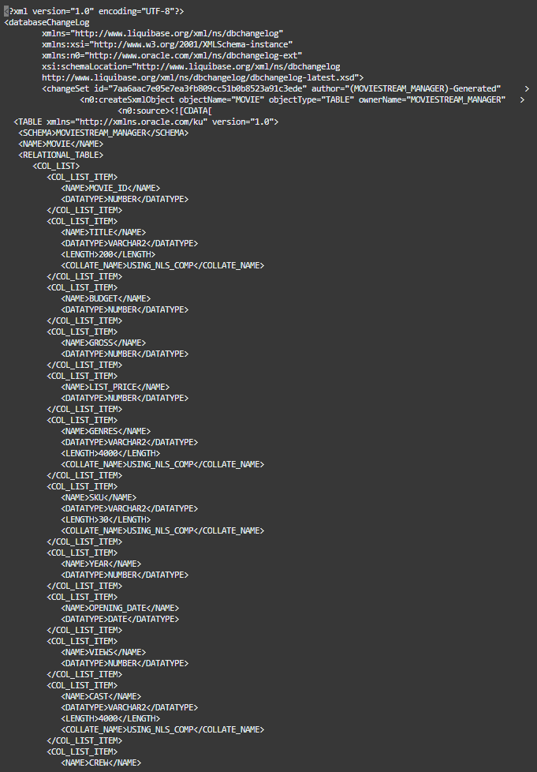
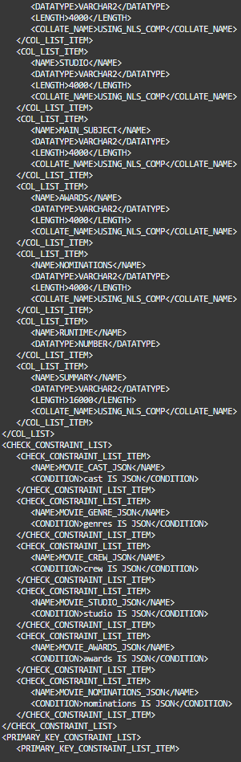
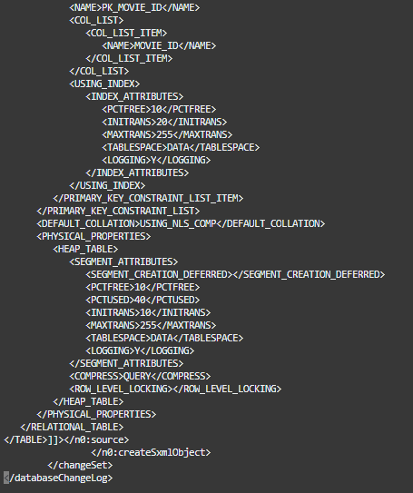

# (Optional) Lab 2: Look under the hood - understanding changelog tables & changelogs

## Introduction
Welcome to Lab 2! Now that you’ve populated your MOVIESTREAM_DEV schema and it’s all ready for you to load your data and start developing, let’s learn a little bit more about some important Liquibase concepts.

**Note:** This lab is optional and does not contain steps necessary for the completion of the workshop. It does however teach core concepts important for fully understanding and utilizing SQLcl Liquibase

*Estimated Time:* 15 Minutes


### Objectives
In this lab you will:
* Explore the Liquibase database changelog tables and understand how they are used to version your schema.
* Learn how to read changelog files and analyze some of the ones you created.

### Prerequisites
Completion of:
* [Introduction](../workshops/freetier/?lab=intro)
* [Getting Started](../workshops/freetier/?lab=cloud-login)
* [Create Your Autonomous Database](../workshops/freetier/?lab=adb-provision-conditional)
* [Setup](../workshops/freetier/?lab=setup)
* [Lab 1: Liquibase Basics - Help, Generate, and Update Commands](../workshops/freetier/?lab=lab1-help-generate-update)


## Task 1: Take a look at the database changelog tables - how you track SQLcl Liquibase's activity
### **MOVIESTREAM_DEV**
   1. Make sure you are still connected in SQLcl to your MOVIESTREAM_DEV database user from the last lab. Let’s take a look at your table list again, this time focusing on the tables with “databasechangelog” in the name:
      * databasechangeloglock
      * databasechangelog_actions
      * databasechangelog

      ```na
      <copy>
      tables;
      </copy>
      ```

      

   2. When a user issues the `liquibase update` command on their database schema, these three tables are automatically created. These tables help you manage and provide context for your Liquibase changelogs. Let's review the first table now:
      * databasechangeloglock ensures only one instance of Liquibase is running on a database schema at a time with a simple 0 or 1 binary lock to prevent change conflicts.
         * When a changelog (or series of changelogs) are run with the `liquibase update` command, first the table is automatically edited to a 1 value in the "Locked" column to activate the lock. Then, the database changes are applied. When they are done, the "Locked" column is automatically edited back to 0 to deactivate the lock.

      ```na
      <copy>
      select * from databasechangeloglock;
      </copy>
      ```

      

   3. Databasechangelog tracks which changesets (the specific changes in a changelog) have been run. There are 14 columns in this table. For details on each of these columns expand the tab below.
   <details>
     <summary>[EXPAND] Databasechangelog Table Details</summary>
       * ID
          * The changeset ID for a particular changelog. The ID is generated when the changelog is created with one of the `liquibase generate` commands.
       * AUTHOR
          * The author of the changeset. In a changelog, it is automatically labeled as the database user who generated the changelog but it can be manually overwritten and set as you please.
       * FILENAME
          * The path from the working directory (when the update was applied) to the changelog file whose changeset is being ran.
       * DATEEXECUTED
          * The date and time the changeset was executed (Day-Month-Year Hour.Minute.Second.Nanosecond AM/PM)
       * ORDEREXECUTED
          * The order in which the changesets in the databasechangelog table were executed starting with 1 and ascending from there.
       * EXECTYPE
          * The status of a changeset’s execution. Values can be: EXECUTED, FAILED, SKIPPED, RERAN, and MARK_RAN.
       * MD5SUM
          * When Liquibase reaches a changeset to execute, it generates an MD5 checksum (a 32-character hexadecimal number) before execution and stores it in this column.
          * If a changeset is modified, the file’s checksum will no longer match the stored value and you will get a Liquibase checksum validation error.
       * DESCRIPTION
          * A short description of the changeset being executed in the format: Changeset Change Type, Database Object Name, Database Object Owner Name.
       * COMMENTS
          * A field for comments to be manually placed if needed.
       * TAG
          * Used for tagging (bookmarking) and rolling back unwanted changelog updates to the point of the tag.
          * The changeset line that has a tag name in it indicates the last changeset unaffected by the tag during a rollback. The effects of all changesets after this row will be undone by rolling back to the tag.
       * LIQUIBASE
          * The version of open-source Liquibase the changeset is being run on. SQLcl Liquibase is built on top of the open-source Liquibase platform and the version displayed will be the open-source platform version, not SQLcl version.
       * CONTEXTS & LABELS
          * Contexts and labels can be manually added to changesets to control whether the changeset is applied or not when commands like `liquibase update` are ran. The column in the database changelog table designates which context or label the changeset was run on, if one was specified.
             * An example would be setting a context or label as “test” or “production” to designate which environment to run the changeset in.
             * Contexts and labels are very similar and can be used identically in simple use cases. Where they differ is what “user” has the power to filter designations made.
                * With contexts, you can specify a logical expression within the changeset.
                * With labels, the logical expression (if you choose to use one) is specified by the user making deployments as a parameter in the `liquibase update` command. 
       * DEPLOYMENT_ID
          * A unique identifier for changeset deployments that will match across changesets deployed as a group (for example when you run `liquibase update` on a controller file).
   </details>
   
      ```na
      <copy>
      select * from databasechangelog;
      </copy>
      ```

      
      2nd half of columns
      

   4. Finally databasechangelog\_actions tracks the state of your database objects and the SQL statements executed during deployment. This table is exclusive to SQLcl Liquibase and not present in the open-source platform.  There are 8 columns. You can learn about each of them by expanding the tab.

   <details>
      <summary>[EXPAND] Databasechangelog\_Actions Table Details</summary>
       * ID
          * The changeset ID for a particular changelog. The ID is generated when the changelog is created with one of the `liquibase generate` commands.
          * This is the same column as in the databasechangelog table.
       * SEQUENCE
          * A deprecated column. Will be removed in a future SQLcl update.
       * SQL
          * The SQL statement/s being executed in the database from the changeset instructions.
       * SXML
          * If a database object was created by the changeset, the field will be blank. If a pre-existing database object was edited by the changeset, this field records the state of the object before the changes were made.
          * SXML is what allows for the dynamic object transformation functionality we added on top of the open-source platform. This can only be found in SQLcl Liquibase. For more information see [HERE](https://docs.oracle.com/en/database/oracle/sql-developer-command-line/23.1/sqcug/using-liquibase.html#GUID-41E0F36F-0091-4393-9BE0-850D590A7417)
       * AUTHOR
          * The author of the changeset. In a changelog, it is automatically labeled as the database user who generated the changelog but it can be manually overwritten and set as you please.
          * This is the same column as in the databasechangelog table.
       * FILENAME
          * The path from the working directory (when the update was applied) to the changelog file whose changeset is being ran.
          * This is the same column as in the databasechangelog table
       * DEPLOYMENT_ID
          * A unique identifier for changeset deployments that will match across changesets deployed as a group (for example when you run `liquibase update` on a controller file).
          * This is the same column as in the databasechangelog table.
       * STATUS
          * The status of the changeset. Possible statuses:
             * RAN - changeset was ran
             * rollbackFailed - rolling back and undoing the changeset failed
             * rolledBack - changeset was successfully rolled back and undone
             * runFailed - running the changeset failed
             * willRollback - changeset is queued to be rolled back and undone
   </details>

      ```na
      <copy>
      select * from databasechangelog_actions;
      </copy>
      ```

      

## Task 2: Learn how to read changelog files

   1. Now that we’ve gone over the databasechangelog tables, let’s explore some of the files that you created. While still in your moviestream_changelogs directory, run the `!ls` command to see the controller.xml file you are about to take a look at:

      ```na
      <copy>
      !ls
      </copy>
      ```

      

   2. Controller.xml manages the execution of your individual database object changelogs. Use `cat controller.xml` to view the file. By default, changelogs are saved in the XML format although other options are available. The controller file is broken down into three section: 

   <details>
   <summary>[EXPAND] XML Prolog - Defines the XML document</summary>
       * `<?xml version="1.0" encoding="UTF-8"?>`
          * This line is called the XML prolog
             * The XML prolog is optional. If it exists, it must come first in the document
          * XML documents can contain international characters, like Norwegian øæå or French êèé
          * To avoid errors, you should specify the encoding used, or save your XML files as UTF-8
          * UTF-8 is the default character encoding for XML documents
          * There are currently only 2 versions of XML: 1.0 and 1.1. Use of 1.0 is most common and 1.1 use is very rare
          * XML 1.0 operates on the principle that “everything not permitted is forbidden” while 1.1 operates on “everything not forbidden is permitted”
   </details>    

   <details>
   <summary>[EXPAND] Changelog Metadata - Identifies and defines Liquibase XML elements</summary>
       * xmlns=”http://www.liquibase.org/xml/ns/dbchangelog”
          * xmlns stands for XML Namespace. It declares what the default namespace for the XML document is.
          * In situations where multiple namespaces are included in an XML document, you don’t need to use prefixes to differentiate elements in this namespace from elements coming from others because this is the “default” namespace.
       * xmlns:xsi=”http://www.w3.org/2001/XMLSchema-instance”
          * Short for XML Namespace:XML Schema Instance
          * While it may seem that due to this naming convention this is a special type of xmlns declaration, this is not the case. xsi is simply a commonly used xmlns prefix that is convenient because of what the acronym is named after. That is why you may have seen it before across other XML documents
             * It is no different than any other xmlns declaration in the format of xmlns:[prefix]
             * Naming it something such as xmlns:d=http://www.w3.org/2001/XMLSchema-instance would functionally accomplish the same result
          * Including a prefix with a namespace declaration allows you to later distinguish which namespace you are referring to with your element you are using. This avoids name conflicts in the case that multiple namespaces in your XML document have elements with the same name
             * Example:
                * You have a namespace xmlns:d=[URL]
                * You want to use the element `<table> </table>` from this namespace but you have declared another namespace in this XML document that also has a table element
                * Using your prefix “d” you declared in the form of `<d:table> </d:table>` distinguishes that you are referencing this namespace and not the other
       * xsi:schemaLocation=http://www.liquibase.org/xml/ns/dbchangelog http://www.liquibase.org/xml/ns/dbchangelog/dbchangelog-latest.xsd
          * xsi stands for: XML Schema Instance
             * An XML Instance document is a file that contains information or data of what you are trying to describe with your schema
             * An XML Schema specifies the structure of an XML document and constraints on its content
          * The schemaLocation attribute has two values separated by a space:
             * The first is the namespace to use.
                * A namespace is a uniform resource identifier (URI). Think of it as a collection of unique elements available to use
                   * A URI is a way to uniquely identify “anything”
                   * XML namespaces are used to provide uniquely named elements and attributes in an XML document
                * The second is the location of the XML schema to use for that namespace  
   </details>

   <details>
   <summary>[EXPAND] Include File - Defines the individual changelogs to run and in what order</summary>
       * include file
          * Include file is where the controller.xml file manages the other changelogs and specifies the order to run them in.
   </details>    

      ```na
      <copy>
      !cat controller.xml
      </copy>
      ```

   3. Next, let’s look at one of your individual changelogs. First, change your current directory to "table". This contains your table database object type changelogs.
      ```na
      <copy>
      cd table
      </copy>
      ```

   4. You can see the list of table changelogs with the `!ls` Linux command.

      ```na
      <copy>
      !ls
      </copy>
      ```

      

   5. Let’s take a look at how the movie table changelog works. 
      * This file contains a sole database object: the table movie. 
      * The changelog may be run individually or as part of a chain of changelogs specified by a controller file. 
      * The controller file you looked at contained three sections: XML Prolog, Changelog Metadata, and Include File. 
         * The movie_table.xml file contains these first two sections but instead of "Include File", it has a "Changeset" section. The changeset section of a changelog file is where the actual instructions for creating a database object are. 

   <details>
   <summary>[EXPAND] Changeset - The database object instructions</summary>
       * `<changeSet id="7aa6aac7e05e7ea3fb809cc51b0b8523a91c3ede" author="(MOVIESTREAM_MANAGER)-Generated"     >`
          * `changeset` is the changelog XML element where the information is stored for the actual database changes that are applied when a changelog is ran.
          * `id` is the changeset ID for a particular changelog. The ID is generated when the changelog is created.
             * It is the same ID present in the databasechangelog and databasechangelog_actions tables.
          * `author` is the author of the changeset. It is automatically labeled as the database user who generated the changelog but it can be manually overwritten and set as you please.
             * It is the same author value present in the databasechangelog and databasechangelog_actions tables.
       * `<n0:createSxmlObject objectName="MOVIE" objectType="TABLE" ownerName="MOVIESTREAM_MANAGER"   >`
          * `createSxmlObject` is one of the SQLcl Liquibase changeset types. `createSXMLObject` creates any database object that can be stored in SXML. For a full list of SQLcl Liquibase changeset types [See Here](https://docs.oracle.com/en/database/oracle/sql-developer-command-line/22.4/sqcug/using-liquibase.html#GUID-AA97A806-F886-4286-A14D-372F20456284)
             * SXML is a data format from the Oracle Database `DBMS_METADATA` package. SXML is an XML representation of object metadata that looks like a direct translation of SQL Data Definition Language (DDL) into XML.
                * Oracle supplies many packages, which are automatically installed with Oracle Database, that extend database functionality. One of these packages, DBMS_METADATA, provides a way to retrieve metadata from the database dictionary as XML or SQL Data Definition Language (DDL) statements, and to submit the XML to recreate the object.
                   * This functionality is the secret weapon of SQLcl Liquibase. The DBMS_METADATA package is used to generate and execute the specialized changelogs that you see in SQLcl Liquibase compared to the open-source platform. These changelogs transform the state of the database objects dynamically and allows for pre-existing object to be altered. This is a feature not available in the Liquibase open-source client. You can find more information on dynamic object transformation with SQLcl Liquibase [Here](https://docs.oracle.com/en/database/oracle/sql-developer-command-line/23.1/sqcug/using-liquibase.html#GUID-41E0F36F-0091-4393-9BE0-850D590A7417)
          * `objectName` is the name of the database object.
          * `objectType` is the database object type.
          * `ownerName` is the database user that created the changeset.
       * `<n0:source><![CDATA[]]></n0:source>`
          * `source` is the XML element from the n0 namespace where the changeset data is stored.
          * `CDATA` stands for Character Data. It is where blocks of text are stored that are not parsed by the parser but are otherwise recognized as markup. For SQLcl Liquibase changelogs, this field is used to store the changeset data such as the Data Definition Language (DDL), SXML, data URL or file path.
       * `<TABLE xmlns="http://xmlns.oracle.com/ku" version="1.0">`
          * Within the CDATA for this changelog, the `TABLE` element is being used as this changelog specifically creates a table. http://xmlns.oracle.com/ku is the namespace this element comes from. All the elements under this are sub elements of table, defining its properties.
   </details>

      ```na
      <copy>
      !cat movie_table.xml
      </copy>
      ```

      
      
      

   6. Congratulations you have now completed the second lab! You may now **proceed to the next lab**.


## Learn More
* [Product Page (SQLcl)](https://www.oracle.com/database/sqldeveloper/technologies/sqlcl/)
* [Documentation (SQLcl & SQLcl Liquibase)](https://docs.oracle.com/en/database/oracle/sql-developer-command-line/)
* Blog Posts/Articles
    * [CI/CD With Oracle Database and APEX](https://www.thatjeffsmith.com/archive/2021/04/ci-cd-with-oracle-database-and-apex/)
    * [SQLcl Liquibase in 6 Minutes](https://www.talke.tech/blog/learn-sqlcl-liquibase-in-6-minutes)
    * [Data Definition Language (DDL) Settings with SQLcl & Liquibase](https://www.thatjeffsmith.com/archive/2023/01/physical-properties-in-oracle-table-liquibase-changesets/)
    * [How to Run SQLcl Liquibase Updates in Different Target Schemas](https://www.thatjeffsmith.com/archive/2022/12/run-liquibase-updates-for-a-specific-schema-with-sqlcl/)
    * [Use JSON, XML, and YAML Formats With SQLcl Liquibase](https://www.thatjeffsmith.com/archive/2022/12/how-to-use-json-xml-yaml-liquibase-changesets-in-sqlcl/)
    * [What's The Difference Between An Oracle Database Schema & User](https://www.talke.tech/blog/whats-the-difference-between-a-db-schema-and-db-user)

## Acknowledgements

- **Author** - Zachary Talke, Product Manager
- **Last Updated By/Date** - Zachary Talke, May 2023
