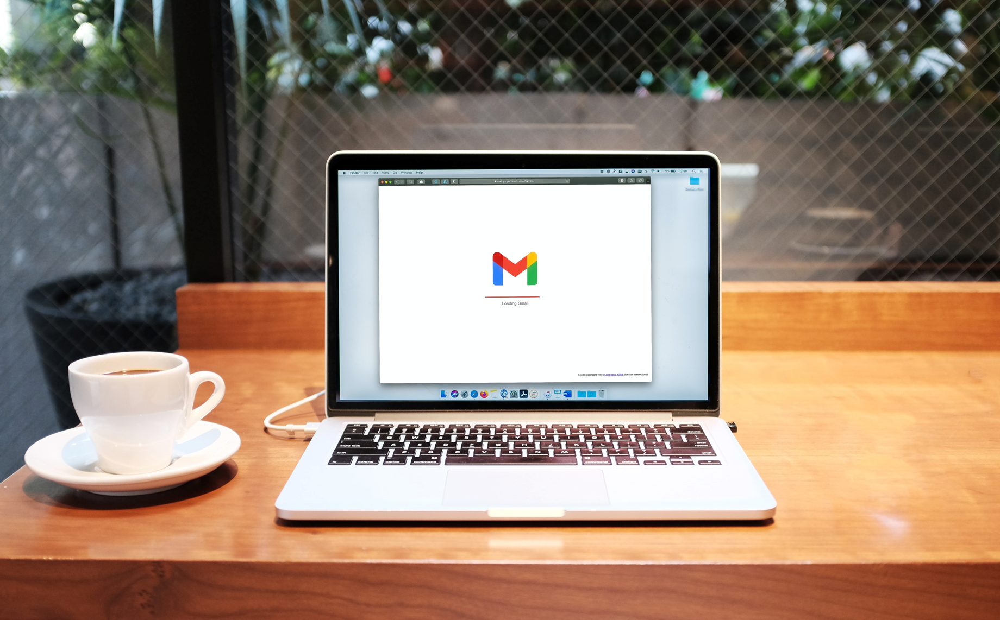
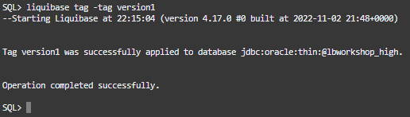
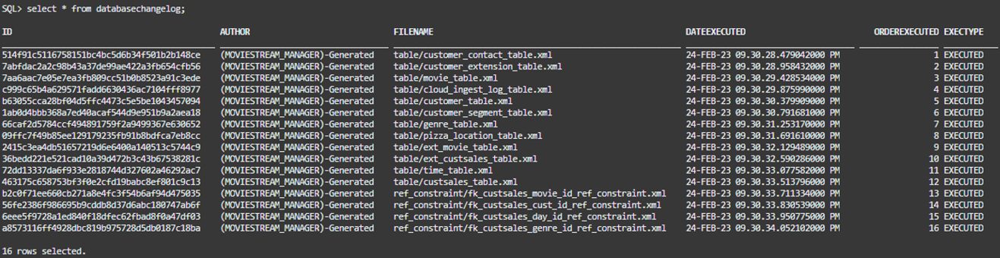
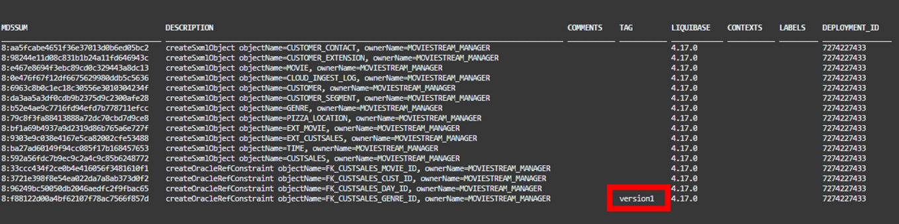
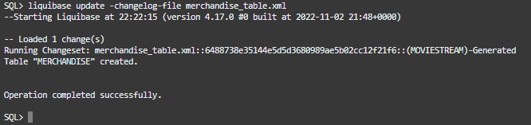
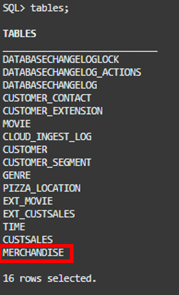
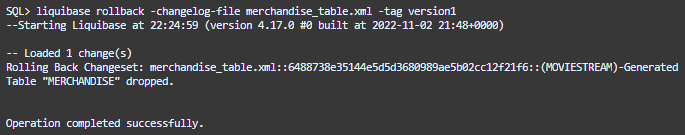
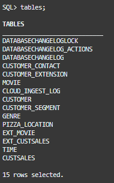

# Lab 3: Tag, you're it! - tag, update, and rollback

## Introduction


According to your emails, it looks like MovieStream wants to start selling merchandise on the website. You’ve been assigned as one of the developers to help build this section of the site.

Your manager already assigned you the JIRA ticket and passed along a changelog with the database object table you will need. Let’s add it to your database schema.

**Note:** In this lab you will learn how to bookmark your database state, apply an update, then roll the update back undoing its effects.

*Estimated Time:* 5 Minutes


### Objectives
In this lab you will:
* Learn to bookmark your database's state with the `liquibase tag`
* Apply a changelog with `liquibase update`
* Roll back the changelog with the `liquibase rollback` command.

### Prerequisites
Completion of:
* [Introduction](../workshops/freetier/?lab=intro)
* [Getting Started](../workshops/freetier/?lab=cloud-login)
* [Create Your Autonomous Database](../workshops/freetier/?lab=adb-provision-conditional)
* [Setup](../workshops/freetier/?lab=setup)
* [Lab 1: Liquibase Basics - Help, Generate, and Update Commands](../workshops/freetier/?lab=lab1-help-generate-update)
* [Lab 2: Getting Under The Hood - Understanding Changelog Tables & Changelogs](../workshops/freetier/?lab=lab2-changelogtables-changelogs)

## Task 1: Tag your database state
### **MOVIESTREAM_DEV**
   1. While still connected to your MOVIESTREAM\_DEV database user from lab 2, go to your moviestream\_changelogs directory.
      ```na
      <copy>
      cd ~/moviestream_changelogs
      </copy>
      ```

   2. Before applying your changelog, let’s bookmark your database schema state with the `tag` command.
      * The `tag` command marks the current database state so you can roll back changes in the future.
         * This way you can deploy changelogs and have the peace of mind that you can rollback and undo these changes if need be.
      * Let’s name the tag "version1".

      ```na
      <copy>
      liquibase tag -tag version1
      </copy>
      ```

      

   3. If you take a look at the last row in your databasechangelog table, you can see the tag has been applied.

      ```na
      <copy> 
      select * from databasechangelog;
      </copy>
      ```

      
      2nd half of columns
      

## Task 2: Apply a changelog and roll it back
   1. Now that creating a tag has been taken care of, you are all set to run the merchandise\_table.xml changelog and create your merchandise table!
      * This is the table you created and saved to a changelog [Back In Lab 1 Task 3 Step 5](/workshops/freetier/?lab=lab1-help-generate-update#Task3:Generateyourdatabaseschemafiles)

      ```na
      <copy>
      liquibase update -changelog-file merchandise_table.xml
      </copy>
      ```

      

   2. You can see this table now in your list with the `tables` command.

      ```na
      <copy>
      tables;
      </copy>
      ```

      

   3. Sure enough, it looks like you just got an email from your manager. The merchandise table still needs some work and you’ll receive the new changelog by the end of the week. In the meantime, let’s undo this changelog with the `liquibase rollback` command.
      * `liquibase rollback` undoes the changelog applied after a specified tag.
         * The `-changelog-file` mandatory parameter is the name of the changelog you are undoing.
         * The `-tag` mandatory parameter is the specific tag you are rolling back to in your databasechangelog table.


      ```na
      <copy>
      liquibase rollback -changelog-file merchandise_table.xml -tag version1
      </copy>
      ```

   

   4. With the `tables` command you can see that merchandise is no longer in the table list.

      ```na
      <copy>
      tables;
      </copy>
      ```

   

   5. Congratulations, you just learned how to apply a tag and perform a rollback! You have completed lab 3! You may now **proceed to the conclusion below**.

## Conclusion
You have completed all the labs in this workshop and learned the fundamentals of SQLcl Liquibase. Congratulations! This was a lot of info to take in.

Your life is about to get a whole lot easier. You are now equipped to automate your database changes and supercharge your software development process; saving you valuable time, money, and resources.

If you have any questions about SQLcl Liquibase at all, please reach out to Database Tools Product Manager Zachary Talke @:
* zachary.talke@oracle.com
* [LinkedIn](https://www.linkedin.com/in/zachary-talke/)
* [Twitter](https://twitter.com/talke_tech)

Even though this LiveLab workshop teaches you plenty to be dangerous with SQLcl Liquibase, this is just the beginning of the journey. There are more resources to be found in the Learn More section below.

Check out [Talke Tech](https://www.talke.tech/) and [thatjeffsmith](https://www.thatjeffsmith.com/) for the latest in SQLcl Liquibase news and educational content.

Stay tuned for future content where we cover how to use SQLcl Liquibase to automate you API and low-code application development!

## Learn More
* [Product Page (SQLcl)](https://www.oracle.com/database/sqldeveloper/technologies/sqlcl/)
* [Documentation (SQLcl & SQLcl Liquibase)](https://docs.oracle.com/en/database/oracle/sql-developer-command-line/)
* Blog Posts/Articles
    * [CI/CD With Oracle Database and APEX](https://www.thatjeffsmith.com/archive/2021/04/ci-cd-with-oracle-database-and-apex/)
    * [SQLcl Liquibase in 6 Minutes](https://www.talke.tech/blog/learn-sqlcl-liquibase-in-6-minutes)
    * [Data Definition Language (DDL) Settings with SQLcl & Liquibase](https://www.thatjeffsmith.com/archive/2023/01/physical-properties-in-oracle-table-liquibase-changesets/)
    * [How to Run SQLcl Liquibase Updates in Different Target Schemas](https://www.thatjeffsmith.com/archive/2022/12/run-liquibase-updates-for-a-specific-schema-with-sqlcl/)
    * [Use JSON, XML, and YAML Formats With SQLcl Liquibase](https://www.thatjeffsmith.com/archive/2022/12/how-to-use-json-xml-yaml-liquibase-changesets-in-sqlcl/)
    * [What's The Difference Between An Oracle Database Schema & User](https://www.talke.tech/blog/whats-the-difference-between-a-db-schema-and-db-user)

## Acknowledgements

- **Author** - Zachary Talke, Product Manager
- **Last Updated By/Date** - Zachary Talke, May 2023
