# Use SQLcl for Database Change Management/Tracking

## Introduction

In this lab you will use the SQLcl to create objects in an Autonomous Database. Once the objects are created, SQLcl will be used to export the object definitions so that we can apply them to other databases.

Estimated Lab Time: 30-45 minutes

Watch the video below for a quick walk through of the lab.

[](youtube:h572hFZBKyA)


### Objectives

- Download the Autonomous Database wallet
- Login to your Autonomous Database with SQLcl
- Create a baseline for your database schema
- Apply the baseline to a new schema


### Prerequisites

- You have completed the [Setups](../setups/setups.md) lab.

## Task 1: Download the Autonomous Database Wallet

To access our Autonomous Database, we first must download the wallet that contains the connection information.

We can do this via two methods.

### Method 1: Download the wallet via a web browser

1. Use the OCI web console drop down menu to go to **Oracle Database** and then **Autonomous Database**.

    

2. On the Autonomous Database page, change your compartment to the livelabs compartment using the **Compartment** dropdown on the left side of the page.

    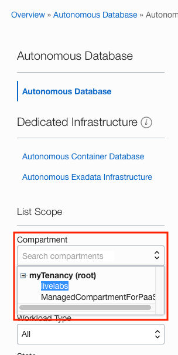

3. In the list of Autonomous Databases, find the **Livelabs ADB** database we created and click on the **Display Name**.

    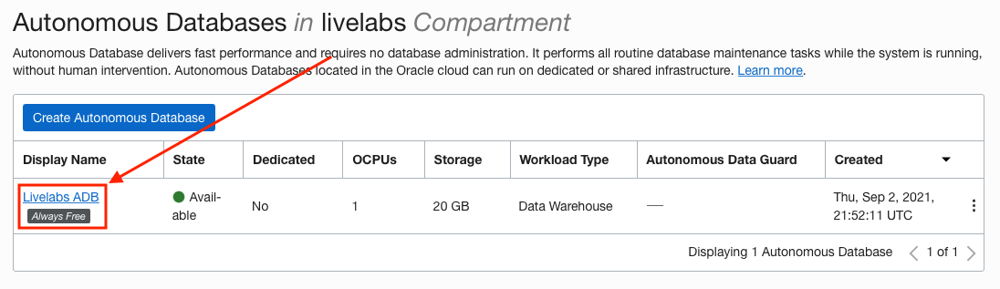

4. On the **Autonomous Database Details Page**, click the **DB Connection button** on the upper part of the page.

    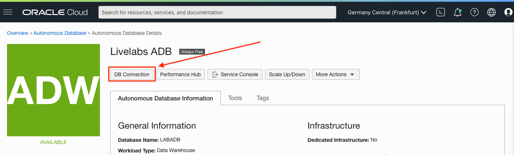


5. The **Database Connection slider** will appear. 

    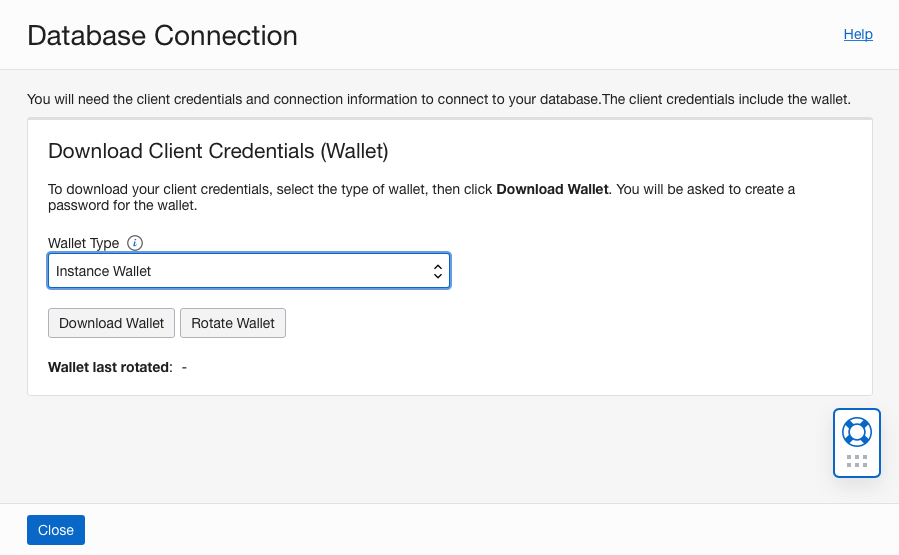

   Use this slider to set the **Wallet Type Select List** to **Instance Wallet**

    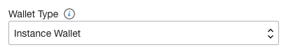

   and then click the **Download Wallet button**.

    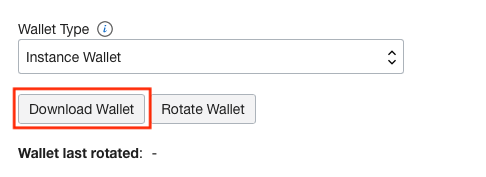

6. Using the **Download Wallet modal**, enter and confirm a password for the wallet and click **download**.

    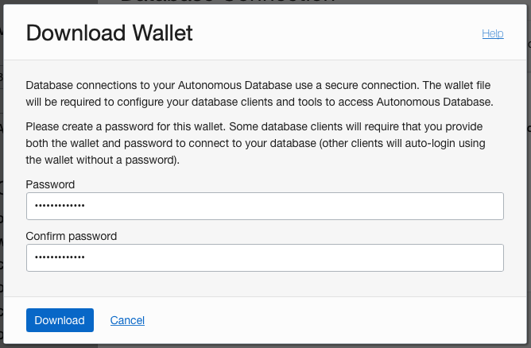

    Note where you saved this file and close the **Download Wallet modal** and then close the **Database Connection slider**.

7. Open an **OCI Cloud Shell session** if one is not already running.

    

8. In the cloud shell ensure you are in your home directory. You can do this by issuing a **cd** from the command prompt and then verifying you are in your home directory by issuing a *pwd* from the command prompt.

   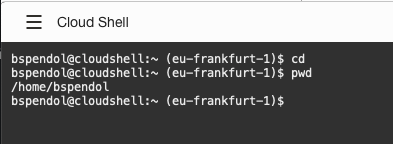

   the directory should be **/home/YOUR_USER_NAME**

9. Find where you saved the **Autonomous Database Wallet** on your local environment and **drag and drop it** into the **cloud shell window**.

   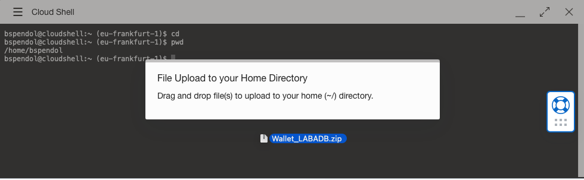

   and you will see the **upload progress** in the upper right of the cloud shell session window

   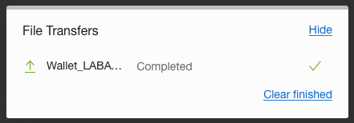

   When done, you can hide the progress window.

10. In your home directory, you can issue an **ls** at the cloud shell prompt to see the file.

      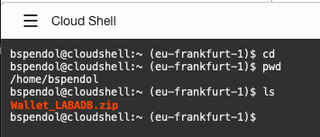

### Method 2: Download the wallet via OCI CLI

We can issue an OCI CLI command to download the Autonomous Database wallet. 

1. Use the OCI web console drop down menu to go to **Oracle Database** and then **Autonomous Database**.

    

2. On the Autonomous Database page, change your compartment to the livelabs compartment using the **Compartment** dropdown on the left side of the page.

    

3. In the list of Autonomous Databases, find the **Livelabs ADB** database we created and click on the **Display Name**.

    

4. Open an **OCI Cloud Shell session** if one is not already running.

    

5. At the cloud shell prompt, we will issue ab OCI CLI command using the autonomous-database generate-wallet api. 

   The format of the api is:

      ```
      oci db autonomous-database generate-wallet --autonomous-database-id ADB_OCID --file FILENAME.ZIP --password MY_PASSWORD
      ```

      where we supply the Autonomous Database OCID, a filename and a password.

6. At the **Cloud Shell prompt**, copy and paste the following to start building our command

      ````
      <copy>
      oci db autonomous-database generate-wallet --autonomous-database-id 
      </copy>
      ````
      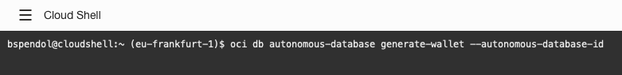


7. Using the **Autonomous Database Details Page**, click the **Copy** link next to the **OCID label** in the **Autonomous Database Information** section.

   

   and paste it into the cloud shell ensuring there is a space between --autonomous-database-id and the OCID you are pasting.

   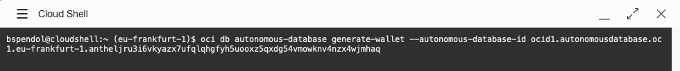

8. We can now add the rest of the command. **Copy and paste the following** into the cloud shell after the OCID you just pasted. Make sure there is a space between the OCID and the command we are about to paste in.

      ````
      <copy>
      --file Wallet_LABADB.zip --password S3cr3tPassw0rd!!
      </copy>
      ````

      when the command **looks like the following**

      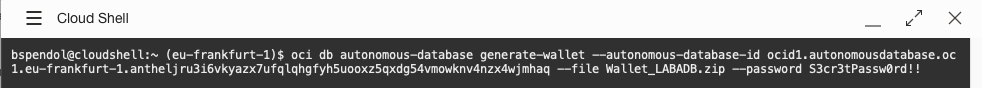

      press **enter** and you will see the **wallet download**

      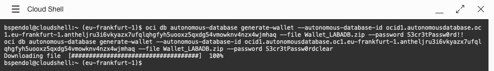

9. In your home directory, you can issue an **ls** at the cloud shell prompt to see the file.

   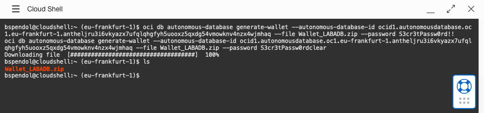


## Task 2: Login to your Autonomous Database with SQLcl

Once the Autonomous Database wallet is downloaded, is time to connect to the database.

1. At a **command line**, get back to your home directory if not already there. You can do this by issuing a **cd** at the command prompt.

      ````
      <copy>
      cd
      </copy>
      ````

      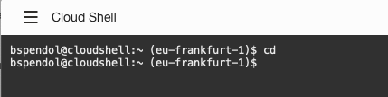

      then, **create a directory** at the Cloud Shell prompt with the following command

      ````
      <copy>
      mkdir livelabs
      </copy>
      ````

      

      move into the directory with a cd livelabs command at the Cloud Shell prompt

      ````
      <copy>
      cd livelabs
      </copy>
      ````

         

2. Now, issue a **pwd** at the command prompt to ensure you are in the correct directory

      ````
      <copy>
      pwd
      </copy>
      ````

      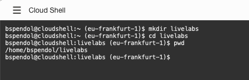

3. **Start SQLcl** but do not log into a database yet. SQLcl is already installed so all you need to do is issue the following command

      ````
      <copy>
      sql /nolog
      </copy>
      ````
      
      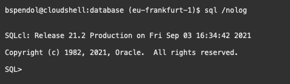

4. Next, we have to tell SQLcl where to look for the Autonomous Database wallet. Remember, we downloaded it in our home directory and we can use the following command to set its location. Just remember to replace USER_NAME with your username. You can look at previous commands we ran to find the exact location if needed.

      ````
      <copy>
      set cloudconfig /home/USER_NAME/Wallet_LABADB.zip
      </copy>
      ````
      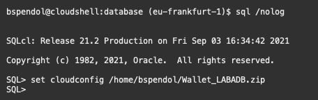

5. Time to connect to the database. The syntax is:

      ```
      SQL> conn USERNAME@DB_NAME_high/medium/low/tp/tpurgent
      ```
      The **high/medium/low/tp/tpurgent** provide different levels of performance for various clients or applications to connect into the database. From the documentation:

      - **tpurgent**: The highest priority application connection service for time critical transaction processing operations. This connection service supports manual parallelism.
      - **tp**: A typical application connection service for transaction processing operations. This connection service does not run with parallelism.
      - **high**: A high priority application connection service for reporting and batch operations. All operations run in parallel and are subject to queuing.
      - **medium**: A typical application connection service for reporting and batch operations. All operations run in parallel and are subject to queuing. Using this service the degree of parallelism is limited to four (4).
      - **low**: A lowest priority application connection service for reporting or batch processing operations. This connection service does not run with parallelism.

   With our database being named LABADB and connecting as the admin user, we would have the following connect command:

      ```
      SQL> conn admin@LABADB_high
      ```

      Run this command at your SQLcl command prompt

      ````
      <copy>
      conn admin@LABADB_high
      </copy>
      ````  
      
      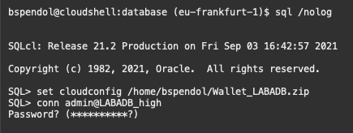

      And then provide the password you used when creating the Autonomous Database at the password prompt and press enter

      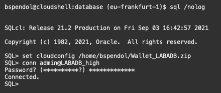

      You should now be connected to the database.

      If you **did not** set the wallet location with the cloudconfig command, you will see an error similar to the following:

      ```
      SQL> conn admin@LABADB_high
         Password? (**********?) **************
         USER          = admin
         URL           = jdbc:oracle:thin:@LABADB_high
         Error Message = IO Error: Unknown host specified  (CONNECTION_ID=SFPhQvISQv2G/WV4VNMOjA==)
         USER          = admin
         URL           = jdbc:oracle:thin:@LABADB_high:1521/LABADB_high
         Error Message = IO Error: Unknown host specified  (CONNECTION_ID=lCiUbeENR4a/9HZDREoVIg==)
      ```   

      Just go back a step and set the wallet location.

6. Time to **create a schema/user**, give that schema some **permissions** and then **create database objects**

   Run the following commands at our SQLcl prompt to create and configure the livelabs user

      ````
      <copy>
      create user livelabs identified by "PAssw0rd11##11" quota unlimited on data;
      </copy>
      ````  

      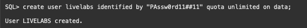

      Give our livelabs users some permissions to connect and create objects in the database

      ````
      <copy>
      grant connect, resource to livelabs;
      </copy>
      ````  
      
      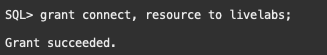
 

7. Now we are going to connect as the livelabs user. Issue the following command at the SQLcl prompt

      ````
      <copy>
      conn livelabs@LABADB_high
      </copy>
      ```` 
      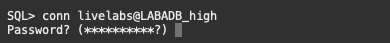

      And then provide the password we used to create the user at the password prompt.

      ````
      <copy>
      PAssw0rd11##11
      </copy>
      ```` 
      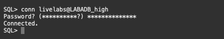
 
8. So we don't take any schema specific storage or DDL information, run the following at the SQLcl prompt.

      ````
      <copy>
      set ddl storage off
      set ddl segment_attributes off
      set ddl tablespace off
      </copy>
      ```` 
      

9. It's time to create some database objects. Run the following code.

   **Create a table**

      ````
      <copy>
      CREATE TABLE trees
         ( tree_id           NUMBER(6)
         , tree_name         VARCHAR2(200)
         , tree_street       VARCHAR2(500)
         , tree_city         VARCHAR2(200)
         , tree_state        VARCHAR2(200)
         , tree_zip          NUMBER
         , tree_description  VARCHAR2(4000)
         , submitter_name    VARCHAR2(500)
         , submitter_email   VARCHAR2(500)
         , submition_date    timestamp
         ) ;
      </copy>
      ```` 

      **Create a procedure**
      ````
      <copy>
      CREATE OR REPLACE PROCEDURE admin_email_set
      IS
      BEGIN
            update trees
               set submitter_email = 'jeff@thatjeff.com'
            where submitter_email is null;

      end admin_email_set;
      /
      </copy>
      ```` 

      **Create an index**
      ````
      <copy>
      CREATE UNIQUE INDEX tree_id_pk
      ON trees (tree_id);
      </copy>
      ```` 

      **Insert some data**
      ````
      <copy>
      PROMPT INSERTING into TREES
      set define off
      begin
      INSERT INTO trees VALUES 
            ( 1
            , 'Cool Tree'
            , '43 West Street'
            , 'Cary'
            , 'NC'
            , 27511
            , 'This tree is super cool'
            , 'Jeff'
            , 'jeff@thatjeff.com'
            , systimestamp
            );
      INSERT INTO trees VALUES 
            ( 2
            , 'Christmas Tree red cedar'
            , '112 Wilkinson Ave'
            , 'Cary'
            , 'NC'
            , 27511
            , 'Its about 25 feet tall'
            , 'Jeff'
            , 'jeff@thatjeff.com'
            , systimestamp
            );
      INSERT INTO trees VALUES 
            ( 3
            , 'Dawn Redwood tree'
            , '313 N Academy St'
            , 'Cary'
            , 'NC'
            , 27511
            , 'These 15 beautiful trees are not Cypress, they are Dawn Redwoods'
            , 'Jeff'
            , 'jeff@thatjeff.com'
            , systimestamp
            );
      INSERT INTO trees VALUES 
            ( 4
            , 'Blackjack Oak at the Arts Center'
            , '101 Dry Ave'
            , 'Cary'
            , 'NC'
            , 27511
            , 'At one time (approximately 1992 to 2011) the Capital Trees Program recorded and listed the champion trees in Wake County.'
            , 'Jeff'
            , 'jeff@thatjeff.com'
            , systimestamp
            );
      INSERT INTO trees VALUES 
            ( 5
            , 'Test Tree'
            , '4 East Street'
            , 'Cary'
            , 'NC'
            , 27511
            , 'Test Tree please delete'
            , 'Jeff'
            , 'jeff@thatjeff.com'
            , systimestamp
            );
      INSERT INTO trees VALUES 
            ( 6
            , 'Tree with Cat'
            , '2220 W Marilyn Cir'
            , 'Cary'
            , 'NC'
            , 27511
            , 'Tree with a cat in it'
            , 'Jeff'
            , 'jeff@thatjeff.com'
            , systimestamp
            );        
      end;
      /
      </copy>
      ```` 


      To verify the code was successful, we can count the records from the trees table. Copy and run the following SQL Statement at the SQLcl prompt.
      ````
      <copy>
      select count(*) from trees;
      </copy>
      ```` 

      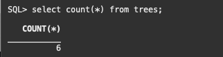

10. While **still logged into the database as our livelabs user**, we are going to use SQLcl to take a baseline of the objects in this schema. To do this, we issue a **Liquibase command at the SQLcl prompt**. The command **lb genschema -split** will pull all the Data Definition Language (DDL) for our database objects and put them into folders that correspond to their types (tables, indexes, triggers, etc). **Copy and paste the following command** then press enter.

      ````
      <copy>
      lb genschema -split
      </copy>
      ```` 
      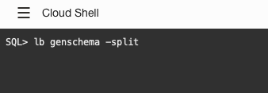

## Task 3: Create a new schema and apply the code with SQLcl

1. To simulate applying our code in a new database without needing to create a new database we can use a new schema. We will be creating this new schema/user just as we did previously with our livelabs user. **Connect as the admin user** by issuing the following command at the SQLcl prompt

      ````
      <copy>
      conn admin@LABADB_high
      </copy>
      ```` 
      

      And then provide the password you used when creating the Autonomous Database at the password prompt and press enter

      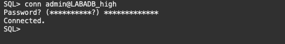

      You should now be connected to the database.


5. Next, we will **create a new schema** to apply out code base to. Run the following command at the SQLcl prompt.

      ````
      <copy>
      create user dbuser identified by "PAssw0rd11##11" quota unlimited on data;
      </copy>
      ```` 

      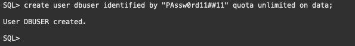

      and grant that user some roles so they can connect to the database and create objects.

      ````
      <copy>
      grant connect, resource to dbuser;
      </copy>
      ```` 

      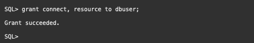

6. We do not need to log out of SQLcl and log back in to change users. All you need to do is **issue a connect command**. Use the following command to log into the database as our new user.

      ````
      <copy>
      conn dbuser@LABADB_high
      </copy>
      ```` 
      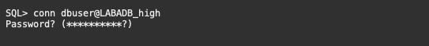

      And then provide the password we used to create the user at the password prompt.

      ````
      <copy>
      PAssw0rd11##11
      </copy>
      ```` 
      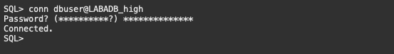

7. We can apply the code base we created in this schema with the following Liquibase command: **lb update -changelog controller.xml**. Now run this command at your SQLcl prompt.

      ````
      <copy>
      lb update -changelog controller.xml
      </copy>
      ```` 
      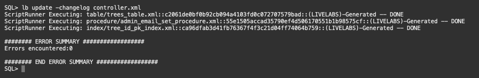

8. While still at the SQLcl prompt, we can issue a tables command and see our trees table as well as the tables Liquibase uses to apply and track our database changes.

      ````
      <copy>
      tables
      </copy>
      ```` 

      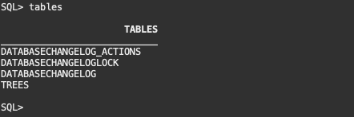

      You now have a new schema that has all the objects from our livelabs schema we can use in our upcoming change management tasks in the next sections of this lab.

## Acknowledgements

- **Authors** - Jeff Smith, Distinguished Product Manager and Brian Spendolini, Trainee Product Manager
- **Last Updated By/Date** - Brian Spendolini, September 2021