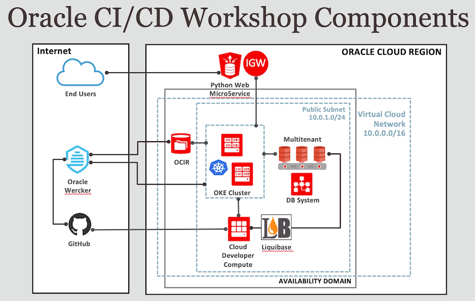

# CI/CD Pipeline with Oracle Database and Python

## Workshop Overview

**Continuous Integration (CI)** refers to the practice of frequently merging new software using a single line of code we call master branch. **Continuous Delivery (CD)** refers to the release of packaged software, modules, or features in frequent cycles. Likewise, **Continuous Deployment (CD)** refers to the deployment these software packages/modules/features to a production platform in frequent cycles.

>**Note** : Even though there are two CDs in the title (CI/CD/CD), only one is used in the acronym (CI/CD).

At a very high level, a CI/CD pipeline usually consists of the following five main steps:

1. **Commit** — When a developer finishes the work on a small change to an application, the code is committed and merged to a central source code repository.
2. **Build** — The change is checked out and verified to make sure the software can be run by a computer. This steps includes all dependencies, based on what programming language, set of libraries, and platform are used.
3. **Automated tests** — The change is tested from multiple angles using unit tests written by developers and testing tools, to ensure the change works and that it doesn't break anything else.
4. **Deliver** — Release new changes, automatically prepared for a production deployment, and make them available to end users on software repository.
5. **Deploy** — The built version is deployed to pre-production, or even production environment.

The entire workflow, and all pipelines are fully automated. This automation auto-magically converts a single commit by a developer into an update to production a few hours later.

Estimated Lab Time:  minutes

## Workshop Requirements

* Access to Oracle Cloud Infrastructure
    * Provided by the instructor for instructor-led workshops
* Access to a laptop or a desktop
    * Requires Microsoft Remote Desktop software
* Knowledge of Python is a plus but not required
* No previous knowledge of machine learning required

## Workshop Components

## Agenda

- **Lab 1 : Oracle Cloud Infrastructure (OCI)**
- **Lab 2 : GitHub Code Repository**
- **Lab 3 : Oracle Wercker CI Service**
- **Lab 4 : Oracle Database for Python**
- **Lab 5 : Push Docker Image to Registry (OCIR)**
- **Lab 6 : Deploy Python App on Container Cluster (OKE)**
- **Lab 7 : Oracle Database Changes in CI/CD Workflow**

## Access the Labs

- Use **Lab Contents** menu on your right to access the labs.
    - If the menu is not displayed, click the menu button  on the top right  make it visible.

- From the menu, click on the lab that you like to proceed with. For example, if you like to proceed to **Lab 1**, click **Lab 1 : Oracle Cloud Infrastructure (OCI)**.

- You may close the menu by clicking 

## Acknowledgements

- **Author** - Valentin Leonard Tabacaru
- **Last Updated By/Date** - Valentin Leonard Tabacaru, Principal Product Manager, DB Product Management, May 2020

## Need Help?
Please submit feedback or ask for help using our [LiveLabs Support Forum](https://community.oracle.com/tech/developers/categories/livelabsdiscussions). Please click the **Log In** button and login using your Oracle Account. Click the **Ask A Question** button to the left to start a *New Discussion* or *Ask a Question*.  Please include your workshop name and lab name.  You can also include screenshots and attach files.  Engage directly with the author of the workshop.

If you do not have an Oracle Account, click [here](https://profile.oracle.com/myprofile/account/create-account.jspx) to create one.

