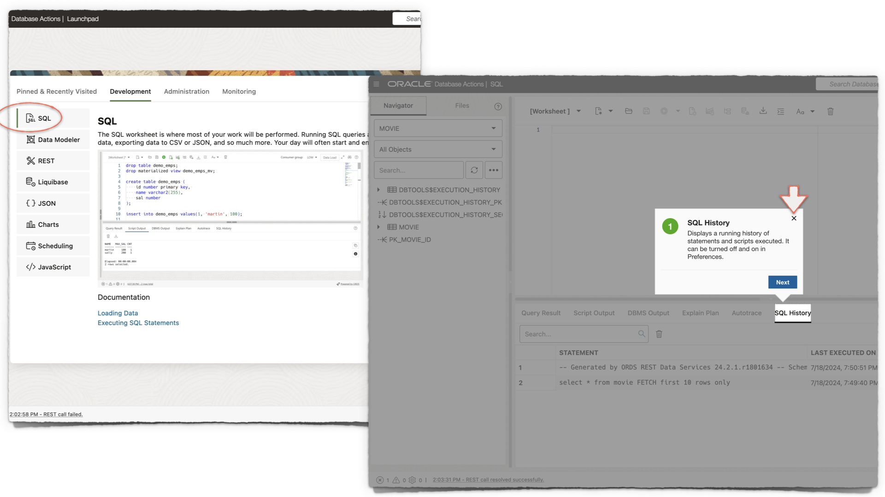
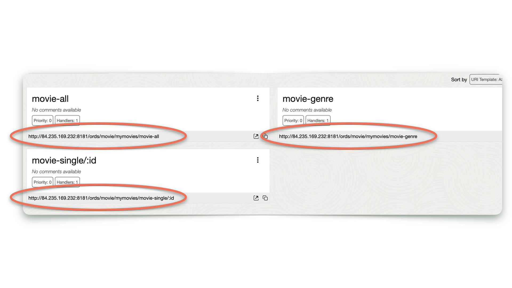
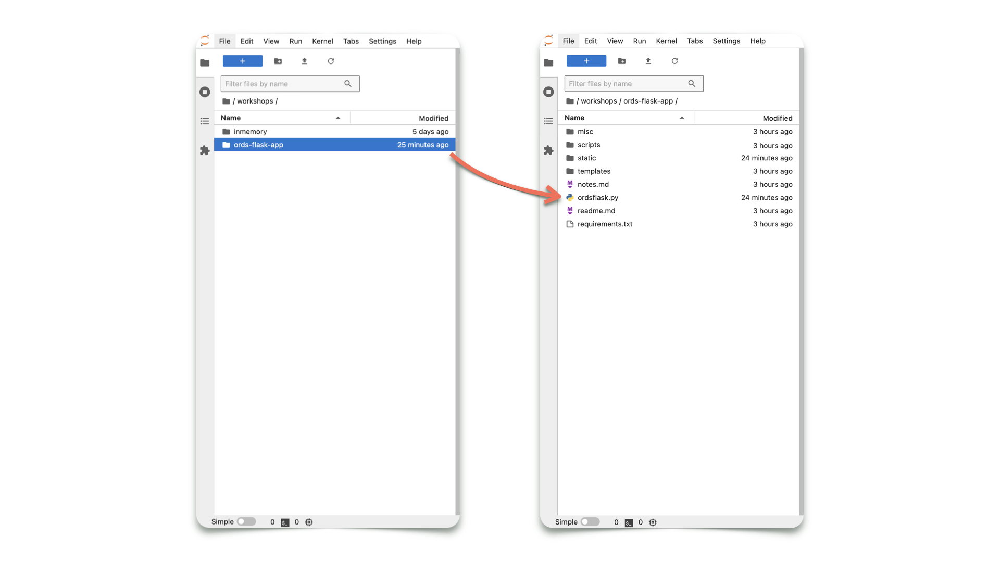
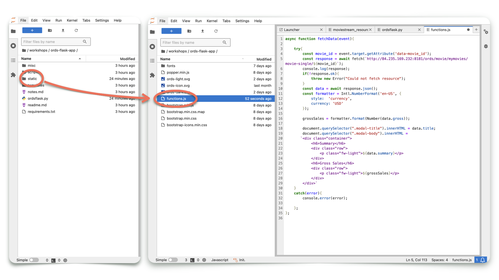
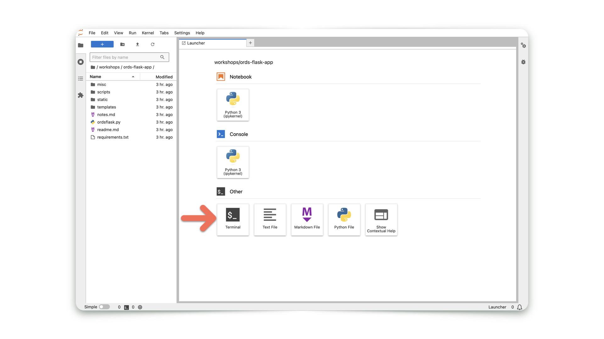
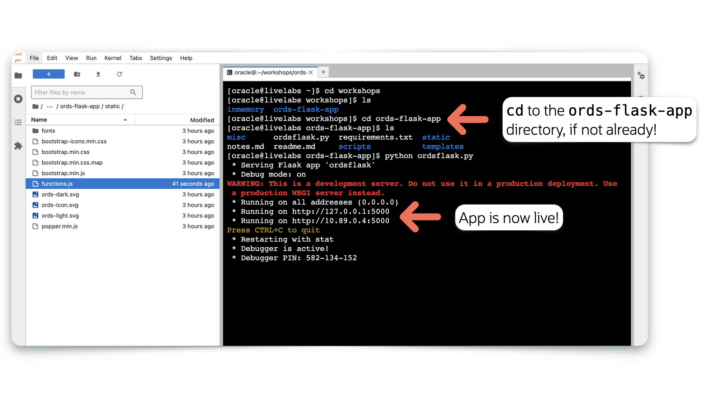
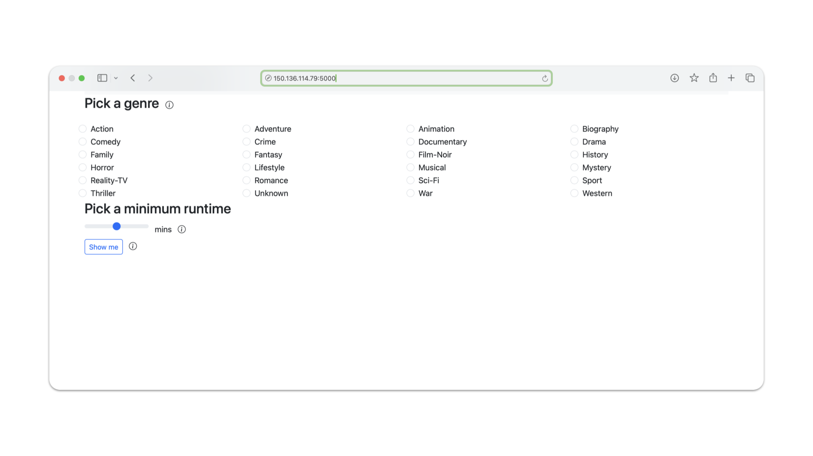

# Get Started

## Introduction

You have been provided with access to a Database Actions (*aka* SQL Developer Web), as well as a Jupyter Lab.

In this lab, you will configure your sample application, and then execute commands to start-up this sample application.

Some experience in shell commands, Python, JavaScript, and HTML are helpful but not necessary. Altough, we've designed this workshop so even the beginner can complete it!

Estimated Time: 10 minutes

### Objectives

In this lab, you will:

* Sign in to Database Actions as the `MOVIE` user
* Create your ORDS APIs with the provided scripts
* Add your ORDS APIs to your project's files
* Start-up a simple ORDS + Python application

### Prerequisites

* Access to a LiveLabs-provided sandbox environment
* Access to Database Actions
* Beginner-level experience in Python, HTML, and Integrated Developer Environments

This lab assumes you have:

* An Oracle account
* All previous labs successfully completed

## Task 1: Database Actions, Part I

1. You have been provided various URLs. One for accessing Database Actions, and another one for accessing a Jupyter lab. First, navigate to Database Actions using the provided URL. You can find these details by clicking **View Login Info** near the top of the Workshop outline.

   

      > **NOTE:** Should you experience some difficulty with copy and paste actions. Depending on the context, you may need
      > to alternate between on-screen `copy` buttons, right-click mouse menu options, and keyboard shortcuts.
      >
      > Highlighting a text value and using keyboard commands is considered a best approach for environments such as this:
      >
      > |       | Copy | Paste |
      > | ----- | ---- | ----- |
      > | macOS | `CMD + C` | `CMD + V` |
      > | Linux | `CTRL + SHIFT + C` | `CTRL + SHIFT + V` |
      > | Windows | `CTRL + C` | `CTRL + V` |

   

2. Several users have been created for you, including a new `MOVIE` user. Its schema has already been REST-enabled, meaning you will be able to Sign in to Database Actions.  

    > **NOTE:** Depending on your lab configuration, you may be redirected to a SQL Developer Web Sign-in screen rather than the Oracle REST Data Services "landing page." In such cases, simply Sign in with the `MOVIE` user's credentials.

   To Sign in, click the <button type="button" style="pointer-events: none;">Go</button> button under the SQL Developer Web card.

   

   Once the Sign-in screen appears, enter the following credentials, and click the <button type="button" style="pointer-events: none;">Sign-in</button> button:

   &nbsp;&nbsp;&nbsp;&nbsp;&nbsp;&nbsp;&nbsp;&nbsp;Username: `MOVIE`  
   &nbsp;&nbsp;&nbsp;&nbsp;&nbsp;&nbsp;&nbsp;&nbsp;Password: `[Can be found in your Reservation details - see image in Step 1 for reference]`
  
3. The Database Actions Launchpad will appear. Navigate to the `Development` category, then click `SQL`. A blank SQL Worksheet will appear.

   

      > **NOTE:** If this is your first time visiting the SQL Worksheet, a guided tour will appear. You may continue with the tour, or click the <button type="button" style="pointer-events: none;">X</button> (as seen in the image) to exit the tour.

4. You'll notice a `MOVIE` table has already been created for you. This table has also been pre-populated with movie data.

   To view a sample of the table's data<span class="fa fa-file-play" aria-hidden="true"></span> copy and paste the following SQL statement into the SQL Worksheet and click then `Run Statement` icon.

      ```sql
      <copy>
      SELECT * FROM MOVIE FETCH FIRST 10 ROWS ONLY;
      </copy>
      ```

   

   You will see results similar to the following image:

   

5. You may notice the varied data types in this table. To take a closer look at how this `MOVIE` table is structured, right-click on the `MOVIE` table, then select `Edit...`. When the `Table Properties` slider appears, click `DDL`, then select the `Create` tab.  

   Note the data types:

   

      > **NOTE:** ORDS APIs will be able to handle all of these various data types and send them to your application.

6. Once you are satisfied, return to the Reservation information for this workshop.

   

## Task 2: Jupyter lab, Part I

1. Using the URL you were provided, log in to your Jupyter lab. *It is recommended you open the Juptyer Lab in a new tab or window.*

   

   Use the same password from the previous task.

   
  
2. Once logged in, you may see several directories. Navigate (i.e., a double or single click on the directory) to the `workshops` directory, then the `ords-flask-app` directory.

   

3. Next, navigate to the `scripts` directory, then open the `moviestream_resource_module_definitions.sql` file.  

    > **TIP:** You may open a file by clicking on the file name *or* right-clicking a file and choose to "Open with > Editor".  
    >
    > 

   This file contains the definitions for your Resource Module, Templates, and Handlers, which are your ORDS APIs.  

   
   *Navigate to `ords-flask-app` then `scripts` then `moviestream_resource_module_definitions.sql`*

4. Select all contents and copy the contents to your clipboard. Then, return to the SQL Worksheet.

    > **TIP:** Refer to Task 1, Step 1 for keyboard shortcuts for copy and paste actions.

   

## Task 3: Database Actions, Part II

1. Navigate to the SQL Worksheet. Then paste (easily done with keyboard shortcuts) the contents of the `moviestream_resource_module_definitions.sql` file to the SQL Worksheet.

   
  
2. Click the `Run Script` icon. Upon completion, a `PL/SQL procedure successfully completed` message will appear in the `Script Output` tab.

   

3. You've just created the ORDS APIs for the `Movie` user. To review the Resource Module, its Resource Templates and Resource Handlers, navigate to the REST Workshop.

   Click the hamburger menu from the top of Database Actions, then click REST.  

      

4. You'll notice a single Module in the Workshop's Object panel. Click it, then click the `moviestream` card.

   

5. You'll now see the newly created Resource Templates. Each Template contains a single `GET` Resource Handler. These are your ORDS APIs; you'll rely on them to feed data to your application.

   

6. Next, copy each of these URI's to your clipboard. In a few moments, you will return to the Jupyter lab to input these into the application code.

   

## Task 4: Jupyter Lab, Part II

1. Navigate back to the Jupyter lab. Once again, locate the `ords-flask-app` directory. Then click on the `ordsflask.py` file to open it.

   

     > You will notice two request variables, `r1` and `r2`. They will both have temporary, placeholder URIs.

2. Replace the `r1` temporary URI with the one you captured in the previous lab. The ORDS URI ending in `/movie-genre` will go here.  

   
   *Refer to ~ Line 21 in the Editor.*  

      > **NOTE:** This should be in the form of: `http://Your Lab's IP:Your Lab's Port Number/ords/movie/mymovies/movie-genre`. Make sure you double-quote the URI; as can be seen in the image below.  

   
   *At or near Line 21, should look similar to the above image.*

3. Next, replace the `/r2` temporary URI with the `/movie-all` URI.

   
   *Refer to ~ Line 73 in the Editor.*  

     > **NOTE:** This should be in the form of: `http://Your Lab's IP:Your Lab's Port Number/ords/movie/mymovies/movie-all`. Make sure you double-quote the URI and retain the `params=data1` portion as can be seen in the image below.

   
   *At or near Line 73, should look similar to the above image.*

4. Verify that your `r1` and `r2` variables are structured like those in the image. Then, save your changes.

5. Next, locate the `static` directory, then open the `functions.js` file. Here, you will see another ORDS URI placeholder at or near Line 12.  

   

6. Replace it with your `/movie-single/:id` URI.

   

7. Verify that your `const response = ...` is structured exactly as the image shows (your URI will differ). Then, save your changes.  

   > **NOTE:** This should be in the form of: `http://Your Lab's IP:Your Lab's Port Number/ords/movie/mymovies/movie-single/${movie_id}`. Make sure you
   > remove the ORDS-provided `:id` portion of the URI. The JavaScript `Fetch()` API requires the *new* URI to be structured this way. Compare your new
   > URI to the one in the image, it should look similar.

   

## Task 5: Start the Flask application

1. From the Jupyter Launcher, open a new Terminal.  

   > **NOTE:** If a new Launcher window is not present, you can click the Blue Box (the box with the `+` inside) to open a new Launcher. Then you may 
   > open a new Terminal.

     

2. Verify you are in the correct directory by:  

    1. First issuing the **`cd workshops`** command.
    2. You may then issue the **`ls`** command to list the files and directories in the `workshops` directory.
    3. Next issue the **`cd ords-flask-app`** command to enter into the `ords-flask-app` directory.

3. Next, issue the following command:

      ```sh
      <copy>python ordsflask.py</copy>
      ```

    
    *The Flask development server will start up.*

4. Your application will be available on port `5000`. However, you will need to open the application in a new tab. Modify the URL, so you are using the one provided to you for this lab *plus* port `5000`.  

     

   
   *Open in a new tab or window.*

5. Navigate to the new tab and combine the lab's URI with port `5000`. Accept any warnings and your application will load.

   

6. The ORDS application will load.  

   

7. With the application running, we'll next explore the ORDS APIs and how they feed data to your application.

8. You may now [proceed to the next lab](#next).  

## Learn More

* [ORDS RESTful services terminology](https://docs.oracle.com/en/database/oracle/oracle-rest-data-services/24.2/orddg/developing-REST-applications.html#GUID-50E24524-32BB-470D-8015-6C25C9B47A44)
* [Flask installation and configuration](https://flask.palletsprojects.com/en/3.0.x/installation/)
* [Visual Studio Code Flask tutorial](https://code.visualstudio.com/docs/python/tutorial-flask)

## Acknowledgements

* **Author** - Chris Hoina, Senior Product Manager, Database Tools
* **Contributors** -  Jeff Smith, Distinguished Product Manager, Database Tools
* **Last Updated By/Date** - Chris Hoina, Database Tools, August 2024
