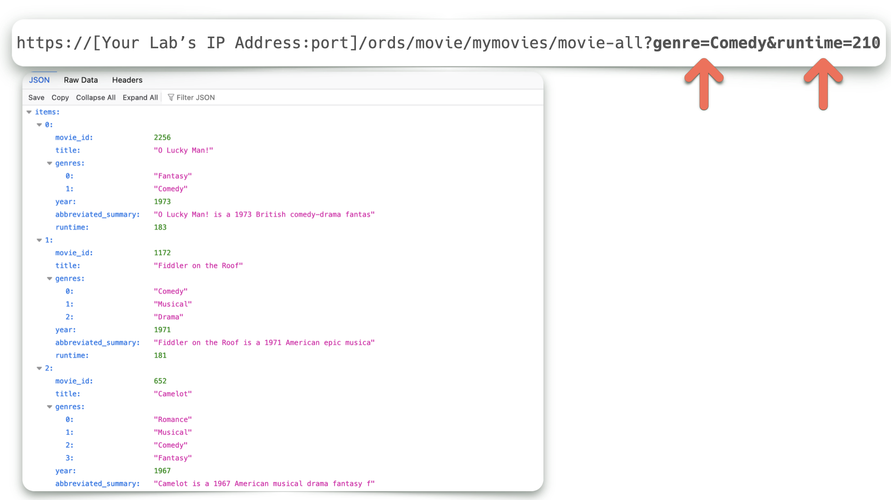
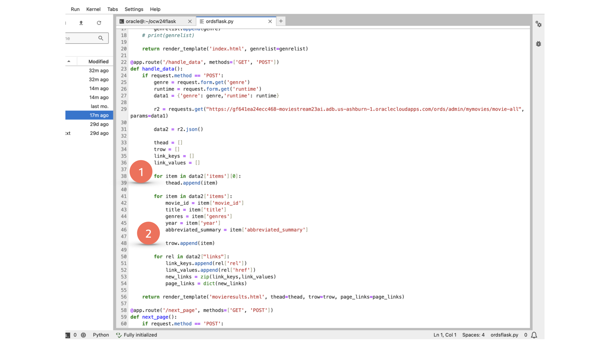

# Bind and Query parameters with ORDS Resource Handlers

## Introduction

You can include parameters in your ORDS APIs. In this lab you will explore how this is done in an example that uses two input parameters. You'll also observe how we have introduced the `json_exists` function into a Resource Handler.

Estimated Time: 20 minutes

### Objectives

In this lab, you will:

* Execute Resource Handler code for the `/movie-all` API
* Explore bind parameters in an ORDS API
* Manually append query parameters into the `/movie-all` ORDS URI

### Prerequisites (Optional)

This lab assumes you have:

* An Oracle account
* All previous labs successfully completed

  > **Note:** If you have a **Free Trial** account, when your Free Trial expires your account will be converted to an **Always Free** account. You will not be able to conduct Free Tier workshops unless the Always Free environment is available. **[Click here for the Free Tier FAQ page.](https://www.oracle.com/cloud/free/faq.html)**

## Task 1: Navigate to the `/movie-all` endpoint

1. From the Database Actions LaunchPad, navigate to the Development category, then the REST section.

     

2. Next, click the `Modules` tile, followed by the `moviestream` Resource Module.

    

    

3. Next, select the `movie-all` Resource Template followed by the `movie-all` Resource Handler.

    

    

## Task 2: Explore the `/movie-all` Resource Handler code

1. Observe the following SQL in the **Source** section.

    ```sql
    SELECT movie_id, title, genres, year, SUBSTR(SUMMARY, 0,50) abbreviated_summary, runtime
    FROM
      MOVIE WHERE JSON_EXISTS(genres, '$[*]?(@ == $v1)'
                      PASSING :genre as "v1")
      AND RUNTIME <= :runtime
      ORDER BY RUNTIME DESC
    ```

2. If you recall from previous Live Labs, you'll recognize this `MOVIE` table. It is comprised of various data types. One such is the `JSON` datatype. In this example, you'll see how ORDS can REST-enable functions such as `JSON_EXISTS`.

    

3. Click the Start icon, to test this Resource Handler source code. When the Bind Variables dialog appears, enter `Comedy` in the `genre` field and `210` in the `runtime` field.

    

4. In the Query results section, you'll notice ORDS has executed the SQL, only returning the movies who have "Comedy" included in the genres column, as well as a runtime of 210 minutes or less.

  

   You've just simulated what a user might select in this sample application.  

   In the REST Workshop:  

     

   In the application:  

   

## Task 3: Using Query Parameters in and ORDS URI

1. The application code might look something like the following image. In this case, the Python `Results` library is used to perform a `GET` request on this ORDS endpoint.

    

    

2. These user selections are passed as Query Parameters - that is, appended to the end of the ORDS URI with the following format:

   

    ```html
    <copy>http://[Your ORDS URI]:[Your Labs' Port Number]/ords/movie/mymovies/movie-all?genre=Comedy&runtime=210</copy>
    ```

3. Use the above URI as a reference. Navigate to your web browser (changing the details specific to your environment) to review the `JSON` representation of this data.  

   > **NOTE:** You must use the PORT number that is used for the ORDS URIs in your Database Actions REST Workshop. Navigate to Database Actions then the REST Workshop to verify you are capturing the correct URI. **DO NOT** use port `5000`, as that is reserved for your Flask application.

   

## Task 4: Putting it all together

1. In this sample application, two lists are created for the subsequent movie table results (also referred to as `movieresults.html`). One list created for table headers, another for the table row data. ORDS supplies these `For` loops with the necessary data. The following image identifies these two sections in the Python code.

     > **Note:** You can review files directly from the Jupyter Lab by right-clicking an object. Choose `Open With` followed by `Editor`.
     > 

     

2. Once the `movieresults.html` page loads, you'll notice two additional features. Each row in the table contains a `More` modal, click it to reveal additional movie details.

   

   Near the end of the `movieresults.html` page you'll find `Previous` and `Next` links. In a later lab we'll explore how ORDS can simplify result pagination.

   

3. In the next lab, you'll explore another ORDS endpoint; this one responsible for feeding the modals information related to its target table row.

You may now [proceed to the next lab](#next).  

## Learn More

* [About the JSON_EXISTS condition](https://docs.oracle.com/en/database/oracle/oracle-database/19/adjsn/condition-JSON_EXISTS.html#GUID-D60A7E52-8819-4D33-AEDB-223AB7BDE60A)
* [About ORDS implicit parameters](https://docs.oracle.com/en/database/oracle/oracle-rest-data-services/24.2/orddg/developing-REST-applications.html#GUID-50E24524-32BB-470D-8015-6C25C9B47A44)
* [Passing parameters in ORDS](https://docs.oracle.com/en/database/oracle/oracle-rest-data-services/24.2/orddg/developing-REST-applications.html#GUID-50E24524-32BB-470D-8015-6C25C9B47A44)

## Acknowledgements

* **Author** - Chris Hoina, Senior Product Manager, Database Tools
* **Contributors** - Jeff Smith, Distinguished Product Manager, Database Tools
* **Last Updated By/Date** - Chris Hoina, Database Tools, July 2024
