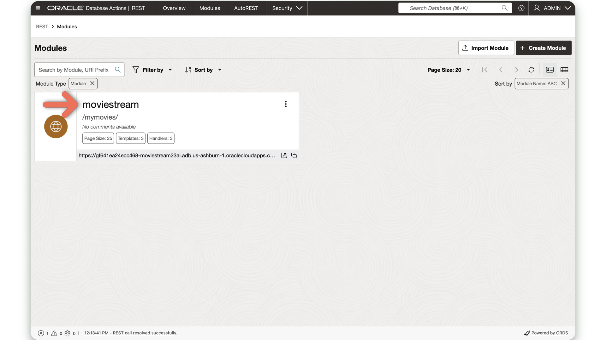
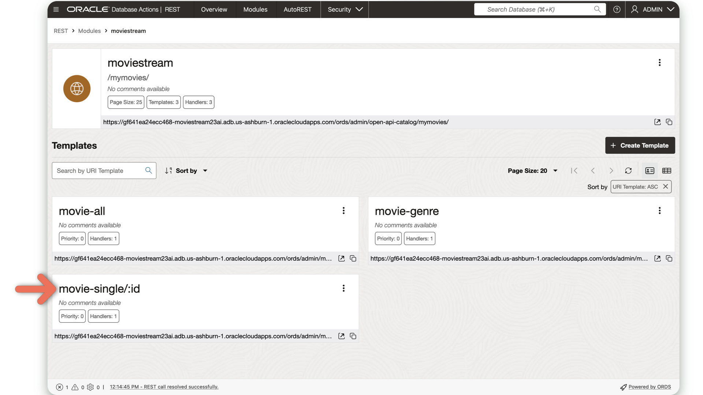
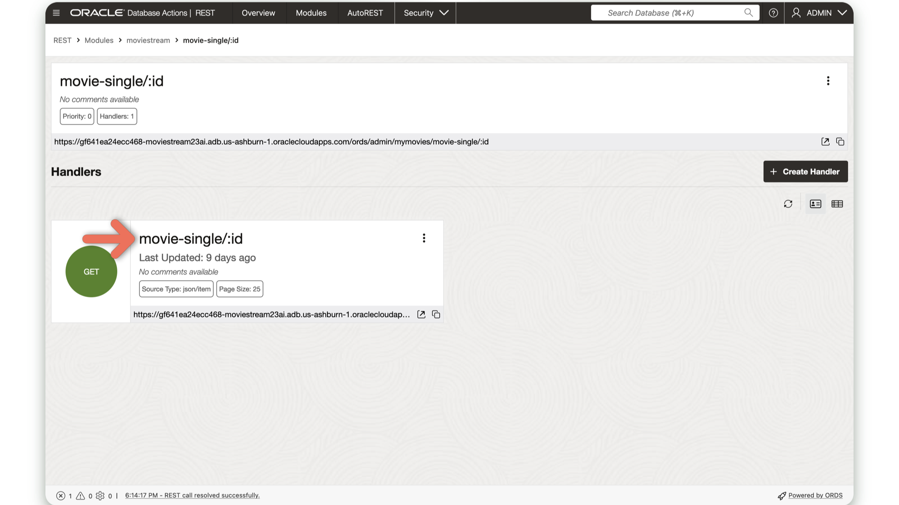
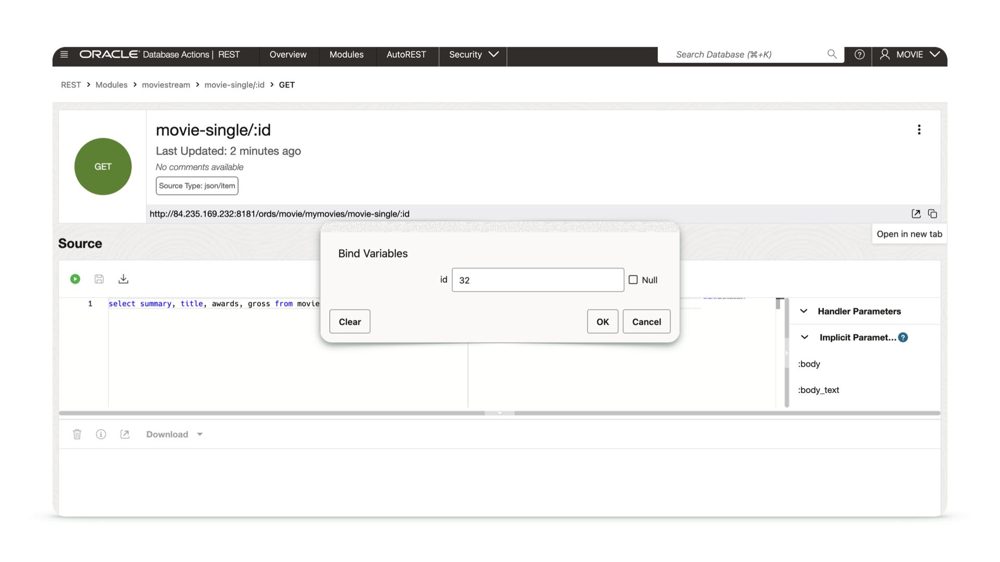
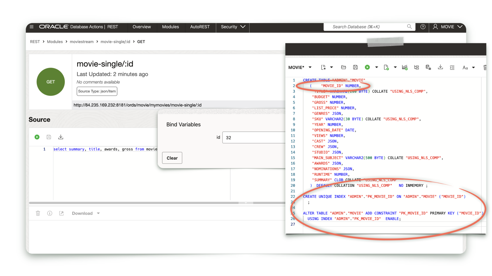
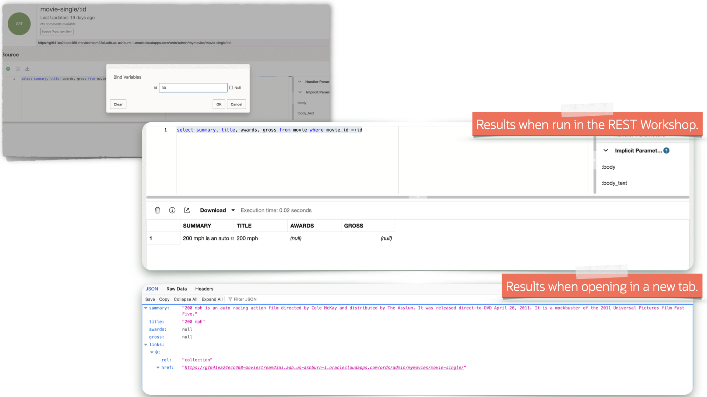

# ORDS URI Route Patterns

## Introduction

This lab will introduce to Route Patterns and how you can include them in your ORDS Resource Handlers.

Estimated Time: 20 minutes

### Objectives

In this lab, you will:

* Explore ORDS Route Patterns
* Test a sample ORDS Route Pattern
* Review the `/movie-single/:id` ORDS endpoint

### Prerequisites (Optional)

This lab assumes you have:

* An Oracle account
* All previous labs successfully completed

  > **Note:** If you have a **Free Trial** account, when your Free Trial expires your account will be converted to an **Always Free** account. You will not be able to conduct Free Tier workshops unless the Always Free environment is available. **[Click here for the Free Tier FAQ page.](https://www.oracle.com/cloud/free/faq.html)**

## Task 1: Navigate to the `/movie-single/:id` endpoint

1. From the Database Actions LaunchPad, navigate to the Development category, then the REST section.

    

2. Next, click the `Modules` tile, followed by the `moviestream` Resource Module.

    

    

3. Next, select the `movie-single/:id` Resource Template followed by the `movie-single/:id` Resource Handler.

    

    

## Task 2: Explore the `/movie-single/:id` Resource Handler code

1. Observe the following SQL in the **Source** section.

    ```sql
    <copy>SELECT SUMMARY, TITLE, AWARDS, GROSS FROM MOVIE WHERE MOVIE_ID = :ID
    </copy>
    ```

2. You can test this endpoint one of two ways: clicking the <svg xmlns="http://www.w3.org/2000/svg" width="16" height="16" fill="currentColor" class="bi bi-play-circle-fill" viewBox="0 0 16 16"><path d="M16 8A8 8 0 1 1 0 8a8 8 0 0 1 16 0M6.79 5.093A.5.5 0 0 0 6 5.5v5a.5.5 0 0 0 .79.407l3.5-2.5a.5.5 0 0 0 0-.814z" focusable="false"/></svg> Start icon or opening the results in <svg xmlns="http://www.w3.org/2000/svg" width="16" height="16" fill="currentColor" class="bi bi-box-arrow-up-right" viewBox="0 0 16 16"><path fill-rule="evenodd" d="M8.636 3.5a.5.5 0 0 0-.5-.5H1.5A1.5 1.5 0 0 0 0 4.5v10A1.5 1.5 0 0 0 1.5 16h10a1.5 1.5 0 0 0 1.5-1.5V7.864a.5.5 0 0 0-1 0V14.5a.5.5 0 0 1-.5.5h-10a.5.5 0 0 1-.5-.5v-10a.5.5 0 0 1 .5-.5h6.636a.5.5 0 0 0 .5-.5"/><path fill-rule="evenodd" d="M16 .5a.5.5 0 0 0-.5-.5h-5a.5.5 0 0 0 0 1h3.793L6.146 9.146a.5.5 0 1 0 .708.708L15 1.707V5.5a.5.5 0 0 0 1 0z" focusable="false"></svg> a new tab.

   

   A dialog will appear, choose any number between `0` and `3800`.

      

   Notice the query results. The `MOVIE_ID` column matches the same number you selected in the Bind variable dialog.

      

   Depending on how you chose to review the results of ORDS endpoint, your results should look similar to the following:

      

3. If it isn't obvious, you should recognize some of the data included in both the `JSON` document and Handler source results (depending on which option you chose to view the results). But instead of being displayed like the above, you've previously seen it displayed in the sample application as a modal. Like this:

    

## Task 3: Putting it all together

1. You've now seen how this ORDS endpoint works. You've also seen the output in several different presentations. Next we'll explore how easy it is to add this ORDS endpoint into an application's code.

2. After a user selects their movie preferences, they are then redirected to a movie results table (i.e., the `movieresults.html` page). From there, the user can click any of the <svg xmlns="http://www.w3.org/2000/svg" width="16" height="16" fill="currentColor" class="bi bi-plus" viewBox="0 0 16 16"><path d="M8 4a.5.5 0 0 1 .5.5v3h3a.5.5 0 0 1 0 1h-3v3a.5.5 0 0 1-1 0v-3h-3a.5.5 0 0 1 0-1h3v-3A.5.5 0 0 1 8 4"/></svg> buttons to see a movie's additional details. This is accomplished with a simple Event Listener, and the JavaScript `Fetch()` API.

    

   When a user clicks the <svg xmlns="http://www.w3.org/2000/svg" width="16" height="16" fill="currentColor" class="bi bi-plus" viewBox="0 0 16 16"><path d="M8 4a.5.5 0 0 1 .5.5v3h3a.5.5 0 0 1 0 1h-3v3a.5.5 0 0 1-1 0v-3h-3a.5.5 0 0 1 0-1h3v-3A.5.5 0 0 1 8 4"/></svg> button, the associated `movie_id` value is used in the Route Pattern of this ORDS endpoint.

     

3. Before, you manually simulated this by inputting a value into the Resource Handler's Bind variable dialog box. Instead here, the JavaScript and `Fetch()` API provide the ORDS endpoint with the necessary `movie_id` value, resulting in the modal you previously observed.

     

4. You may have noticed two other buttons, in addition to the `More` button. In the next lab you'll explore pagination, or paging results, with ORDS APIs.

    

You may now [proceed to the next lab](#next).  

## Learn More

* [Using route patterns in ORDS](https://docs.oracle.com/en/database/oracle/oracle-rest-data-services/24.2/orddg/developing-REST-applications.html#GUID-50E24524-32BB-470D-8015-6C25C9B47A44)
* [The ORDS Route Pattern specification](https://docs.oracle.com/en/database/oracle/oracle-rest-data-services/24.2/ordjv/doc-files/route-patterns.html)
* [**Blog** ORDS route patterns first introduction](https://blog.cdivilly.com/2015/03/10/route-patterns)

## Acknowledgements

* **Author** - Chris Hoina, Senior Product Manager, Database Tools
* **Contributors** - Jeff Smith, Distinguished Product Manager, Database Tools
* **Last Updated By/Date** - Chris Hoina, Database Tools, August 2024