# Automatically load CSV data from Object Storage into an Autonomous Data Warehouse with Functions and Oracle REST Data Services

## Introduction

This lab will walk you through combining different components of OCI and the autonomous database to create an end to end data loading flow with CSV files.

*Estimated Lab Time:* 60 Minutes

### Objectives

In this lab, you will:
* Create a table and Auto-REST enable it
* Create a function to pass a CSV file into batch load API of the auto-REST enabled table
* Create an event that looks in a bucket for CSV files to consume and pass into our function.

### Prerequisites

This lab assumes you have:
- Completed the [setup steps](../setups/setups.md)(OCI permissions and database creation).

## Task 1: Download Lab Files

Download the lab files with the following link. 

[Lab Files](https://objectstorage.us-ashburn-1.oraclecloud.com/p/LNAcA6wNFvhkvHGPcWIbKlyGkicSOVCIgWLIu6t7W2BQfwq2NSLCsXpTL9wVzjuP/n/c4u04/b/livelabsfiles/o/developer-library/func.zip)

We will be using the **file1.csv** file in the next section via a browser so unzip the func.zip file in your local environment/desktop.

To download them in the OCI Cloud Console, use the following command:
```
curl -o func.zip https://objectstorage.us-ashburn-1.oraclecloud.com/p/LNAcA6wNFvhkvHGPcWIbKlyGkicSOVCIgWLIu6t7W2BQfwq2NSLCsXpTL9wVzjuP/n/c4u04/b/livelabsfiles/o/developer-library/func.zip
```

If you have the OCI Cloud Shell open, you can now drag and drop files to your home directory.

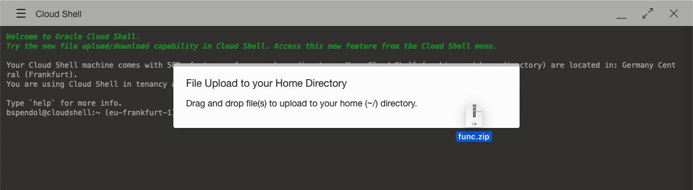

## Task 2: Prepare the Database

1. Start by going to the details page of your autonomous database if not already there. Use the OCI web console drop down menu to go to **Oracle Database** and then **Autonomous Database**.

    

    And on the **Autonomous Database** page, ensure that **livelabs** is selected for the **Compartment** dropdown on the left side of the page.

    

2. Now, find your **ORDS ADB** database in the list and left click on the **Display Name**

    

3. On the Autonomous Database Details page for our ORDS ADB database, click the **Database Actions** button on the top of the page

    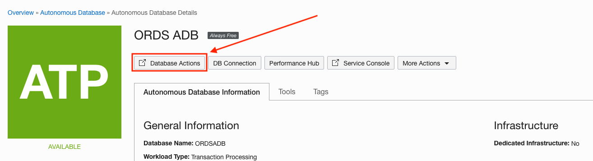

    this will pop up a modal window

    

    **NOTE**: If you have a pop-up blocker on your browser, you will have to view the blocked window and allow it to open.


**The new browser window should automatically login you in directly to the Database Actions Page. If it does, you can then move to step 6.**

**If it does not log you in automatically, continue with the next 2 steps (4 and 5).**

4. On the Database Actions page that was opened in a new browser tab/window, enter **admin** as the username. Then left click the **Next** button.

    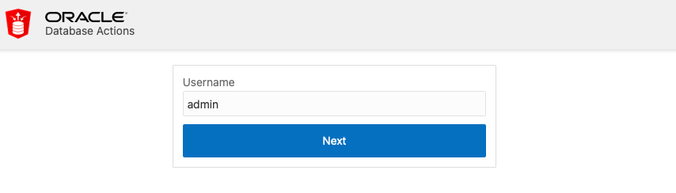

5. On the next page, enter the password you used to create the autonomous database in the setups part of the lab. Then left click the **Sign in** button.

    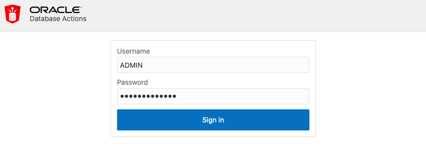

6. After signing in as **admin**, we end up on the overview page. Click the **SQL** tile.

    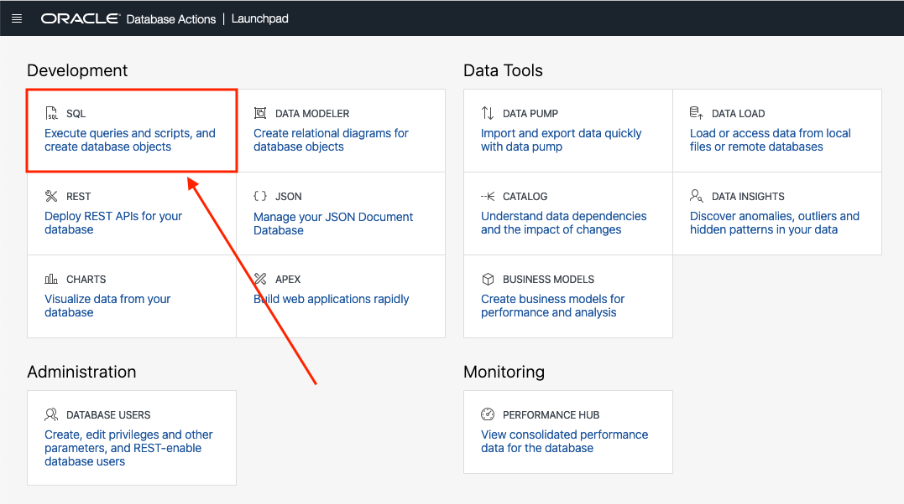

**If this is your first time accessing the SQL Worksheet, you will be presented with a guided tour. Complete the tour or click the X in any tour popup window to quit the tour.**

7. We are now ready to load data into the database. For this task, we will use the Data Loading tab in the SQL Worksheet.

    

8. Start by clicking the Data Loading area; the center of the gray dotted-line box.

    

9. The Upload Data into New Table modal will appear.

    

10. We are going to use the same file we are going to run the automated load with so that the table definitions match. In the zip file you downloaded at the begining of the lab, find the **file1.csv** file.

11. Drag the **file1.csv** file into the Upload Data into New Table modal. You can also click the Select Files button and find where you downloaded it via your operating system's file browser.

    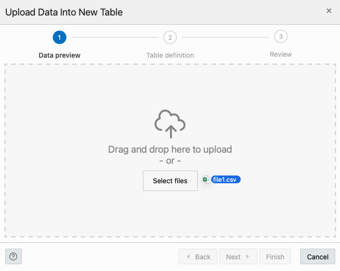

12. The modal will then give you a preview of what the data will look like in an Oracle table. Go ahead and click the Next button on the bottom right of the modal.

    

13. On the following step of the data loading modal, we can see the name of the table we are going to create (FILE1) as well as the column and data types for the table.

    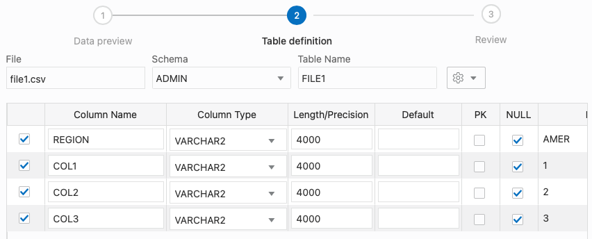
    
14. Seeing our sample data deals with regional counts of ska shows, lets name the table **REGION**.

    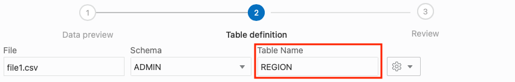
    
15. Click Next on the bottom right of the modal when done renaming the table.

    

16. On the last step of the modal, we can see a review of the table name (that we changed to REGION) and source file

    

    the DDL (Data Definition Language) for creating the table

    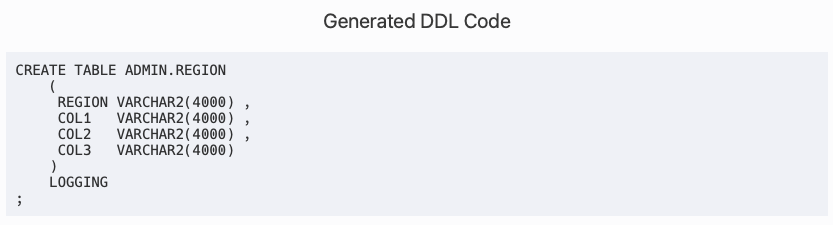

    and if you scroll down, the column mappings.

    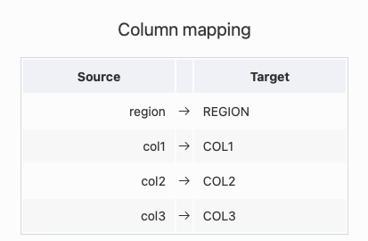

17. When you are done taking a look, click the Finish button in the lower right of the modal.

    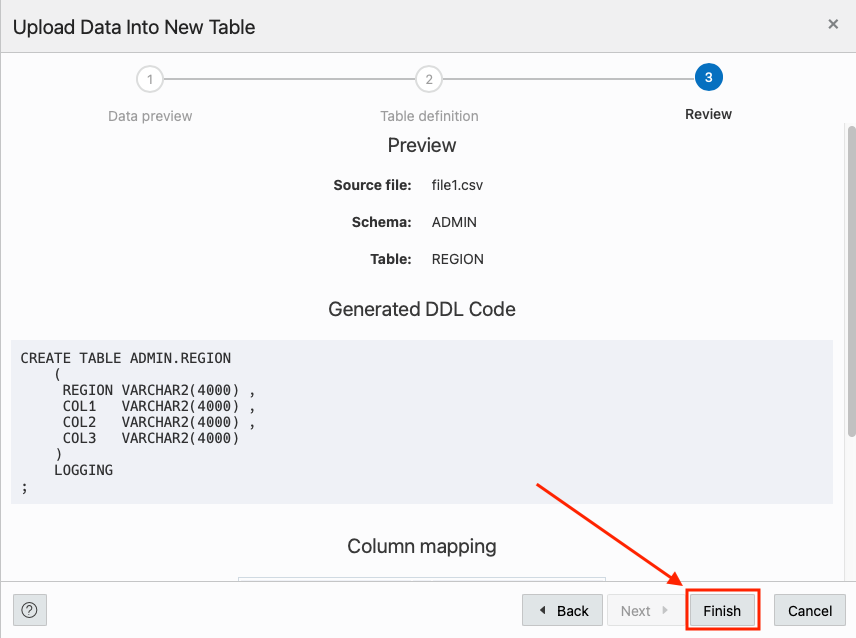

    The Data Loader will now process the file by creating a table and loading the CSV file data into that table. 

    

    Once its done, you will see a row in the Data Loading tab that indicates how many rows were uploaded, if any failed and the table name.

    

18. We can take a look at our newly created table and the data in it by using the navigator on the left of the SQL Worksheet. Just right click the table name and select Open from the pop up menu.

    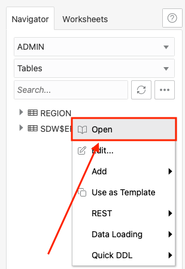

    In the slider that has come out from the right of the page, we can look at the data definition, triggers, constraints and even the data itself.

    

## Task 3: Auto-REST Enable a Table

1. REST enabling a table couldn't be easier. To do this, find the table we just created named **CSV_DATA** in the navigator on the left of the SQL Worksheet.

    

2. Right click on the table name and select **REST** in the pop up menu then **Enable**.

    

3. The REST Enable Object slider will appear from the right side of the page. Keep the default values and when ready, click the **Enable** button in the lower right of the slider.

    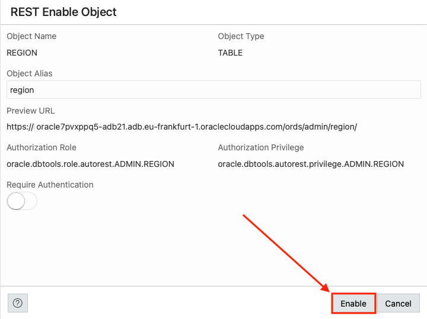

    Thats it! Your table is REST enabled. 

4. Before we finish up with setting up our database table, we need to record some information for configuring our function later in this lab. On the SQL worksheet page we are on, look at the URL in your browser. 

    

We need to capture the hostname in the URL for our function. Copy and paste the URL and save it for later user (paste in a text editor or notes application). You can see from the image the URL is **https://myadbhostname-ordsadb.adb.eu-frankfurt-1.oraclecloudapps.com/ords/sql-developer**. Yours will be in a similar format but a different hostname.


## Task 4: Create and Deploy the Function

We now need to create a function that will see the incoming file in Object Store and use the Batch Load API of the table we created that leverages the REST services available to us from ORDS. 

First, we need to make an Application to hold our function. 

From the [documentation](https://docs.oracle.com/en-us/iaas/Content/Functions/Concepts/functionsconcepts.htm):

```
In Oracle Functions, an application is:
    a logical grouping of functions
    a way to allocate and configure resources for all functions in the application
    a common context to store configuration variables that are available to all functions in the application
    a way to ensure function runtime isolation
```

1. Use the OCI web console drop down menu to go to **Developer Services** and then **Applications**.

    

2. On the **Applications** page, ensure that the **Compartment** is set to livelabs.

    

3. Now, click the **Create Application** button.

    

4. On the **New Application** slide out form, start by setting the **Name** to functionsApp.

    **Name:** functionsApp

    ````
    <copy>
    functionsApp
    </copy>
    ````
    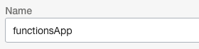

5. Use the **VNC in livelabs** dropdown to select our FunctionsVCN if not already selected. You can use the **Change Compartment** link if this did not default to using livelabs as the compartment.

    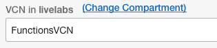

6. Using the **Subnets in livelabs** dropdown, select **Public Subnet-FunctionsVCN(Regional)**. You can use the **Change Compartment** link if this did not default to using livelabs as the compartment.

    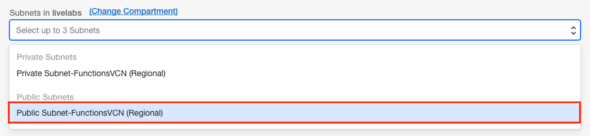

7. When your **New Application** form looks like the below image

    

    click the **Create** button in the lower left of the slider.

    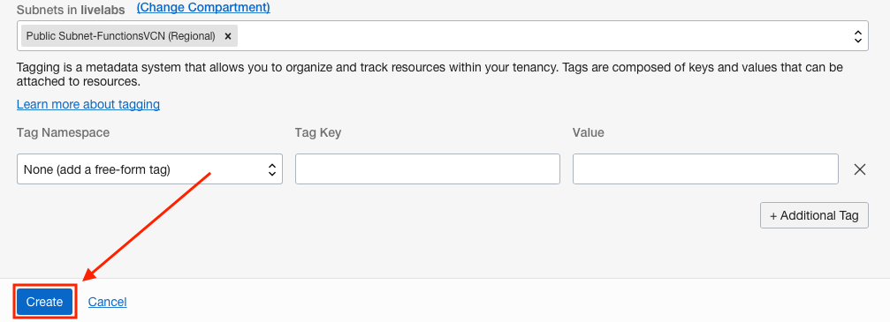

8. With your application created, click on the **Name** in the Applications List

    

9. On the **Application Details** page, using the **Resources List** on the left side of the page, click **Getting Started**.

    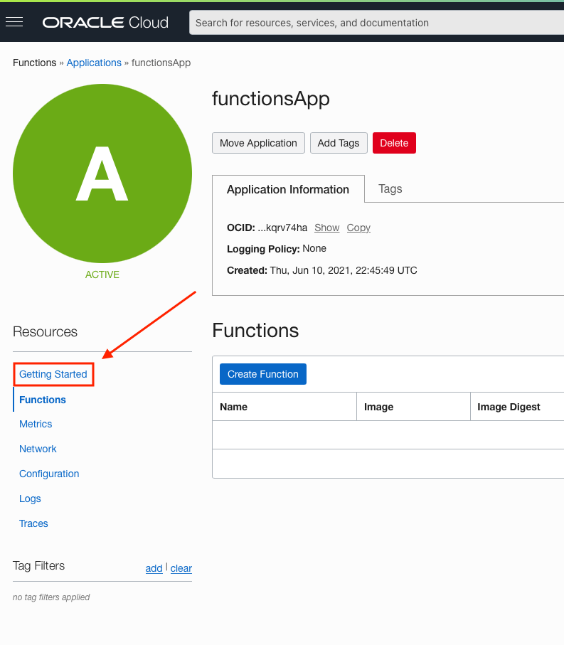

10. On the **Getting Started** page, ensure that **Cloud Shell Setup** is selected.

    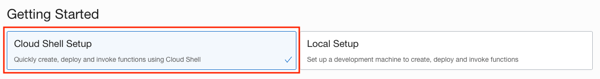

11. The next few steps will be using the **OCI Cloud Shell**. We can start a Cloud Shell session by clicking the **Launch Cloud Shell** button in the **Begin your Cloud Shell session** step on the **Getting Started** page.

    

    This will open the **OCI Cloud Shell** on the bottom of the page.

    

12. In the **Setup fn CLI on Cloud Shell** section, we will be copying and pasting many commands to use in the **OCI Cloud Shell** . Starting at **Step 2** for setting our region context,

    

    copy and paste the first command

    ````
    <copy>
    fn list context
    </copy>
    ````

    This will return something similar to the following:

    ```
    bspendol@cloudshell:~ (eu-frankfurt-1)$ fn list context
    CURRENT NAME            PROVIDER        API URL     REGISTRY
            default         oracle-cs
    ```

    Now, we are going to set a context based on the region you are in. In this example, I am in the eu-frankfurt-1 region. Your command in the Getting Started section may differ but the command will be structured in the same way.

    ```
    bspendol@cloudshell:~ (eu-frankfurt-1)$ fn use context eu-frankfurt-1
    Now using context: eu-frankfurt-1 
    ```

13. We are now going to update the context with the function's compartment ID with step 3. The OCI web console gives you this command to copy and paste with the compartment OCID already in the command; no need to fetch it.

    

    Copy, paste and run this command in the cloud shell.

    ```
    bspendol@cloudshell:~ (eu-frankfurt-1)$ fn update context oracle.compartment-id ocid1.compartment.oc1..aaaaaaaaszrdd8hj489fhfdrhf8sjwsns98n498dfjhnsdaioocereyzgkrkosw4q
    Current context updated oracle.compartment-id with ocid1.compartment.oc1..aaaaaaaaszrdd8hj489fhfdrhf8sjwsns98n498dfjhnsdaioocereyzgkrkosw4q
    ```

14. In step 4, we will update the context with the location of the Registry you want to use.

    

    The command the UI gives is in the format:
    ```
    region_container_registry/tenancy_name/ocir_repo_name_of_your_choice
    ```

    You will see the command similar to:
    ```
    fn update context registry fra.ocir.io/mytenancy/[OCIR-REPO]
    ```
    You can replace **[OCIR-REPO]** with any name you would like. For this lab, lets use livelabsRepo. Replace **[OCIR-REPO]** with **livelabsrepo** in your command
    ```
    fn update context registry fra.ocir.io/mytenancy/livelabsrepo
    ```
    and then run it
    ```
    bspendol@cloudshell:~ (eu-frankfurt-1)$ fn update context registry fra.ocir.io/mytenancy/livelabsrepo
    Current context updated registry with fra.ocir.io/mytenancy/livelabsrepo
    ```

15. Step 5 was completed in the setup lab where we generated a token for our user so we can skip this step. 

    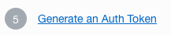

    Now would be a good time to retrieve the saved token you saved from the setup steps.

16. For step 6, 

        

    we will be logging into the Registry using the Auth Token you generated in the setup steps as your password. The command we will be running will be in the format 
    
    ```
    docker login -u '<tenancy-namespace>/<user-name>' <region-key>.ocir.io
    ```
    as seen below:
    
    ```
    docker login -u 'mytenancy/oracleidentitycloudservice/bspendol' fra.ocir.io
    ```

    For reference, you can look up the **region-key** [here](https://docs.oracle.com/en-us/iaas/Content/General/Concepts/regions.htm).

    If your tenancy is federated with Oracle Identity Cloud Service, you will use the above format using oracleidentitycloudservice. If the user you are using is not a federated user, you will use the syntax tenancy_namespace/user_name. If you do not know your Tenancy Namespace, you can find that information on your user profile page or click [here](https://docs.oracle.com/en-us/iaas/Content/Object/Tasks/understandingnamespaces.htm) for more information.

    ```
    bspendol@cloudshell:~ (eu-frankfurt-1)$ docker login -u 'mytenancy/oracleidentitycloudservice/bspendol' fra.ocir.io
    Password: 

    Login Succeeded
    ```

17. Next, in step 7, 

    

    verify we can see our application by running **fn list apps**

    ```
    bspendol@cloudshell:~ (eu-frankfurt-1)$ fn list apps
    NAME            ID
    functionsApp    ocid1.fnapp.oc1.eu-frankfurt-1.aaaaaaaaaaaaaaaaaaaaaaaaaaaaaaaaaaaaaaaaaaaaaaaaaaaa
    ```

    We are now setup to deploy our function.

18. Download the function code in your OCI Cloud Shell with the following command if you have not done so already:

    ```
    curl -o func.zip https://objectstorage.us-ashburn-1.oraclecloud.com/p/LNAcA6wNFvhkvHGPcWIbKlyGkicSOVCIgWLIu6t7W2BQfwq2NSLCsXpTL9wVzjuP/n/c4u04/b/livelabsfiles/o/developer-library/func.zip
    ```    

    Once downloaded, unzip it

    ```
    gunzip func.zip
    ```

    ````
    <copy>
    gunzip func.zip
    </copy>
    ````

19. Move into that directory that was created

    cd func

20. Now we can deploy our function to our application. This command can also be found as step number 10 on the Functions Getting Started page.

    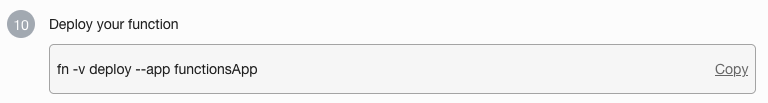

    Use the following command
   
    ````
    <copy>
    fn -v deploy --app functionsApp
    </copy>
    ````

    The OCI Cloud Shell will report back the progress of the function's deployment

    ```
    Pushing fra.ocir.io/mytenancy/livelabsrepo/csv-to-adw-with-ords-and-fn:0.0.68 to docker registry...
    The push refers to repository [fra.ocir.io/mytenancy/livelabsrepo/csv-to-adw-with-ords-and-fn]
    2775700c8222: Pushed 
    9b50566e770b: Pushed 
    522edf3e7d77: Pushed 
    3613dd225bdd: Pushed 
    c09710e8f799: Pushed 
    43022de19af6: Pushed 
    cdf79d97e316: Pushed 
    88fb2db345cd: Pushed 
    747aa001f428: Pushed 
    f9ef7f1bcb19: Pushed 
    02c055ef67f5: Pushed 
    0.0.68: digest: sha256:2a2a2a2a2a2a2a2a2a2a2a2a2a2a2a2a2a2a2a2a2a2a2a2a2a2a2a2a2a2a2a2a size: 2623
    Updating function csv-to-adw-with-ords-and-fn using image fra.ocir.io/mytenancy/livelabsrepo/csv-to-adw-with-ords-and-fn:0.0.68...
    Successfully created function: csv-to-adw-with-ords-and-fn with fra.ocir.io/mytenancy/livelabsrepo/csv-to-adw-with-ords-and-fn:0.0.68
    ```

21. With the function deployed, we need to configure some of the parameters needed so that it can find and login to the database. 

    Configuring function parameters is in the following syntax:
    ```
    fn config function <app-name> <function-name> <parameter> <parameter-value>
    ```
    We have the following values to supply:

    ```
    fn config function <app-name> <function-name> ords_base_url <ORDS Base URL>
    fn config function <app-name> <function-name> db_schema <DB schema>
    fn config function <app-name> <function-name> db_user <DB user name>
    fn config function <app-name> <function-name> secret_ocid <secret ocid>
    fn config function <app-name> <function-name> input_bucket <input bucket name>
    fn config function <app-name> <function-name> processed_bucket <processed bucket name>
    ```
    And with the values we need with our **app-name** and **function-name** filled in for you:

    ````
    <copy>
    fn config function functionsApp csv-to-adw-with-ords-and-fn ords_base_url "https://xxxxxx-xxxxxx/ords/"
    fn config function functionsApp csv-to-adw-with-ords-and-fn db_schema "admin"
    fn config function functionsApp csv-to-adw-with-ords-and-fn db_user "admin"
    fn config function functionsApp csv-to-adw-with-ords-and-fn secret_ocid "xxxxxxxxx"
    fn config function functionsApp csv-to-adw-with-ords-and-fn input_bucket "input-bucket"
    fn config function functionsApp csv-to-adw-with-ords-and-fn processed_bucket "processed-bucket" 
    </copy>
    ````
    The above commands need some values specified before running them. First, we need to change the **ords_base_url** with the one you recorded after creating the table earlier in this lab. If you remember mine was **https://myadbhostname-adb21.adb.eu-frankfurt-1.oraclecloudapps.com/ords/sql-developer** so ill want to set this parameter to:
    ```
    fn config function functionsApp csv-to-adw-with-ords-and-fn ords_base_url "https://myadbhostname-adb21.adb.eu-frankfurt-1.oraclecloudapps.com/ords/"
    ```
    Your value will be similar (but not the same).

    For the **secret_ocid** parameter, use the OCID of the password you entered in the secrets service during the setup.

    ```
    fn config function functionsApp csv-to-adw-with-ords-and-fn secret_ocid "ocid1.vaultsecret.oc1.eu-frankfurt-1.a1a2a3a4a1a2a3a4a1a2a3a4a1a2a3a4a1a2a3a4a1a2a3a4"
    ```

    Once the values are entered, run them in the OCI Cloud Shell. Be sure to press enter/return after each configuration and that you see the confirmation that the function was updated.
    ```
    bspendol@cloudshell:~ (eu-frankfurt-1)$ fn config function functionsApp csv-to-adw-with-ords-and-fn ords_base_url "https://myadbhostname-adb21.adb.eu-frankfurt-1.oraclecloudapps.com/ords/"
    functionsApp csv-to-adw-with-ords-and-fn updated ords_base_url with https://myadbhostname-adb21.adb.eu-frankfurt-1.oraclecloudapps.com/ords/
    
    bspendol@cloudshell:~ (eu-frankfurt-1)$ fn config function functionsApp csv-to-adw-with-ords-and-fn db_schema "admin"
    functionsApp csv-to-adw-with-ords-and-fn updated db_schema with admin
    
    bspendol@cloudshell:~ (eu-frankfurt-1)$ fn config function functionsApp csv-to-adw-with-ords-and-fn db_user "admin"
    functionsApp csv-to-adw-with-ords-and-fn updated db_user with admin
    
    bspendol@cloudshell:~ (eu-frankfurt-1)$ fn config function functionsApp csv-to-adw-with-ords-and-fn secret_ocid "ocid1.vaultsecret.oc1.eu-frankfurt-1.a1a2a3a4a1a2a3a4a1a2a3a4a1a2a3a4a1a2a3a4a1a2a3a4"
    functionsApp csv-to-adw-with-ords-and-fn updated dbpwd_cipher with ocid1.vaultsecret.oc1.eu-frankfurt-1.a1a2a3a4a1a2a3a4a1a2a3a4a1a2a3a4a1a2a3a4a1a2a3a4
    
    bspendol@cloudshell:~ (eu-frankfurt-1)$ fn config function functionsApp csv-to-adw-with-ords-and-fn input_bucket "input-bucket"
    functionsApp csv-to-adw-with-ords-and-fn updated input_bucket with input-bucket
    
    bspendol@cloudshell:~ (eu-frankfurt-1)$ fn config function functionsApp csv-to-adw-with-ords-and-fn processed_bucket "processed-bucket" 
    functionsApp csv-to-adw-with-ords-and-fn updated processed_bucket with processed-bucket
    ```
    Our function is now configured. At any time you can list the configuration parameters in a function with the command:
    ```
    fn list config fn <application-name> <function-name>
    ```
    so for our function and application it would be
    ```
    fn list config fn functionsApp csv-to-adw-with-ords-and-fn
    ```
    The Application Details page will also reflect this function has been created.

    

22. So we can see any issues with our function, we need to enable **logging**. On the left side of the **functionsApp Details Page**, find and click the **Logs** option.

    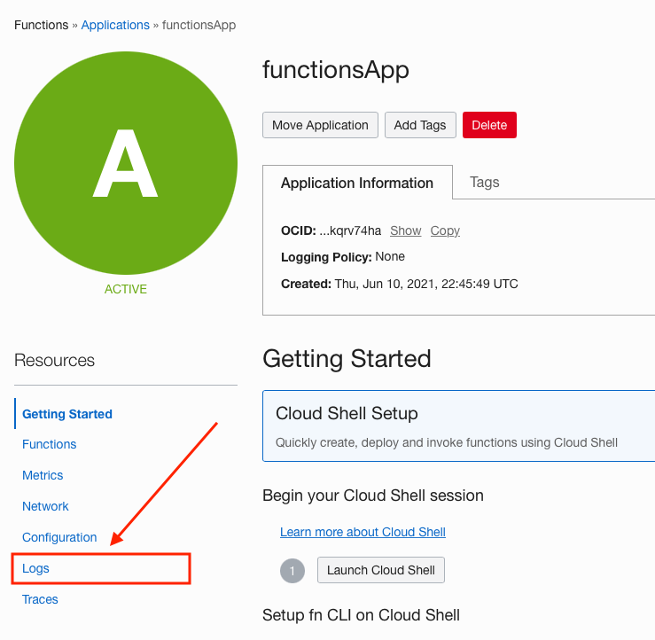

23. Now in the **Logs** section

    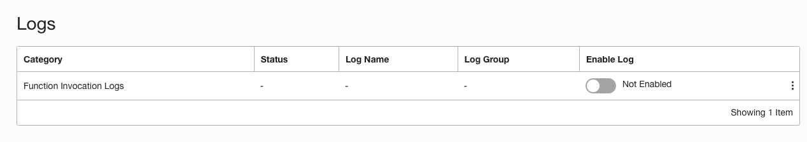

    either click the toggle button in the **Enable Log** column

    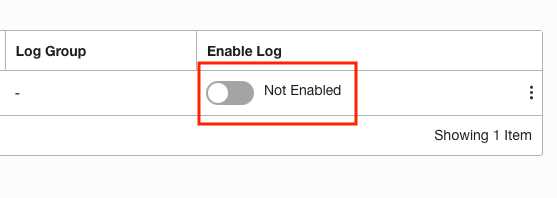

    or use the pop out menu and select **Enable Log**.

    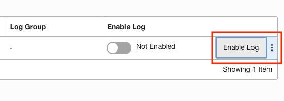

24. When the **Enable Log** slider form appears, keep the default values and click the **Enable Log** button in the lower left of the form.

    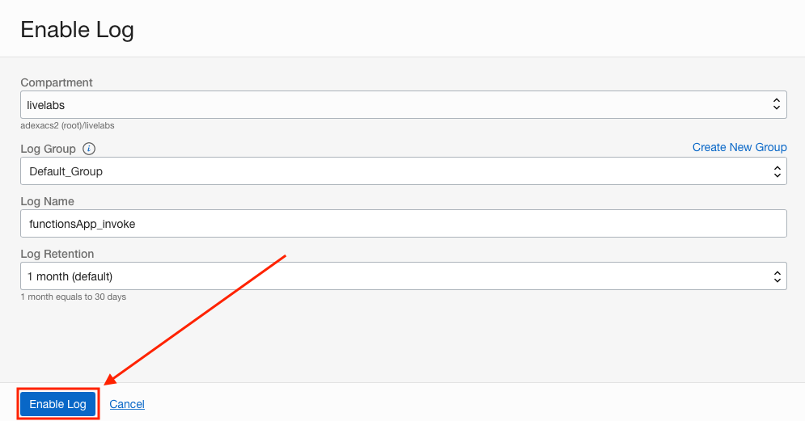

25. Our log is now enabled. You can view the log by clicking on the **functionsApp_invoke** link in the **Log Name column**.

    

## Task 5: Create an Event

1. So that the function triggers when the file1.csv csv file is put into a bucket, we have to create an **Event**. Use the OCI web console drop down menu to go to **Observability & Management** and then **Events Service**.

    

2. Next, ensure we are using the livelabs compartment for this **Event** we are about to create. Use the **Compartments** drop down on the left side of the page to select **livelabs**.

    

3. Now that the livelabs compartment is selected, click the **Create Rule** button.

    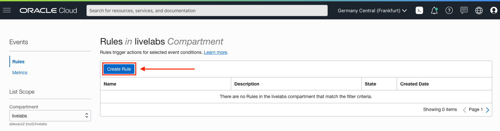

4. On the **Create Rule** page, start with the Rule's **Display Name**. Let's use **CSV File Watch** as the value.

    **Display Name:** CSV File Watch

    ````
    <copy>
    CSV File Watch
    </copy>
    ````
    

5. The **Description** can be **This rule watches for a CSV file in a bucket then triggers a function**.

    **Description:** This rule watches for a CSV file in a bucket then triggers a function

    ````
    <copy>
    This rule watches for a CSV file in a bucket then triggers a function
    </copy>
    ````
    

6. **Rule Conditions** are up next. 

    

    For the first rule, we will use the following values:
    **Condition:** Event Type
    **Service Name:** Object Store
    **Event Type:** Object Create

    

    This rule says watch for object creation in object store.

    Once you have filled out the first rule, click the **+ Another Condition** button.

      

    For the second rule, use the following values:
    **Condition:** Attribute
    **Attribute Name:** compartmentName
    **Attribute Value:** livelabs

    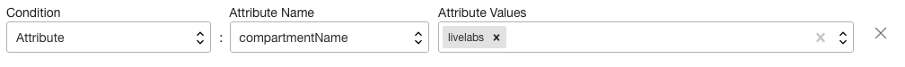

    You will have to type in the **Attribute Value** of livelabs. This rule says the compartment needs to be the livelabs compartment. 
    
    Once you have filled out the first rule, click the **+ Another Condition** button.

      

    For the third rule, use the following values:
    **Condition:** Attribute
    **Attribute Name:** bucketName
    **Attribute Value:** input-bucket

    You will have to type in the **Attribute Value** of input-bucket. This rule says the bucket needs to be the input-bucket.

    

    Your **Rule Conditions** section should look like the below image

    

    These rules say, watch for object creation in the livelabs compartment where the bucket name is input-bucket.

7. We now need to tell the Rule that when the **Rule Conditions** are met, perform this Action. We do this with the **Actions** section on the bottom of the page.

    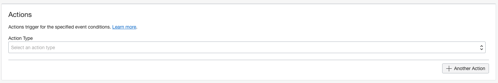

8. We will create one **Action**. Use the following values:
    **Action Type:** Functions
    **Function Compartment:** livelabs
    **Function Application:** functionsApp
    **Function:** csv-to-adw-with-ords-and-fn

    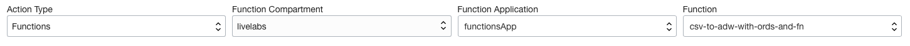

9. Once your **Create Rule** page looks like the following image, click the **Create Rule** button in the lower left of the page.

    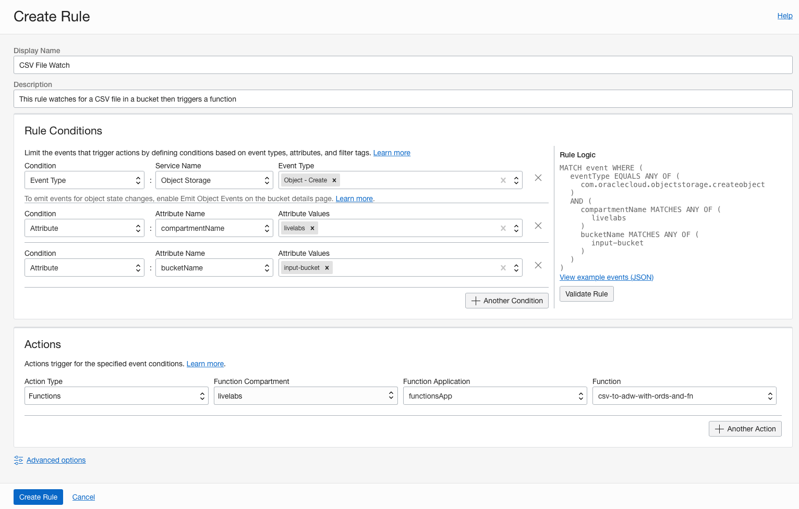

## Task 6: Taking the Flow for a Spin

1. It's time to see our function in action. To do this we need to put the file1.csv csv file into the input-bucket bucket. Use the OCI web console drop down menu to go to **Storage** and then **Buckets**.

    

2. Click the **input-bucket** link in the **Name Column**.

    

3. In the **Objects Section**, click the **Upload** button.

    

4. On the **Upload Objects** form, use the **Choose Files from your Computer** section to drag and drop or file browse to the file1.csv file we used when creating the table earlier in this lab.

    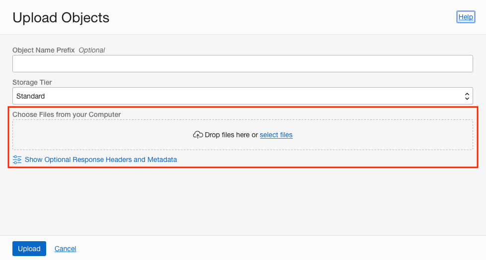

5. Once selected, click the **Upload** button.

    

6. We can check if the file was loaded into the database by going back to our **SQL Worksheet** in **Database Actions** and running the following SQL Query:

    ````
    <copy>
    select * from region;
    </copy>
    ````
    With the result being 8 rows (4 new and 4 from when we loaded the initial file).

    ```
    select * from region;

    REGION    COL1    COL2    COL3 
    _________ _______ _______ _______ 
    AMER      1       2       3       
    APAC      4       5       6       
    EMEA      7       8       9       
    AMER      10      11      12      
    AMER      1       2       3       
    APAC      4       5       6       
    EMEA      7       8       9       
    AMER      10      11      12      

    8 rows selected. 
    ```

    


## Conclusion

In this section, you created a table, auto-REST enabled it and use that REST endpoint with a function to batch load data from object store.

## Acknowledgements

- **Author** - Jeff Smith, Distinguished Product Manager and Brian Spendolini, Trainee Product Manager
- **Last Updated By/Date** - Brian Spendolini, December 2021