# Send Log Data to an Autonomous Database with Service Connector Hub

## Introduction

In this lab, you will create a service connector to move log data from the Logging service to an Autonomous Database using Functions and Oracle REST Data Services.

*Estimated Lab Time:* 30 Minutes

### Objectives

In this lab, you will:
* Create a JSON collection in the Autonomous Database using SODA/Database Actions
* Create a function to pass log files into a JSON collection
* Connect all the pieces together with Service Connector Hub

### Prerequisites

This lab assumes you have:
- Completed the [setup steps](../setups/setups.md)(OCI permissions and database creation).
- Completed the [CSV Functions Lab](../csv-function/csv-function.md)


## Task 1: Download Lab Files

Download the lab files with the following link. 

[Lab Files](https://objectstorage.us-ashburn-1.oraclecloud.com/p/LNAcA6wNFvhkvHGPcWIbKlyGkicSOVCIgWLIu6t7W2BQfwq2NSLCsXpTL9wVzjuP/n/c4u04/b/livelabsfiles/o/developer-library/func2.zip)

To download them in the OCI Cloud Console, use the following command:
```
curl -o func2.zip https://objectstorage.us-ashburn-1.oraclecloud.com/p/LNAcA6wNFvhkvHGPcWIbKlyGkicSOVCIgWLIu6t7W2BQfwq2NSLCsXpTL9wVzjuP/n/c4u04/b/livelabsfiles/o/developer-library/func2.zip
```

## Task 2: Creating a Collection

**If this is your first time accessing the JSON Worksheet, you will be presented with a guided tour. Complete the tour or click the X in any tour popup window to quit the tour.**

### **Create a Collection using the Database Actions UI**

1. The first step here is to create a **collection** for our JSON Documents. We can do this two ways. The first method is to use the UI in Database Actions. We can start by selecting **JSON** in the **Database Actions Menu**.

    

2. On the JSON worksheet, left click the **Create Collection** button in the middle of the page.

    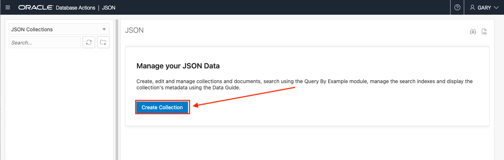

3. Using the **New Collection** slider

    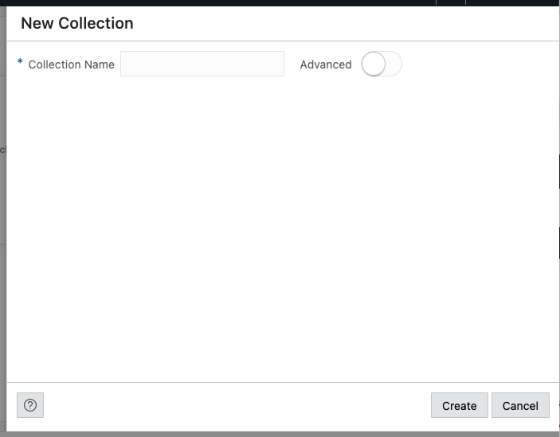

    enter **loggingcollection** in the **Collection Name** field

    ````
    <copy>
    loggingcollection
    </copy>
    ````

    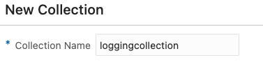

4. When your **New Collection** slider looks like the below image, left click the **Create** button.

    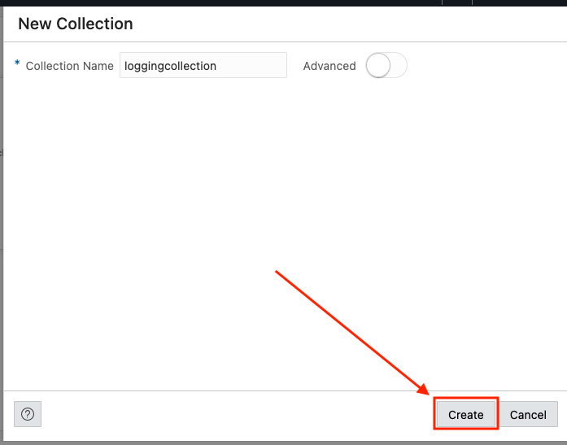

### **Create a Collection using the SODA for REST APIs**

1. We can create a collection with the **SODA for REST APIs** as well. To do this, open an **OCI Cloud Shell**. We can do this by clicking the Cloud Shell icon in the upper right of the OCI web console.

    

2. We can now use the **OCI Cloud Shell** that appears on the bottom of the OCI Web Console Page.

    

3. To use the SODA for REST APIs, we need to construct the URL. To start, we use cURL and pass in the username/password combination. Be sure to use the password that you set for our user back in the User Setups lab.

    ```
    curl -u "admin:PASSWORD"
    ```

    Also, we can add the -i which tells the cURL command to include the HTTP response headers in the output. This is helpful with debugging

    ```
    curl -u "admin:PASSWORD" -i
    ```

    next, this is going to create a collection, so we will use the **PUT HTTP method**. 

    ```
    curl -u "admin:PASSWORD" -i -X PUT
    ```

    Lastly, we will add the URL. The URL is built up with the hostname followed by ords, followed by our schema name admin

    ```
    https://coolrestlab-adb21.adb.eu-frankfurt-1.oraclecloudapps.com/ords/admin/
    ```

    then, add soda to indicate we want to use the SODA APIs followed by latest and the name of the collection airportdelayscollection. Your URL should look similar to the below one. (Your hostname will be different then this sample)

    ```
    https://coolrestlab-adb21.adb.eu-frankfurt-1.oraclecloudapps.com/ords/admin/soda/latest/loggingcollection
    ```

    And when we put it all together, we get the following:

    ```
    curl -u "admin:PASSWORD" -i -X PUT https://coolrestlab-adb21.adb.eu-frankfurt-1.oraclecloudapps.com/ords/admin/soda/latest/loggingcollection
    ```

4. We now can take this cURL command and run it in the OCI Cloud Shell. **REMEMBER to use *your* password in place of PASSWORD**

    

    ```
    curl -u "admin:PASSWORD" -i -X PUT https://coolrestlab-adb21.adb.eu-frankfurt-1.oraclecloudapps.com/ords/admin/soda/latest/loggingcollection
    HTTP/1.1 201 Created
    Date: Mon, 26 Apr 2021 15:53:46 GMT
    Content-Length: 0
    Connection: keep-alive
    X-Frame-Options: SAMEORIGIN
    Cache-Control: private,must-revalidate,max-age=0
    Location: https://coolrestlab-adb21.adb.eu-frankfurt-1.oraclecloudapps.com/ords/admin/soda/latest/loggingcollection/
    ```
    If the collection already exists, you will get a message similar to the following:

    ```
    HTTP/1.1 200 OK
    Date: Mon, 26 Apr 2021 16:07:38 GMT
    Content-Length: 0
    Connection: keep-alive
    X-Frame-Options: SAMEORIGIN
    Cache-Control: private,must-revalidate,max-age=0
    ```

## Task 3: Create and Deploy a Function

1. The next few steps will be using the **OCI Cloud Shell**. We can do this by clicking the **Cloud Shell icon** in the upper right of the OCI web console.

    

2. Seeing in the previous lab we set up our context and docker repository, we can start by just logging back into the repository so that we can deploy the next function. As a reminder, the command we will be running will be in the format **docker login -u '<tenancy-namespace>/<user-name>' <region-key>.ocir.io** as seen below:

    ```
    docker login -u 'mytenancy/oracleidentitycloudservice/bspendol' fra.ocir.io
    ```

    If your tenancy is federated with Oracle Identity Cloud Service, you will use the above format using oracleidentitycloudservice. If the user you are using is not a federated user, you will use the syntax tenancy_name/user_name. Remember to use the token we created in the setup part of the lab just as we did previously.

    ```
    bspendol@cloudshell:~ (eu-frankfurt-1)$ docker login -u 'mytenancy/oracleidentitycloudservice/bspendol' fra.ocir.io
    Password: 

    Login Succeeded
    ```

3. Next, we verify we can see our application by running fn list apps

    ```
    bspendol@cloudshell:~ (eu-frankfurt-1)$ fn list apps
    NAME            ID
    functionsApp    ocid1.fnapp.oc1.eu-frankfurt-1.aaaaaaaaa1a2a3a4a1a2a3a4a1a2a3a4a1a2a3a4a1a2a3a4a1a2a3a4
    ```

    We are now setup to deploy our function.

4. Download the function code in your OCI Cloud Shell with the following command if you have not done so already:

    ```
    curl -o func2.zip https://objectstorage.us-ashburn-1.oraclecloud.com/p/LNAcA6wNFvhkvHGPcWIbKlyGkicSOVCIgWLIu6t7W2BQfwq2NSLCsXpTL9wVzjuP/n/c4u04/b/livelabsfiles/o/developer-library/func2.zip
    ```    

    Once downloaded, unzip it

    ```
    gunzip func2.zip
    ```

    ````
    <copy>
    gunzip func2.zip
    </copy>
    ````

5. Move into that directory that was created

    cd func2

6. Now we can deploy our function to our application. Use the following command:
   
    ````
    <copy>
    fn -v deploy --app functionsApp
    </copy>
    ````

    The OCI Cloud Shell will report back the progress of the function's deployment

    ```
    Pushing fra.ocir.io/mytenancy/livelabsrepo/log-to-adw-with-ords-and-fn:0.0.68 to docker registry...
    The push refers to repository [fra.ocir.io/mytenancy/livelabsrepo/log-to-adw-with-ords-and-fn]
    2775700c8222: Pushed 
    9b50566e770b: Pushed 
    522edf3e7d77: Pushed 
    3613dd225bdd: Pushed 
    c09710e8f799: Pushed 
    43022de19af6: Pushed 
    cdf79d97e316: Pushed 
    88fb2db345cd: Pushed 
    747aa001f428: Pushed 
    f9ef7f1bcb19: Pushed 
    02c055ef67f5: Pushed 
    0.0.68: digest: sha256:2a2a2a2a2a2a2a2a2a2a2a2a2a2a2a2a2a2a2a2a2a2a2a2a2a2a2a2a2a2a2a2a size: 2623
    Updating function log-to-adw-with-ords-and-fn using image fra.ocir.io/mytenancy/livelabsrepo/log-to-adw-with-ords-and-fn:0.0.68...
    Successfully created function: log-to-adw-with-ords-and-fn with fra.ocir.io/mytenancy/livelabsrepo/log-to-adw-with-ords-and-fn:0.0.68
    ```

7. With the function deployed, we need to configure some of the parameters needed so that it can find and login to the database. Configuring function parameters is in the following syntax"
    ```
    fn config function <app-name> <function-name> <parameter> <parameter-value>
    ```
    We have the following values to supply:

    ```
    fn config function <app-name> <function-name> ords_base_url <ORDS Base URL>
    fn config function <app-name> <function-name> db_schema <DB schema>
    fn config function <app-name> <function-name> db_user <DB user name>
    fn config function <app-name> <function-name> secret_ocid <secret ocid>
    fn config function <app-name> <function-name> collection <input bucket name>
    ```

    And with the values we need with our **app-name** and **function-name** filled in for you:
    ````
    <copy>
    fn config function functionsApp log-to-adw-with-ords-and-fn ords_base_url "https://xxxxxx-xxxxxx/ords/"
    fn config function functionsApp log-to-adw-with-ords-and-fn db_schema "admin"
    fn config function functionsApp log-to-adw-with-ords-and-fn db_user "admin"
    fn config function functionsApp log-to-adw-with-ords-and-fn secret_ocid "xxxxxxxxx"
    fn config function functionsApp log-to-adw-with-ords-and-fn collection "loggingcollection"
    </copy>
    ````

    The above commands need some values specified before running them. First, we need to change the **ords_base_url** with the one you recorded after creating the table earlier in this lab. If you remember mine was **https://myadbhostname-adb21.adb.eu-frankfurt-1.oraclecloudapps.com/ords/sql-developer** so ill want to set this parameter to:
    ```
    fn config function functionsApp log-to-adw-with-ords-and-fn ords_base_url "https://myadbhostname-adb21.adb.eu-frankfurt-1.oraclecloudapps.com/ords/"
    ```
    Your value will be similar (but not the same).

    For the **secret_ocid** parameter, use the OCID of the password you entered in the secrets service during the setup.

    ```
    fn config function functionsApp log-to-adw-with-ords-and-fn secret_ocid "ocid1.vaultsecret.oc1.eu-frankfurt-1.a1a2a3a4a1a2a3a4a1a2a3a4a1a2a3a4a1a2a3a4a1a2a3a4"
    ```

    Once the values are entered, run them in the OCI Cloud Shell. Be sure to press enter/return after each configuration and that you see the confirmation that the function was updated.
    ```
    bspendol@cloudshell:~ (eu-frankfurt-1)$ fn config function functionsApp log-to-adw-with-ords-and-fn ords_base_url "https://myadbhostname-adb21.adb.eu-frankfurt-1.oraclecloudapps.com/ords/"
    functionsApp log-to-adw-with-ords-and-fn updated ords_base_url with https://myadbhostname-adb21.adb.eu-frankfurt-1.oraclecloudapps.com/ords/
    
    bspendol@cloudshell:~ (eu-frankfurt-1)$ fn config function functionsApp log-to-adw-with-ords-and-fn db_schema "admin"
    functionsApp log-to-adw-with-ords-and-fn updated db_schema with admin
    
    bspendol@cloudshell:~ (eu-frankfurt-1)$ fn config function functionsApp log-to-adw-with-ords-and-fn db_user "admin"
    functionsApp log-to-adw-with-ords-and-fn updated db_user with admin
    
    bspendol@cloudshell:~ (eu-frankfurt-1)$ fn config function functionsApp log-to-adw-with-ords-and-fn secret_ocid "ocid1.vaultsecret.oc1.eu-frankfurt-1.a1a2a3a4a1a2a3a4a1a2a3a4a1a2a3a4a1a2a3a4a1a2a3a4"
    functionsApp log-to-adw-with-ords-and-fn updated dbpwd_cipher with ocid1.vaultsecret.oc1.eu-frankfurt-1.a1a2a3a4a1a2a3a4a1a2a3a4a1a2a3a4a1a2a3a4a1a2a3a4
    
    bspendol@cloudshell:~ (eu-frankfurt-1)$ fn config function functionsApp log-to-adw-with-ords-and-fn collection "loggingcollection"
    functionsApp log-to-adw-with-ords-and-fn updated input_bucket with loggingcollection
    ```
    Our function is now configured. At any time you can list the configuration parameters in a function with the command:
    ```
    fn list config fn <application-name> <function-name>
    ```
    so for our function and application it would be
    ```
    fn list config fn functionsApp log-to-adw-with-ords-and-fn
    ```
    The Application Details page will also reflect this function has been created.

    


## Task 4: Create a Service Connector

1. Use the OCI web console drop down menu to go to **Observability & Management** and then **Service Connectors**.

    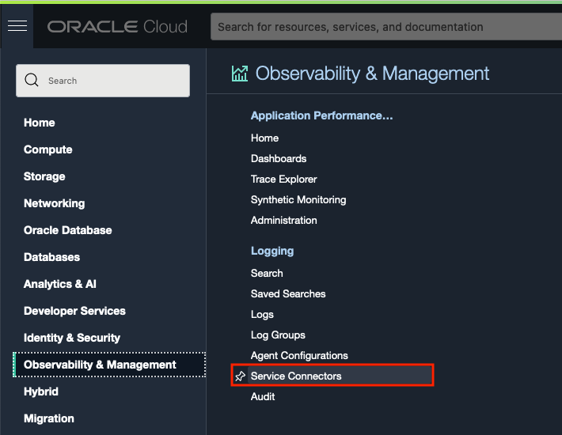

2. Next, ensure we are using the livelabs compartment for this **Service Connector** we are about to create. Use the **Compartments** drop down on the left side of the page to select **livelabs**.

    

3. Click the **Create Service Connector** button.

    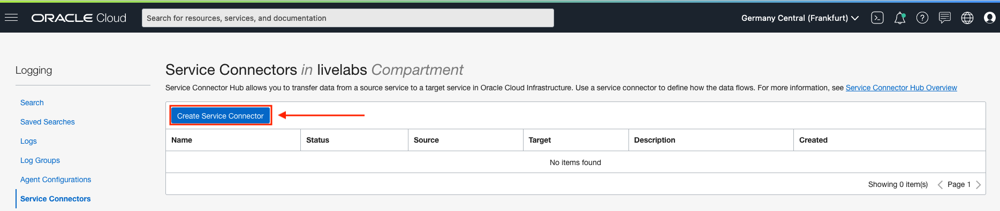

4. On the Create Service Connector page, start by giving the Service Connector a name. Use the **Connector Name** field and enter **Send Logs to My Autonomous Database**.

    **Connector Name:** Send Logs to My Autonomous Database

    ````
    <copy>
    Send Logs to My Autonomous Database
    </copy>
    ````
    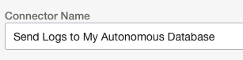

5. For the **Description** field, use the same value as the Connector Name.

    **Description:** Send Logs to My Autonomous Database

    ````
    <copy>
    Send Logs to My Autonomous Database
    </copy>
    ````

    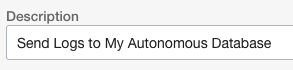

6. Ensure the **Resource Compartment** is set to **livelabs**

    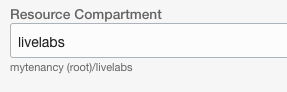

    And the top naming section should look like the following image:

    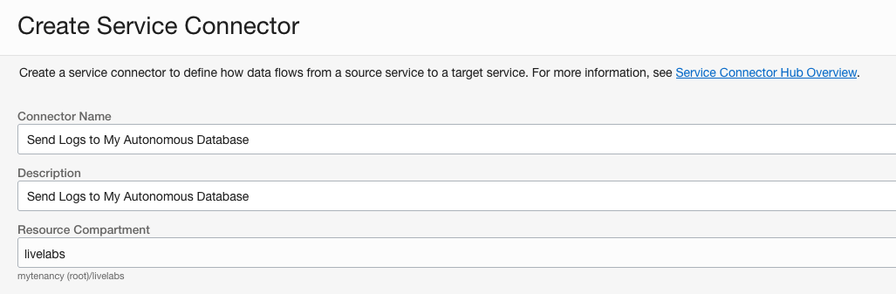   

7. Now, in the **Configure Service Connector** section, we will be selecting our source and target services to move log data to the database. Starting with the **Source** dropdown

    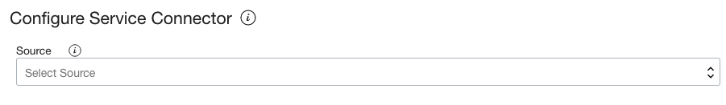   

    select **Logging** as the **Source**

       

8. In the **Configure source connection** section, ensure the **Compartment Name** is livelabs

    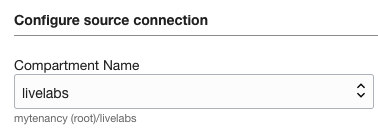   

9. For **Log Group**, select **Default_Group**

     

10. And for the **Logs** dropdown, select **functionsApp_invoke**, the log we created in the previous lab to track the batch load insert.

     

    The **Configure source connection** section should look like the following image:

    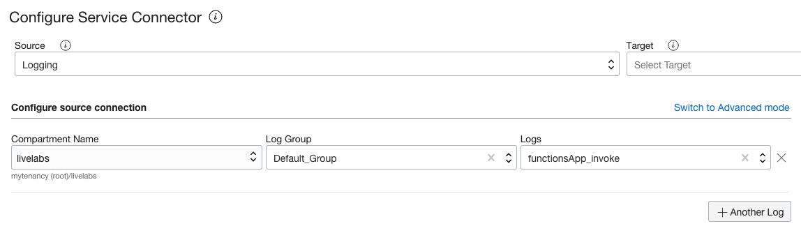 

11. The **Target** section is next. Use the **Target** dropdown to select **Functions**.

     

12. Once **Functions** has been selected using the **Target** dropdown, scroll down the page to find the **Configure target connection** section, just below the **Configure Function Task (Optional)** section.

     


13. Ensure the **Compartment** dropdown is set to **livelabs**

    

14. Using the **Function Application** dropdown, select **functionsApp**.

    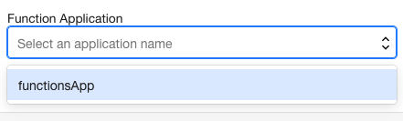


15. Using the **Function** dropdown, select **log-to-adw-with-ords-and-fn**

    

    Your **Configure target connection** section should look like the following image:

    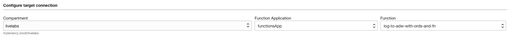

    and if you scroll the page up, you can see the mini-topology map has our services and green checks indicating we are ready to create.

    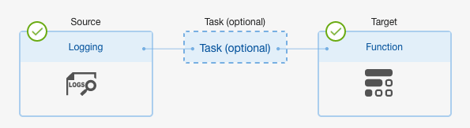

16. On the lower part of the page, you may see a prompt to create a policy (required for access to create or update a service connector). If you do, click the **Create** button for this policy to be auto-created.

    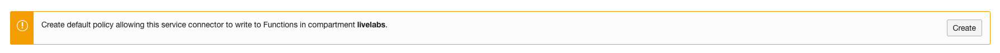

17. When done reviewing, click the **Create** button in the lower left of the page.

    

18. Our Service Connector is created and ready to be used.

    

## Task 5: Testing the Flow

1. To test the entire flow, we need to put the file1.csv csv file into the input-bucket bucket just as we did in the previous lab. Use the OCI web console drop down menu to go to **Storage** and then **Buckets**.

    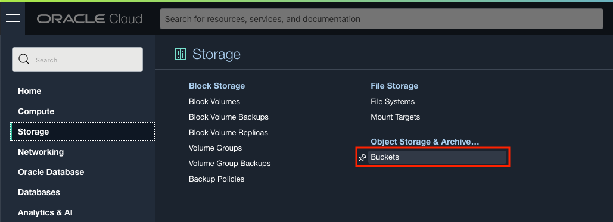

2. Click the **input-bucket** link in the **Name Column**.

    

3. In the **Objects Section**, click the **Upload** button.

    

4. On the **Upload Objects** form, use the **Choose Files from your Computer** section to drag and drop or file browse to the file1.csv file we used when creating the table earlier in this lab.

    

5. Once selected, click the **Upload** button.

    

6. To see the logs uploaded to the database, we need to go back to the JSON worksheet. Back in **Database Actions**, choose **JSON** in the **Database Actions Menu**.

    

or select the JSON tile on the **Database Actions** homepage.

    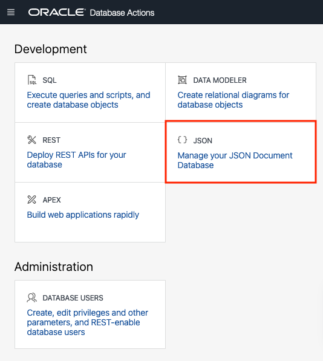

7. Click on our collection **loggingcollection** on the left side of the page in the **Collections Navigator**

    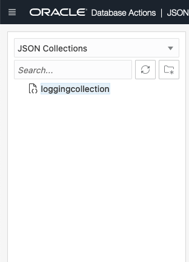

8. Now using the worksheet, issue a **Query by Example** that will bring back all records. We can do this by typing **{}** in the worksheet
    ````
    <copy>
    {}
    </copy>
    ````
    

    and then clicking the **Run Query** button.

    

9. We can filter our search to just logs that deal with our CSV file insert. Issue the following **Query by Example** 
    ````
    <copy>
    {"subject": "csv-to-adw-with-ords-and-fn"}
    </copy>
    ````

    

    and then clicking the **Run Query** button.

    

## Conclusion

In this section, you created a function to automate the loading of logs into a database using the service connector.

## Acknowledgements

- **Author** - Jeff Smith, Distinguished Product Manager and Brian Spendolini, Trainee Product Manager, Greg Verstraeten, Product Manager
- **Last Updated By/Date** - Brian Spendolini, December 2021