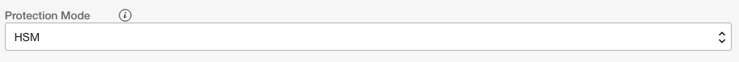
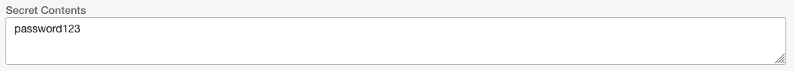

# Lab Setups

## About the Workshop

This part of the lab will guide you through some setup items that have to be performed before we can start the lab.

*Estimated Lab Time:* 60 Minutes

### Objectives

In this lab, you will:

* Create a compartment for our OCI components
* Setup permissions for dynamic groups and policies
* Create an Autonomous Database
* Setup a Virtual Cloud Network
* Create Object Store Buckets for our csv files
* Create a secret using the Secrets Service and the OCI Vault

### Prerequisites

This lab assumes you have:

* Completed the [Getting Started](https://oracle-livelabs.github.io/common/labs/cloud-login/pre-register-free-tier-account.md) lab

## Task 1: Create a Compartment

We are going to create a **Compartment** for this lab so that our functions, logs, database and other OCI components reside in a single place.

1. To create a compartment, use the OCI web console drop down menu and select **Identity & Security**, then **Compartments**.

    

2. On the Compartments page, click the **Create Compartment** button.

    

3. Using the **Create Compartment** modal, set the following values:

    **Name:** livelabs

    ```shell
    <copy> 
    livelabs
    </copy>
    ```

    

    **Description:** livelabs

    ```shell
    <copy>
    livelabs
    </copy>
    ```

    

    **Parent Compartment:** Use the root compartment (Should be auto-selected, your root compartment will be named different, but will have (root) after it)

    

4. When your Create Compartment modal looks like the following image (root compartment name will be different but have (root) after the name), click the **Create Compartment** button.

    

### Get the Compartment OCID

Before we create some of the resources we need for functions, we need to record the OCID for compartment we just created. Back on the compartments page, find the OCID column of the livelabs compartment we just created and hover your mouse over the characters link in that row. You will see a pop up window with the OCID and a copy link. Click the copy link to copy the compartments OCID and paste it into a text editor for later reference. 
**You may have to refresh the page to see the created compartment.**


## Task 2: Setup OCI Permissions

For the Function we create to interact with the Object Store, we first have to create a Dynamic Group and some IAM policies.
**If you did not copy the OCID for the compartment you just created do that now before moving on to the next step**

### Create a Dynamic Group

Let's start off by creating a dynamic group. This group will be used with policy generation in the next step. More on Dynamic Groups can be found [here](https://docs.oracle.com/en-us/iaas/Content/Identity/Tasks/managingdynamicgroups.htm).

1. Use the OCI web console drop down menu and select **Identity & Security**, then **Dynamic Groups**.

    

2. On the Dynamic Groups page, click **Create Dynamic Group**

    

3. On the Create Dynamic Group page, set the following values:

    **Name:** functionsDynamicGroup

    ```shell
    <copy>
    functionsDynamicGroup
    </copy>
    ```

    

    **Description:** Dynamic Group for Functions

    ```shell
    <copy>
    Dynamic Group for Functions
    </copy>
    ```

    

    **Matching Rules:**

    The `Match any rules defined below` radio button is selected.

    > ⚠ Replace **YOUR COMPARTMENT OCID** with the compartment OCID you copied in Task 1.

    **Text for Rule 1:**

    ```shell
    <copy>
    ALL {resource.type = 'fnfunc', resource.compartment.id = 'YOUR COMPARTMENT OCID'}
    </copy>
    ```

    

4. Once your Create Dynamic Group page looks like the below image, click the **Create** button. (Remember, your OCID for the compartment will be different than the one in the image)

    

5. You will now be on the Dynamic Group Details page for the one we just created

    

### Create IAM Policies

Next, we need to associate our dynamic group to some policies so that it has the ability to use object store to see and process the CSV files as they come in.

1. Use the OCI web console menu to navigate to **Identity & Security**, then **Policies**

    

2. On the Policies page

    

    find the Compartment dropdown and select our root compartment if not already selected

    

3. Next, click the **Create Policy** button

    

4. On the Create Policy page, set the following values:

    **Name:** functionPolicies

    ```shell
    <copy>
    functionPolicies
    </copy>
    ```

    

    **Description:** Policies for our functions

    ```shell
    <copy>
    Policies for our functions
    </copy>
    ```

    

    **Compartment:** livelabs (Should be auto-selected)

    

5. Now in the Policy Builder, click the **Show manual editor** toggle switch

    

6. Copy and paste the following policy code into the text area. You will need to change the text **YOUR_REGION** to reflect the OCI region you are in. You can reference the documentation [here](https://docs.oracle.com/en-us/iaas/Content/General/Concepts/regions.htm) to find your **Region Identifier** to replace the **YOUR_REGION** text. For example, if we were in the Phoenix OCI region, the policy would be:

    `Allow service objectstorage-us-phoenix-1 to manage object-family in tenancy`

    Now copy and paste the following text and use the appropriate region.

    ```shell
    <copy>
    Allow dynamic-group functionsDynamicGroup to manage objects in compartment livelabs
    Allow dynamic-group functionsDynamicGroup to manage buckets in compartment livelabs
    Allow service objectstorage-YOUR_REGION to manage object-family in tenancy
    </copy>
    ```

    

7. When your Create Policy page looks like the below image (remember your region may be different than the one in the image), click the **Create** button.

    

8. You will be brought to the Policy Details page for the just created policy

    

## Task 3: Create an Autonomous Database

1. Use the OCI web console drop down menu to go to **Oracle Database** and then **Autonomous Database**.

    

2. On the Autonomous Database page, change your compartment to the livelabs compartment using the **Compartment** dropdown on the left side of the page.

    

3. With the livelabs compartment selected, click the **Create Autonomous Database** button on the top of the page.

    

4. In the **Create Autonomous Database** page, we start in the **Provide basic information for the Autonomous Database** section. Here we can ensure our **Compartment** is **livelabs** and give our database a **Display Name**. We can use **ORDS ADB** as the Display Name.

    **Display Name:** ORDS ADB

    ```shell
    <copy>
    ORDS ADB
    </copy>
    ```

    

    For the **Database Name**, we can use **ORDSADB**.

      **Database Name:** ORDSADB

    ```shell
    <copy>
    ORDSADB
    </copy>
    ```

      

    The **Provide basic information for the Autonomous Database** section should look like the following image:

     

5. For Database **Workload Type**, choose **Transaction Processing**.

     

6. In the **Deployment Type** section, choose **Shared Infrastructure** if not already selected for you.

     

7. Next we have the **Configure the database** section. Start here by clicking the **Always Free** toggle button so that it is switched to the right side as seen in the following image.

     

8. Use the **Choose database version** dropdown to choose **21c** as the database version.

   

9. Your **Configure the database** section should look like the following image.

   

10. The next section is **Create administrator credentials**. Here, provide a password that conforms to the password complexity rules of:

    `Password must be 12 to 30 characters and contain at least one uppercase letter, one lowercase letter, and one number.
    The password cannot contain the double quote (") character or the username "admin".`

    If the password does conform to these rules and matches in both fields, the section should look like the following image.

    

11. For the **Choose network access** section, select **Secure access from everywhere** if not already selected.

    

12. The **Choose a license type** section should default to **License Included**.

    

13. When the **Create Autonomous Database** is completely filled out, click the **Create Autonomous Database** button on the bottom left of the page.

    

14. Your Autonomous Database should be done creating in just a few short minutes.

## Task 4: Create a Virtual Cloud Network

Our functions will need a Virtual Cloud Network (VCN) to live in. We can quickly create one with the VCN Wizard.

1. Use the OCI web console drop down menu to go to **Networking** and then **Virtual Cloud Networks**.

    

2. Next, ensure we are using the livelabs compartment for this Virtual Cloud Network we are about to create. Use the **Compartments** drop down on the left side of the page to select **livelabs**.

    

3. Back on the top of the page, click the **Start VCN Wizard** button.

    

4. After clicking the button, the **Start VCN Wizard** modal window will pop up. Select the **VCN with Internet Connectivity** option if not already selected and then click the **Start VCN Wizard** button on the bottom left of the modal window.

    

5. On the **Configuration** page of the **Create a VCN with Internet Connectivity** flow, in the **Basic Information** section, set the **VCN Name** to be FunctionsVCN and the **Compartment** to be livelabs if not already selected.

    **VCN Name:** FunctionsVCN

    ```shell
    <copy>
    FunctionsVCN
    </copy>
    ```

    

    **Compartment:** livelabs (Should be auto-selected)

    

    Your **Basic Information** section should look like the following image.

    

6. In the **Configure VCN and Subnets** section, we can leave the default values.

    

    Once you have reviewed the default values in the **Configure VCN and Subnets** section, click the **Next** button on the bottom left of the **Create a VCN with Internet Connectivity** page.

   

7. On the **Review and Create** page of the **Create a VCN with Internet Connectivity** flow, review the values and when ready, click the **Create** button on the bottom left of the page.

   

8. Your Virtual Cloud Network components will now be created.

   

    When done, click the **View Virtual Cloud Network** botton on the bottom left of the page to view the details of the newly created VCN.

   

## Task 5: Generate an Auth Token

1. Use the OCI web console menu to navigate to **Identity & Security**, then **Users**

   

2. On the Users page, find your user login and click the the name to go to the User Details page.

   

3. On the **User Details** page, on the left side of the page, under **Resources**, find and click **Auth Tokens**.

   

4. With Auth Tokens selected, click the **Generate Token** button.

   

5. In the **Generate Token** modal window, set the description to **functions**

    ```shell
    <copy>
    functions
    </copy>
    ```

   

    then click the **Generate Token** button.

    

6. The **Generated Token** will now be displayed. Click the **Copy** link and save this token somewhere we can refer to it later in the lab.

    

    When you have copied the token and saved it somewhere (text pad, notes app, etc), click the **Close** button.

   > It is important to note that the token text will not be displayed or able to be retrieved after you click the close button in the Generate Token Model. Please copy and save this token text.

## Task 6: Create Object Store Buckets

The function will be watching an object store bucket for a CSV file, process it then place it into another bucket so we need to create two buckets.

1. Use the OCI web console drop down menu to go to **Storage** and then **Buckets**.

    

2. Next, ensure we are using the livelabs compartment for these buckets we are about to create. Use the **Compartments** drop down on the left side of the page to select **livelabs**.

    

3. Now that we have the compartment set, click the **Create Bucket** button.

    

4. Using the **Create Bucket** slide out form, set the **Bucket Name** to **input-bucket**

      **Bucket Name:** input-bucket

    ```shell
    <copy>
    input-bucket
    </copy>
    ```

    

    Once the **Bucket Name** is **input-bucket**, click the **Create** button on the bottom left of the form.

    

5. We need to create one more bucket. Again click the **Create Bucket** button.

    

6. Using the **Create Bucket** slide out form, set the **Bucket Name** to **processed-bucket**

      **Bucket Name:** processed-bucket

    ```shell
    <copy>
    processed-bucket
    </copy>
    ```

    

    Once the **Bucket Name** is **processed-bucket**, click the **Create** button on the bottom left of the form.

    

7. You should now have two buckets created in the livelabs compartment.

    

## Task 7: Create a Vault and Store the Database Admin Password

To ensure we are not using passwords in plain text in any configurations or parts of this lab, we need to create an OCI Vault and place the password for the admin user of the database into the Secrets Service.

1. Use the OCI web console drop down menu to go to **Identity & Security** and then **Valut**.

    

2. Next, ensure we are using the livelabs compartment for the **Vault** we are about to create. Use the **Compartments** drop down on the left side of the page to select **livelabs**.

    

3. Now, click the **Create Vault** button on the page.

    

4. In the **Create Vault** slider, ensure that **livelabs** is selected for the **Create in Compartment** dropdown.

    

5. And lets name the vault **livelabsVault** using the Name field.

    **Name:** livelabsVault

    ```shell
    <copy>
    livelabsVault
    </copy>
    ```

   

   > Ensure that the **Make it a virtual private vault** checkbox is **unchecked** and left empty.

6. Once the **Create Vault** slider looks like the following image, click the **Create Vault** button.

    

7. After the vault is done creating, click on the **Vault Name** to view the details.

     

8. We need to set a **Master Encryption Key** for our vault. On the **Vault Details** page, in the **Master Encryption Keys in livelabs Compartment** section, click the **Create Key** button.

    

9. Using the **Create Key** slider, start by ensuring that the **Create in Compartment** dropdown is set to **livelabs**.

    

10. Next, our **Protection Mode** should be set to **HSM** if not already selected. You can read more about protection modes and keys [here](https://docs.oracle.com/en-us/iaas/Content/KeyManagement/Concepts/keyoverview.htm#concepts).

    

11. For the **Name** field, use **Vinz Clortho**; this being a master key and all.

    **Name:** Vinz Clortho

    ```shell
    <copy>
    Vinz Clortho
    </copy>
    ```

    

12. For our **Key Shape**, set the **Key Shape: Algorithm** to **AES** if not already selected and the **Key Shape: Length** to **256 bits** if also not selected.

    

13. When your **Create Key** slider form looks like the following image, click the **Create Key** button.

    

14. Once the **Master Encryption Key** is created

    

    Use the **Resources** links list on the left of the page and select **Secrets**.

    

15. In the **Secrets in livelabs Compartment** section, click **Create Secret**.

    

16. Using the **Create Secret** slider, ensure that **livelabs** is selected for the **Create in Compartment** dropdown.

    

17. For the **Name** field, enter **dbpwd**.

    **Name:** dbpwd

    ```shell
    <copy>
    dbpwd
    </copy>
    ```

    

18. In the **Description** field, we can enter **Database Password for Admin User**

    **Description:** Database Password for Admin User

    ```shell
    <copy>
    Database Password for Admin User
    </copy>
    ```

    

19. For the **Encryption Key in livelabs** dropdown, select the **Master Key** we just created.

    

20. The **Secret Type Template** dropdown should be **Plain-Text** if not already selected.

    

21. Lastly, enter the password you used in the **Autonomous Database Creation** section into the **Secret Contents** text area.

    

22. Once your **Create Secret** slider looks like the following image, click the **Create Secret** button in the lower left.

    

23. Once the secret is done creating, use the **pop-up menu** on the right of the secret row and select **Copy OCID**.

    

    > Save this OCID in a text editor or notes application for later use

## Conclusion

In this section, you created a compartment, dynamic group a database and policies for the upcoming lab sections

You may now **proceed to the next lab**.

## Acknowledgements

* **Authors**

  * Jeff Smith, Distinguished Product Manager
  * Chris Hoina, Senior Product Manager

* **Contributors** - Brian Spendolini

* **Last Updated By/Date** - Chris Hoina, March 2023
