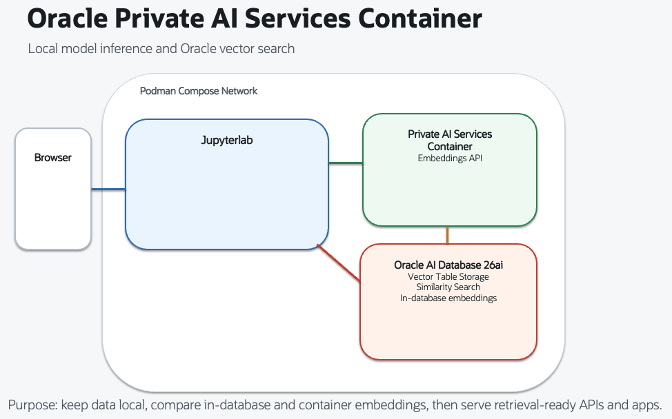

# Introduction

## About this Workshop

Welcome to **Build multimodal AI Vector Search using Oracle Private AI Service Container**.

Oracle Private AI Services Container exists to give you modern model inference inside your own environment. You get a local model endpoint without sending your text or images to a public AI service.

Its core value is control with flexibility:
- Keep **data inside your network** and security boundary
- Update model services **without changing core database** deployment
- **Reuse one model endpoint** across notebooks, SQL flows, and apps
- **Support multimodal patterns**, such as image and text embeddings in one solution

Use each path for a different job:
- **In-database embeddings (`provider=database`)** fit SQL-first workflows with minimal moving parts.
- **Private AI Services Container (`provider=privateai`)** fits teams that need model agility, multimodal use cases, or shared model serving across tools.

Compared with public embedding APIs, a private container is often the stronger enterprise choice:
- Sensitive data does not leave your environment
- Latency and cost are more predictable on local network paths
- Development is less exposed to external quotas, endpoint drift, and service outages

In the following labs you will work not only with in-database embedding but **specifically** with the Oracle Private AI Services Container to:
- discover available models in the Oracle Private AI Services Container
- generate embeddings using ONXX models stored in the Oracle AI Database and via the API endpoint provided by the Oracle Private AI Services Container.
- store vectors in Oracle AI Database
- run cosine similarity search
- build a simple image search app that used multimodal embedding models

Estimated Workshop Time: 90 minutes

### Architecture at a Glance

- `jupyterlab` runs Python notebooks.
- `privateai` serves embedding models at `http://privateai:8080` on the container network.
- `aidbfree` stores documents and vectors.

### Objectives

In this workshop, you will:
- Validate the runtime services required for the lab
- Generate embeddings with both database-stored ONNX models and Oracle Private AI Services Container
- Perform semantic similarity search in Oracle AI Database 26ai
- Build a simple image app that uses multimodal embeddings for similarity search

## Learn More

- [Oracle Private AI Services Container User Guide](https://docs.oracle.com/en/database/oracle/oracle-database/26/prvai/oracle-private-ai-services-container.html)
- [Private AI Services Container API Reference](https://docs.oracle.com/en/database/oracle/oracle-database/26/prvai/private-ai-services-container-api-reference.html)
- [DBMS_VECTOR UTL_TO_EMBEDDING](https://docs.oracle.com/en/database/oracle/oracle-database/26/vecse/utl_to_embedding-and-utl_to_embeddings-dbms_vector.html)

## Acknowledgements
- **Author** - Oracle LiveLabs Team
- **Last Updated By/Date** - Oracle LiveLabs Team, March 2026
