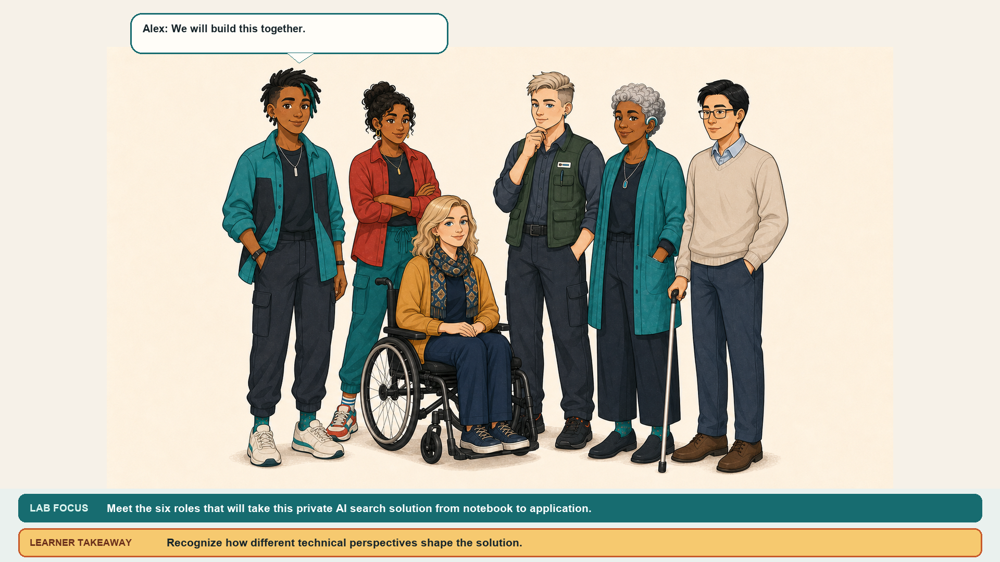
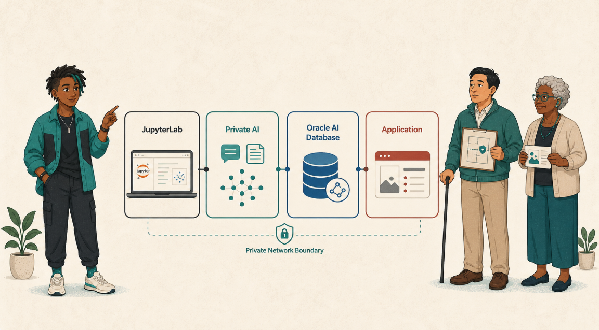

# Introduction

## About this Workshop

Welcome to **Build multimodal AI Vector Search using Oracle Private AI Services Container**.

The team has a practical challenge: make internal documents and images searchable with AI without sending sensitive data to a public service. Alex, Jordan, Sam, Priya, Maya, and Casey will build the solution together, testing where inference should happen and how the result should reach a user.

The team begins with a question that many enterprise AI teams face: how can they make private documents and images searchable without sending the underlying data to a public AI service? Their answer will depend on more than choosing a model. They must understand the runtime, compare two inference paths, and prove that the final search experience works.

You join the team as they turn that question into a working solution. The labs move from orientation to implementation, so each result gives you the context needed for the next decision.

### **Follow the Team's Investigation**

- **Jordan starts in JupyterLab.** The team runs notebooks, inspects files, and uses the terminal. This first step matters because every later experiment depends on knowing where the code, data, and results live.
- **Sam checks the environment.** Before anyone troubleshoots application code, you verify that JupyterLab, Private AI Services Container, Oracle AI Database, and ORDS can reach one another. By the end of this step, you have evidence that the runtime is ready.
- **Alex makes the architecture decision.** The team can generate embeddings inside Oracle AI Database with an ONNX model using **`provider=database`**, or call a model endpoint hosted by Oracle Private AI Services Container using **`provider=privateai`**. The database path keeps the workflow close to SQL and the data, with fewer moving parts. The private service path keeps model serving flexible and makes it easier to support multimodal use cases or share one endpoint across notebooks, database workflows, and applications.
- **Priya turns the experiment into an application.** Text and images are converted into comparable vectors, cosine similarity ranks the results, and a Flask application returns the most relevant images. This is where the architecture becomes useful beyond the notebook.
- **Maya compares models by the job.** You examine result quality, request time, and operational fit rather than relying on model name alone. The optional next steps leave you with a pattern you can adapt to your own data, models, and applications.

### **Why This Matters**

Running inference inside your environment gives the team more control over sensitive data, network paths, model changes, and service dependencies. It also avoids sending every embedding request to a public endpoint with external quotas, endpoint changes, or usage-based charges. The goal is not simply to create vectors; it is to understand where inference belongs and why that choice matters for an enterprise application.

Estimated Workshop Time: 100 minutes, including optional next steps

### **Architecture at a Glance**

### Objectives

By the end of the workshop, you will have followed the complete path from notebook to application:

- Orient yourself in JupyterLab and run the workshop code
- Prove that the private runtime services are reachable
- Generate and store embeddings with both supported inference paths
- Search vectors with cosine similarity in Oracle AI Database
- Compare models using quality, latency, and operational fit
- Build a multimodal image-search application that uses the vectors

## Learn More

- [Oracle Private AI Services Container User Guide](https://docs.oracle.com/en/database/oracle/oracle-database/26/prvai/oracle-private-ai-services-container.html)
- [Private AI Services Container API Reference](https://docs.oracle.com/en/database/oracle/oracle-database/26/prvai/private-ai-services-container-api-reference.html)
- [DBMS_VECTOR UTL_TO_EMBEDDING](https://docs.oracle.com/en/database/oracle/oracle-database/26/vecse/utl_to_embedding-and-utl_to_embeddings-dbms_vector.html)

## Acknowledgements
- **Author** - Kevin Lazarz & Matt Kowalik
- **Last Updated By/Date** - Matt Kowalik, September 2026
