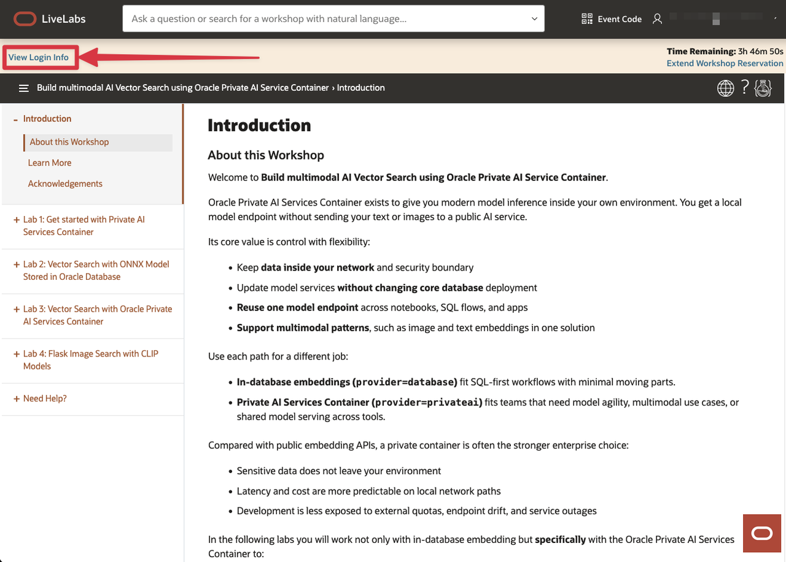
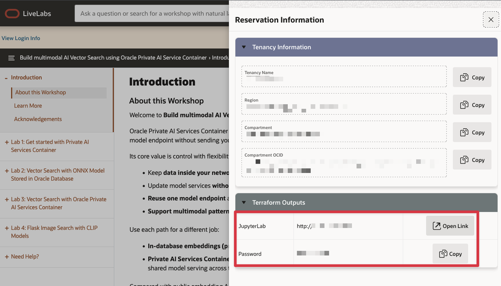
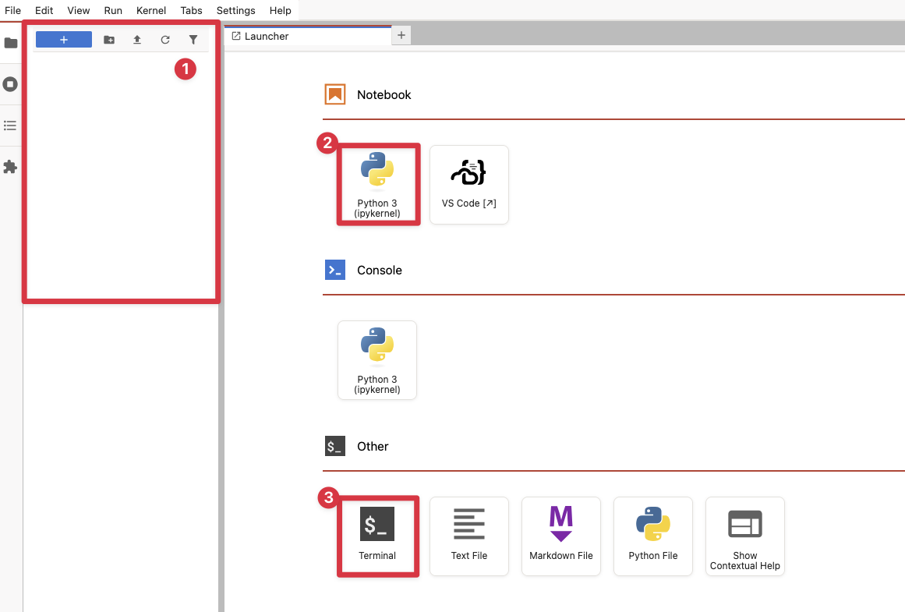
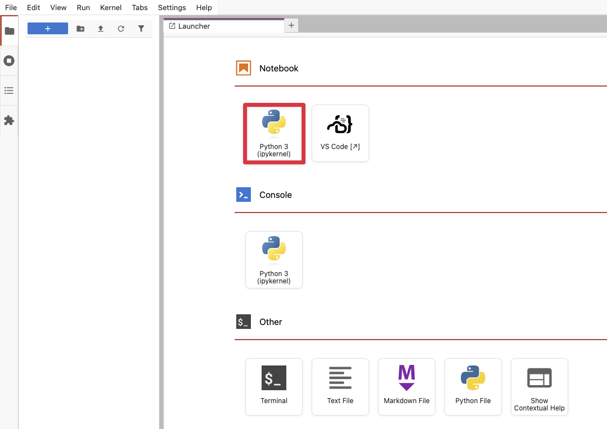
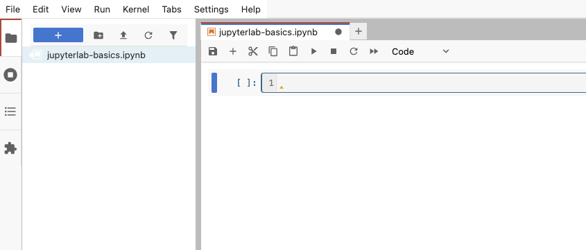
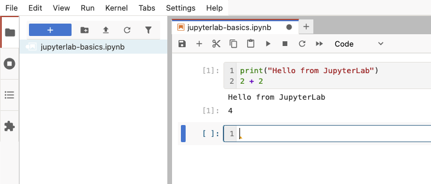
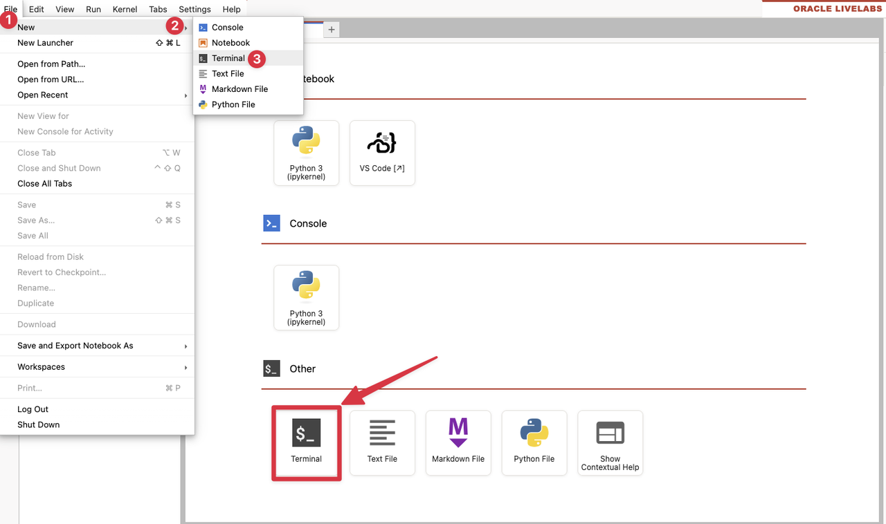

# Lab 1: Login to JupyterLab and work with Notebooks

## Introduction

This workshop uses JupyterLab for three common tasks:
- opening notebook files
- running Python notebook cells
- opening a terminal when you need shell commands

If you are new to JupyterLab, spend a few minutes in this lab first. You will learn how to open a notebook, run cells, and open a terminal. These are the JupyterLab skills you need for the remaining labs.

Estimated Time: 5 minutes

### Objectives

In this lab, you will:
- Identify the file browser, launcher, notebook, and terminal areas in JupyterLab
- Create a new notebook with the Python kernel
- Run code cells and understand execution prompts and output
- Open a terminal for later workshop tasks

### Prerequisites

This lab assumes:
- You can open the JupyterLab URL provided for your workshop environment
- You have the password or access details supplied with your reservation

## Task 1: Login to JupyterLab workspace

1. After you launched the workshop, click **View Login Info** in the top left corner

    

2. Click **Copy** to copy the password to the clipboard. Then click **Open Link**, to access the JupyterLab login screen

    

3. Use the password to login to JupyterLab.

    

## Task 2: Review the JupyterLab workspace

1. Sign in to JupyterLab using the URL and password provided for your environment.

2. After login, review the main areas of the screen:
    1. the **File Browser** on the left,
    2. the **Notebook** tile in the main work area,
    3. and the **Terminal** tile in the main work area.

    

3. If the Launcher is not open, click the blue `+` button in the upper-left corner or choose `File` -> `New Launcher`.

## Task 3: Create a new notebook

1. In the Launcher, under **Notebook**, click **Python 3 (ipykernel)**.

    

2. JupyterLab opens a new notebook tab with one empty cell and a Python kernel indicator in the upper-right corner.

3. Rename the notebook to something easy to recognize, for example `jupyterlab-basics.ipynb`.

    

4. In the rest of this workshop you will usually open existing notebook files, but creating one now makes the notebook workflow easier to understand.

## Task 4: Run code cells

1. Click in the first empty cell and enter the following code:

    ```python
    <copy>
    print("Hello from JupyterLab")
    2 + 2
    </copy>
    ```

2. Run the cell with `Shift+Enter`.

3. Notice what changes after you execute the cell:
    - The prompt to the left of the cell changes from `[ ]` to `[*]` while the kernel is busy.
    - After the code finishes, JupyterLab replaces `[*]` with an execution number such as `[1]`.
    - The output appears directly below the cell.

    

4. You can also use the toolbar **Run** button instead of the keyboard shortcut.

5. Keep these shortcuts in mind:
    - `Shift+Enter` runs the cell and moves to the next cell.
    - `Ctrl+Enter` or `Cmd+Enter` runs the cell and keeps the current cell selected.
    - `Alt+Enter` runs the cell and inserts a new cell below.


## Task 5: Open a terminal and manage the kernel

1. Later labs use a terminal for `curl`, `wget`, and shell commands. Open a terminal from `File` -> `New` -> `Terminal`, or choose the **Terminal** tile in the Launcher.

    

2. If a notebook cell runs longer than expected, select `Kernel` -> `Interrupt Kernel` to stop the current execution.

3. If the notebook state becomes inconsistent, select `Kernel` -> `Restart Kernel`, then rerun the required cells from top to bottom.

4. You are now ready to continue with the environment checks in Lab 2.

## Acknowledgements
- **Author** - Oracle LiveLabs Team
- **Last Updated By/Date** - Oracle LiveLabs Team, April 2026
