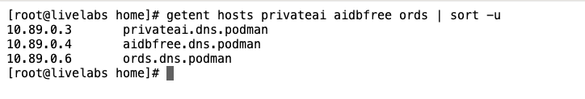
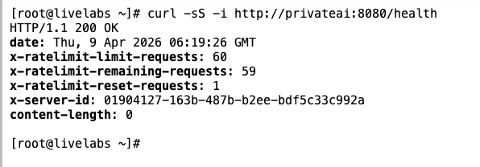
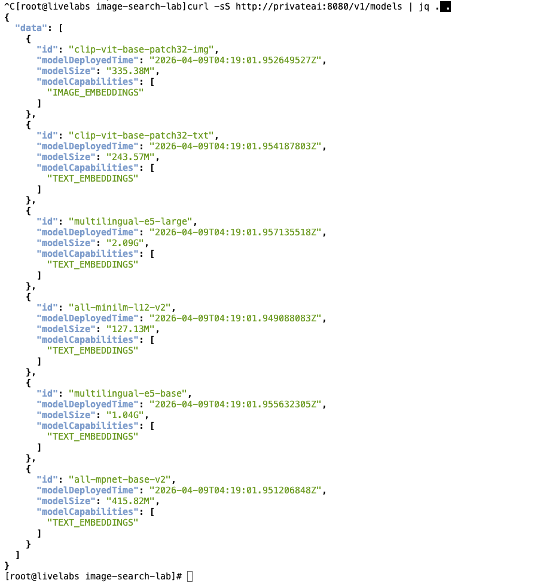

# Lab 2: Verify the Runtime Environment

## Introduction

In this lab, you verify that the Oracle Private AI Services Container API endpoints are reachable on the network.
You will also learn how to list all the models available in the container.
All checks are executed from a **JupyterLab Terminal**.

Estimated Time: 10 minutes

### Objectives

In this lab, you will:
- Verify internal container DNS resolution from JupyterLab
- Validate Private AI health and model list
- Confirm Oracle AI Database and ORDS reachability from JupyterLab

### Prerequisites

This lab assumes:
- You can open a terminal in JupyterLab (`File` -> `New` -> `Terminal`) or click the `Terminal` tile on the home page


## Task 1: Verify Internal Hostname Resolution

1. In JupyterLab, open a new terminal.

    

2. Verify that runtime service names resolve:

    ```bash
    <copy>getent hosts privateai aidbfree ords | sort -u</copy>
    ```

    Expected: one IP entry for each service name.

    

## Task 2: Validate Private AI Services Container REST Endpoints and list available models

1. Let's first check that the Health REST endpoint of the Private AI Services Container:

    ```bash
    <copy>curl -sS -i http://privateai:8080/health</copy>
    ```

    Expected: HTTP `200`.

    

2. Now we list all deployed models that come with the Private AI Services Container:

    ```bash
    <copy>curl -sS http://privateai:8080/v1/models | jq .</copy>
    ```

    Expected: JSON payload with a `data` array of model IDs.

    

3. Review the models
   
   Use the table below as a quick model-selection guide after you run `/v1/models`:

   | Model ID | Capabilities | Model Size | Typical Use Case | When to Choose It |
   | --- | --- | --- | --- | --- |
   | `clip-vit-base-patch32-img` | `IMAGE_EMBEDDINGS` | `335.38M` | Create embeddings for images/photos. | Choose for image indexing and visual similarity search. Pair with `clip-vit-base-patch32-txt` for text-to-image retrieval. |
   | `clip-vit-base-patch32-txt` | `TEXT_EMBEDDINGS` | `243.57M` |  Create text embeddings compatible with CLIP image vectors. | Choose for natural-language queries against a CLIP image index. |
   | `all-minilm-112-v2` | `TEXT_EMBEDDINGS` | `127.13M` |  Lightweight general-purpose text embeddings. | Choose for fastest startup and lower resource usage in English-focused semantic search. |
   | `all-mpnet-base-v2` | `TEXT_EMBEDDINGS` | `415.82M` | Higher-quality English semantic embeddings. | Choose when retrieval quality matters more than model size and latency. |
   | `multilingual-e5-base` | `TEXT_EMBEDDINGS` | `1.04G` |  Multilingual semantic search across many languages. | Choose for mixed-language corpora or non-English user queries. |
   | `multilingual-e5-large` | `TEXT_EMBEDDINGS` | `2.09G` | Large text embedding model Multilingual semantic search across many languages. | Choose when you want strongest semantic coverage and can accept higher memory/latency cost. |
    {: title="Models deployed in Oracle Private AI Services Container"}

   Rule of thumb:
   - For image search: use the CLIP pair (`clip-vit-base-patch32-img` + `clip-vit-base-patch32-txt`).
   - For text-only search: start with `all-minilm-112-v2`, then move to larger models if quality needs improvement.
   - For non-English text: start with `multilingual-e5-base` and move to `multilingual-e5-large` if you need better accuracy.


## Acknowledgements
- **Author** - Oracle LiveLabs Team
- **Last Updated By/Date** - Oracle LiveLabs Team, April 2026
