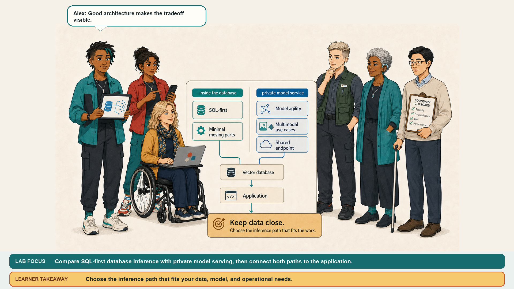

# Optional Lab: Next Steps

## Introduction

The core solution is working, and Casey asks what the team should build next. The same private inference and vector-search pattern can grow into document chunking, an ORDS endpoint, or broader model experiments.

Casey asks you to choose the next practical extension rather than start from scratch. The notebook and Flask app already provide the foundation: private model inference creates vectors, Oracle AI Database stores them, and vector search finds related content. In this optional lab, you will sketch how that foundation can grow with the needs of an application.

Estimated Time: 10 minutes

### Option 1: Add PDF Chunking

When a document is too large to embed as one item, Casey suggests breaking it into meaningful chunks. You can create a `DOCUMENTS` and `DOC_CHUNKS` pipeline, use `DBMS_VECTOR.UTL_TO_CHUNKS`, and generate each chunk’s embedding with `UTL_TO_EMBEDDING` and provider `privateai`. The result is a searchable document corpus where a query can retrieve the most relevant passage instead of an entire file.

### Option 2: Expose Search Through ORDS

If the team wants other applications to use the search capability, the next step is to give it an API. Create a stored procedure that accepts query text, returns the top-k rows from the vector search SQL, and publish it through ORDS under a chosen base path. This turns the database search logic into a reusable service without moving the data out of the private environment.

### Option 3: Compare Models

If the search results are promising but the team is unsure which model to standardize on, Casey points back to the evidence. Enumerate `/v1/models`, regenerate vectors with different model IDs, and compare retrieval quality with latency. Use the model-comparison lab for a beginner-friendly JupyterLab walkthrough before choosing the model that best fits the workload.

### Objectives

In this lab, you will:
- Identify practical extensions to the notebook and Flask patterns built in this workshop
- Plan follow-on experiments for PDF chunking, ORDS publication, and model comparison

## Acknowledgements
- **Author** - Kevin Lazarz & Matt Kowalik
- **Last Updated By/Date** - Matt Kowalik, September 2026
