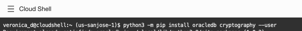

# Environment setup

## Introduction

This lab will show you how to install the **python-oracledb** driver and how to test the connection to the Oracle Autonomous Database.

Estimated Time: 10 minutes

### Objectives

In this lab, you will:

- install python-oracledb driver
- test connection to the Oracle Autonomous Database using the python-oracledb driver thin connection

### Prerequisites

- Having completed [Setup Autonomous Database Instance](../Lab1-adb/adb.md)  -- TODO: verify links
- Install Python 3 if not already available. It can be obtained from your operating system package library or from [python.org](https://python.org). On Windows, use Python 3.7 or later. On macOS, use Python 3.8 or later. On Linux, use Python 3.6 or later.

*Note: Cloud Shell used in this LiveLab has Python 3.8.13 preinstalled.*

## Task 1: Install _python-oracledb_ driver

1.  On Oracle Linux 8, run the following in the Cloud Shell:
    ````
    <copy>
    $ python3 -m pip install oracledb cryptography --user
    </copy>
    ````
 
.

## Task 2: Download the sample files on Cloud Shell
**TODO** DO WE NEED TO SETUP A BUCKET WHERE TO UPLOAD THE TUTORIAL?

1. The Python scripts used in this LiveLab are in the python-oracledb GitHub repository.

Download a zip file of the repository from here and unzip it. Alternatively you can use 'git' to clone the repository. 
    ````
    <copy>
    $ git clone https://github.com/oracle/python-oracledb.git
    </copy>
    ````

**or a PUBLIC BUCKET TODO** -- NEED CHRIS INPUT

 

The **samples/tutorial** directory has scripts to run and modify. The **samples/tutorial/solutions** directory has scripts with suggested code changes. The **samples/tutorial/sql** directory has all the SQL scripts used by the Python files to create database tables and other objects.
.

## Task 3: Test Connection to Oracle Autonomous Database
By default, python-oracledb runs in a ‘Thin’ mode which connects directly to Oracle Database. This mode does not need Oracle Client libraries. However, some additional functionality is available when python-oracledb uses them. Python-oracledb is said to be in ‘Thick’ mode when Oracle Client libraries are used. Both modes have comprehensive functionality supporting the Python Database API v2.0 Specification.

There are two ways to create a connection to Oracle Autonomous Database using python-oracledb driver:
- **Standalone connections**: [standalone connections](https://python-oracledb.readthedocs.io/en/latest/user_guide/connection_handling.html#standaloneconnection) are useful when the application needs a single connection to the database. Connections are created by calling **oracledb.connect()**
- **Pooled connections**: [connection pooling](https://python-oracledb.readthedocs.io/en/latest/user_guide/connection_handling.html#connpooling) is important for performance when applications frequently connect and disconnect from the database. Pools support Oracle's [high-availability](https://python-oracledb.readthedocs.io/en/latest/user_guide/ha.html#highavailability) features and are recommended for applications that must be reliable. Small pools can also be useful for applications that want a few connections available for infrequent use. Pools are created with **oracledb.create_pool()** at application initialization time, and then **ConnectionPool.acquire()** can be called to obtain a connection from the pool

1. In order to connect to the Oracle Autonomous Database, we need a few arguments used by the connection:
    - **user**:     for this exercise we'll be using the Admin user
    - **password**: password for Admin user
    - **dsn**:      data source name for the Oracle Autonomous Database created
    - **wallet_location**: the location where the wallet was saved
    - **wallet_password**: the password setup for the wallet 

    For this simple exercise to test the connection, we are going to hardcode the values of each of the arguments.

2. Create a .py script to connect to Oracle Autonomous Database and edit it to reflect the following:

    ````
    $ cd samples/tutorial
    $ vi test.py
    ````

    
    
    ````
    <copy>
    import oracledb

    con = oracledb.connect(user="Admin", password="Cloud123", dsn="""(description= (retry_count=20)(retry_delay=3)(address=(protocol=tcps)(port=1522)(host=adb.us-sanjose-1.oraclecloud.com))(connect_data=(service_name=g3f2a0f6aeefec7_db20220721220247_high.adb.oraclecloud.com))(security=(ssl_server_cert_dn="CN=adb.us-sanjose-1.oraclecloud.com, OU=Oracle ADB SANJOSE, O=Oracle Corporation, L=Redwood City, ST=California, C=US")))""", 
    wallet_location="/Users/vvdumitr/instantclient_19_8/network/admin", wallet_password="python123")

    print("Database version: ", con.version)
    </copy>
    ````
3. Run the python script and expect the ADB version to populate. This means that the connection to the database has been successful

    ````
    <copy>
    python3 test.py
    </copy>
    ````

    

## Acknowledgements
- **Author** - Veronica Dumitriu
- **Contributors** - Chris Jones
- **Last Updated By/Date** - Veronica Dumitriu, July 2022