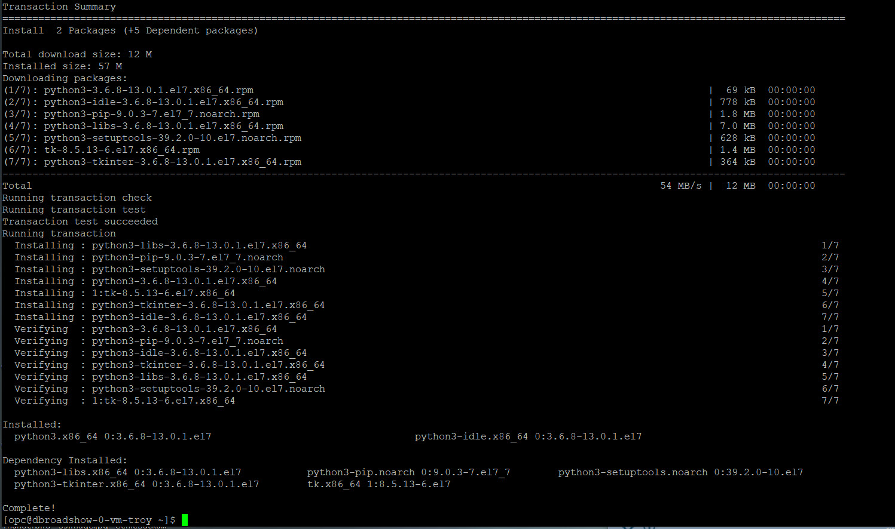
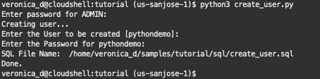
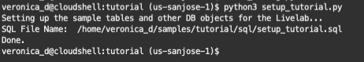
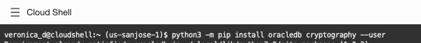
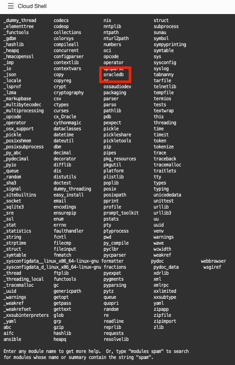

# Python-oracledb driver for Oracle Database: The New Wave of Scripting

## Introduction

This tutorial is an introduction to using Python with Oracle Database. It contains beginner and advanced material. Sections can be done in any order. Choose the content that interests you and your skill level.

Follow the steps in this document. The **tutorial** directory has scripts to run and modify. The **tutorial/solutions** directory has scripts with the suggested code changes.

Estimated Lab Time: 10 minutes

### About python-oracledb driver

**python-oracledb** driver is a Python extension module that enables access to Oracle Database. This latest, renamed release of the widely used cx_Oracle driver introduces a new ‘Thin’ mode for direct connection to the database and it conforms to the Python database API 2.0 specification with a considerable number of additions and a couple of exclusions.

python-oracledb driver is compatible with Python versions 3.6 through 3.10. Prebuilt packages are available on Windows for Python 3.7 or later, on macOS for Python 3.7 or later, and on Linux for Python 3.6 or later.

python-oracledb 1.0 is available.
It introduces a default **Thin** mode for direct connection to Oracle Database and Oracle client libraries are optional.
In **Thick** mode, some advanced Oracle Database functionality is currently only available when optional Oracle Client libraries are loaded by python-oracledb. Libraries are available in the free Oracle Instant Client packages. Python-oracledb can use Oracle Client libraries 11.2 through 21c.

Python is open-source, cross-platform, and free of cost. There's no excuse not to give Python a try!

### Objectives

*  Learn best practices and efficient techniques for connection management
* Learn how to validate Python operations

### Prerequisites

This lab assumes you have completed the following labs:
* Login to Oracle Cloud
* Create Autonomous Database
* Environment Setup

## Task 1: Install Python

Python comes preinstalled on most Linux distributions, and for this LiveLab, the Cloud Shell already has Python 3.8.13 preinstalled. The Python packages can be obtained from the software repository of your Linux distribution using the package manager.

1.  Open up the Oracle Cloud Shell check if python3 has been installed by running the command.

    ````
    <copy>
    python3 -V
    </copy>
    ````

    For this tutorial Python Version 3.6 (or later) is preferred. python-oracledb version 1.0 (or later) is needed. 
    Oracle Autonomous Database needs to be created in order to connect to it using a wallet.

3.  Upgrade Python if you do not have Python 3 installed. There is no harm in running this command multiple times, the system will either install packages or let you know they are already installed.

    ````
    <copy>
    sudo yum -y install python3 python3-tools
    </copy>
    ````

    

## Task 2: Add a New Schema in your Oracle Autonomous Database

1.  Review *db\_config\_sys.py* in the tutorial directory. This file is included in other Python files for creating and dropping the tutorial user.
Edit db\_config\_sys.py file and change the default values to match the system connection information for your environment. Alternatively, you can set the given environment variables in your terminal window. For the DSN string, copy the text of the dsn.txt file.

    ````
    <copy>
    import oracledb
    import os
    import getpass
    #
    # Tutorial credentials and connection string for the SYSTEM (ADMIN) user.
    # Environment variable values are used, if they are defined.
    #
    sysuser = "ADMIN"
    dsn="""(description= (retry_count=20)(retry_delay=3)(address=(protocol=tcps)(port=1522)(host=adb.us-sanjose-1.oraclecloud.com))(connect_data=(service_name=g3f2a0f6aeefec7_db20220721220247_high.adb.oraclecloud.com))(security=(ssl_server_cert_dn="CN=adb.us-sanjose-1.oraclecloud.com, OU=Oracle ADB SANJOSE, O=Oracle Corporation, L=Redwood City, ST=California, C=US")))"""
    
    syspw = os.environ.get("PYTHON_SYSPASSWORD")
    wallet_location="/home/veronica_d/Wallets"
    wallet_password="python123"
    if syspw is None:
        syspw = getpass.getpass("Enter password for %s: " % sysuser)
    </copy>
    ````

2. Review *db\_config.py* (thin mode), and *db\_config.sql* files in the tutorial and tutorial/sql directories respectively. These are included in other Python and SQL files for setting up the database connection.

Edit db_config.py file and change the default values to match the connection information for your environment.

**TODO: review which user needs to be used: ADMIN or PYTHONDEMO**

3.  In this tutorial you will create a new schema in OADB.
Review the grants created in *samples/tutorial/sql/create\_user.sql* by opening it in vi. Then open a terminal window and run create\_user.py to execute the create\_user.sql script and create the new schema. This tutorial uses the name **pythondemo** for the new schema. 
*Note: The password you enter for the schema must contain at least an Upper letter:

    ````
    <copy>
    python3 create_user.py
    </copy>
    ````
    If it runs successfully, you will see something similar below:

    

4. If for any reason you need to drop the user, review the *samples/tutorial/sql/drop\_user.sql* file and then run
    ````
    <copy>
    python3 drop_user.py
    </copy>
    ````

5. Install the tables and other database objects for the Livelab
- Once you have a database user, then you can create the key tables and database objects for the Livelab by running *setup\_tutorial.py* (the environment setup file), using your values for the Livelab username, password and connection string:
    ````
    <copy>
    $ python setup_tutorial.py
    </copy>
    ````
This will call the setup_tutorial.sql file from tutorials/sql directory to setup some sample tables and database objects required for running the examples in the tutorial.
If it runs successfully, you will see something similar below:
    

## Task 3: Install python-oracledb driver 

1.  Install the `python-oracledb` module using python3 and pip. 

    ````
    <copy>
    python3 -m pip install oracledb cryptography --user
    </copy>
    ````

    

    *Note* At runtime, the module name of the python-oracledb package is **oracledb**

2.  Test your install by launching the python console and list the available modules.
    ````
    <copy>
    python3
    help('modules')
    </copy>
    ````

    This command will show you a list of installed modules that should include the oracledb module we installed in the previous step.

    
.

## Task 4: Connect to a Database
Connect to the Oracle database and print the version of the database via python. (This confirms you are connected to an Oracle instance and returns the database version.)

1. Review the code contained in *connect.py*:
    
````
<copy>
import oracledb
import db_config
    
con = oracledb.connect(user=db_config.user, password=db_config.pw, dsn=db_config.dsn, wallet_location=db_config.wallet_location, wallet_password=db_config.wallet_password)

print("Database version:", con.version)
</copy>
````

The username, the password, the connection string and the wallet information that you configured in the db\_config.py module is passed to the connect() method. By default, Oracle's Easy Connect connection string syntax is used.

2. Create a basic connection
Run the script and expect output as below:

````
<copy>
python3 connect.py
</copy>
````

The version number of the database should be displayed. An exception is raised if the connection fails. 


Adjust the username, password, or connection string parameters to invalid values to see the exception.

3. Indentation indicates code structure.
**TODO** -- remove?

4.  Executing a query.
    Open **query.py** in vi. It looks like:

    ````
    <copy>
    import oracledb
    import db_config
    
    con = oracledb.connect(user=db_config.user,
       password=db_config.pw, dsn=db_config.dsn, wallet_location=db_config.wallet_location, wallet_password=db_config.wallet_password)
    
    cur = con.cursor()
    cur.execute("select * from dept order by deptno")
    res = cur.fetchall()
    for row in res:
        print(row)
    ````

    Make sure the print(row) line is indented. This lab uses spaces, not tabs.

    The code executes a query and fetches all data.

    Save the file and run it:

    ````
    python3 query.py
    ````

    

    In each loop iteration a new row is stored in row as a Python "tuple" and is displayed.

    Fetching Data is described in a later section

5.  Closing connections

    Connections and other resources used by python-oracledb will automatically be closed at the end of scope. This is a common programming style that takes care of the correct order of resource closure.
    
    Resources can also be explicitly closed to free up database resources if they are no longer needed. This may be useful in blocks of code that remain active for some time.
    
    Open *query.py* in an editor and add calls to close the cursor and connection like:
    
    ````
    <copy>
    import oracledb
    import db_config
    
    con = oracledb.connect(user=db_config.user,
       password=db_config.pw, dsn=db_config.dsn, wallet_location=db_config.wallet_location, wallet_password=db_config.wallet_password)
    
    cur = con.cursor()
    cur.execute("select * from dept order by deptno")
    res = cur.fetchall()
    for row in res:
        print(row)
        
    cur.close()
    con.close()
    ````
    
    Running the script completes without error:
    
    ````
    <copy>
    python3 query.py
    </copy>
    ````
    
    
    
    If you swap the order of the two close() calls you will see an error.

6.  Checking versions

    Review the code contained in *versions.py*:

    ````
    import oracledb
    import db_config

    con = oracledb.connect(user=db_config.user, password=db_config.pw, dsn=db_config.dsn, wallet_location=db_config.wallet_location, wallet_password=db_config.wallet_password)

    print(oracledb.__version__)  # two underscores before and after the version
    print("Database version:", con.version)
    ````
    
    Run the script:

    ````
    python3 versions.py
    ````

    This gives the version of the oracledb interface.

    
.

## Conclusion

In this lab, you had an opportunity to try out connecting Python to the Oracle Database.
You have learned how to:
* Create connections


## Acknowledgements

* **Author** - Christopher Jones, Anthony Tuininga, Veronica Dumitriu
* **Contributors** - Jaden McElvey, Anoosha Pilli, Troy Anthony
* **Last Updated By/Date** - Veronica Dumitriu, DB Product Management, July 2022