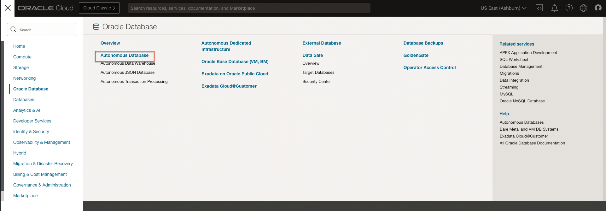
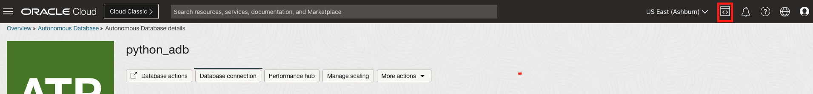

# Set up Autonomous Database Instance

## Introduction

This lab will show you how to setup a Free TIER Autonomous Database  instance.

**Oracle Cloud Infrastructure’s Autonomous Database** is a fully managed, preconfigured database environment with two workload types available: Autonomous Transaction Processing and Autonomous Data Warehouse. You don’t need to configure or manage any hardware, or install any software. After provisioning, you can scale the number of CPU cores or the storage capacity of the database at any time without impacting availability or performance.

Estimated Time: 15 minutes

### Objectives

In this lab, you will:

- Setup an Oracle Autonomous Database, shared infrastructure

### Prerequisites

This lab assumes you have: 
- An Oracle Free Tier or Paid Cloud account 


*Note: If you have a **Free Trial** account, when your Free Trial expires your account will be converted to an **Always Free** account. You will not be able to conduct Free Tier workshops unless the Always Free environment is available. **[Click here for the Free Tier FAQ page.](https://www.oracle.com/cloud/free/faq.html)***

## Task 1: Create an Autonomous Database Instance

1.  Login to your Oracle Cloud Account
2.  Click the **Navigation** Menu in the upper left, navigate to **Oracle Database** and select **Autonomous Database**

 

3. Create a new Autonomous Database Instance as following:
    - DB Display Name: python_adb
    - Workload Type: Transaction Processing
    - Choose a Deployment Type: Shared Infrastructure

 

4. Configure the Database
In the **Configure the Database** section, proceed with the following selections: 
    - Toggle: Always FREE
    - DB Version: 19c
    - Default OCPU count(1)
    - Default Storage (TB 0.02)

5. In the **Create Administrator Credentials** section, enter the password for the Admin user and make note of it, as this as this will be required in the subsequent labs.

 

6. In the **Choose Network Access** section, select 'Secure Access from Everywhere'

In the **Choose License and Oracle Database Edition** section, select 'License Included'

Hit **Create Autonomous Database** button
 

This process might take few minutes. You can check the status of the creation of the Autonomous Database Shared infrastructure, by using the Console.

Once Autonomous Database Shared Infrastructure is provisioned, it is automatically started and you should see the following summary

 
.

## Task 2: Download Oracle Autonomous Database Wallet

To connect to the Oracle Autonomous Database, you need the wallet file.

1.  In the Autonomous Database Summary screen, select **DB Connection** tab and in the popup **Database Connection** window, in the **Download Client Credentials (Wallet)** section, 
    -  select Wallet Type: Instance Wallet
    - hit **Download Wallet** button

 

2. Specify a password for the Wallet

Hit **Download** button and save the wallet as a zip file to a location on your local laptop, then click Close to close the popup window. We will upload this file on Console Shell in the next task, so please make a note of the location where the .zip wallet is saved.

 

Make a note of the password as this will be used for the database connection and it is required in the subsequent labs.
.

## Task 3: Upload Wallet to the Cloud Shell

**Cloud Shell**  is a web browser-based terminal accessible from the Oracle Cloud Console and available to all Oracle Cloud Infrastructure users. It’s free to use (within monthly tenancy limits), and it provides access to a Linux shell with a pre-authenticated CLI and other useful tools for following Oracle Cloud Infrastructure service tutorials and labs. The Cloud Shell appears in the Console as a persistent frame and stays active as you navigate to different parts of the Console. Cloud Shell is pre-authenticated with your console credentials.

In the Oracle Autonomous Database Summary screen, we're going to launch Cloud Shell (this has Python pre-installed), and we're going to connect to the Autonomous Database Shared infrastructure, using the Wallet downloaded at the previous task.  

1. To launch Cloud Shell, sign in to your Oracle Cloud Infrastructure tenancy and click the command prompt icon in Console header:

 

2. When connected, the following should display:
 

3. Drag and drop the Wallet archive from the location where it was saved, to the Console Shell
 

4. Unzip the wallet
In your home folder, create directory _Wallets_ and move the wallet archive to Wallets folder. We are going to unzip the file in this directory
    ````
    $ mkdir Wallets
    $ mv Wallet\_python_adb.zip ./Wallets
    $ cd Wallets
    $ unzip Wallet\_python_adb.zip
    ````
    
.

## Task 4: Copy Oracle Autonomous Database DSN string

One of the arguments used in to connect to the Oracle Autonomous Database is the DSN (data source name).  

1.  In the ADB Summary screen, select **DB Connection** tab and in the popup **Database Connection** window, in the **TNS Name** section, **Show** the connection string for the high service level TNS name
    
2. Click 'Close' to close the popup window.

## Acknowledgements
- **Authors** - Veronica Dumitriu
- **Contributors** - Chris Jones
- **Last Updated By/Date** - Veronica Dumitriu, July 2022