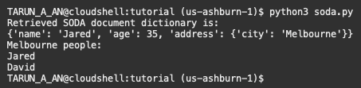
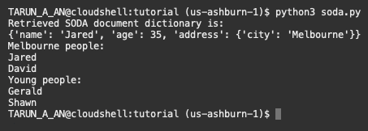

# Simple Oracle Document Access (SODA)

## Introduction

Simple Oracle Document Access (SODA) is a set of NoSQL-style APIs. Documents can be inserted, queried, and retrieved from Oracle Database. By default, documents are JSON strings. SODA APIs exist in many languages. It is usable in python-oracledb's thick mode. Documentation link for further reading: [Simple Oracle Document Access (SODA)](https://python-oracledb.readthedocs.io/en/latest/user_guide/soda.html).

Estimated Time: 5 minutes

### Objectives

*  Learn best practices and efficient techniques for using SODA to retrieve, insert and query documents from Oracle databases.

### Prerequisites

This lab assumes you have completed the following labs:
* Login to Oracle Cloud
* Create Oracle Autonomous Database shared infrastructure
* Environment Setup

## Task 1: Inserting JSON Documents

1. Review *soda.py*:

    ````
    <copy>
    import oracledb
    import db_config_thick as db_config

    con = oracledb.connect(user=db_config.user,password=db_config.pw, dsn=db_config.dsn, 
                            config_dir=db_config.config_dir, wallet_location=db_config.wallet_location, wallet_password=db_config.wallet_password)

    soda = con.getSodaDatabase()
    # Explicit metadata is used for maximum version portability
    
    metadata = {
                "keyColumn": {
                    "name":"ID"
                },
                "contentColumn": {
                    "name": "JSON_DOCUMENT",
                    "sqlType": "BLOB"
                },
                "versionColumn": {
                    "name": "VERSION",
                    "method": "UUID"
                },
                "lastModifiedColumn": {
                    "name": "LAST_MODIFIED"
                },
                "creationTimeColumn": {
                    "name": "CREATED_ON"
                }
            }
           
    collection = soda.createCollection("friends", metadata)
    
    content = {'name': 'Jared', 'age': 35, 'address': {'city': 'Melbourne'}}
    
    doc = collection.insertOneAndGet(content)
    key = doc.key
    
    doc = collection.find().key(key).getOne()
    content = doc.getContent()
    print('Retrieved SODA document dictionary is:')
    print(content)

    </copy>
    ````

    **soda.createCollection()** will create a new collection, or open an existing collection, if the name is already in use. 

    **insertOneAndGet()** inserts the content of a document into the database and returns a SODA Document Object. This allows access to metadata such as the document key. By default, document keys are automatically generated.

    The **find()** method is used to begin an operation that will act upon documents in the collection.

    **content** is a dictionary. You can also get a JSON string by calling **doc.getContentAsString()**.

2. Run the file:

    ````
    <copy>
    python3 soda.py
    </copy>
    ````

    The output shows the content of the new document.

## Task 2:  Searching SODA Documents

1. Extend *soda.py* to insert some more documents and perform a find filter operation:

    ````
    <copy>
    myDocs = [
        {'name': 'Gerald', 'age': 21, 'address': {'city': 'London'}},
        {'name': 'David', 'age': 28, 'address': {'city': 'Melbourne'}},
        {'name': 'Shawn', 'age': 20, 'address': {'city': 'San Francisco'}}
    ]
    collection.insertMany(myDocs)

    filterSpec = { "address.city": "Melbourne" }
    myDocuments = collection.find().filter(filterSpec).getDocuments()

    print('Melbourne people:')
    for doc in myDocuments:
        print(doc.getContent()["name"])
    </copy>
    ````

2. Run the script again:

    ````
    <copy>
    python3 soda.py
    </copy>
    ````

    The find operation filters the collection and returns documents where the city is Melbourne. Note the **insertMany()** method is currently in preview.

    

    SODA supports query by example (QBE) with an extensive set of operators. 

3. Extend *soda.py* with a QBE to find documents where the age is less than 25:

    ````
    <copy>
    filterSpec = {'age': {'$lt': 25}}
    myDocuments = collection.find().filter(filterSpec).getDocuments()

    print('Young people:')
    for doc in myDocuments:
        print(doc.getContent()["name"])
    </copy>
    ````

    Running the script displays the names.

    

## Conclusion

In this lab, you had an opportunity to try out connecting Python to the Oracle Database.
You have learned how to use SODA to query, insert and retrieve documents from Oracle databases

## Acknowledgements

* **Authors** - Christopher Jones, Anthony Tuininga, Sharad Chandran, Veronica Dumitriu
* **Contributors** - Jaden McElvey, Anoosha Pilli, Troy Anthony
* **Last Updated By/Date** - Veronica Dumitriu, DB Product Management, Feb 2023