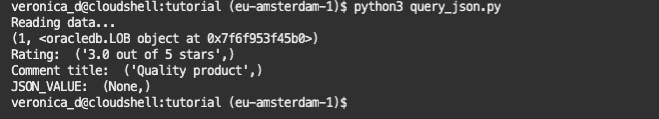

# Query a JSON table from Python

## Introduction

This section provides detail on how to work with JSON data in Oracle Autonomous Database using Python’s interface. The exercises include loading JSON data into a table, validating documents with IS JSON check, and querying JSON data from Python.

Estimated Time: 10 minutes

### Objectives

* Learn best practices and efficient techniques for working with JSON data in Oracle Autonomous Database using Python’s interface.

### Prerequisites

This lab assumes you have completed the following labs:
* Login to Oracle Cloud
* Create Oracle Autonomous Database Serverless
* Environment Setup

[Query a JSON table from Python](videohub:1_q6shm5lp)
## Task 1: Query data in a JSON table

The exercises include querying JSON data from a table in Oracle Autonomous Database from Python.

1. Review the code contained in *query_json.py*:

    ````
    <copy>
    import oracledb
    import db_config

    con = oracledb.connect(user=db_config.user,
                        password=db_config.pw, 
                        dsn=db_config.dsn, 
                        config_dir=db_config.config_dir, wallet_location=db_config.wallet_location, wallet_password=db_config.wallet_password)
    cur = con.cursor()

    cur.execute('select * from test_json_table')

    print ('Reading data...')

    for row in cur:
        print (row)

    </copy>
    ````

2. In Cloud Shell or in a terminal window, run:

    ````
    <copy>
    python3 query_json.py
    </copy>
    ````

    Python returns an empty row:

    

## Task 2: Insert a row into the JSON table

Next you're going to insert a row into the table and re-query the table.

1. Review *insert_json.py* to append the following lines:

    ````
    <copy>
    import oracledb
    import db_config

    con = oracledb.connect(user=db_config.user,
                        password=db_config.pw, 
                        dsn=db_config.dsn, 
                        config_dir=db_config.config_dir, 
                        wallet_location=db_config.wallet_location, 
                        wallet_password=db_config.wallet_password)

    cur = con.cursor()

    cur.execute('delete from TEST_JSON_TABLE')
    cur.execute('commit')

    cur.execute('insert into TEST_JSON_TABLE (JSON_DATA) values (\'{rating: "3.0 out of 5 stars", title: "Quality product", customer_name: "John Smith", date: "on 23 April 2023",colour: "Colour Name: Envoy colour",purchase_type: "Verified Purchase",comment: "Good service"}\')')
    cur.execute('commit')

    cur.close()
    con.close()

    </copy>
    ````
2. Run *insert_json.py* in Cloud Shell or in a terminal window:

    ````
    <copy>
    python3 insert_json.py
    </copy>
    ````


3. Re-query the table in Cloud Shell or in a terminal window:

    ````
    <copy>
    python3 query_json.py
    </copy>
    ````

    Python returns the LOB pointer:

    


## Task 3: Retrieve a portion of the JSON document

Retrieve and print the **rating** portion of the JSON document.

1. Edit *query_json.py* to append the following lines:

    ````
    <copy>

    # task 3
    cur.execute('select json_value(json_data, \'$.rating\') from TEST_JSON_TABLE')

    for row in cur:
        print ('Rating: ', row)

    </copy>
    ````

2. In Cloud Shell or in a terminal window, rerun the query_json.py file and notice the results:

    ````
    <copy>
    python3 query_json.py
    </copy>
    ````

    Python returns the **rating**:

    

3. Retrieve the **comment titles**

    Edit *query_json.py* file to append the following lines of code:

    ````
    <copy>

    cur.execute('select json_value(json_data, \'$.title\') from test_json_table')

    for row in cur:
        print ('Comment title: ', row)

    </copy>
    ````

4. In Cloud Shell or in a terminal window, rerun the query_json.py file and notice the results:

    ````
    <copy>
    python3 query_json.py
    </copy>
    ````

    Python returns the **title**:

    

## Task 4: JSON\_VALUE and JSON\_QUERY

To retrieve a single value of a JSON document, use the JSON\_VALUE function. JSON\_VALUE retrieves only one value. JSON\_VALUE uses dot-notation syntax – JSON Path Expression – to navigate through a JSON document hierarchy. The dot-notation syntax is a table alias (represented by the ‘$’ sign) followed by a dot (.) and the name of a JSON column we want to retrieve (or more if the document structure includes nested values).

The results of the query are retrieved by a simple print row call. Now try retrieving the complete JSON document using JSON\_VALUE.

1. Edit *query_json.py* file to append the following lines of code:

    ````
    <copy>
    # task 4
    cur.execute('select json_value(json_data, \'$\') from test_json_table')

    for row in cur:
        print ('JSON_VALUE: ', row)
    </copy>
    ````

2. In Cloud Shell or in a terminal window, run the query_json.py file and notice the results:

    ````
    <copy>
    python3 query_json.py
    </copy>
    ````

    You will notice that no records are returned even though we know they have been populated with data. This is due to JSON_VALUE being able to work only with scalar SQL data types (that is, not an object or collection data type).

    

3. To retrieve fragments of a JSON document, JSON_QUERY has to be used.

    Edit *query_json.py* file to append the following lines of code:

    ````
    <copy>
    cur.execute('select json_query(json_data, \'$\') from test_json_table')

    for row in cur:
        print ('JSON_QUERY: ', row)

    </copy>
    ````

4. In Cloud Shell or in a terminal window, run the query_json.py file and notice the results:

    ````
    <copy>
    python3 query_json.py
    </copy>
    ````

    

## Task 5: Is it JSON or not?

You are going to insert a second row into the TEST\_JSON\_TABLE  table in a non-JSON format.

1. In Code Editor, review *insert_nonjson.py*:

    ````
    <copy>
    import oracledb
    import db_config

    con = oracledb.connect(user=db_config.user,
                        password=db_config.pw, 
                        dsn=db_config.dsn, 
                        config_dir=db_config.config_dir, 
                        wallet_location=db_config.wallet_location, 
                        wallet_password=db_config.wallet_password)

    cur = con.cursor()

    # task 5
    cur.execute('insert into TEST_JSON_TABLE (JSON_DATA) values (\'<rating> 3.0 out of 5 stars </rating> <title> Quality product </title> <customer_name> "Geir Gjorven </customer_name> <date> on 29 September 2014 </date> <colour> Colour Name: Envoy colour </colour> <purchase_type> Verified Purchase </purchase_type> <comment> Good service </comment>\')')
    cur.execute('commit')

    cur.close()
    con.close()
    </copy>
    ````

2. In Cloud Shell or in a terminal window, run *insert_nonjson.py* file:

    ````
    <copy>
    python3 insert_nonjson.py
    </copy> 
    ````
    
    The record is committed to the database without an error because the table does not specifically define its input has to be of the JSON format.


3. Check that the record has been added to the table by counting the number of rows in TEST\_JSON\_TABLE.

    In Code Editor, append the following lines to the *query_json.py* file:

    ````
    <copy>
    # task 5
    cur.execute('select count(*) from TEST_JSON_TABLE')

    for row in cur: 
        print ('Count rows: ', row)
    </copy>
    ````

    In Cloud Shell or in a terminal window, run query_json.py file:

    ````
    <copy>
    python3 query_json.py
    </copy> 
    ````

    Notice the results:

    

4. You can filter out records that do not follow JSON format with IS JSON and IS NOT JSON SQL extensions. First, check if there are any non-JSON records in the table.

    In Code Editor, append the following lines to the *query_json.py* file:

    ````
    <copy>
    cur.execute('select ID from TEST_JSON_TABLE where JSON_DATA IS NOT JSON')

    for row in cur: 
        print ('Is NOT JSON ID: ', row)
    </copy>
    ````

    In Cloud Shell or in a terminal window, run query_json.py file:

    ````
    <copy>
    python3 query_json.py
    </copy>
    ````

    Notice the results:

    

    *Note*: The index number may be different in the query executed, in which case change the ID from 2, as specified in the following DELETE statement.

5. Delete the non-JSON row(s) from TEST\_JSON\_TABLE.

    In Code Editor, review the code in file *delete\_nonjson.py* file

    ````
    <copy>
    import oracledb
    import db_config

    con = oracledb.connect(
                        user=db_config.user,
                        password=db_config.pw, 
                        dsn=db_config.dsn, 
                        config_dir=db_config.config_dir, 
                        wallet_location=db_config.wallet_location, 
                        wallet_password=db_config.wallet_password)

    cur = con.cursor()

    # task 5
    cur.execute('delete from TEST_JSON_TABLE where id in (select ID from TEST_JSON_TABLE where JSON_DATA IS NOT JSON)')
    cur.execute('commit')

    cur.close()
    con.close()
    </copy>
    ````

    In Cloud Shell or in a terminal window, run *delete_nonjson.py* file:

    ````
    <copy>
    python3 delete_nonjson.py
    </copy>
    ````

6. Check the results. In Cloud Shell or in a terminal window, run *query_json.py* file:

    ````
    <copy>
    python3 query_json.py
    </copy>
    ````

    Notice the results:

    

## Conclusion

In this lab, you had an opportunity to try out connecting Python to the Oracle Database.
You have learned how to create a table having JSON data, and to query the JSON data from a table using Python.

## Acknowledgements

* **Authors** - Troy Anthony, Veronica Dumitriu
* **Contributors** - Anoosha Pilli, Dylan
* **Last Updated By/Date** - Veronica Dumitriu, Product Management, Jul 2023
