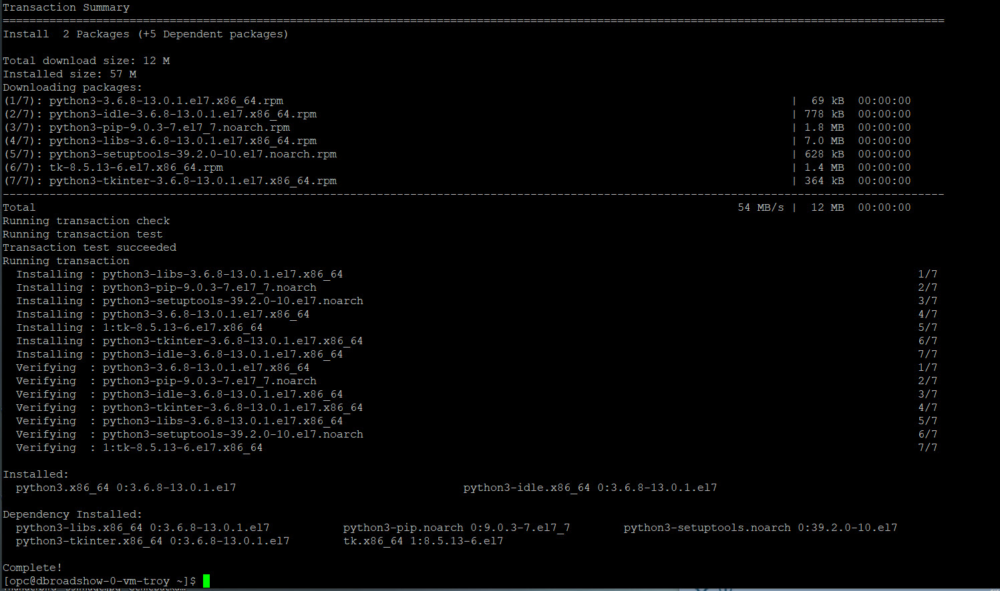
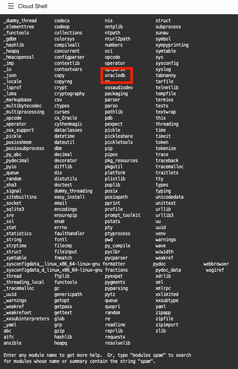
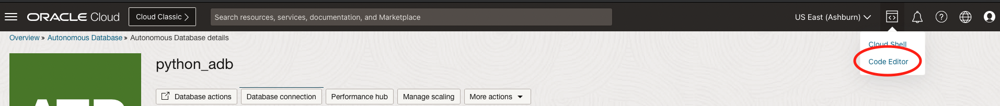
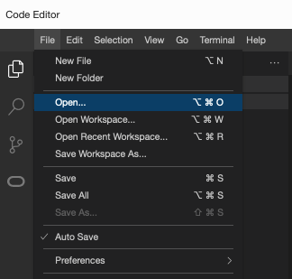

# Environment Setup

## Introduction

This tutorial is an introduction to using Python with Oracle Database. It contains beginner and advanced material. Follow the steps in this document. The **tutorial** directory has scripts to run and modify.
This lab will show you how to install the **python-oracledb** driver and how to configure and test the connection to the Oracle Autonomous Database, shared infrastructure.

Estimated Time: 5 minutes

Watch the video below for a quick walk-through of the lab.
[Environment Setup](videohub:1_s2pdny0p)

### About python-oracledb driver

**python-oracledb** driver is a Python extension module that enables access to Oracle Database. This latest, renamed release of the widely used cx_Oracle driver introduces a new ‘Thin’ mode for direct connection to the database and it conforms to the Python database API 2.0 specification with a considerable number of additions and a couple of exclusions.

python-oracledb driver is compatible with Python versions 3.6 through 3.11. Prebuilt packages are available on Windows for Python 3.7 or later, on macOS for Python 3.7 or later, and on Linux for Python 3.6 or later.

python-oracledb 1.3.2 is available. It has a default **Thin** mode for direct connection to Oracle Database and Oracle client libraries are optional.
In **Thick** mode, some advanced Oracle Database functionality is currently only available when optional Oracle Client libraries are loaded by python-oracledb. Libraries are available in the free Oracle Instant Client packages. Python-oracledb can use Oracle Client libraries 11.2 through 21c.

Python is open-source, cross-platform, and free of cost. There's no excuse not to give Python a try!

### Objectives

In this lab, you will:

* Install python-oracledb driver
* *Note: This Livelab is using Cloud Shell, which has Python 3.8.14 preinstalled.*
* Connect to the Oracle Autonomous Database shared infrastructure using the python-oracledb driver
* Learn how to validate Python operations

### Prerequisites

This lab assumes you have completed the following labs:
* Login to the Oracle Sandbox
* Have an Oracle Autonomous Database, shared infrastructure already created
* Install Python 3, if not already available. It can be obtained from your operating system package library or from [python.org](https://python.org). On Windows, use Python 3.7 or later. On macOS, use Python 3.8 or later. On Linux, use Python 3.6 or later.

## Task 1: Install Python 3

Python comes preinstalled on most Linux distributions, and for this LiveLab, the Cloud Shell already has Python 3.8.14 preinstalled, so you don't have to run this step. In case you wanted to install Python in your own environment, outside of Cloud Shell, the steps for installing it are provided below.
The Python packages can be obtained from the software repository of your Linux distribution using the package manager.

1.  Open up the Oracle Cloud Shell and check if python3 has been installed, by running the command:

    ````
<copy>
python3 -V
</copy>
    ````

    For this tutorial, Python version 3.6 (or later) is preferred. python-oracledb version 1.0 (or later) is needed.
    You must have an Oracle Autonomous Database already created, in order to connect to it using the python-oracledb driver.

2.  Upgrade Python if you do not have Python 3 installed. There is no harm in running this command multiple times, the system will either install packages or let you know they are already installed.

    ````
<copy>
    sudo yum -y install python3 python3-tools
</copy>
    ````

    

## Task 2: Install python-oracledb driver

1.  Check if the Python driver is already installed. If you get a warning that the module is not found, then proceed to install the `python-oracledb` module using python3 and pip.

    On Oracle Linux 8, run the following in the Cloud Shell:

    ````
<copy>
    pip show oracledb
    python3 -m pip install oracledb cryptography --user
</copy>
    ````
 

    *Note* At runtime, the module name of the python-oracledb package is **oracledb**

2.  Test your install by launching the python console and list the available modules.

    ````
    <copy>
    python3
    help('modules')
    </copy>
    ````

    This command will show you a list of installed modules that should include the oracledb module we installed in the previous step.

    

    Type exit() to return to the command line prompt

## Task 3: Download the sample files on Cloud Shell

1. Get the sample Python scripts from [here](https://objectstorage.us-ashburn-1.oraclecloud.com/p/G1OGqC7vt8o0M_AOM_MU18yrJ3-6_1f82XIHoZYc1au3mszv_brD6trhq9CsTd6l/n/c4u04/b/livelabsfiles/o/samples.zip):

    In the Cloud Shell, run the following:

    ````
    <copy>
    wget https://objectstorage.us-ashburn-1.oraclecloud.com/p/G1OGqC7vt8o0M_AOM_MU18yrJ3-6_1f82XIHoZYc1au3mszv_brD6trhq9CsTd6l/n/c4u04/b/livelabsfiles/o/samples.zip
    </copy>
    ````
2. In the Cloud Shell, navigate to your home directory and unzip the sample.zip file, then remove the .zip file:
    ````
    <copy>
    cd 
    unzip samples.zip
    </copy>
    ````
    ````
    <copy>
    rm samples.zip
    </copy>
    ````


    

The **samples/tutorial** directory has scripts to run and modify. The **samples/tutorial/sql** directory has all the SQL scripts used by the Python files to create database tables and other objects.
## Task 4: Download Oracle Autonomous Database Wallet

1.  Login to your Oracle Cloud Account
2.  Click the **Navigation** Menu in the upper left, navigate to **Oracle Database** and select **Autonomous Database**
3.  In the Autonomous Database Summary screen, select **Database Connection** tab and in the popup **Database Connection** window, in the **Download Client Credentials (Wallet)** section,
    -  select Wallet Type: Instance Wallet
    - hit **Download Wallet** button


2. Specify password for the Wallet

Hit **Download** button and save the wallet as a zip file to a location on your local laptop, then click Close to close the popup window. We will upload this file on Console Shell in the next task, so please make a note of the location where the .zip wallet is saved.

 

Make a note of the password as this will be used for the database connection and it is required in the subsequent labs.

## Task 5: Upload Wallet to the Cloud Shell

**Cloud Shell**  is a web browser-based terminal accessible from the Oracle Cloud Console and available to all Oracle Cloud Infrastructure users. It’s free to use (within monthly tenancy limits), and it provides access to a Linux shell with a pre-authenticated CLI and other useful tools for following Oracle Cloud Infrastructure service tutorials and labs. The Cloud Shell appears in the Console as a persistent frame and stays active as you navigate to different parts of the Console. Cloud Shell is pre-authenticated with your console credentials.

In the Oracle Autonomous Database Summary screen, we're going to launch Cloud Shell (this has Python pre-installed), and in the subsequent labs we're going to connect to the Autonomous Database Shared infrastructure using the Wallet downloaded at the previous task.  

1. To launch the Cloud Shell, sign in to your Oracle Cloud Infrastructure tenancy and click the command prompt icon in Console header, then select Cloud Shell from the drop down:

 

2. When connected, the following should display:
 

3. Drag and drop the Wallet archive from the location where it was saved, to the Console Shell
 

4. Unzip the wallet
In your home folder, create directory _Wallets_ and move the wallet archive to the Wallets folder. We are going to unzip the file in this directory
    ````
    $ mkdir Wallets
    $ mv Wallet_pythonadb.zip ./Wallets
    $ cd Wallets
    $ unzip Wallet_python_adb.zip
    ````
    
.

## Task 6: Environment setup

We are going to use the [Code Editor](https://docs.oracle.com/en-us/iaas/Content/API/Concepts/code_editor_intro.htm) functionality available on your tenancy in order to edit the Python and SQL scripts, as needed.
Oracle Cloud Infrastructure (OCI) Code Editor provides a rich, in-console editing environment that enables you to edit code and update service workflows and scripts without having to switch between the Console and your local development environment.

To access Code Editor, once logged in to your Oracle Cloud Account, select your tenancy and press command prompt icon in Console header, then select Code Editor as in the image below:


During this lab you will be reviewing and editing the sample tutorial files provided, so you need to open them in Code Editor:

- From the Menu, select File > Open...
    
- Select the location of the samples/tutorial directory and click **Open**
    
- On the left side Pane > Files you should see all the files and subdirectories in the /tutorial directory. To review or modify a file, select the desired file and this opens in the file editor.
    
- Set Autosave option under File > Autosave menu, to avoid loosing changes you make to the files.

To access the local development environment from Code Editor, you may launch Terminal.


Alternatively, you may want to keep Cloud Shell open side by side.

Let's do the necessary configurations to connect to the Oracle Autonomous Database. First, we need a few arguments used by the connection:
* **user**:         for this exercise we'll be using the **pythondemo** user
* **password**:     password for the **pythondemo** user (the schema has already been created in the Oracle Autonomous Database)
* **dsn**:          data source name for the Oracle Autonomous Database shared infrastructure
* **config dir**:   the location where the dsn connection string resides
* **wallet location**: the location where the wallet was saved
* **wallet password**: the password setup for the wallet
    
You need to set the default values to match the system connection information for your environment, as they would be used by the config files *db\_config.py* and *db\_config\_sys.py* in the samples/tutorial directory.
    
In this lab you are going to set the given environment variables in your terminal window.
    
````
<copy>
vi ~/.bash_profile
</copy>
````

Add the folowing lines to the file, with values to match the system connection information for your environment:

*Note*: Replace **localuser** in the path with the value of the actual localuser on your OCI environment (in the Terminal, run _pwd_ in the command line, to get the actual value)

````
<copy>
export SYSUSER="ADMIN"
export PYTHON_USER="pythondemo"
export CONFIG_DIR="/home/localuser/Wallets"
export DSN_ADB="pythonadb_high"
export WALLET_LOCATION="/home/localuser/Wallets"
</copy>
````

Additionally, if you do not want the system to keep prompting you to enter the passwords each time you run python code, you may want to store these as environment variables (you may add them to the *.bash\_profile*):

````
<copy>
export SYSPASSWORD="xxxxxxxxx"
export PYTHON_PASSWORD="xxxxxxxxx"
export WALLET_PASSWORD="xxxxxxxxx"
</copy>
````

*Note*: SYSPASSWORD is the ADMIN password; WALLET\_PASSWORD is the value of the Wallet password you set when saving the Wallet; PYTHON\_PASSWORD is the password for the schema used in this tutorial.

Run the following in the terminal window:

````
<copy>
. ~/.bash_profile
</copy>
````

2. In Code Editor, review the *db\_config\_sys.py* in the tutorial directory. This file is included in other Python files for creating and dropping the tutorial user.

````
<copy>
import oracledb
import os
import getpass
#
# Tutorial credentials and connection string for the SYSTEM (ADMIN) user.
# Environment variable values are used, if they are defined.
#
    
user = os.environ.get("SYSUSER")                    
pw = os.environ.get("SYSPASSWORD")                
dsn = os.environ.get("DSN_ADB")
config_dir = os.environ.get("CONFIG_DIR")
wallet_location = os.environ.get("WALLET_LOCATION")
wallet_password = os.environ.get("WALLET_PASSWORD")
    
if pw is None:
    pw = getpass.getpass("Enter password for %s: " % user)
    
if wallet_password is None:
    wallet_password = getpass.getpass("Enter password for the Wallet: ")
</copy>
````

3. In Code Editor, review *db\_config.py* (thin mode), in the samples/tutorial directory.
This file is used by other Python files for setting up the database connection.

````
<copy>
import oracledb
import os
import getpass
    
# Tutorial credentials and connection string.
# Environment variable values are used, if they are defined.

user = os.environ.get("PYTHON_USER", "pythondemo")      #pythondemo schema, or your preferred schema when connecting to ADB
pw = os.environ.get("PYTHON_PASSWORD")
if pw is None:
    pw = getpass.getpass("Enter password for %s: " % user)
config_dir = os.environ.get("CONFIG_DIR") 
dsn = os.environ.get("DSN_ADB")
wallet_location = os.environ.get("WALLET_LOCATION")
wallet_password = os.environ.get("WALLET_PASSWORD")
if wallet_password is None:
    wallet_password = getpass.getpass("Enter password for the Wallet: " )
</copy>
````

4. Change the database username and connection string in the SQL configuration file  *db\_config.sql* in samples/tutorial/sql directory and enter values to match the system connection information for your environment:

````
<copy>
-- Default database username
def user = "pythondemo"
    
-- Default database connection string
def connect_string="""(description= (retry_count=20)(retry_delay=3)(address=(protocol=tcps)(port=1522)(host=adb.us-sanjose-1.oraclecloud.com))(connect_data=(service_name=g3f2a0f6aeefec7_db20220721220247_high.adb.oraclecloud.com))(security=(ssl_server_cert_dn="CN=adb.us-sanjose-1.oraclecloud.com, OU=Oracle ADB SANJOSE, O=Oracle Corporation, L=Redwood City, ST=California, C=US")))"""

-- Prompt for the password
accept pw char prompt 'Enter database password for &user: ' hide
</copy>
````

5. In Code Editor, navigate to home/localuser/Wallets directory and edit the *sqlnet.ora* file to add the wallet
location directory and save

*Note*: Replace **localuser** in the path with the value of the actual localuser on your OCI environment

````
<copy>
WALLET_LOCATION = (SOURCE = (METHOD = file) (METHOD_DATA = (DIRECTORY="/home/localuser/Wallets")))
</copy>
````

6. Runtime Naming

At runtime, the module name of the python-oracledb package is **oracledb**

## Task 7: Test Connection to Oracle Autonomous Database
By default, python-oracledb runs in a _Thin_ mode which connects directly to Oracle Database.

There are two ways to create a connection to Oracle Autonomous Database using python-oracledb driver:
- **Standalone connections**: [standalone connections](https://python-oracledb.readthedocs.io/en/latest/user_guide/connection_handling.html#standaloneconnection) are useful when the application needs a single connection to the database. Connections are created by calling **oracledb.connect()**
- **Pooled connections**: [connection pooling](https://python-oracledb.readthedocs.io/en/latest/user_guide/connection_handling.html#connpooling) is important for performance when applications frequently connect and disconnect from the database. Pools support Oracle's [high-availability](https://python-oracledb.readthedocs.io/en/latest/user_guide/ha.html#highavailability) features and are recommended for applications that must be reliable. Small pools can also be useful for applications that want a few connections available for infrequent use. Pools are created with **oracledb.create_pool()** at application initialization time, and then **ConnectionPool.acquire()** can be called to obtain a connection from the pool.

Connect to the Oracle Database and print the version of the database via Python. This confirms you are connected to an Oracle instance and returns the database version.

1. in Code Editor, review the code contained in *connect.py*:
    
````
<copy>
import oracledb
import db_config
    
con = oracledb.connect(user=db_config.user,
                    password=db_config.pw, 
                    dsn=db_config.dsn, 
                    config_dir=db_config.config_dir, 
                    wallet_location=db_config.wallet_location,
                    wallet_password=db_config.wallet_password)

print("Database version:", con.version)
</copy>
````

The username, the password, the connection string and the wallet information that you configured in the db\_config.py module is passed to the connect() method. By default, Oracle's Easy Connect connection string syntax is used.

2. Create a basic connection

In a Terminal window or in Cloud Shell, run the script as below:

````
<copy>
python3 connect.py
</copy>
````

The version number of the database should be displayed. An exception is raised if the connection fails.


Adjust the username, password, or connection string parameters to invalid values to see the exception.

3.  Executing a query.

Open **query.py** in Code Editor. It looks like:

````
<copy>
import oracledb
import db_config
    
con = oracledb.connect(user=db_config.user,
                    password=db_config.pw, 
                    dsn=db_config.dsn, 
                    config_dir=db_config.config_dir, 
                    wallet_location=db_config.wallet_location, 
                    wallet_password=db_config.wallet_password)
    
cur = con.cursor()
cur.execute("select * from dept order by deptno")
res = cur.fetchall()
for row in res:
    print(row)
</copy>
````

Make sure the print(row) line is indented. This lab uses spaces, not tabs.

The code executes a query and fetches all data.

Save the file and run it:

````
<copy>
python3 query.py
</copy>
````


In each loop iteration a new row is stored in row as a Python "tuple" and is displayed.

Fetching Data is described in a later section

4.  Closing connections

Connections and other resources used by python-oracledb will automatically be closed at the end of scope. This is a common programming style that takes care of the correct order of resource closure.
    
Resources can also be explicitly closed to free up database resources if they are no longer needed. This may be useful in blocks of code that remain active for some time.
    
Open *query.py* in Code Editor and add calls to close the cursor and connection like:

````
<copy>
import oracledb
import db_config
    
con = oracledb.connect(user=db_config.user,
                    password=db_config.pw, 
                    dsn=db_config.dsn, 
                    config_dir=db_config.config_dir, 
                    wallet_location=db_config.wallet_location, 
                    wallet_password=db_config.wallet_password)
    
cur = con.cursor()
cur.execute("select * from dept order by deptno")
res = cur.fetchall()
for row in res:
    print(row)
        
cur.close()
con.close()
````
    
Running the script completes without error:
    
````
<copy>
python3 query.py
</copy>
````
    

    
If you swap the order of the two close() calls you will see an error.

5.  Checking versions

Review the code contained in *versions.py*:

````
<copy>
import oracledb
import db_config

con = oracledb.connect(user=db_config.user,
                    password=db_config.pw, 
                    dsn=db_config.dsn, 
                    config_dir=db_config.config_dir, 
                    wallet_location=db_config.wallet_location, 
                    wallet_password=db_config.wallet_password)

print(oracledb.__version__)  # two underscores before and after the version
print("Database version:", con.version)
</copy>
````
    
Run the script in Cloud Shell or a terminal window:

````
<copy>
python3 versions.py
</copy>
````

This gives the version of the oracledb interface.


.

## Conclusion

In this lab, you had an opportunity to try out connecting Python to the Oracle Database.
You have learned how to:
* Install Python 3, if not already available
* Install the python-oracledb driver
* Setup the environment to allow connections to Oracle Autonomous Database, shared infrastructure using python-oracledb
* Create connections to Oracle Autonomous Database, shared infrastructure using the python-oracledb driver

## Acknowledgements
* **Authors** - Christopher Jones, Anthony Tuininga, Sharad Chandran, Veronica Dumitriu
* **Contributors** - Jaden McElvey, Anoosha Pilli, Troy Anthony
* **Last Updated By/Date** - Veronica Dumitriu, Oracle Database Drivers Product Management, June 2023