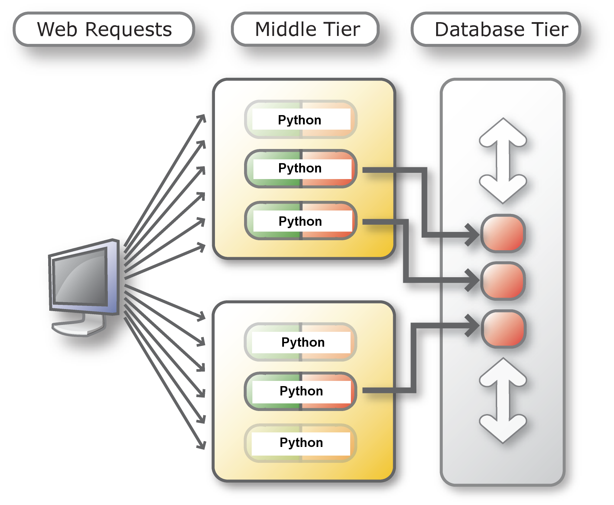

# Connection Pools

## Introduction
Connection pooling is important for performance when multi-threaded applications frequently connect and disconnect from the database. Pooling also gives the best support for Oracle's High Availability (HA) features. Documentation link for further reading: [Connection Pooling](https://python-oracledb.readthedocs.io/en/latest/user_guide/connection_handling.html#connection-pooling).

This lab will show how to create connection pools using python-oracledb driver

Estimated Lab Time: 5 minutes

### Objectives

*  Learn best practices and efficient techniques for connection pooling.

### Prerequisites

This lab assumes you have completed the following labs:
* Login to Oracle Cloud
* Create Oracle Autonomous Database shared infrastructure
* Environment Setup

## Task 1: Connection pooling
Review the code contained in *connect\_pool.py*:

````
import oracledb
import threading
import db_config

pool = oracledb.create_pool(user=db_config.user,    password=db_config.pw, dsn=db_config.dsn, config_dir=db_config.config_dir,min=2, max=5, increment=1, getmode=oracledb.POOL_GETMODE_WAIT, wallet_location=db_config.wallet_location, wallet_password=db_config.wallet_password)

def Query():
    con = pool.acquire()
    cur = con.cursor()
    for i in range(4):
        cur.execute("select myseq.nextval from dual")
        seqval, = cur.fetchone()
        print("Thread", threading.current_thread().name, "fetched sequence =", seqval)

thread1 = threading.Thread(name='#1', target=Query)
thread1.start()

thread2 = threading.Thread(name='#2', target=Query)
thread2.start()

thread1.join()
thread2.join()

print("All done!")
````

The **create\_pool()** function creates a pool of Oracle connections for the user. Connections in the pool can be used by python-oracledb connections by calling **pool.acquire()**. The initial pool size is 2 connections. The maximum size is 5 connections. When the pool needs to grow, 1 new connection will be created at a time. The pool can shrink back to the minimum size of 2 when connections are no longer in use.

The **def Query():** line creates a method that is called by each thread.

In the method, the **pool.acquire()** call gets one connection from the pool (as long as less than 5 are already in use). This connection is used in a loop of 4 iterations to query the sequence myseq. At the end of the method, python-oracledb will automatically close the cursor and release the connection back to the pool for reuse.

The **seqval, = cur.fetchone()** line fetches a row and puts the single value contained in the result tuple into the variable **seqval**. Without the comma, the value in **seqval** would be a tuple like **"(1,)"**.

Two threads are created, each invoking the Query() method.

In a command terminal, run:

````
<copy>
python3 connect_pool.py
</copy>
````


The output shows interleaved query results as each thread fetches values independently. The order of interleaving may vary from run to run.

## Taks 2: Connection pool experiments

Review *connect\_pool2.py*, which has a loop for the number of threads, each iteration invoking the Query() method:

````
import oracledb
import threading
import db_config

pool = oracledb.create_pool(user=db_config.user, password=db_config.pw, dsn=db_config.dsn, config_dir=db_config.config_dir, wallet_location=db_config.wallet_location, wallet_password=db_config.wallet_password, min=2, max=5, increment=1, getmode=oracledb.POOL_GETMODE_WAIT)

def Query():
    con = pool.acquire()
    cur = con.cursor()
    for i in range(4):
        cur.execute("select myseq.nextval from dual")
        seqval, = cur.fetchone()
        print("Thread", threading.current_thread().name, "fetched sequence =", seqval)

numberOfThreads = 2
threadArray = []

for i in range(numberOfThreads):
    thread = threading.Thread(name = '#' + str(i), target = Query)
    threadArray.append(thread)
    thread.start()

for t in threadArray:
    t.join()

print("All done!")
````

In a command terminal, run:

````
<copy>
python3 connect_pool2.py
</copy>
````


Experiment with different values of the pool parameters and **numberOfThreads**. Larger initial pool sizes will make the pool creation slower, but the connections will be available immediately when needed. When **numberOfThreads** exceeds the maximum size of the pool, the **acquire()** call will generate an error such as **ORA-24459: OCISessionGet() timed out waiting for the pool to create new connections**. 

Pool configurations where min is the same as max (and increment = 0) are often recommended as a best practice. This avoids connection storms on the database server.
.

## Taks3:  Creating a Database Resident Connection Pool (DRCP) Connection

Database Resident Connection Pooling allows multiple Python processes on multiple machines to share a small pool of database server processes.

Below left is a diagram without DRCP. Every application connection has its own 'dedicated' database server process. Application connect and close calls require the expensive create and destroy of those database server processes. To avoid these costs, scripts may hold connections open even when not doing database work: these idle server processes consumes database host resources. Below right is a diagram with DRCP. Scripts can use database servers from a pre-created pool of servers and return them when they are not in use.

Without DRCP: 

With DRCP: 

DRCP is useful when the database host machine does not have enough memory to handle the number of database server processes required. If DRCP is enabled, it is best used in conjunction with python-oracledb's connection pooling. However, the default 'dedicated' server process model is generally recommended if the database host memory is large enough. This can be with or without a python-oracledb connection pool, depending on the connection rate.
    
Batch scripts doing long running jobs should generally use dedicated connections. Both dedicated and DRCP servers can be used together in the same application or database.

**Start the Database Resident Connection Pool (DRCP)**

If you are running a local or remote Oracle Database (that is not an ADB), start the DRCP pool. Note that the DRCP pool is started in an Oracle Autonomous Database by default.

**Connect to the Oracle Database through DRCP**

Review the code contained in *connect\_drcp.py*:

````
<copy>
import oracledb
import db_config
    
con = oracledb.connect(user=db_config.user, password=db_config.pw, dsn=db_config.dsn + ":pooled", config_dir=db_config.conf.config_dir,
wallet_location=db_config.wallet_location, wallet_password=db_config.wallet_password,cclass="PYTHONDEMO", purity=oracledb.PURITY_SELF)
    
print("Database version:", con.version)
</copy>
````
    
This is similar to connect.py but ":pooled" is appended to the connection string, telling the database to use a pooled server. A Connection Class "PYTHONDEMO" is also passed into the connect() method to allow grouping of database servers to applications. Note that with Autonomous Database, the connection string has a different form, see the ADB documentation.
    
The "purity" of the connection is defined as the PURITY_SELF constant, meaning the session state (such as the default date format) might be retained between connection calls, giving performance benefits. Session information will be discarded if a pooled server is later reused by an application with a different connection class name.
    
Applications that should never share session information should use a different connection class and/or use PURITY\_NEW to force creation of a new session. This reduces overall scalability but prevents applications from misusing the session information. The default purity for connections created with connect() is PURITY_NEW.
    
Run *connect\_drcp.py* in Cloud Shell terminal.

````
<copy>
python3 connect_drcp.py
</copy>
````

The output is simply the version of the database.


## Task4:  Connection pooling and DRCP

DRCP works well with python-oracledb's connection pooling.

Edit *connect\_pool2.py*, reset any changed pool options, and modify it to use DRCP:

````
<copy>
import oracledb
import db_config
import threading

pool = oracledb.create_pool(user=db_config.user, password=db_config.pw, dsn=db_config.dsn + ":pooled",
wallet_location=db_config.wallet_location, wallet_password=db_config.wallet_password,min=2, max=5, increment=1, getmode=oracledb.POOL_GETMODE_WAIT,cclass="PYTHONDEMO", purity=oracledb.PURITY_SELF)
    
def Query():
con = pool.acquire()
cur = conn.cursor()
for i in range(4):
    cur.execute("select myseq.nextval from dual")
    seqval, = cur.fetchone()
    print("Thread", threading.current_thread().name, "fetched sequence =", seqval)
        
numberOfThreads = 2
threadArray = []
    
for i in range(numberOfThreads):
thread = threading.Thread(name='#' + str(i), target=Query)
threadArray.append(thread)
thread.start()
    
for t in threadArray:
t.join()
    
print("All done!")
</copy>
````

The script logic does not need to be changed to benefit from DRCP connection pooling.

Run the script:

````
<copy>
python3 connect_pool2.py
</copy>
````

Optionally, you can run drcp_query.py to check the DRCP pool statistics.

````
<copy>
python3 drcp_query.py
</copy>
````

This will prompt for the ADMIN user, the password, the database connection string, wallet location and password. 
    
Note that with ADB, this view does not contain rows, so running this script is not useful. For other Oracle Databases, the script shows the number of connection requests made to the pool since the database was started ("NUM\_REQUESTS"), how many of those reused a pooled server's session ("NUM\_HITS"), and how many had to create new sessions ("NUM\_MISSES"). Typically the goal is a low number of misses.
    
If the file is run successfully, you should see something like
    
Looking at DRCP Pool stats...

````
(CCLASS_NAME, NUM_REQUESTS, NUM_HITS, NUM_MISSES)
-------------------------------------------------
('PYTHONDEMO.SHARED', 5, 0, 5)

('PYTHONDEMO.PYTHONDEMO', 4, 2, 2)
    
('SYSTEM.SHARED', 11, 0, 11)
    
Done.
````
    
To see the pool configuration, you can query DBA\_CPOOL_INFO.


## Task5:  More DRCP investigation

To further explore the behaviors of python-oracledb connection pooling and DRCP pooling, you could try changing the purity to oracledb.PURITY\_NEW to see the effect on the DRCP NUM\_MISSES statistic.
    
Another experiement is to include the time module at the file top:

````
<copy>
import time
</copy>
````
and add calls to **time.sleep(1)** in the code, for example in the query loop. Then look at the way the threads execute. Use *drcp\_query.sql* to monitor the pool's behavior.

## Conclusion

In this lab, you had an opportunity to try out connecting Python to the Oracle Database.
You have learned how to:
* Use python-oracledb connection pooling and Database Resident Connection Pooling

## Acknowledgements

* **Authors** - Christopher Jones, Anthony Tuininga, Sharad Chandran, Veronica Dumitriu
* **Contributors** - Jaden McElvey, Anoosha Pilli, Troy Anthony
* **Last Updated By/Date** - Veronica Dumitriu, DB Product Management, July 2022