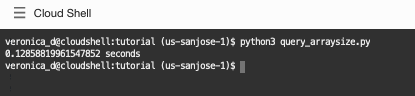
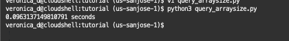

# Data Fetching

## Introduction

Executing SELECT queries is the primary way to get data from Oracle Database.

There are a number of functions you can use to query an Oracle database, but the basics of querying are always the same:
* Parse the statement for execution.
* Bind data values (optional).
* Execute the statement.
* Fetch the results from the database.

This lab will show how to fetch the data using python-oracledb driver

Estimated Time: 10 minutes

Watch the video below for a quick walk-through of the lab.
[Data Fetching](videohub:1_5r4lafnz)

### Objectives

* Learn best practices and efficient techniques for fetching data.

### Prerequisites

This lab assumes you have completed the following labs:

* Login to Oracle Cloud
* Create Oracle Autonomous Database Serverless
* Environment Setup

## Task 1: A simple query

1. Review the code contained in *query2.py*:

    ````
    <copy>
    import oracledb
    import db_config
 
    con = oracledb.connect(user=db_config.user,
                         password=db_config.pw, 
                         dsn=db_config.dsn, 
                         config_dir=db_config.config_dir, wallet_location=db_config.wallet_location,  wallet_password=db_config.wallet_password)
    cur = con.cursor()
    cur.execute("select * from dept order by deptno")
    for deptno, dname, loc in cur:
      print("Department number: ", deptno)
      print("Department name: ", dname)
      print("Department location:", loc)
    </copy>
    ````

    The **cursor()** method opens a cursor for statements to use.

    The **execute()** method parses and executes the statement.

    The loop fetches each row from the cursor and unpacks the returned tuple into the variables deptno, dname, loc, which are then printed.

2. Run the script in the Cloud Shell or in a terminal window:

    ````
    <copy>
    python3 query2.py
    </copy>
    ````

    The output is:

    


## Task 2: Data fetching using fetchone()

When the number of rows is large, the fetchall() call may use too much memory.

1. Review the code contained in *query\_one.py*:

    ````
    <copy>
    import oracledb
    import db_config
    
    con = oracledb.connect(user=db_config.user,
                        password=db_config.pw, 
                        dsn=db_config.dsn, 
                        config_dir=db_config.config_dir, wallet_location=db_config.wallet_location, wallet_password=db_config.wallet_password)
                        
    cur = con.cursor()
    
    cur.execute("select * from dept order by deptno")
    row = cur.fetchone()
    print(row)
    
    row = cur.fetchone()
    print(row)
    </copy>
    ````

    This uses the **fetchone()** method to return just a single row as a tuple. When called multiple time, consecutive rows are returned:

2. Run the script in Cloud Shell or in a terminal window:

    ````
    <copy>
    python3 query_one.py
    </copy>
    ````

    

    The first two rows of the table are printed.

## Task 3: Data fetching using fetchmany()

1. Review the code contained in *query\_many.py*:

    ````
    <copy>
    import oracledb
    import db_config

    con = oracledb.connect(
                        user=db_config.user,
                        password=db_config.pw, 
                        dsn=db_config.dsn,
                        config_dir=db_config.config_dir, 
                        wallet_location=db_config.wallet_location, 
                        wallet_password=db_config.wallet_password)

    cur = con.cursor()
    
    cur.execute("select * from dept order by deptno")
    num_rows=3
    res = cur.fetchmany(num_rows)
    print(res)
    </copy>
    ````

    The **fetchmany()** method returns a list of tuples. By default the number of rows returned is specified by the cursor attribute **arraysize** (which defaults to 100). Here the num_Rows parameter specifies that three rows should be returned.

2. Run the script in a terminal window:
    ````
    <copy>
    python3 query_many.py
    </copy>
    ````
    
    
    
    The first three rows of the table are returned as a list (Python's name for an array) of tuples.

3. You can access elements of the lists by position indexes. To see this, edit the file *query\_many.py* and add:

    ````
    <copy>
    print(res[0])    # first row
    print(res[0][1]) # second element of first row
    </copy>
    ````

    Run the script *query_many.py* in the terminal window to see the output:

    

## Taks 4:  Tuning with arraysize and prefetch rows

This section demonstrates a way to improve query performance by increasing the number of rows returned in each batch from Oracle to the Python program.

Row prefetching and array fetching are both internal buffering techniques to reduce round-trips to the database. The difference is the code layer that is doing the buffering, and when the buffering occurs.

During the setup_environment.py run, a table was created and populated with a large number of rows to be used by the query\_arraysize.py file by internally running the sql script below:

  ````
    create table bigtab (mycol varchar2(20));
    begin
      for i in 1..20000
        loop
          insert into bigtab (mycol) values (dbms_random.string('A',20));
        end loop;
    end;
  ````
    
The setup file has also inserted around 20000 string values in the bigtab table.
    
1. Review the code contained in *query\_arraysize.py*:

    ````
    <copy>
    import oracledb
    import time
    import db_config
    
    con = oracledb.connect(
                    user=db_config.user,
                    password=db_config.pw, 
                    dsn=db_config.dsn, 
                    config_dir=db_config.config_dir, 
                    wallet_location=db_config.wallet_location, 
                    wallet_password=db_config.wallet_password
                    )
    
    start = time.time()
    
    cur = con.cursor()
    cur.prefetchrows = 100
    cur.arraysize = 100
    cur.execute("select * from bigtab")
    res = cur.fetchall()
    
    # print(res)  # uncomment to display the query results
    
    elapsed = (time.time() - start)
    print(elapsed, "seconds")
    </copy>
    ````

    This uses the 'time' module to measure elapsed time of the query. The prefetchrows and arraysize values are set to 100. This causes batches of 100 records at a time to be returned from the database to a cache in Python. This reduces the number of **roundtrips** made to the database, often reducing network load and reducing the number of context switches on the database server. The **fetchone()**, **fetchmany()** and **fetchall()** methods will read from the cache before requesting more data from the database.

2. In Cloud Shell or in a terminal window, run:

    ````
    <copy>
    python3 query_arraysize.py
    </copy>
    ````

3. Rerun a few times to see the average times.

    

4. Experiment with different arraysize values. For example, edit query\_arraysize.py and change the arraysize to:

    ````
    <copy>
    cur.arraysize = 2000
    </copy>
    ````

5. Rerun the *query_arraysize.py* script to compare the performance of different arraysize settings.

    

    In general, larger array sizes improve performance. Depending on how fast your system is, you may need to use different arraysizes than those given here, to see a meaningful time difference.

    There is a time/space tradeoff for increasing the values. Larger values will require more memory in Python for buffering the records.
    If you know the query returns a fixed number of rows, for example 20 rows, then set arraysize to 20 and prefetchrows to 21.  The addition of one to prefetchrows prevents a round-trip to check for end-of-fetch.  The statement execution and fetch will take a total of one round-trip.  This minimizes the load on the database.

    If you know a query only returns a few records, decrease the arraysize from the default to reduce memory usage.

## Conclusion

In this lab, you had an opportunity to try out connecting Python to the Oracle Database.
You have learned how to:
* Use python-oracledb to fetch data

## Acknowledgements

* **Authors** - Christopher Jones, Anthony Tuininga, Sharad Chandran, Veronica Dumitriu
* **Contributors** - Jaden McElvey, Anoosha Pilli, Troy Anthony
* **Last Updated By/Date** - Veronica Dumitriu, DB Product Management, July 2022