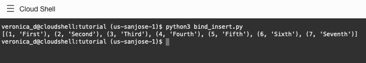
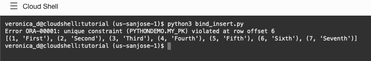

# Binding Data

## Introduction

Bind variables enable you to re-execute statements with new data values without the overhead of re-parsing the statement. Binding improves code reusability, improves application scalability, and can reduce the risk of SQL injection attacks. Using bind variables is strongly recommended. Documentation link for further reading: [Using Bind Variables](https://python-oracledb.readthedocs.io/en/latest/user_guide/bind.html).

Estimated Lab Time: 10 minutes

### Objectives

*  Learn best practices and efficient techniques for binding data.

### Prerequisites

This lab assumes you have completed the following labs:
* Login to Oracle Cloud
* Create Oracle Autonomous Database shared infrastructure
* Environment Setup

## Task 1: Binding in queries

Review the code contained in *bind\_query.py*:

````
<copy>
import oracledb
import db_config

con = oracledb.connect(user=db_config.user,
                password=db_config.pw, 
                dsn=db_config.dsn, 
                config_dir=db_config.config_dir, wallet_location=db_config.wallet_location, wallet_password=db_config.wallet_password)
    
cur = con.cursor()

cur.prepare("select * from dept where deptno = :id order by deptno")

cur.execute(None, id = 20)
res = cur.fetchall()
print(res)

cur.execute(None, id = 10)
res = cur.fetchall()
print(res)
</copy>
````

The statement contains a bind variable **":id"** placeholder. The statement is only prepared once but executed twice with different values for the WHERE clause.

In the Cloud Shell or a terminal window, run:

````
<copy>
python3 bind_query.py
</copy>
````

The output shows the details for the two departments.


An arbitrary number of named arguments can be used in an execute() call. Each argument name must match a bind variable name. Alternatively, instead of passing multiple arguments you could pass a second argument to execute() that is a sequence or a dictionary. Later examples show these syntaxes.
    
To bind a database NULL, use the Python value None.
    
python-oracledb uses a cache of executed statements. As long as the statement you pass to execute() is in that cache, you can use different bind values and still avoid a full statement parse. The statement cache size is configurable for each connection. To see the default statement cache size, edit *bind\_query.py* and add a line at the end:

````
<copy>
print(con.stmtcachesize)
</copy>
````
    
Re-run the file. 
    


You would set the statement cache size to the number of unique statements commonly executed in your applications.

## Task 2:  Binding in inserts
    
The [environment setup file](https://oracle.github.io/python-oracledb/samples/tutorial/Python-and-Oracle-Database-The-New-Wave-of-Scripting.html#installsampleenv) has already created the **mytab** table (to be used by the *bind\_insert.py* file) by internally running the sql script below:

````
create table mytab (id number, data varchar2(20), constraint my_pk primary key (id));
````

Review the code contained in *bind\_insert.py*:

````
<copy>
import oracledb
import db_config

con = oracledb.connect(user=db_config.user,
                password=db_config.pw, 
                dsn=db_config.dsn, 
                config_dir=db_config.config_dir, wallet_location=db_config.wallet_location, wallet_password=db_config.wallet_password)   
    
cur = con.cursor()

rows = [ (1, "First" ), (2, "Second" ),
        (3, "Third" ), (4, "Fourth" ),
        (5, "Fifth" ), (6, "Sixth" ),
        (7, "Seventh" ) ]

cur.executemany("insert into mytab(id, data) values (:1, :2)", rows)

# Now query the results back

cur2 = con.cursor()
cur2.execute('select * from mytab')
res = cur2.fetchall()
print(res)
</copy>
````

The 'rows' array contains the data to be inserted.

The executemany() call inserts all rows. This call allows "array binding", which is an efficient way to insert multiple records.

The final part of the script queries the results back and displays them as a list of tuples.

From Console Shell or a terminal window, run:

````
<copy>
python3 bind_insert.py
</copy>
````



The new results are automatically rolled back at the end of the script so re-running it will always show the same number of rows in the table.

## Task 3:  Batcherrors

The Batcherrors features allows invalid data to be identified while allowing valid data to be inserted.

Edit the data values in *bind\_insert.py* and create a row with a duplicate key.

````
<copy>
import oracledb
import db_config

con = oracledb.connect(user=db_config.user,
                password=db_config.pw, 
                dsn=db_config.dsn, 
                config_dir=db_config.config_dir, wallet_location=db_config.wallet_location, wallet_password=db_config.wallet_password)    

cur = con.cursor()

rows = [ (1, "First" ), (2, "Second" ),
        (3, "Third" ), (4, "Fourth" ),
        (5, "Fifth" ), (6, "Sixth" ),
        (6, "Duplicate" ),
        (7, "Seventh" ) ]
            
cur.executemany("insert into mytab(id, data) values (:1, :2)", rows, batcherrors=True)

for error in cur.getbatcherrors():
    print("Error", error.message.rstrip(), "at row offset", error.offset)

# Now query the results back

cur2 = con.cursor()
cur2.execute('select * from mytab')
res = cur2.fetchall()
print(res)
</copy>
````

From Cloud Shell or a terminal window, run:

````
<copy>
python3 bind_insert.py
</copy>
````
    


The new code shows the offending duplicate row: "ORA-00001: unique constraint (PYTHONDEMO.MY_PK) violated at row offset 6". This indicates the 6th data value (counting from 0) had a problem.
    
The other data gets inserted and is queried back.
    
At the end of the script, python-oracledb will roll back an uncommitted transaction. If you want to commit results, you can use:

````
<copy>
con.commit()
</copy>
````

To force python-oracledb to roll back, use:

````
<copy>
con.rollback()
</copy>
````

## Conclusion

In this lab, you had an opportunity to try out connecting Python to the Oracle Database.
You have learned how to:
* Use python-oracledb for binding data

## Acknowledgements

* **Authors** - Christopher Jones, Anthony Tuininga, Sharad Chandran, Veronica Dumitriu
* **Contributors** - Jaden McElvey, Anoosha Pilli, Troy Anthony
* **Last Updated By/Date** - Veronica Dumitriu, DB Product Management, July 2022