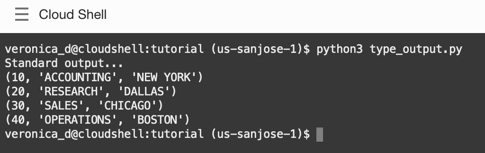
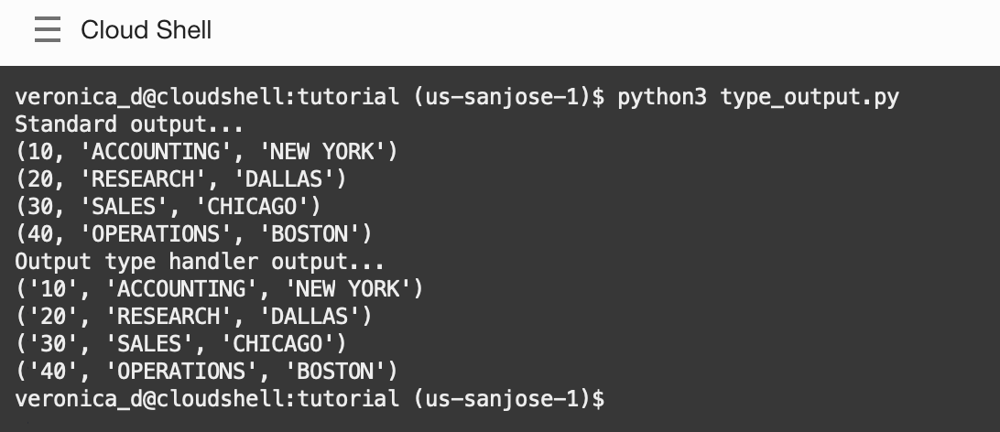
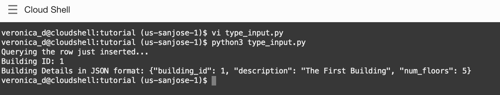

# Type Handlers

## Introduction

This lab will show how to use type handlers in order to alter data that is fetched from or sent to the database. You may read more about type handlers at [Changing Fetched Data Types with Output Type Handlers](https://python-oracledb.readthedocs.io/en/latest/user_guide/sql_execution.html#changing-fetched-data-types-with-output-type-handlers) and [Changing Bind Data Types using an Input Type Handler](https://python-oracledb.readthedocs.io/en/latest/user_guide/bind.html#changing-bind-data-types-using-an-input-type-handler).

Estimated Time: 10 minutes

Watch the video below for a quick walk-through of the lab.
[Type Handlers](videohub:1_e1omeg5y)

Watch the video below for a quick walk-through of the lab.
[Type Handlers](videohub:1_e1omeg5y)

### Objectives

*  Learn best practices and efficient techniques for using type handlers

### Prerequisites

This lab assumes you have completed the following labs:
* Login to Oracle Cloud
* Create Oracle Autonomous Database Serverless
* Environment Setup

## Task 1: Basic output type handler

Output type handlers enable applications to change how data is fetched from the database. For example, numbers can be returned as strings or decimal objects. LOBs can be returned as string or bytes.

A type handler is enabled by setting the outputtypehandler attribute on either a cursor or the connection. If set on a cursor it only affects queries executed by that cursor. If set on a connection it affects all queries executed on cursors created by that connection.

1. Review the code contained in *type\_output.py*:

    ````
    <copy>
    import oracledb
    import db_config

    con = oracledb.connect(user=db_config.user,
                    password=db_config.pw, 
                    dsn=db_config.dsn,
                    config_dir=db_config.config_dir, wallet_location=db_config.wallet_location, wallet_password=db_config.wallet_password)

    cur = con.cursor()

    print("Standard output...")
    for row in cur.execute("select * from dept"):
        print(row)
    </copy>
    ````

2. In Cloud Shell or in a terminal window, run:

    ````
    <copy>
    python3 type_output.py
    </copy>
    ````

    This shows the department number represented as digits like 10.

    

3. Add an output type handler to the bottom of the *type\_output.py* file:

    ````
    <copy>
    def ReturnNumbersAsStrings(cursor, name, defaultType, size, precision, scale):
        if defaultType == oracledb.NUMBER:
            return cursor.var(str, 9, cursor.arraysize)

    print("Output type handler output...")
    cur = con.cursor()
    cur.outputtypehandler = ReturnNumbersAsStrings
    for row in cur.execute("select * from dept"):
        print(row)
    </copy>
    ````

    This type handler converts any number columns to strings with maxium size 9.

4. Run the script again:

    ````
    <copy>
    python3 type_output.py
    </copy>
    ````

    The new output shows the department numbers are now strings within quotes like '10'.

    

## Task2:  Output type handlers and variable converters

When numbers are fetched from the database, the conversion from Oracle's decimal representation to Python's binary format may need careful handling. To avoid unexpected issues, the general recommendation is to do number operations in SQL or PL/SQL, or to use the decimal module in Python.

Output type handlers can be combined with variable converters to change how data is fetched.

1. Review *type\_converter.py*:

    ````
    <copy>
    import oracledb
    import db_config
    
    con = oracledb.connect(user=db_config.user,
                        password=db_config.pw, 
                        dsn=db_config.dsn, 
                        config_dir=db_config.config_dir, wallet_location=db_config.wallet_location, wallet_password=db_config.wallet_password)

    cur = con.cursor()

    for value, in cur.execute("select 0.1 from dual"):
        print("Value:", value, "* 3 =", value * 3)
    </copy>
    ````

2. Run the file:

    ````
    <copy>
    python3 type_converter.py
    </copy>
    ````

    The output is like:

    ````
    Value: 0.1 * 3 = 0.30000000000000004
    ````

3. Replace the text file in the *type_converter.py* file with the text below to add a type handler that uses a Python decimal converter:

    ````
    <copy>
    import oracledb
    import decimal
    import db_config

    con = oracledb.connect(user=db_config.user,
                        password=db_config.pw, 
                        dsn=db_config.dsn, 
                        config_dir=db_config.config_dir, wallet_location=db_config.wallet_location, wallet_password=db_config.wallet_password)

    cur = con.cursor()

    def ReturnNumbersAsDecimal(cursor, name, defaultType, size, precision, scale):
        if defaultType == oracledb.NUMBER:
            return cursor.var(str, 9, cursor.arraysize, outconverter = decimal.Decimal)

    cur.outputtypehandler = ReturnNumbersAsDecimal

    for value, in cur.execute("select 0.1 from dual"):
        print("Value:", value, "* 3 =", value * 3)
    </copy>
    ````

    The Python decimal.Decimal converter gets called with the string representation of the Oracle number. The output from decimal.Decimal is returned in the output tuple.

4. Run the file again:

    ````
    <copy>
    python3 type_converter.py
    </copy>
    ````

    Output is like:

    ````
    Value: 0.1 * 3 = 0.3
    ````

    The code above demonstrates the use of outconverter, but in this particular case, python-oracledb offers a simple convenience attribute to do the same conversion:

    ````
    <copy>
    import oracledb
    oracledb.defaults.fetch_decimals = True
    </copy>
    ````

## Task3:  Input type handlers

Input type handlers enable applications to change how data is bound to statements, or to enable new types to be bound directly without having to be converted individually.

1. Review *type\_input.py*:

    ````
    <copy>
    import oracledb
    import db_config
    import json

    con = oracledb.connect(user=db_config.user,
                            password=db_config.pw,
                            dsn=db_config.dsn, 
                            config_dir=db_config.config_dir, 
                            wallet_location=db_config.wallet_location, 
                            wallet_password=db_config.wallet_password)

    cur = con.cursor()

    # Create table
    cur.execute("""begin
                    execute immediate 'drop table BuildingTable';
                    exception when others then
                    if sqlcode <> -942 then
                        raise;
                    end if;
                end;""")
    cur.execute("""create table BuildingTable (
                    ID number(9) not null,
                    BuildingDetails varchar2(400),
                    constraint TestTempTable_pk primary key (ID))""")
    # Create a Python class for a Building
    class Building(object):

    def __init__(self, building_id, description, num_floors):
        self.building_id = building_id
        self.description = description
        self.num_floors = num_floors

    def __repr__(self):
        return "<Building %s: %s>" % (self.building_id, self.description)

    def __eq__(self, other):
        if isinstance(other, Building):
            return other.building_id == self.building_id \
                and other.description == self.description \
                and other.num_floors == self.num_floors
        return NotImplemented

    def to_json(self):
        return json.dumps(self.__dict__)

    @classmethod
    def from_json(cls, value):
        result = json.loads(value)
        return cls(**result)
    
    # Convert a Python building object to SQL JSON type that can be read as a string 
    def building_in_converter(value):
        return value.to_json()
    
    def input_type_handler(cursor, value, num_elements):
        if isinstance(value, Building):
            return cursor.var(oracledb.STRING, arraysize=num_elements,
                            inconverter=building_in_converter)
                          
    building = Building(1, "The First Building", 5)  # Python object
    cur.execute("truncate table BuildingTable")
    
    cur.inputtypehandler = input_type_handler
    cur.execute("insert into BuildingTable (ID, BuildingDetails) values (:1, :2)",
            (building.building_id, building))
    con.commit()
    
    # Query the row
    print("Querying the row just inserted...")
    cur.execute("select ID, BuildingDetails from BuildingTable")
    
    for (int_col, string_col) in cur:
    print("Building ID:", int_col)
    print("Building Details in JSON format:", string_col)
    </copy>
    ````

    In the new file, a Python class Building is defined, which holds basic information about a building. The Building class is used lower in the code to create a Python instance:

    ````
    building = Building(1, "The First Building", 5)
    ````

    which is then directly bound into the INSERT statement like:

    ````
    cur.execute("insert into BuildingTable (ID, BuildingDetails) values (:1, :2)", (building.building_id, building))
    ````

    The mapping between Python and Oracle objects is handled in building\_in\_converter which creates an Oracle STRING object from the Building Python object in a JSON format. The building\_in\_converter method is called by the input type handler input\_type\_handler,whenever an instance of Building is inserted with the cursor.
    
2. In Cloud Shell or in a terminal window, run:

    ````
    <copy>
    python3 type_input.py
    </copy>
    ````

    You should expect results as below:

    
    
## Conclusion

In this lab, you had an opportunity to try out connecting Python to the Oracle Database.
You have learned how to:
* Use type handlers in order to alter data that is fetched from or sent to the database.

## Acknowledgements

* **Authors** - Christopher Jones, Anthony Tuininga, Sharad Chandran, Veronica Dumitriu
* **Contributors** - Jaden McElvey, Anoosha Pilli, Troy Anthony
* **Last Updated By/Date** - Veronica Dumitriu, DB Product Management, June 2023