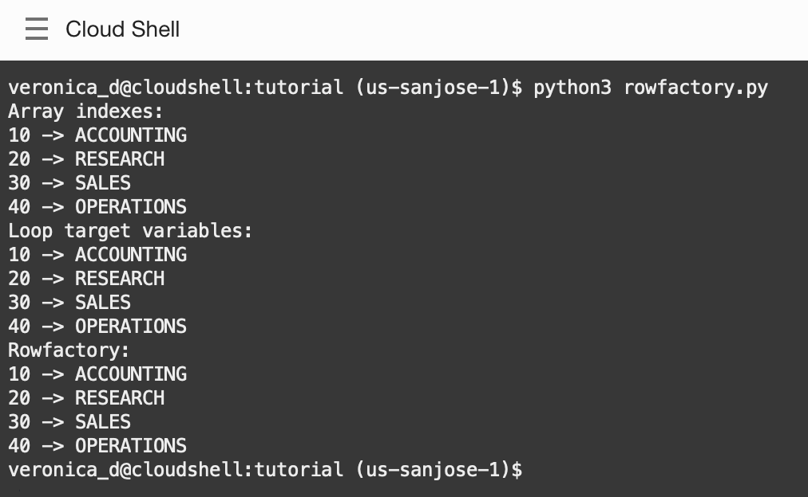

# Rowfactory Functions

## Introduction

Rowfactory functions enable queries to return objects other than tuples. They can be used to provide names for the various columns or to return custom objects. This lab will show how to use rowfactory functions from Python

Estimated Lab Time: 3 minutes

Watch the video below for a quick walk-through of the lab.
[Rowfactory Functions](videohub:1_l5w1xt8h)

### Objectives

*  Learn best practices and efficient techniques for mapping column names,  objects using rowfactory functions.

### Prerequisites

This lab assumes you have completed the following labs:
* Login to Oracle Cloud
* Create Oracle Autonomous Database shared infrastructure
* Environment Setup

## Task 1: Rowfactory for mapping column names

Review the code contained in *rowfactory.py*:

````
<copy>
import collections
import oracledb
import db_config

con = oracledb.connect(user=db_config.user,
                        password=db_config.pw, 
                        dsn=db_config.dsn, 
                        config_dir=db_config.config_dir, 
                        wallet_location=db_config.wallet_location, 
                        wallet_password=db_config.wallet_password)

cur = con.cursor()

cur.execute("select deptno, dname from dept")
res = cur.fetchall()

print('Array indexes:')
for row in res:
    print(row[0], "->", row[1])

print('Loop target variables:')
for c1, c2 in res:
    print(c1, "->", c2)
</copy>
````

This shows two methods of accessing result set items from a data row. The first uses array indexes like row[0]. The second uses loop target variables which take the values of each row tuple.

Run the file:

````
<copy>
python3 rowfactory.py
</copy>
````


Both access methods gives the same results.

To use a rowfactory function, edit rowfactory.py and add this code at the bottom:

````
<copy>
print('Rowfactory:')
cur.execute("select deptno, dname from dept")
cur.rowfactory = collections.namedtuple("MyClass", ["DeptNumber", "DeptName"])

rows = cur.fetchall()
for row in rows:
	print(row.DeptNumber, "->", row.DeptName)
</copy>
````

This uses the Python factory function namedtuple() to create a subclass of tuple that allows access to the elements via indexes or the given field names.

The print() function shows the use of the new named tuple fields. This coding style can help reduce coding errors.

Run the script again in Cloud Shell or in a Code Editor terminal window:

````
<copy>
python3 rowfactory.py
</copy>
````

The output results are the same.




## Conclusion

In this lab, you had an opportunity to try out connecting Python to the Oracle Database.
You have learned how to:
* Use rowfactory functions to map column names from Python code.

## Acknowledgements

* **Authors** - Christopher Jones, Anthony Tuininga, Sharad Chandran, Veronica Dumitriu
* **Contributors** - Jaden McElvey, Anoosha Pilli, Troy Anthony
* **Last Updated By/Date** - Veronica Dumitriu, DB Product Management, July 2022