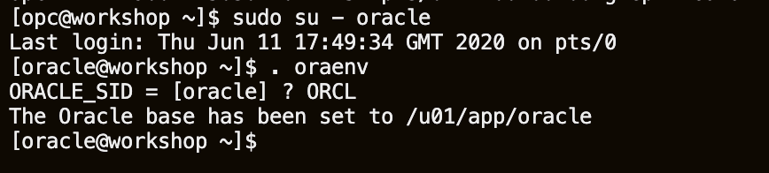
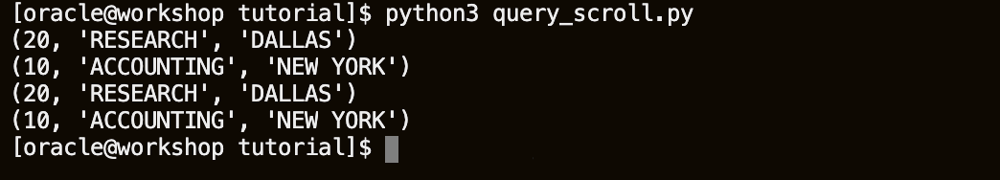
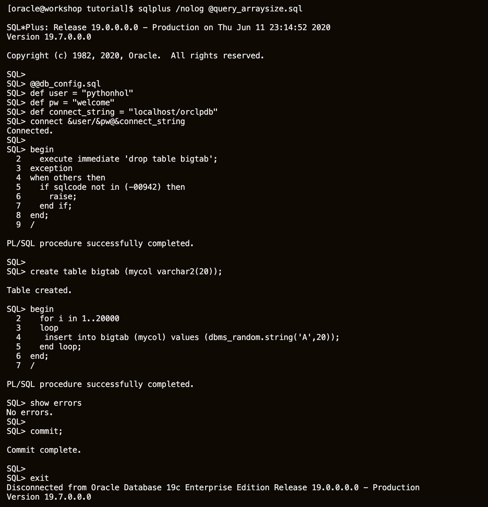
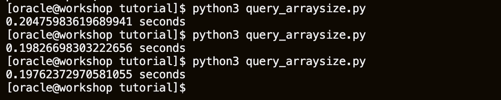
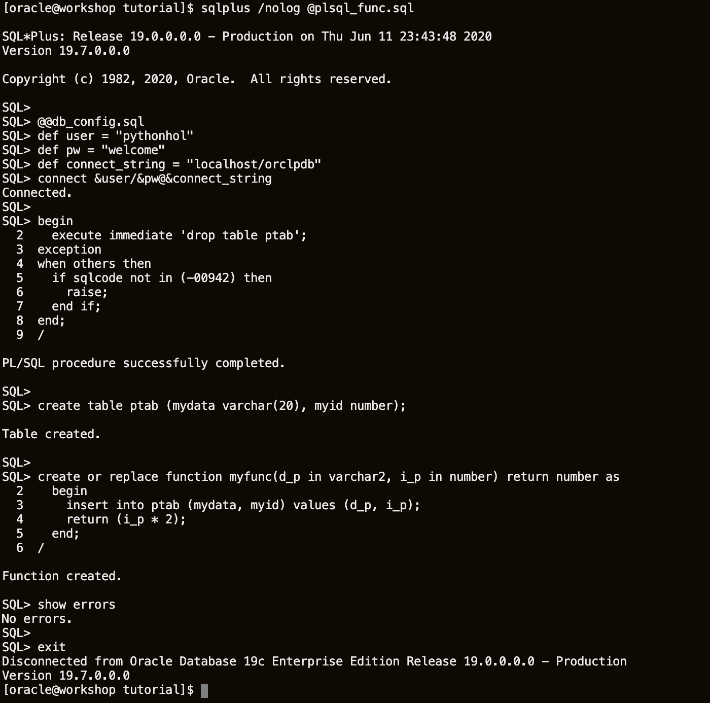
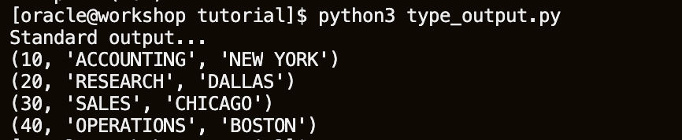
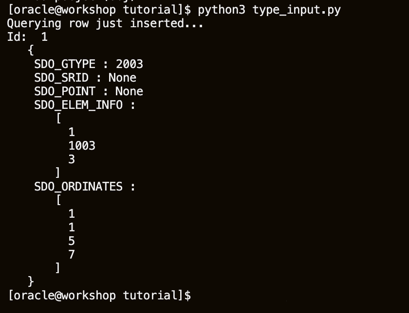
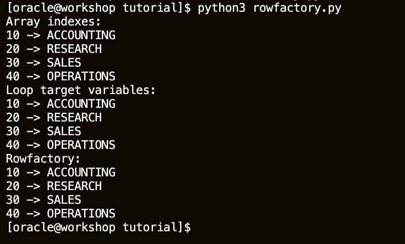
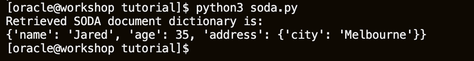
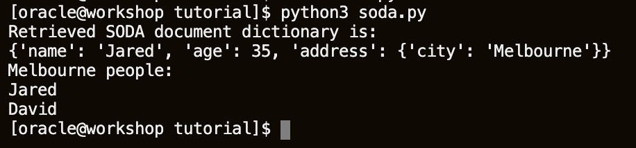

# Python and Oracle Database: Scripting for the Future

## Introduction

This tutorial is an introduction to using Python with Oracle Database. It contains beginner and advanced material. Sections can be done in any order. Choose the content that interests you and your skill level.

Follow the steps in this document. The **tutorial** directory has scripts to run and modify. The **tutorial/solutions** directory has scripts with the suggested code changes.

Estimated Lab Time: 60 minutes

### About cx\_Oracle Python extension

cx\_Oracle is a Python extension module that enables access to Oracle Database. It conforms to the Python database API 2.0 specification with a considerable number of additions and a couple of exclusions.

cx\_Oracle 8 has been tested with Python versions 3.6 through 3.9. Older versions of cx\_Oracle may be used with previous Python releases. You can use cx\_Oracle with Oracle 11.2, 12, 18, 19 and 21 client libraries. Oracle's standard client-server version interoperability allows connection to both older and newer databases. For example Oracle 19c client libraries can connect to Oracle Database 11.2.

cx\_Oracle 8 is available.

Python is open-source, cross-platform, and free of cost. There's no excuse not to give Python a try!

### Objectives

* Learn how to use Python in the Oracle Database
* Learn how to validate Python operations

### Prerequisites

This lab assumes you have completed the following labs:
* Login to Oracle Cloud
* Generate SSH Key
* Environment Setup using Marketplace Image

## Task 1: Install Python

Python comes preinstalled on most Linux distributions, and it is available as a package on others. The Python packages can be obtained from the software repository of your Linux distribution using the package manager.

1.  Open up the Oracle Cloud shell (or terminal of your choice) and ssh into your compute instance as the `opc` user if not already.

    ````
    ssh -i ~/.ssh/<sshkeyname> opc@<Your Compute Instance Public IP Address>
    ````

2.  Check if python3 has been installed by running the command.

    ````
    <copy>
    python -V
    </copy>
    ````

    For this tutorial Python Version 3.6 (or later) is preferred. **You will typically have to update Python**. cx\_Oracle version 7.2 (or later) is needed. cx\_Oracle version 8 is available. Oracle database 19c is installed with the 19c client libraries. SQL*Plus is preinstalled. The Advanced Queuing section requires Oracle client 12.2 or later. The SODA section requires Oracle client 18.5, or later, and Oracle Database 18 or later.

3.  Upgrade Python if you do not have Python 3 installed. There is no harm in running this command multiple times, the system will either install packages or let you know they are already installed.

    ````
    <copy>
    sudo yum -y install python3 python3-tools
    </copy>
    ````

    

## Task 2: Add a Sample Schema in your Database

1.  Switch to the `oracle` user using the sudo command.

    ````
    <copy>
    sudo su - oracle
    </copy>
    ````

2.  It is necessary to correctly set the environment variables so that we can later run `sqlplus`. Copy and paste the following.

    ````
    <copy>
    . oraenv
    </copy>
    ````

    When prompted with `ORACLE_SID = [orcl] ?` copy and paste the following then press enter.

    ````
    <copy>
    ORCL
    </copy>
    ````

    

3. Create a directory structure named `python/` and get the SQL setup scripts.

    ````
    <copy>
    mkdir -p python
    cd python
    wget  https://objectstorage.us-ashburn-1.oraclecloud.com/p/LNAcA6wNFvhkvHGPcWIbKlyGkicSOVCIgWLIu6t7W2BQfwq2NSLCsXpTL9wVzjuP/n/c4u04/b/livelabsfiles/o/developer-library/python_setup.zip
    unzip python_setup.zip
    </copy>
    ````

    

4. Install the sample schema using the script **SetupSamples**.

    ````
    <copy>
    sqlplus sys/Ora_DB4U@localhost/orclpdb as sysdba @/home/oracle/python/sql/SetupSamples
    </copy>
    ````

    The **SetupSamples** script will create a user `pythonhol` with a password `welcome`.

    

    

    To leave `sqlplus` you need to use the exit command.

    ````
    <copy>
    exit
    </copy>
    ````

## Task 3: Install Python Oracle Module and Connect to a Database

cx\_Oracle is a python module that enables access to Oracle databases. This module is supported by Oracle 11.2 and higher and works for both Python 2.X and 3.X. There are various ways in which cx\_Oracle can be installed. In this example, we will use pip (installed by default for python 3.4 and up). For more ways to install cx\_Oracle (like yum) check the documentation on [https://yum.oracle.com/oracle-linux-python.html#Aboutcx_Oracle](https://yum.oracle.com/oracle-linux-python.html#Aboutcx_Oracle "documentation").

1.  Install the `cx_Oracle` module using python3 and pip for the oracle user. If your terminal disconnected and you are opc again, enter the command `sudo su - oracle` to switch back to the `oracle` user. The **pip** command will install cx_Oracle8.

    ````
    <copy>
    python3 -m pip install --user cx_Oracle
    </copy>
    ````

    

2.  Test your install by launching the python console and list the available modules.
    ````
    <copy>
    python3
    help('modules')
    </copy>
    ````

    This command will show you a list of installed modules that should include the cx\_Oracle module we installed in the previous step.

    

3.  Connect to the Oracle database and print the version of the database via python. (This confirms you are connected to an Oracle instance and returns the database version.)

    ````
    <copy>
    import cx_Oracle
    con = cx_Oracle.connect('system/Ora_DB4U@localhost:1521/orclpdb')
    print(con.version)
    </copy>
    ````

    The output should be similar to 19.7.0.0.0. Copy and paste the `quit` command below this will exit the python command line editor.

    ````
    <copy>
    quit()
    </copy>
    ````

    

## Task 4: The Python Interpreter

There are several ways to execute Python code. In this step, we start with two examples on how to execute Python code from the command line. The first example executing code from the command prompt i.e. executing commands directly in the interpreter. The second example to save your code in a .py file and invoke the interpreter to execute the file.

1.  To execute code from command line open the Python command-line editor and type the following commands, one by one (each line is one command).

    ````
    <copy>
    python3
    var1 = "Hello World"
    var1
    </copy>
    ````

    The output will be `'Hello World'`.

    

2.  Quit the python terminal

    ````
    <copy>
    quit()
    </copy>
    ````

3.  To create a simple script, open up the nano text editor by copying and pasting the command `nano test.py`.

    ````
    <copy>
    cd ~
    nano test.py
    </copy>
    ````

    Enter the following script into nano.

    ````
    <copy>
    var1 = "Hello World"
    print(var1)
    </copy>
    ````

4.  If you are using nano. Type **Ctrl+x** to exit the file. When prompted press **y**. Then press **ENTER** to confirm. The file should be named **test.py** and be located in the **/home/oracle directory**.

    *This process of opening and closing files in nano will be used throughout the rest of this lab. Remember to open a file in nano, first navigate to the directory with the file. Open the file with the command `nano FileName`. Save and close the file with `Ctrl+x`, then `y`, then `ENTER`.*

    ````
    <copy>
    python3 ~/test.py
    </copy>
    ````

    

## Task 5: Connect to the Oracle Database

1.  Review the connection credentials.

    Review db\_config.py and db\_config.sql in the tutorial directory. These are included in other Python and SQL files in this tutorial.

    To view db\_config.py copy and paste the following:

    ````
    <copy>
    cd ~/python/tutorial
    cat db_config.py
    </copy>
    ````

    The output should say:

    ````
    user = "pythonhol"
    pw = "welcome"
    dsn = "localhost:1521/orclpdb"
    ````

    To view db\_config.sql copy and paste the following:

    ````
    <copy>
    cd ~/python/tutorial
    cat db_config.sql
    </copy>
    ````

    The output should say:

    ````
    def user = "pythonhol"
    def pw = "welcome"
    def connect_string = "localhost:1521/orclpdb"
    ````

2.  Creating a basic connection.

    Review the code contained in connect.py by issuing the command **cat connect.py**.

    ````
    import cx_Oracle
    import db_config

    con = cx_Oracle.connect(db_config.user, db_config.pw, db_config.dsn)
    print("Database version:", con.version)
    ````

    The cx\_Oracle module is imported to provide the API for accessing the Oracle database. Many inbuilt and third party modules can be  included in this way in Python scripts.

    The **connect()** method is passed the username, the password and the connection string that you configured in the **db\_config.py** module. In this case, Oracle's Easy Connect connection string syntax is used. It consists of the hostname of your machine,  localhost, and the database service name **orclpdb**.

    In your command terminal, change to the tutorial directory:

    ````
    <copy>
    cd /home/oracle/python/tutorial
    </copy>
    ````

    Run the Python script:

    ````
    <copy>
    python3 connect.py
    </copy>
    ````

    

    The version number of the database should be displayed. An exception is raised if the connection fails. Adjust the username, password or connect string parameters to invalid values to see the exception.

    **cx\_Oracle** also supports "external authentication", which allows connections without needing usernames and passwords to be embedded in the code. Authentication would then instead be performed by, for example, LDAP. By default they connect to the 'orclpdb' database service on the same machine as Python. You can modify the values in both files to match the connection information for your environment.

3. Indentation indicates code structure.

    There are no statement terminators or begin/end keywords or braces to indicate blocks of code.

    Open connect.py in an editor with the command **nano connect.py**. Indent the print statement with some spaces:

    ````
    <copy>
    import cx_Oracle
    import db_config

    con = cx_Oracle.connect(db_config.user, db_config.pw, db_config.dsn)
      print("Database version:", con.version)
    </copy>
    ````

4. Save the script (**^x**) and run it again:

    ````
    <copy>
    python3 connect.py
    </copy>
    ````

    

    This raises an exception about the indentation. The number of spaces or tabs must be consistent in each block; otherwise, the Python interpreter will either raise an exception or execute code unexpectedly.

    Python may not always be able to identify accidental from deliberate indentation. *Check your indentation is correct before running each example*. Make sure to indent all statement blocks equally. **Note the sample files use spaces, not tabs.**

5. Executing a query.

    Open **query.py** in an editor. If you are using nano text editor to edit the file, use command **nano query.py**.

    It looks like:

    ````
    import cx_Oracle
    import db_config

    con = cx_Oracle.connect(db_config.user, db_config.pw, db_config.dsn)
    ````

    Edit the file by adding the code shown in below to the end of the file:

    ````
    <copy>
    cur = con.cursor()
    cur.execute("select * from dept order by deptno")
    res = cur.fetchall()
    for row in res:
        print(row)
    </copy>
    ````

    Make sure the print(row) line is indented. This lab uses spaces, not tabs.

    The code executes a query and fetches all data.

    Save the file and run it:

    ````
    <copy>
    python3 query.py
    </copy>
    ````

    

    In each loop iteration a new row is stored in row as a Python "tuple" and is displayed.

    Fetching Data is described in a later section

6.  Closing connections

    Connections and other resources used by cx\_Oracle will automatically be closed at the end of scope. This is a common programming style that takes care of the correct order of resource closure.

    Resources can also be explicitly closed to free up database resources if they are no longer needed. This may be useful in blocks of code that remain active for some time.

    Open **query.py** in an editor and add calls to close the cursor and connection like:

    ````
    <copy>
    import cx_Oracle
    import db_config

    con = cx_Oracle.connect(db_config.user, db_config.pw, db_config.dsn)

    cur = con.cursor()
    cur.execute("select * from dept order by deptno")
    res = cur.fetchall()
    for row in res:
        print(row)

    cur.close()
    con.close()
    </copy>
    ````

    Running the script completes without error:

    ````
    <copy>
    python3 query.py
    </copy>
    ````

    

    If you swap the order of the two close() calls you will see an error.

    

7.  Checking versions

    Review the code contained in **versions.py**:

    ````
    import cx_Oracle
    import db_config

    con = cx_Oracle.connect(db_config.user, db_config.pw, db_config.dsn)

    print(cx_Oracle.version)
    ````

    Run the script:

    ````
    <copy>
    python3 versions.py
    <copy>
    ````

    This gives the version of the cx\_Oracle interface.

    ````
    7.3.0
    ````

    Replace the text in **versions.py** with the text below to print the version of the database, and of the Oracle client libraries used by cx\_Oracle:

    ````
    <copy>
    import cx_Oracle
    import db_config

    con = cx_Oracle.connect(db_config.user, db_config.pw, db_config.dsn)

    print(cx_Oracle.version)
    print("Database version:", con.version)
    print("Client version:", cx_Oracle.clientversion())
    </copy>
    ````

    When the script is run, it will display:

    ````
    7.3.0
    Database version: 19.7.0.0.0
    Client version: (19, 7, 0, 0, 0)
    ````

    **Note** the client version is a tuple.

    Any cx\_Oracle installation can connect to older and newer Oracle Database versions. By checking the Oracle Database and client versions numbers, the application can make use of the best Oracle features available.

## Task 6: Connection Pooling

1.  Connection pooling

    Review the code contained in **connect\_pool.py**:

    ````
    import cx_Oracle
    import threading
    import db_config

    pool = cx_Oracle.SessionPool(db_config.user, db_config.pw, db_config.dsn,
                                 min = 2, max = 5, increment = 1, threaded = True)

    def Query():
        con = pool.acquire()
        cur = con.cursor()
        for i in range(4):
            cur.execute("select myseq.nextval from dual")
            seqval, = cur.fetchone()
            print("Thread", threading.current_thread().name, "fetched sequence =", seqval)

    thread1 = threading.Thread(name='#1', target=Query)
    thread1.start()

    thread2 = threading.Thread(name='#2', target=Query)
    thread2.start()

    thread1.join()
    thread2.join()

    print("All done!")
    ````

    The **SessionPool()** function creates a pool of Oracle connections for the user. Connections in the pool can be used by cx\_Oracle  connections by calling **pool.acquire()**. The initial pool size is 2 connections. The maximum size is 5 connections. When the pool needs to grow, 1 new connection will be created at a time. The pool can shrink back to the minimum size of 2 when connections are no longer in use.

    The **def Query():** line creates a method that is called by each thread.

    In the method, the **pool.acquire()** call gets one connection from the pool (as long as less than 5 are already in use). This connection is used in a loop of 4 iterations to query the sequence myseq. At the end of the method, cx\_Oracle will automatically close the cursor and release the connection back to the pool for reuse.

    The **seqval, = cur.fetchone()** line fetches a row and puts the single value contained in the result tuple into the variable **seqval**. Without the comma, the value in **seqval** would be a tuple like **"(1,)"**.

    Two threads are created, each invoking the Query() method.

    In a command terminal, run:

    ````
    <copy>
    cd ~/python/tutorial
    python3 connect_pool.py
    </copy>
    ````

    

    The output shows interleaved query results as each thread fetches values independently. The order of interleaving may vary from run to run.

2. Connection pool experiments

    Review **connect\_pool2.py**, which has a loop for the number of threads, each iteration invoking the Query() method:

    ````
    import cx_Oracle
    import threading
    import db_config

    pool = cx_Oracle.SessionPool(db_config.user, db_config.pw, db_config.dsn,
                                 min = 2, max = 5, increment = 1, threaded = True)

    def Query():
        con = pool.acquire()
        cur = con.cursor()
        for i in range(4):
            cur.execute("select myseq.nextval from dual")
            seqval, = cur.fetchone()
            print("Thread", threading.current_thread().name, "fetched sequence =", seqval)

    numberOfThreads = 2
    threadArray = []

    for i in range(numberOfThreads):
        thread = threading.Thread(name = '#' + str(i), target = Query)
        threadArray.append(thread)
        thread.start()

    for t in threadArray:
        t.join()

    print("All done!")
    ````

    In a command terminal, run:

    ````
    <copy>
    cd ~/python/tutorial
    python3 connect_pool2.py
    </copy>
    ````

    

    Experiment with different values of the pool parameters and **numberOfThreads**. Larger initial pool sizes will make the pool creation slower, but the connections will be available immediately when needed. When **numberOfThreads** exceeds the maximum size of the pool, the **acquire()** call will generate an error such as **ORA-24459: OCISessionGet() timed out waiting for the pool to create new connections**. Adding the additional argument **getmode = cx\_Oracle.SPOOL\_ATTRVAL\_WAIT** to the **cx\_Oracle.SessionPool()** call will prevent the exception from taking place, but will cause the thread to wait until a connection is available.

    Pool configurations where min is the same as max (and increment = 0) are often recommended as a best practice. This avoids connection storms on the database server.

3.  Creating a Database Resident Connection Pool (DRCP) Connection

    Database Resident Connection Pooling allows multiple Python processes on multiple machines to share a small pool of database server processes.

    Below left is a diagram without DRCP. Every application connection has its own 'dedicated' database server process. Application connect and close calls require the expensive create and destroy of those database server processes. To avoid these costs, scripts may hold connections open even when not doing database work: these idle server processes consumes database host resources. Below right is a diagram with DRCP. Scripts can use database servers from a pre-created pool of servers and return them when they are not in use.

    Without DRCP: 

    With DRCP: 

    DRCP is useful when the database host machine does not have enough memory to handle the number of database server processes required. However, if database host memory is large enough, then the default, 'dedicated' server process model is generally recommended. If DRCP is enabled, it is best used in conjunction with cx\_Oracle middle-tier connection pooling.

    Batch scripts doing long running jobs should generally use dedicated connections. Both dedicated and DRCP servers can be used in the same database for different applications.

    Review the code contained in **connect\_drcp.py**:

    ````
    import cx_Oracle
    import db_config

    con = cx_Oracle.connect(db_config.user, db_config.pw, db_config.dsn + ":pooled",
                            cclass="PYTHONHOL", purity=cx_Oracle.ATTR_PURITY_SELF)
    print("Database version:", con.version)
    ````

    This is similar to **connect.py** but ":pooled" is appended to the connection string, telling the database to use a pooled server. A Connection Class "PYTHONHOL" is also passed into the connect() method to allow grouping of database servers to applications.

    The "purity" of the connection is defined as the ATTR\_PURITY\_SELF constant, meaning the session state (such as the default date format) might be retained between connection calls, giving performance benefits. Session information will be discarded if a pooled server is later reused by an application with a different connection class name.

    Applications that should never share session information should use a different connection class and/or use ATTR\_PURITY\_NEW to force creation of a new session. This reduces overall scalability but prevents applications mis-using session information.

    Before you run the **connect\_drcp.py** code you will need to start the default connection pool in the instance.

    Connect to the oracle instance as `sys`:

    ````
    <copy>
    sqlplus sys/Ora_DB4U@localhost:1521/orcl as sysdba
    </copy>
    ````

    ````
    <copy>
    exec dbms_connection_pool.start_pool;
    exit;
    </copy>
    ````

    Run **connect\_drcp.py** in a terminal window.

    ````
    <copy>
    python3 connect_drcp.py
    </copy>
    ````

    The output is simply the version of the database.

    

    **Note** If you get an error: **"ORA-12520 TNS: Listener could not find available handler"**, you have not started the DRCP connection pool.

4.  Connection pooling and DRCP

    DRCP works well with cx\_Oracle's connection pooling.

    Edit **connect\_pool2.py**, reset any changed pool options, and modify it to use DRCP:

    ````
    import cx_Oracle
    import threading

    pool = cx_Oracle.SessionPool(db_config.user, db_config.pw, db_config.dsn + ":pooled",
                                 min = 2, max = 5, increment = 1, threaded = True)


    def Query():
        con = pool.acquire(cclass = "PYTHONHOL", purity = cx_Oracle.ATTR_PURITY_SELF)
        cur = conn.cursor()
        for i in range(4):
            cur.execute("select myseq.nextval from dual")
            seqval, = cur.fetchone()
            print("Thread", threading.current_thread().name, "fetched sequence =", seqval)

    numberOfThreads = 2
    threadArray = []

    for i in range(numberOfThreads):
        thread = threading.Thread(name = '#' + str(i), target = Query)
        threadArray.append(thread)
        thread.start()

    for t in threadArray:
        t.join()

    print("All done!")
    ````

    The script logic does not need to be changed to benefit from DRCP connection pooling.

    Run the script:

    ````
    <copy>
    python3 connect_pool2.py
    </copy>
    ````

    If you get the error **"ORA-24459: OCISessionGet() timed out waiting for pool to create new connections"** or **"ORA-24418: Cannot open further sessions"**, it is because connection requests are being made while the pool is starting or growing. Add the argument getmode = cx\_Oracle.SPOOL\_ATTRVAL\_WAIT to the cx\_Oracle.SessionPool() call so connection requests wait for pooled connections to be available.

    Open a new a terminal window and invoke SQL*Plus:

    ````
    <copy>
    sqlplus /nolog @drcp_query.sql
    </copy>
    ````

    This shows the number of connection requests made to the pool since the database was started ("NUM\_REQUESTS"), how many of those reused a pooled server's session ("NUM\_HITS"), and how many had to create new sessions ("NUM\_MISSES"). Typically the goal is a low number of misses.

    To see the pool configuration you can query DBA\_CPOOL\_INFO.

5.  More DRCP investigation

    To explore the behaviors of cx\_Oracle connection pooling and DRCP pooling further, you could try changing the purity to **cx\_Oracle.ATTR\_PURITY\_NEW** to see the effect on the DRCP **NUM\_MISSES** statistic.

    Another experiment is to include the time module at the file top:

    ````
    <copy>
    import time
    </copy>
    ````

    and add calls to **time.sleep(1)** in the code, for example in the query loop. Then look at the way the threads execute. Use **drcp\_query.sql** to monitor the pool's behavior.

## Task 7: Fetching Data

1. A simple query

    There are a number of functions you can use to query an Oracle database, but the basics of querying are always the same:
    * Parse the statement for execution.
    * Bind data values (optional).
    * Execute the statement.
    * Fetch the results from the database.

    Review the code contained in **query2.py**:

    ````
    import cx_Oracle
    import db_config

    con = cx_Oracle.connect(db_config.user, db_config.pw, db_config.dsn)

    cur = con.cursor()
    cur.execute("select * from dept order by deptno")
    for deptno, dname, loc in cur:
        print("Department number: ", deptno)
        print("Department name: ", dname)
        print("Department location:", loc)
    ````

    The cursor() method opens a cursor for statements to use.

    The execute() method parses and executes the statement.

    The loop fetches each row from the cursor and unpacks the returned tuple into the variables deptno, dname, loc, which are then printed.

    Run the script in a terminal window:

    ````
    <copy>
    cd ~/python/tutorial
    python3 query2.py
    </copy>
    ````

    


2. Using fetchone()

    When the number of rows is large, the fetchall() call may use too much memory.

    Review the code contained in **query\_one.py**:

    ````
    import cx_Oracle
    import db_config

    con = cx_Oracle.connect(db_config.user, db_config.pw, db_config.dsn)
    cur = con.cursor()

    cur.execute("select * from dept order by deptno")
    row = cur.fetchone()
    print(row)

    row = cur.fetchone()
    print(row)
    ````

    This uses the fetchone() method to return just a single row as a tuple. When called multiple time, consecutive rows are returned:

    Run the script in a terminal window:

    ````
    <copy>
    python3 query_one.py
    </copy>
    ````

    

    The first two rows of the table are printed.

3.  Using fetchmany()

    Review the code contained in **query\_many.py**:

    ````
    import cx_Oracle
    import db_config

    con = cx_Oracle.connect(db_config.user, db_config.pw, db_config.dsn)
    cur = con.cursor()

    cur.execute("select * from dept order by deptno")
    res = cur.fetchmany(numRows = 3)
    print(res)
    ````

    The fetchmany() method returns a list of tuples. By default the number of rows returned is specified by the cursor attribute **arraysize** (which defaults to 100). Here the numRows parameter specifies that three rows should be returned.

    Run the script in a terminal window:

    ````
    <copy>
    python3 query_many.py
    </copy>
    ````

    

    The first three rows of the table are returned as a list (Python's name for an array) of tuples.

    You can access elements of the lists by position indexes. To see this, **edit the file query\_many.py** and add:

    ````
    <copy>
    print(res[0])    # first row
    print(res[0][1]) # second element of first row
    </copy>
    ````
    Run the script **query_many.py** in the terminal window to see the output:

    

4.  Scrollable cursors

    Scrollable cursors enable the application to move backwards as well as forwards in query results. They can be used to skip rows as well as move to a particular row.

    Review the code contained in **query\_scroll.py**:

    ````
    import cx_Oracle
    import db_config

    con = cx_Oracle.connect(db_config.user, db_config.pw, db_config.dsn)
    cur = con.cursor(scrollable = True)

    cur.execute("select * from dept order by deptno")

    cur.scroll(2, mode = "absolute")  # go to second row
    print(cur.fetchone())

    cur.scroll(-1)                    # go back one row
    print(cur.fetchone())
    ````

    Run the script in a terminal window:

    ````
    <copy>
    python3 query_scroll.py
    </copy>
    ````

    

    Edit query\_scroll.py and experiment with different scroll options and orders, such as:

    ````
    <copy>
    cur.scroll(1)  # go to next row
    print(cur.fetchone())

    cur.scroll(mode = "first")  # go to first row
    print(cur.fetchone())
    </copy>
    ````

    Run the **query_scroll.py** script in a terminal window:

    

    Try some scroll options that go beyond the number of rows in the result set.

5.  Tuning with arraysize

    This section demonstrates a way to improve query performance by increasing the number of rows returned in each batch from Oracle to the Python program.

    Row prefetching and array fetching are both internal buffering techniques to reduce round-trips to the database. The difference is the code layer that is doing the buffering, and when the buffering occurs.

    First, create a table with a large number of rows. Review **query\_arraysize.sql**:

    ````
    create table bigtab (mycol varchar2(20));
    begin
      for i in 1..20000
      loop
       insert into bigtab (mycol) values (dbms_random.string('A',20));
      end loop;
    end;
    /
    show errors

    commit;

    exit
    ````

    In a terminal window run the script as:

    ````
    <copy>
    sqlplus /nolog @query_arraysize.sql
    </copy>
    ````

    

    Review the code contained in **query\_arraysize.py**:

    ````
    import cx_Oracle
    import time
    import db_config

    con = cx_Oracle.connect(db_config.user, db_config.pw, db_config.dsn)

    start = time.time()

    cur = con.cursor()
    cur.prefetchrows = 100
    cur.arraysize = 100
    cur.execute("select * from bigtab")
    res = cur.fetchall()
    # print(res)  # uncomment to display the query results

    elapsed = (time.time() - start)
    print(elapsed, "seconds")
    ````

    This uses the 'time' module to measure elapsed time of the query. The prefetchrows and arraysize values are set to 100. This causes batches of 100 records at a time to be returned from the database to a cache in Python. This reduces the number of **roundtrips** made to the database, often reducing network load and reducing the number of context switches on the database server. The **fetchone()**, **fetchmany()** and **fetchall()** methods will read from the cache before requesting more data from the database.

    In a terminal window, run:

    ````
    <copy>
    python3 query_arraysize.py
    </copy>
    ````

    Rerun a few times to see the average times.

    

    Experiment with different arraysize values. For example, edit query\_arraysize.py and change the arraysize to:

    ````
    cur.arraysize = 2000
    ````

    Rerun the **query_arraysize.py** script to compare the performance of different arraysize settings.

    

    In general, larger array sizes improve performance. Depending on how fast your system is, you may need to use different arraysizes than those given here to see a meaningful time difference.

    There is a time/space tradeoff for increasing the values. Larger values will require more memory in Python for buffering the records.
    If you know the query returns a fixed number of rows, for example 20 rows, then set arraysize to 20 and prefetchrows to 21.  The addition of one to prefetchrows prevents a round-trip to check for end-of-fetch.  The statement execution and fetch will take a total of one round-trip.  This minimizes load on the database.

    The default value of arraysize for cx\_Oracle is 100. If you know a query only returns a few records, decrease the arraysize from the default to reduce memory usage.

## Task 8: Binding Data

Bind variables enable you to re-execute statements with new data values, without the overhead of reparsing the statement. Bind variables improve code reusability, and can reduce the risk of SQL injection attacks.

1.  Binding in queries

    Review the code contained in **bind\_query.py**:

    ````
    import cx_Oracle
    import db_config

    con = cx_Oracle.connect(db_config.user, db_config.pw, db_config.dsn)
    cur = con.cursor()

    cur.prepare("select * from dept where deptno = :id order by deptno")

    cur.execute(None, id = 20)
    res = cur.fetchall()
    print(res)

    cur.execute(None, id = 10)
    res = cur.fetchall()
    print(res)
    ````

    The statement contains a bind variable ":id" placeholder. The statement is only prepared once but executed twice with different values for the WHERE clause.

    The special symbol "None" is used in place of the statement text argument to execute() because the prepare() method has already set the statement. The second argument to the execute() call can be a sequence (binding by position) or a dictionary (binding by name) or an arbitrary number of named arguments (also binding by name), which is what has been done in this example. In the first execute call, this dictionary has the value 20 for the key of "id". The second execute uses the value 10.

    From a terminal window, run:

    ````
    <copy>
    cd ~/python/tutorial
    python3 bind_query.py
    </copy>
    ````

    The output shows the details for the two departments.

    

2.  Binding in inserts

    Review the code in **bind\_insert.sql** creating a table for inserting data:

    ````
    create table mytab (id number, data varchar2(20), constraint my_pk primary key (id));
    ````

    Run the script as:

    ````
    <copy>
    sqlplus /nolog @bind_insert.sql
    </copy>
    ````

    

    Review the code contained in **bind\_insert.py**:

    ````
    import cx_Oracle
    import db_config

    con = cx_Oracle.connect(db_config.user, db_config.pw, db_config.dsn)
    cur = con.cursor()

    rows = [ (1, "First" ), (2, "Second" ),
             (3, "Third" ), (4, "Fourth" ),
             (5, "Fifth" ), (6, "Sixth" ),
             (7, "Seventh" ) ]

    cur.executemany("insert into mytab(id, data) values (:1, :2)", rows)

    # Now query the results back

    cur2 = con.cursor()
    cur2.execute('select * from mytab')
    res = cur2.fetchall()
    print(res)
    ````

    The 'rows' array contains the data to be inserted.

    The executemany() call inserts all rows. This call allows "array binding", which is an efficient way to insert multiple records.

    The final part of the script queries the results back and displays them as a list of tuples.

    From a terminal window, run:

    ````
    <copy>
    python3 bind_insert.py
    </copy>
    ````

    

    The new results are automatically rolled back at the end of the script so re-running it will always show the same number of rows in the table.

3.  Batcherrors

    The Batcherrors features allows invalid data to be identified while allowing valid data to be inserted.

    Edit the data values and replace the rext in **bind\_insert.py** and create a row with a duplicate key.

    ````
    <copy>
    import cx_Oracle
    import db_config

    con = cx_Oracle.connect(db_config.user, db_config.pw, db_config.dsn)
    cur = con.cursor()

    rows = [ (1, "First" ), (2, "Second" ),
            (3, "Third" ), (4, "Fourth" ),
            (5, "Fifth" ), (6, "Sixth" ),
            (6, "Duplicate" ),
            (7, "Seventh" ) ]

    cur.executemany("insert into mytab(id, data) values (:1, :2)", rows)

    # Now query the results back

    cur2 = con.cursor()
    cur2.execute('select * from mytab')
    res = cur2.fetchall()
    print(res)
    </copy>
    ````

    From a terminal window, run:

    ````
    <copy>
    python3 bind_insert.py
    </copy>
    ````

    The duplicate generates the error "ORA-00001: unique constraint (PYTHONHOL.MY\_PK) violated". The data is rolled back and the query returns no rows.

    Edit the file again and enable batcherrors and query the results back. Copy and replace `bind_insert.py` with the below text.

    ````
    <copy>
    import cx_Oracle
    import db_config

    con = cx_Oracle.connect(db_config.user, db_config.pw, db_config.dsn)
    cur = con.cursor()

    rows = [ (1, "First" ), (2, "Second" ),
            (3, "Third" ), (4, "Fourth" ),
            (5, "Fifth" ), (6, "Sixth" ),
            (6, "Duplicate" ),
            (7, "Seventh" ) ]

    cur.executemany("insert into mytab(id, data) values (:1, :2)", rows, batcherrors = True)

    for error in cur.getbatcherrors():
        print("Error", error.message.rstrip(), "at row offset", error.offset)

    cur2 = con.cursor()
    cur2.execute('select * from mytab')
    res = cur2.fetchall()
    print(res)
    </copy>
    ````

    Run the file:

    ````
    <copy>
    python3 bind_insert.py
    </copy>
    ````

    The new code shows the offending duplicate row: "ORA-00001: unique constraint (PYTHONHOL.MY\_PK) violated at row offset 6". This indicates the 6th data value (counting from 0) had a problem.

    The other data gets inserted and is queried back.

    At the end of the script, cx\_Oracle will roll back an uncommitted transaction. If you want to commit results, you can use:

    ````
    con.commit()
    ````

    To force cx\_Oracle to roll back, use:

    ````
    con.rollback()
    ````

4.  Binding named objects

    cx\_Oracle can fetch and bind named object types such as Oracle's Spatial Data Objects (SDO).

    In a terminal window, start SQL\*Plus using the lab credentials and connection string, such as:

    ````
    <copy>
    sqlplus pythonhol/welcome@localhost:1521/orclpdb
    </copy>
    ````

    Use the SQL\*Plus **DESCRIBE** command to look at the SDO definition:

    ````
    <copy>
    desc MDSYS.SDO_GEOMETRY
    </copy>
    ````

    It contains various attributes and methods. The top level description is:

    ````
    Name                                      Null?    Type
    ----------------------------------------- -------- ----------------------------
    SDO_GTYPE                                          NUMBER
    SDO_SRID                                           NUMBER
    SDO_POINT                                          MDSYS.SDO_POINT_TYPE
    SDO_ELEM_INFO                                      MDSYS.SDO_ELEM_INFO_ARRAY
    SDO_ORDINATES                                      MDSYS.SDO_ORDINATE_ARRAY
    ````

    In the terminal type **exit** to exit from SQL\*Plus and review the code contained in **bind\_sdo.py**:

    ````
    import cx_Oracle
    import db_config

    con = cx_Oracle.connect(db_config.user, db_config.pw, db_config.dsn)
    cur = con.cursor()

    # Create table
    cur.execute("""begin
                    execute immediate 'drop table testgeometry';
                    exception when others then
                    if sqlcode <> -942 then
                        raise;
                    end if;
                end;""")
    cur.execute("""create table testgeometry (
                id number(9) not null,
                geometry MDSYS.SDO_GEOMETRY not null)""")

    # Create and populate Oracle objects
    typeObj = con.gettype("MDSYS.SDO_GEOMETRY")
    elementInfoTypeObj = con.gettype("MDSYS.SDO_ELEM_INFO_ARRAY")
    ordinateTypeObj = con.gettype("MDSYS.SDO_ORDINATE_ARRAY")
    obj = typeObj.newobject()
    obj.SDO_GTYPE = 2003
    obj.SDO_ELEM_INFO = elementInfoTypeObj.newobject()
    obj.SDO_ELEM_INFO.extend([1, 1003, 3])
    obj.SDO_ORDINATES = ordinateTypeObj.newobject()
    obj.SDO_ORDINATES.extend([1, 1, 5, 7])
    print("Created object", obj)

    # Add a new row
    print("Adding row to table...")
    cur.execute("insert into testgeometry values (1, :objbv)", objbv = obj)
    print("Row added!")

    # Query the row
    print("Querying row just inserted...")
    cur.execute("select id, geometry from testgeometry");
    for row in cur:
        print(row)
    ````

    This uses **gettype()** to get the database types of the SDO and its object attributes. The **newobject()** calls create Python representations of those objects. The python object atributes are then set. Oracle VARRAY types such as SDO\_ELEM\_INFO\_ARRAY are set with extend().

    Run the file:

    ````
    <copy>
    python3 bind_sdo.py
    </copy>
    ````

    

    The new SDO is shown as an object, similar to:

    ````
    (1, <cx_Oracle.Object MDSYS.SDO_GEOMETRY at 0x104a76230>)
    ````

    To show the attribute values, edit the the query code section at the end of the **bind_sdo.py** file. Add a new method that traverses the object. The file below the existing comment "# (Change below here)") should look like:

    ````
    <copy>
    # (Change below here)

    # Define a function to dump the contents of an Oracle object
    def dumpobject(obj, prefix = "  "):
        if obj.type.iscollection:
            print(prefix, "[")
            for value in obj.aslist():
                if isinstance(value, cx_Oracle.Object):
                    dumpobject(value, prefix + "  ")
                else:
                    print(prefix + "  ", repr(value))
            print(prefix, "]")
        else:
            print(prefix, "{")
            for attr in obj.type.attributes:
                value = getattr(obj, attr.name)
                if isinstance(value, cx_Oracle.Object):
                    print(prefix + "  " + attr.name + " :")
                    dumpobject(value, prefix + "    ")
                else:
                    print(prefix + "  " + attr.name + " :", repr(value))
            print(prefix, "}")

    # Query the row
    print("Querying row just inserted...")
    cur.execute("select id, geometry from testgeometry")
    for id, obj in cur:
        print("Id: ", id)
        dumpobject(obj)
    </copy>
    ````

    Run the file again:

    ````
    <copy>
    python3 bind_sdo.py
    </copy>
    ````

    This shows

    ````
    Querying row just inserted...

    Id:  1
    {
        SDO_GTYPE : 2003
        SDO_SRID : None
        SDO_POINT : None
        SDO_ELEM_INFO :
        [
            1
            1003
            3
        ]
        SDO_ORDINATES :
        [
            1
            1
            5
            7
        ]
    }
    ````

    To explore further, try setting the SDO attribute SDO\_POINT, which is of type SDO\_POINT\_TYPE.

    The gettype() and newobject() methods can also be used to bind PL/SQL Records and Collections.

## Task 9: PL/SQL

PL/SQL is Oracle's procedural language extension to SQL. PL/SQL procedures and functions are stored and run in the database. Using PL/SQL lets all database applications reuse logic, no matter how the application accesses the database. Many data-related operations can be performed in PL/SQL faster than extracting the data into a program (for example, Python) and then processing it.

1. PL/SQL functions

    Review **plsql\_func.sql** which creates a PL/SQL stored function myfunc() to insert a row into a new table named ptab and return double the inserted value.

    ````
    create table ptab (mydata varchar(20), myid number);

    create or replace function myfunc(d_p in varchar2, i_p in number) return number as
    begin
        insert into ptab (mydata, myid) values (d_p, i_p);
        return (i_p * 2);
    end;
    /
    ````

    Run the script using:

    ````
    <copy>
    sqlplus /nolog @plsql_func.sql
    </copy>
    ````

    

    Review the code contained in **plsql\_func.py**:

    ````
    import cx_Oracle
    import db_config

    con = cx_Oracle.connect(db_config.user, db_config.pw, db_config.dsn)
    cur = con.cursor()

    res = cur.callfunc('myfunc', int, ('abc', 2))
    print(res)
    ````

    This uses **callfunc()** to execute the function. The second parameter is the type of the returned value. It should be one of the types supported by cx\_Oracle or one of the type constants defined by cx\_Oracle (such as cx\_Oracle.NUMBER). The two PL/SQL function parameters are passed as a tuple, binding them to the function parameter arguments.

    From a terminal window, run:

    ````
    <copy>
    cd ~/python/tutorial
    python3 plsql_func.py
    </copy>
    ````

    The output is a result of the PL/SQL function calculation.

    ````
    4
    ````

2. PL/SQL procedures

    Review **plsql\_proc.sql** which creates a PL/SQL procedure myproc() to accept two parameters. The second parameter contains an OUT return value.

    ````
    create or replace procedure myproc(v1_p in number, v2_p out number) as
    begin
    v2_p := v1_p * 2;
    end;
    /
    ````

    Run the script with:

    ````
    <copy>
    sqlplus /nolog @plsql_proc.sql
    </copy>
    ````

    

    Review the code contained in **plsql\_proc.py**:

    ````
    import cx_Oracle
    import db_config

    con = cx_Oracle.connect(db_config.user, db_config.pw, db_config.dsn)
    cur = con.cursor()

    myvar = cur.var(int)
    cur.callproc('myproc', (123, myvar))
    print(myvar.getvalue())
    ````

    This creates an integer variable myvar to hold the value returned by the PL/SQL OUT parameter. The input number 123 and the output variable name are bound to the procedure call parameters using a tuple.

    To call the PL/SQL procedure, the **callproc()** method is used.

    In a terminal window, run:

    ````
    <copy>
    python3 plsql_proc.py
    </copy>
    ````

    The **getvalue()** method displays the returned value.

    ````
    246
    ````

## Task 10: Type Handlers

1.  Basic output type handler

    Output type handlers enable applications to change how data is fetched from the database. For example, numbers can be returned as strings or decimal objects. LOBs can be returned as string or bytes.

    A type handler is enabled by setting the outputtypehandler attribute on either a cursor or the connection. If set on a cursor it only affects queries executed by that cursor. If set on a connection it affects all queries executed on cursors created by that connection.

    Review the code contained in **type\_output.py**:

    ````
    import cx_Oracle
    import db_config

    con = cx_Oracle.connect(db_config.user, db_config.pw, db_config.dsn)
    cur = con.cursor()

    print("Standard output...")
    for row in cur.execute("select * from dept"):
        print(row)
    ````

    In a terminal window, run:

    ````
    <copy>
    cd ~/python/tutorial
    python3 type_output.py
    </copy>
    ````

    This shows the department number represented as digits like 10.

    

    Add an output type handler to the bottom of the **type\_output.py** file:

    ````
    <copy>
    def ReturnNumbersAsStrings(cursor, name, defaultType, size, precision, scale):
        if defaultType == cx_Oracle.NUMBER:
            return cursor.var(str, 9, cursor.arraysize)

    print("Output type handler output...")
    cur = con.cursor()
    cur.outputtypehandler = ReturnNumbersAsStrings
    for row in cur.execute("select * from dept"):
        print(row)
    </copy>
    ````

    This type handler converts any number columns to strings with maxium size 9.

    Run the script again:

    ````
    <copy>
    python3 type_output.py
    </copy>
    ````

    The new output shows the department numbers are now strings within quotes like '10'.

    

2.  Output type handlers and variable converters

    When numbers are fetched from the database, the conversion from Oracle's decimal representation to Python's binary format may need careful handling. To avoid unexpected issues, the general recommendation is to do number operations in SQL or PL/SQL, or to use the decimal module in Python.

    Output type handlers can be combined with variable converters to change how data is fetched.

    Review **type\_converter.py**:

    ````
    import cx_Oracle
    import db_config

    con = cx_Oracle.connect(db_config.user, db_config.pw, db_config.dsn)
    cur = con.cursor()

    for value, in cur.execute("select 0.1 from dual"):
        print("Value:", value, "* 3 =", value * 3)
    ````

    Run the file:

    ````
    <copy>
    python3 type_converter.py
    </copy>
    ````

    The output is like:

    ````
    Value: 0.1 * 3 = 0.30000000000000004
    ````

    Replace the text file in the **type_converter.py** file with the text below to add a type handler that uses a Python decimal converter:

    ````
    <copy>
    import cx_Oracle
    import decimal
    import db_config

    con = cx_Oracle.connect(db_config.user, db_config.pw, db_config.dsn)
    cur = con.cursor()

    def ReturnNumbersAsDecimal(cursor, name, defaultType, size, precision, scale):
        if defaultType == cx_Oracle.NUMBER:
            return cursor.var(str, 9, cursor.arraysize, outconverter = decimal.Decimal)

    cur.outputtypehandler = ReturnNumbersAsDecimal

    for value, in cur.execute("select 0.1 from dual"):
        print("Value:", value, "* 3 =", value * 3)
    </copy>
    ````

    The Python decimal.Decimal converter gets called with the string representation of the Oracle number. The output from decimal.Decimal is returned in the output tuple.

    Run the file again:

    ````
    <copy>
    python3 type_converter.py
    </copy>
    ````

    Output is like:

    ````
    Value: 0.1 * 3 = 0.3
    ````

    Although the code demonstrates the use of outconverter, in this particular case, the variable can be created simply by using the following code to replace the outputtypehandler function defined above. Replace the file with the text below.

    ````
    <copy>
    import cx_Oracle
    import decimal
    import db_config

    con = cx_Oracle.connect(db_config.user, db_config.pw, db_config.dsn)
    cur = con.cursor()

    def ReturnNumbersAsDecimal(cursor, name, defaultType, size, precision, scale):
        if defaultType == cx_Oracle.NUMBER:
            return cursor.var(decimal.Decimal, arraysize = cursor.arraysize)

    cur.outputtypehandler = ReturnNumbersAsDecimal

    for value, in cur.execute("select 0.1 from dual"):
        print("Value:", value, "* 3 =", value * 3)
    </copy>
    ````

3.  Input type handlers

    Input type handlers enable applications to change how data is bound to statements, or to enable new types to be bound directly without having to be converted individually.

    Review **type\_input.py**, which is similar to the final bind\_sdo.py from section 4.4, with the addition of a new class and converter (shown in bold):

    ````
    import cx_Oracle
    import db_config

    con = cx_Oracle.connect(db_config.user, db_config.pw, db_config.dsn)
    cur = con.cursor()

    # Create table
    cur.execute("""begin
                    execute immediate 'drop table testgeometry';
                    exception when others then
                    if sqlcode <> -942 then
                        raise;
                    end if;
                end;""")
    cur.execute("""create table testgeometry (
                id number(9) not null,
                geometry MDSYS.SDO_GEOMETRY not null)""")

    # Create a Python class for an SDO
    class mySDO(object):

       def __init__(self, gtype, elemInfo, ordinates):
          self.gtype = gtype
          self.elemInfo = elemInfo
          self.ordinates = ordinates

    # Get Oracle type information
    objType = con.gettype("MDSYS.SDO_GEOMETRY")
    elementInfoTypeObj = con.gettype("MDSYS.SDO_ELEM_INFO_ARRAY")
    ordinateTypeObj = con.gettype("MDSYS.SDO_ORDINATE_ARRAY")

    # Convert a Python object to MDSYS.SDO_GEOMETRY
    def SDOInConverter(value):
        obj = objType.newobject()
        obj.SDO_GTYPE = value.gtype
        obj.SDO_ELEM_INFO = elementInfoTypeObj.newobject()
        obj.SDO_ELEM_INFO.extend(value.elemInfo)
        obj.SDO_ORDINATES = ordinateTypeObj.newobject()
        obj.SDO_ORDINATES.extend(value.ordinates)
        return obj

    def SDOInputTypeHandler(cursor, value, numElements):
        if isinstance(value, mySDO):
            return cursor.var(cx_Oracle.OBJECT, arraysize = numElements,
                    inconverter = SDOInConverter, typename = objType.name)

    sdo = mySDO(2003, [1, 1003, 3], [1, 1, 5, 7])  # Python object
    cur.inputtypehandler = SDOInputTypeHandler
    cur.execute("insert into testgeometry values (:1, :2)", (1, sdo))

    # Define a function to dump the contents of an Oracle object
    def dumpobject(obj, prefix = "  "):
        if obj.type.iscollection:
            print(prefix, "[")
            for value in obj.aslist():
                if isinstance(value, cx_Oracle.Object):
                    dumpobject(value, prefix + "  ")
                else:
                    print(prefix + "  ", repr(value))
            print(prefix, "]")
        else:
            print(prefix, "{")
            for attr in obj.type.attributes:
                value = getattr(obj, attr.name)
                if isinstance(value, cx_Oracle.Object):
                    print(prefix + "  " + attr.name + " :")
                    dumpobject(value, prefix + "    ")
                else:
                    print(prefix + "  " + attr.name + " :", repr(value))
            print(prefix, "}")

    # Query the row
    print("Querying row just inserted...")
    cur.execute("select id, geometry from testgeometry")
    for (id, obj) in cur:
        print("Id: ", id)
        dumpobject(obj)
    ````

    In the new file, a Python class mySDO is defined, which has attributes corresponding to each Oracle MDSYS.SDO\_GEOMETRY attribute. The mySDO class is used lower in the code to create a Python instance:

    ````
    sdo = mySDO(2003, [1, 1003, 3], [1, 1, 5, 7])
    ````

    which is then directly bound into the INSERT statement like:

    ````
    cur.execute("insert into testgeometry values (:1, :2)", (1, sdo))
    ````

    The mapping between Python and Oracle objects is handled in SDOInConverter which uses the cx\_Oracle newobject() and extend() methods to create an Oracle object from the Python object values. The SDOInConverter method is called by the input type handler SDOInputTypeHandler whenever an instance of mySDO is inserted with the cursor.

    To confirm the behavior, run the file:

    ````
    <copy>
    python3 type_input.py
    </copy>
    ````

    

## Task 11: LOBs

Oracle Database "LOB" long objects can be streamed using a LOB locator, or worked with directly as strings or bytes.

1.  Fetching a CLOB using a locator

    Review the code contained in **clob.py**:

    ````
    import cx_Oracle
    import db_config

    con = cx_Oracle.connect(db_config.user, db_config.pw, db_config.dsn)
    cur = con.cursor()

    print("Inserting data...")
    cur.execute("truncate table testclobs")
    longString = ""
    for i in range(5):
        char = chr(ord('A') + i)
        longString += char * 250
        cur.execute("insert into testclobs values (:1, :2)",
                    (i + 1, "String data " + longString + ' End of string'))
    con.commit()

    print("Querying data...")
    cur.prepare("select * from testclobs where id = :id")
    cur.execute(None, {'id': 1})
    (id, clob) = cur.fetchone()
    print("CLOB length:", clob.size())
    clobdata = clob.read()
    print("CLOB data:", clobdata)
    ````

    This inserts some test string data and then fetches one record into clob, which is a cx\_Oracle character LOB Object. Methods on LOB include size() and read().

    To see the output, run the file:

    ````
    <copy>
    cd ~/python/tutorial
    python3 clob.py
    </copy>
    ````

    

    Edit the file and experiment reading chunks of data by giving start character position and length, such as clob.read(1,10)

2.  Fetching a CLOB as a string

    For CLOBs small enough to fit in the application memory, it is much faster to fetch them directly as strings.

    Review the code contained in **clob\_string.py**. The differences from clob.py are shown in bold:

    ````
    import cx_Oracle
    import db_config

    con = cx_Oracle.connect(db_config.user, db_config.pw, db_config.dsn)
    cur = con.cursor()

    print("Inserting data...")
    cur.execute("truncate table testclobs")
    longString = ""
    for i in range(5):
        char = chr(ord('A') + i)
        longString += char * 250
        cur.execute("insert into testclobs values (:1, :2)",
                    (i + 1, "String data " + longString + ' End of string'))
    con.commit()

    def OutputTypeHandler(cursor, name, defaultType, size, precision, scale):
        if defaultType == cx_Oracle.CLOB:
            return cursor.var(cx_Oracle.LONG_STRING, arraysize = cursor.arraysize)

    con.outputtypehandler = OutputTypeHandler

    print("Querying data...")
    cur.prepare("select * from testclobs where id = :id")
    cur.execute(None, {'id': 1})
    (id, clobdata) = cur.fetchone()
    print("CLOB length:", len(clobdata))
    print("CLOB data:", clobdata)
    ````

    The OutputTypeHandler causes cx\_Oracle to fetch the CLOB as a string. Standard Python string functions such as len() can be used on the result.

    The output is the same as for clob.py. To check, run the file:

    ````
    <copy>
    python3 clob_string.py
    </copy>
    ````

## Task 12: Rowfactory functions

Rowfactory functions enable queries to return objects other than tuples. They can be used to provide names for the various columns or to return custom objects.

1.  Rowfactory for mapping column names.

    Review the code contained in **rowfactory.py**:

    ````
    import collections
    import cx_Oracle
    import db_config

    con = cx_Oracle.connect(db_config.user, db_config.pw, db_config.dsn)
    cur = con.cursor()

    cur.execute("select deptno, dname from dept")
    rows = cur.fetchall()

    print('Array indexes:')
    for row in rows:
        print(row[0], "->", row[1])

    print('Loop target variables:')
    for c1, c2 in rows:
        print(c1, "->", c2)
    ````

    This shows two methods of accessing result set items from a data row. The first uses array indexes like row[0]. The second uses loop target variables which take the values of each row tuple.

    Run the file:

    ````
    <copy>
    cd ~/python/tutorial
    python3 rowfactory.py
    </copy>
    ````

    

    Both access methods gives the same results.

    To use a rowfactory function, edit rowfactory.py and add this code at the bottom:

    ````
    <copy>
    print('Rowfactory:')
    cur.execute("select deptno, dname from dept")
    cur.rowfactory = collections.namedtuple("MyClass", ["DeptNumber", "DeptName"])

    rows = cur.fetchall()
    for row in rows:
        print(row.DeptNumber, "->", row.DeptName)
    </copy>
    ````

    This uses the Python factory function namedtuple() to create a subclass of tuple that allows access to the elements via indexes or the given field names.

    The print() function shows the use of the new named tuple fields. This coding style can help reduce coding errors.

    Run the script again:

    ````
    <copy>
    python3 rowfactory.py
    </copy>
    ````

    The output results are the same.

    

## Task 13: Subclassing Connections and Cursors

1. Subclassing connections

    Review the code contained in **subclass.py**:

    ````
    import cx_Oracle
    import db_config

    class MyConnection(cx_Oracle.Connection):

       def __init__(self):
          print("Connecting to database")
          return super(MyConnection, self).__init__(db_config.user, db_config.pw, db_config.dsn)

    con = MyConnection()
    cur = con.cursor()

    cur.execute("select count(*) from emp where deptno = :bv", (10,))
    count, = cur.fetchone()
    print("Number of rows:", count)
    ````

    This creates a new class "MyConnection" that inherits from the cx\_Oracle Connection class. The `init` method is invoked when an instance of the new class is created. It prints a message and calls the base class, passing the connection credentials.

    In the "normal" application, the application code:

    ````
    con = MyConnection()
    ````
    does not need to supply any credentials, as they are embedded in the custom subclass. All the cx_Oracle methods such as cursor() are available, as shown by the query.

    Run the file:

    ````
    <copy>
    cd ~/python/tutorial
    python3 subclass.py
    </copy>
    ````

    The query executes successfully.

2.  Subclassing cursors

    Edit **subclass.py** and extend the cursor() method with a new MyCursor class. Copy and replace the text in subclass.py with the text below.

    ````
    <copy>
    import cx_Oracle
    import db_config

    class MyConnection(cx_Oracle.Connection):

       def __init__(self):
          print("Connecting to database")
          return super(MyConnection, self).__init__(db_config.user, db_config.pw, db_config.dsn)

       def cursor(self):
         return MyCursor(self)

    class MyCursor(cx_Oracle.Cursor):
        def execute(self, statement, args):
            print("Executing:", statement)
            print("Arguments:")
            for argIndex, arg in enumerate(args):
                print("  Bind", argIndex + 1, "has value", repr(arg))
                return super(MyCursor, self).execute(statement, args)
        def fetchone(self):
            print("Fetchone()")
            return super(MyCursor, self).fetchone()
    con = MyConnection()
    cur = con.cursor()
    cur.execute("select count(*) from emp where deptno = :bv", (10,))
    count, = cur.fetchone()
    print("Number of rows:", count)
    </copy>
    ````

    When the application gets a cursor from the MyConnection class, the new cursor() method returns an instance of our new MyCursor class.

    The "application" query code remains unchanged. The new execute() and fetchone() methods of the MyCursor class get invoked. They do some logging and invoke the parent methods to do the actual statement execution.

    To confirm this, run the file again:

    ````
    <copy>
    python3 subclass.py
    </copy>
    ````

## Task 14: Advanced Queueing

1. Message passing with Oracle Advanced Queuing

    Review **aq.py**:

    ````
    import cx_Oracle
    import decimal
    import db_config

    con = cx_Oracle.connect(db_config.user, db_config.pw, db_config.dsn)
    cur = con.cursor()

    BOOK_TYPE_NAME = "UDT_BOOK"
    QUEUE_NAME = "BOOKS"
    QUEUE_TABLE_NAME = "BOOK_QUEUE_TABLE"

    # Cleanup
    cur.execute(
        """begin
            dbms_aqadm.stop_queue('""" + QUEUE_NAME + """');
            dbms_aqadm.drop_queue('""" + QUEUE_NAME + """');
            dbms_aqadm.drop_queue_table('""" + QUEUE_TABLE_NAME + """');
            execute immediate 'drop type """ + BOOK_TYPE_NAME + """';
            exception when others then
            if sqlcode <> -24010 then
                raise;
            end if;
        end;""")

    # Create a type
    print("Creating books type UDT_BOOK...")
    cur.execute("""
            create type %s as object (
                title varchar2(100),
                authors varchar2(100),
                price number(5,2)
            );""" % BOOK_TYPE_NAME)

    # Create queue table and queue and start the queue
    print("Creating queue table...")
    cur.callproc("dbms_aqadm.create_queue_table",
            (QUEUE_TABLE_NAME, BOOK_TYPE_NAME))
    cur.callproc("dbms_aqadm.create_queue", (QUEUE_NAME, QUEUE_TABLE_NAME))
    cur.callproc("dbms_aqadm.start_queue", (QUEUE_NAME,))

    booksType = con.gettype(BOOK_TYPE_NAME)
    queue = con.queue(QUEUE_NAME, booksType)

    # Enqueue a few messages
    print("Enqueuing messages...")

    BOOK_DATA = [
        ("The Fellowship of the Ring", "Tolkien, J.R.R.", decimal.Decimal("10.99")),
        ("Harry Potter and the Philosopher's Stone", "Rowling, J.K.",
                decimal.Decimal("7.99"))
    ]

    for title, authors, price in BOOK_DATA:
        book = booksType.newobject()
        book.TITLE = title
        book.AUTHORS = authors
        book.PRICE = price
        print(title)
        queue.enqOne(con.msgproperties(payload=book))
        con.commit()

    # Dequeue the messages
    print("\nDequeuing messages...")
    queue.deqOptions.wait = cx_Oracle.DEQ_NO_WAIT
    while True:
        props = queue.deqOne()
        if not props:
            break
        print(props.payload.TITLE)
        con.commit()

    print("\nDone.")
    ````

    This file sets up Advanced Queuing using Oracle's DBMS\_AQADM package. The queue is used for passing Oracle UDT\_BOOK objects. The file uses AQ interface features enhanced in cx\_Oracle 7.2.

    Run the file:

    ````
    <copy>
    cd ~/python/tutorial
    python3 aq.py
    </copy>
    ````

    The output shows messages being queued and dequeued.

    

    To experiment, split the code into three files: one to create and start the queue, and two other files to queue and dequeue messages. Experiment running the queue and dequeue files concurrently in separate terminal windows.

    Try removing the commit() call in **aq-dequeue.py**. Now run **aq-enqueue.py** once and then **aq-dequeue.py** several times. The same messages will be available each time you try to dequeue them.

    Change **aq-dequeue.py** to commit in a separate transaction by changing the "visibility" setting:

    ````
    queue.deqOptions.visibility = cx_Oracle.DEQ_IMMEDIATE
    ````

    This gives the same behavior as the original code.

    Now change the options of enqueued messages so that they expire from the queue if they have not been dequeued after four seconds:

    ````
    queue.enqOne(con.msgproperties(payload=book, expiration=4))
    ````

    Now run **aq-enqueue.py** and **wait four seconds** before you run **aq-dequeue.py**. There should be no messages to dequeue.

    If you are stuck, look in the **solutions** directory at the aq-dequeue.py, aq-enqueue.py and aq-queuestart.py files.

## Task 15: Simple Oracle Document Access (SODA)

Simple Oracle Document Access is a set of NoSQL-style APIs. Documents can be inserted, queried, and retrieved from Oracle Database using a set of NoSQL-style cx\_Oracle methods. By default, documents are JSON strings. SODA APIs exist in many languages.

1.  Inserting JSON Documents

    Review **soda.py**:

    ````
    import cx_Oracle
    import db_config

    con = cx_Oracle.connect(db_config.user, db_config.pw, db_config.dsn)

    soda = con.getSodaDatabase()

    collection = soda.createCollection("friends")

    content = {'name': 'Jared', 'age': 35, 'address': {'city': 'Melbourne'}}

    doc = collection.insertOneAndGet(content)
    key = doc.key

    doc = collection.find().key(key).getOne()
    content = doc.getContent()
    print('Retrieved SODA document dictionary is:')
    print(content)
    ````

    **soda.createCollection()** will create a new collection, or open an existing collection, if the name is already in use.

    **insertOneAndGet()** inserts the content of a document into the database and returns a SODA Document Object. This allows access to meta data such as the document key. By default, document keys are automatically generated.

    The **find()** method is used to begin an operation that will act upon documents in the collection.

    **content** is a dictionary. You can also get a JSON string by calling **doc.getContentAsString()**.

    Run the file:

    ````
    <copy>
    cd ~/python/tutorial
    python3 soda.py
    </copy>
    ````

    The output shows the content of the new document.

    

2.  Searching SODA Documents

    Extend **soda.py** to insert some more documents and perform a find filter operation:

    ````
    <copy>
    myDocs = [
        {'name': 'Gerald', 'age': 21, 'address': {'city': 'London'}},
        {'name': 'David', 'age': 28, 'address': {'city': 'Melbourne'}},
        {'name': 'Shawn', 'age': 20, 'address': {'city': 'San Francisco'}}
    ]
    collection.insertMany(myDocs)

    filterSpec = { "address.city": "Melbourne" }
    myDocuments = collection.find().filter(filterSpec).getDocuments()

    print('Melbourne people:')
    for doc in myDocuments:
        print(doc.getContent()["name"])
    </copy>
    ````

    Run the script again:

    ````
    <copy>
    python3 soda.py
    </copy>
    ````

    The find operation filters the collection and returns documents where the city is Melbourne. Note the **insertMany()** method is currently in preview.

    

    SODA supports query by example (QBE) with an extensive set of operators. Extend **soda.py** with a QBE to find documents where the age is less than 25:

    ````
    <copy>
    filterSpec = {'age': {'$lt': 25}}
    myDocuments = collection.find().filter(filterSpec).getDocuments()

    print('Young people:')
    for doc in myDocuments:
        print(doc.getContent()["name"])
    </copy>
    ````

    Running the script displays the names.

    

## Conclusion

In this lab, you had an opportunity to try out connecting Python to the Oracle Database.
You have learned how to:
* Create connections
* Use cx\_Oracle connection pooling and Database Resident Connection Pooling
* Execute queries and fetch data
* Use bind variables
* Use PL/SQL stored functions and procedures
* Extend cx\_Oracle classes
* Use Oracle Advanced Queuing

An additional lab on using Python with is available in the New Features for Developers lab.

## Acknowledgements

* **Author** - Christopher Jones, Anthony Tuininga
* **Contributors** - Jaden McElvey, Anoosha Pilli, Troy Anthony
* **Last Updated By/Date** - Troy Anthony, DB Product Management, December 2020

