# Get Started with Git and Set up the GitHub Environment

## Introduction

In this lab, you will learn how to create a GitHub Account and associate it with your Oracle email account, request that your GitHub account is added to the Oracle GitHub Organization (OGHO) at [github.com/oracle](github.com/oracle), set up the GitHub development environment, and install GitHub Desktop.

### Objectives

* Submit a LiveLabs workshop request using the **Oracle Workshop Management System (WMS)**.
* Create a GitHub account and add it to the Oracle GitHub Organization.
* Set up your GitHub environment.
* Install GitHub Desktop Client (recommended for User Assistance Developers).

### What Do You Need?

* Access to the **Oracle Workshop Management System (WMS)**
* Access to the **Develop LiveLabs Workshops and Labs Using Markdown** internal documentation
* Familiarity with HTML and/or Markdown is helpful but not required

## Task 1: Submit a Workshop Request to the Oracle Workshop Management System

Before getting started, you should submit your LiveLabs workshop request to the WMS. Submitting a workshop informs the Oracle ecosystem that you are working on a workshop and submits your idea to the Workshop Council. We urge you not to delay this step. There are hundreds of workshops already, this step is important to help us preserve the quality and integrity of the workshop catalog.

1. Log in to Corporate VPN.

2.  Access the **Oracle Workshop Management System (WMS)** page.
    > **Note:** This page is only accessible to Oracle Employees.

3.  Click **Submit a New Workshop Request**.

4.  Fill in required *Workshop Basic Information*. Select the *Stakeholder*, *Workshop Council*, and *Workshop Owner Group* for your workshop. Fill in the *Workshop Abstract* **thoroughly**, *Workshop Outline*, and *Workshop Prerequisites*. Click **?** besides those fields to see more details.

  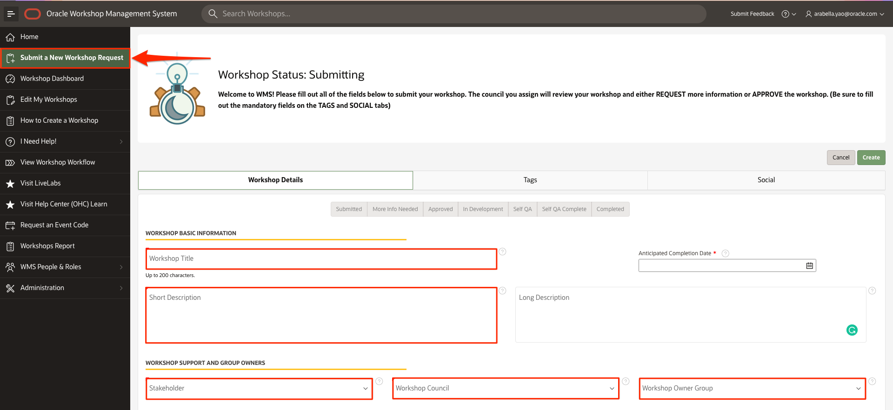
  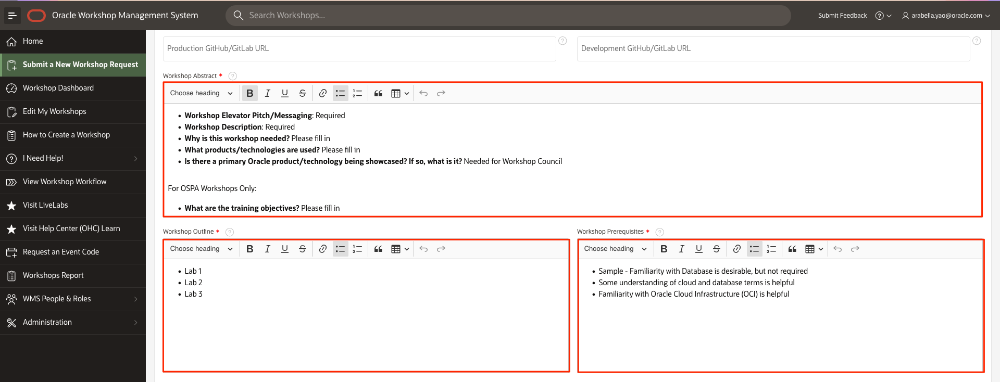

5.  Click the *Tags* tab, and select the proper tags for your workshop. You should select a *Level* tag, and at least one tag for *Role*, *Focus Area*, and *Product* respectively. Failure to do so will prevent your workshop from being approved. Click **Create**.

  

6. Click the *Social* tab to include a link to the blog of your workshop, write a couple of sentences that would accompany a LinkedIn post about your workshop, and write a tweet to be used to promote your workshop.

  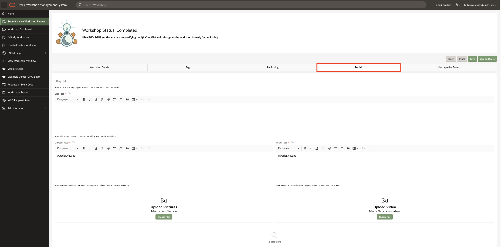

7.  We recommend you don't start working on your workshop until your workshop has been approved by a council member.

Once your workshop is submitted, it will be sent to the workshop council.  The workshop council will approve your workshop or ask for more details within 3 business days. If you have not heard back from your council group after 3 business days, please message them via WMS. Once approved, you will be entered into the workflow and given additional steps to progress through to production.

To find your council members, go to WMS, under **People & Role Reports**, select **Workshop Council Members**, and you can find your council members.

> **Note:** If you are a developer, QA, or PM, you can create and publish a Custom image of the on-premises product to OCI Marketplace. See the [Creating Compute Images for Marketplace](https://oracle-livelabs.github.io/common/sample-livelabs-templates/create-labs/labs/workshops/compute/index.html?lab=6-labs-setup-graphical-remote-desktop) LiveLabs workshop.

## Task 2: Create and Set Up Your GitHub Account

In this Task, you will create and set up your GitHub account.

1. Create a free GitHub Account here: [GitHub Web UI](https://github.com/) if you don't have one.
    

2.  If this is a new account, use your Oracle email ID to register.

    > **Note:** Do not create a secondary new account to join GitHub. Ensure that your GitHub account is associated with your @oracle.com email ID.

3. Go to [GitHub Settings](https://github.com/settings/profile) and configure the following:
    *   Set your Name as it appears on your Aria employee page.
    *   Add your Profile Picture.

4. Click **Account** to add your user name in the **Enter a user name** dialog. For example, achepuri, LauranSerhal, and so on.

5. Set up a 2 Factor Authentication here: [GitHub Security](https://github.com/settings/security).

    

## Task 3: Download and Install the latest version of Git (Optional Step)

> **Note:** For User Assistance Developers (UAD), Oracle recommends using the GitHub Desktop client because of its simple and user-friendly user interface, and it is also much easier to use than the Git command line; therefore,  if you are a UAD, skip this task and follow the instructions in **Task 4: Install GitHub Desktop**.

To install Git:

1. Install Git for your operating system from the [Git download site] (https://git-scm.com/downloads).

2. Click the required option under **Downloads** (**Windows** in this example) and save the installer file.

3. Browse to the downloaded location and double-click the file to launch the installer.

4. Click **Yes** in the **User Account Control** dialog box.

5. Click **Next** in the **GNU General Public License** dialog box.

6. Under **Choose the default behavior of `git pull`**, leave the selected **Default (fast-forward or merge)** option as is and click **Next**.

7. In the **Configuring experimental options** dialog box, click **Install**.

## Task 4: Install GitHub Desktop

The GitHub Desktop application is a UI client for Windows and Mac that simplifies the complex set of GitHub command line arguments. GitHub Desktop is a fast and easy way to contribute to projects and it simplifies your development workflow. It is much easier than using the Git command line.

To set up the GitHub Development Environment and install **GitHub Desktop**:

1. Download and install **GitHub Desktop** from [GitHub Desktop](https://desktop.github.com/).

2. When the software is successfully installed, open the **GitHub Desktop**.

  

3. Click **File > Options > Sign in**, enter your GitHub **Username** or **email address**, **Password**, and then click **Sign in**. You will receive an authentication code sent to your cell phone. Enter this code in the **Authentication code** field in the **Sign in** dialog box.

    > **Note:** The authentication code is valid only for a few seconds.

  You are now logged in to **GitHub Desktop**.

  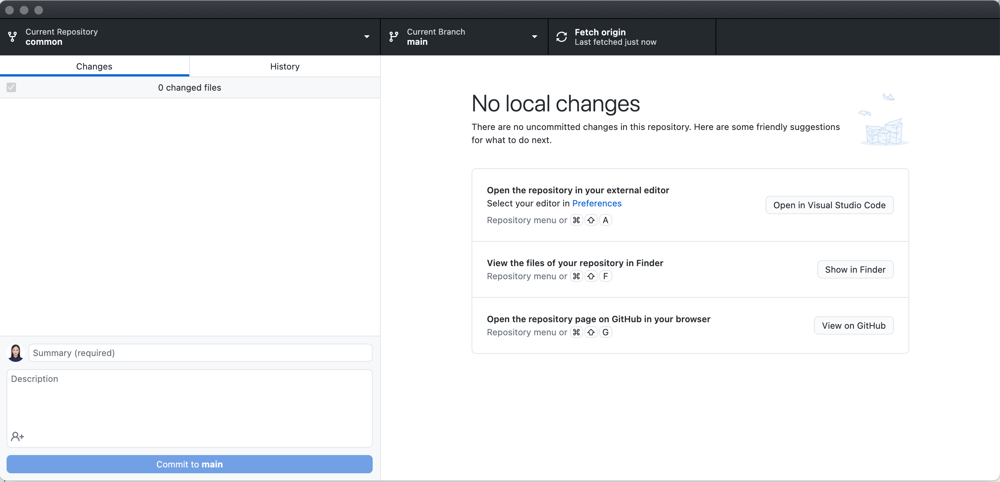

## Task 5: Fork Repositories of the oracle-livelabs Project on Your GitHub Account

  We create workshops and labs in the repositories of the **oracle-livelabs** project. You must fork a repository to create a duplicate personal copy of the repository on your GitHub account. You own the forked (stage) repository, and you can edit its contents without affecting the parent (production) repository.

  For example, if a user named arabellayao forks the **database** repository in the **oracle-livelabs** project, a duplicate repository [arabellayao/database](https://github.com/arabellayao/database) is created.

  After your workshop is approved by the council group, you first need to identify **which one repository among the [24 repositories](https://github.com/orgs/oracle-livelabs/repositories) you want to create your workshop in**. That decision depends on what product your workshop is about, or which council your workshop belongs to. For example, if your workshop is about GoldenGate, you should create your workshop in the [oracle-livelabs/goldengate](https://github.com/oracle-livelabs/goldengate) repository. Click [here](https://github.com/orgs/oracle-livelabs/repositories) to see the complete list of the repositories, and select one repository that fits your workshop.

  If you are not sure which repository to put your workshop in or do not see a repository that fits your workshop, please contact your council group or contact our LiveLabs team. We can give you some suggestions, and even create a new repository for you if necessary.

  For example, I want to create a workshop about GoldenGate, so I select the [oracle-livelabs/goldengate](https://github.com/oracle-livelabs/goldengate) repository. Next, I **only** need to fork the **goldengate** repository. The following steps walk you through forking the **goldengate** repository, but the steps are the same if you are forking any other repositories in the oracle-livelabs GitHub project.

1. Log in to the [GitHub Web UI](http://github.com), using your GitHub account.

2. Navigate to the [Oracle Livelabs GitHub project](https://github.com/oracle-livelabs).

3. Click **Repositories** to review the existing repositories. Select one repository that fits your workshop and click that repository.

  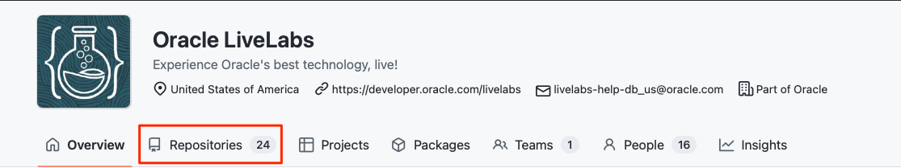

4. Here, I am using the **goldengate** repository as an example, but the process is the same for other repositories. Click **Fork**.

  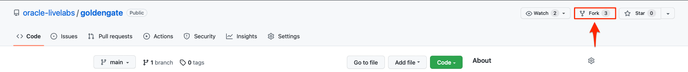

5. Under **Owner**, expand the dropdown list and select your username. You can accept the **Repository name** as it is. Click **Create fork**.

  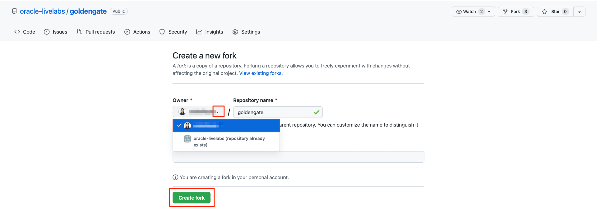

6. Then, user arabellayao has forked the **goldengate** repository.

  

In the next Task, you will clone this forked repository.

## Task 6: Clone the Forked Repository
A clone is a copy of your forked repository that lives on your local computer instead of on [GitHub Web UI](http://github.com). When you clone your forked repository, you can edit the files in your preferred editor, such as **Atom** editor, or **Visual Studio Code**, and use the **GitHub Desktop** client to keep track of your changes without having to be online.

To clone the forked repository:
1. Open your **GitHub Desktop** application and log in using your GitHub account.

2. Click **File > Clone repository** to display the **Clone a Repository** dialog box.

    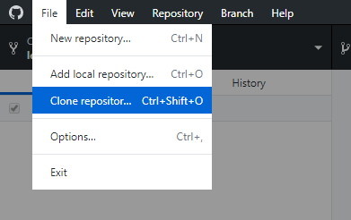

3. Select your repository such as **your account/repo** from **Your Repositories**. In this example, select **arabellayao/goldengate**. Under **Local Path**, select the local path on your machine where the repository is going to be cloned (copied). This is where the repository files get copied to your local file system. Click **Clone**.

    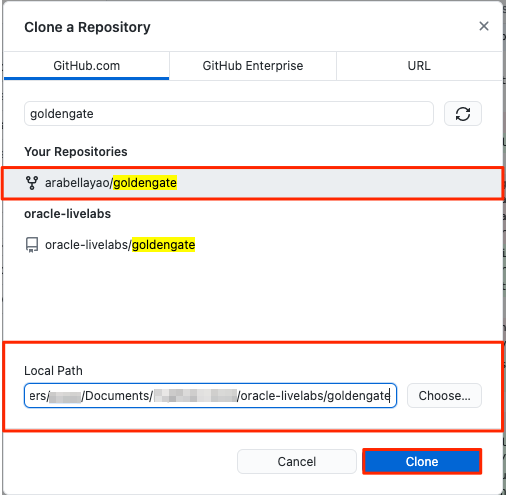

4. The cloning process may take several minutes, depending on how big the repository is.

  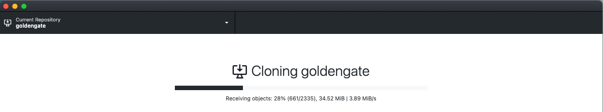

5. When asked how you plan to use the fork, select **To contribute to the parent project**. Click **Continue**.

  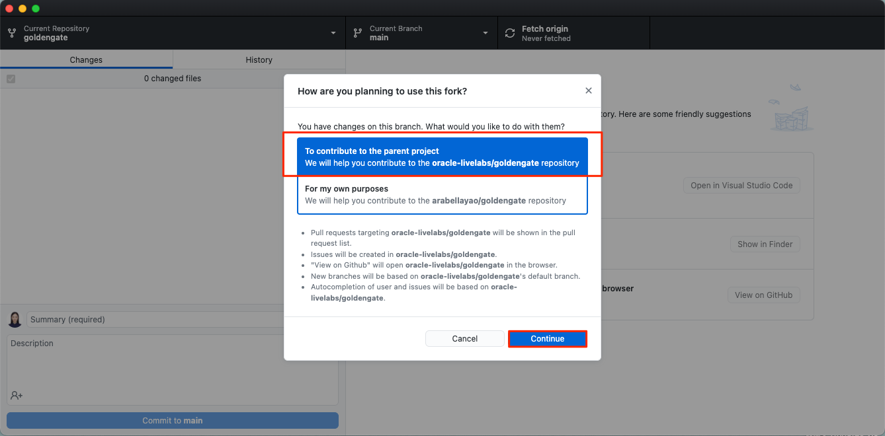

6. The repository files (in this case, **goldengate**) appear in the local path you just specified. You can now start working on your labs and workshops!

  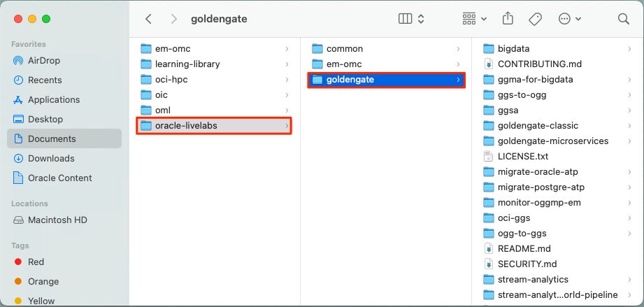

  > **Note:** The local cloned repository is connected to the remote fork version. You can push your local clone changes to the remote fork version when you are online to keep them in sync.

  When you make a clone, you can create your project folder, edit the files in your preferred editor, such as **Atom** or **Visual Studio Code**, and use **GitHub Desktop** to keep track of your changes without having to be online.

  The repository you cloned is still connected to the remote version (your fork) so that you can push your local changes to the remote to keep them synced when you're online.

7. You can also use Github Desktop to synchronize the changes that you have made in your local file system to the forked content on your GitHub repo.

  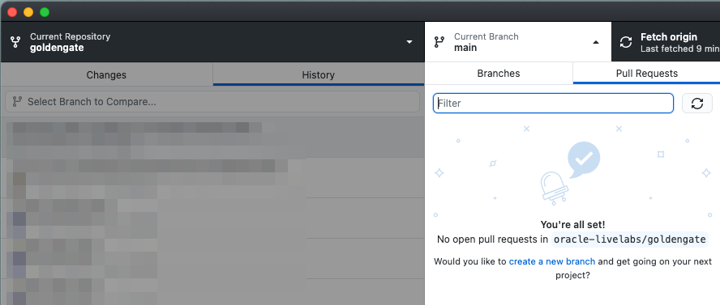

This concludes this lab. You may now **proceed to the next lab**.

## Want to Learn More?

* [Download and Install Git for Windows](https://git-scm.com/download/win)
* [Download and Install Git for Mac](https://git-scm.com/download/mac)

## Acknowledgements

* **Authors:**
    * Anuradha Chepuri, Principal User Assistance Developer, Oracle GoldenGate
    * Lauran Serhal, Principal User Assistance Developer, Oracle Database and Big Data
* **Contributors:**
    * Kay Malcolm, Database Product Management
    * Madhusudhan Rao, Principal Product Manager, Database
    * Aslam Khan, Senior User Assistance Manager, ODI, OGG, EDQ
    * Arabella Yao, Product Manager, Database

* **Last Updated By/Date:** Arabella Yao, Jun 2022