# Use A Text Editor to Develop Markdown Content

## Introduction

You can use your preferred editor to author and edit your Markdown (.md) content for rendering the Workshop output.

> **Note:** Oracle recommends the UA Developers use Atom.

### Objectives

* Learn about the tools that are available to develop and host your content.
* Learn how to merge content.
* Create workshop and lab content.
* Preview the content in a browser.


## Task 1: Install Your Text Editor

You can use your preferred editor, however, we recommend downloading either Atom or Visual Studio Code. Below, there are instructions for both.

### **Option 1: Install Atom**

`Atom.io` is a 3rd party IDE freely available under MIT License.

To install Atom:

1. Go to the [Atom](https://github.com/atom/atom/releases/tag/v1.51.0) URL.
2. Click the zip file for your operating system, save and extract the zip file.
  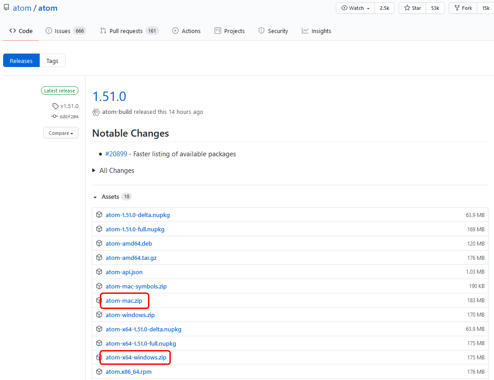
3. From the extracted files, click `atom.exe` to launch Atom.

### **Option 2: Install Visual Studio Code**

To install Visual Studio Code:

1. Visit the [download](https://code.visualstudio.com/download) site and select the zip file for your operating system. In this case, we chose Mac OS.
  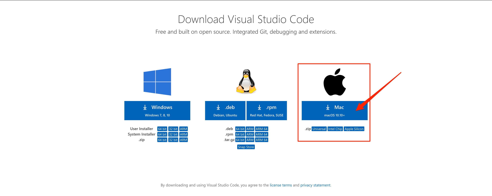
3. Double-click the zip file to expand it. The VS Code application will then show in your downloads folder in Finder.
  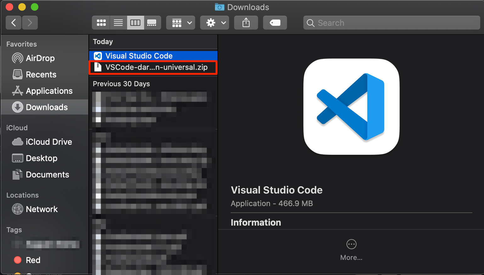
4. Drag it to the Applications folder and double-click it to launch the text editor.
  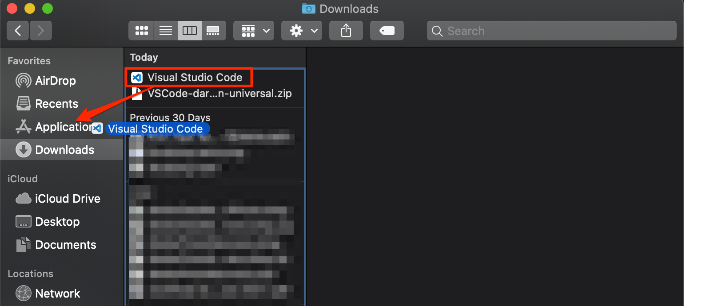

## Task 2: Install Live Server

### **Option 1: Install Atom's Live Server Package**

You must NOT be connected to Oracle's network or VPN while installing the **atom-live-server** package.

To install **atom-live-server**:
1. In the **Atom** editor, click **Help**, and then select **Welcome Guide**.
2. In the **Welcome Guide** screen, click **Install a Package**, and then click **Open Installer** to display the **Install Packages** window.

  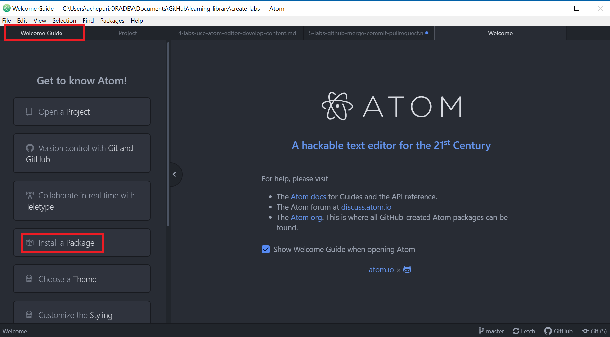

3. Enter **atom-live-server**, and then click **Install**.

  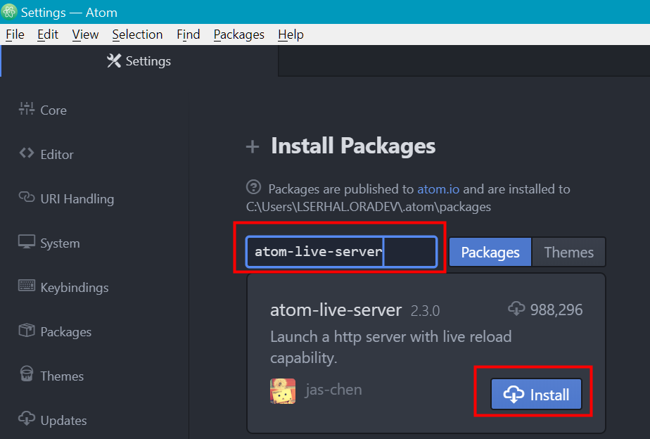

4. When the installation is completed, the **Install** button is replaced with the **Uninstall** and **Disable** buttons.
  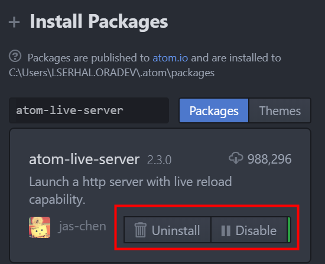
The **atom-live-server** plugin is added to the **Packages** menu.
  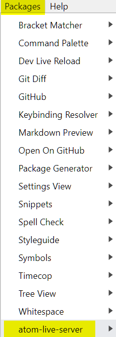

### **Option 2: Install Visual Studio Code's Live Server Extension**

1. Launch VS Code and navigate to the Extensions bar.
  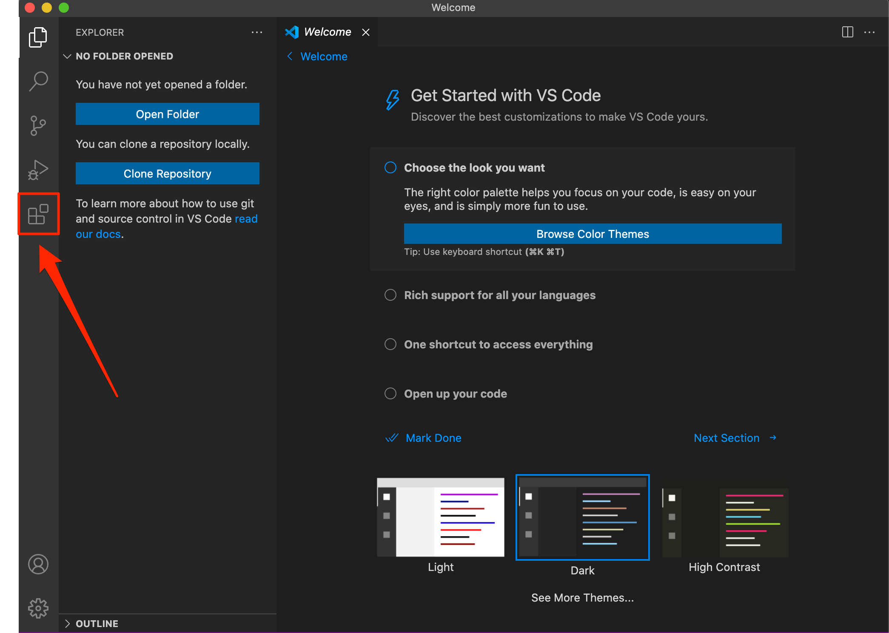
2. Type "Live Server" into the search bar and select the first entry, "Live Server 5.6.1".
  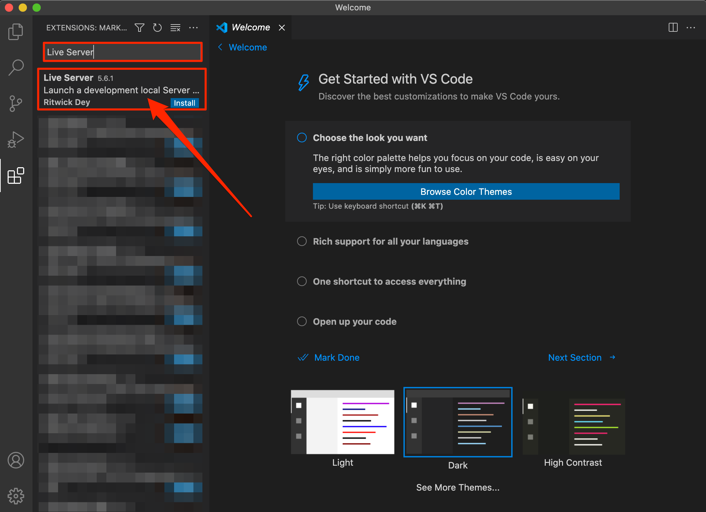
3. Click "Install".
  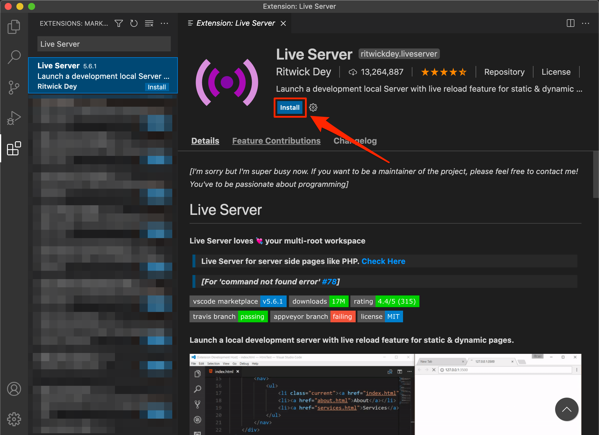

## Task 3: Merge Content from Git Before You Start Editing Your Content
  Every day before you start editing your content, ensure to do a Merge in **GitHub Desktop**.
  Merging synchronizes the content in your cloned repository with the latest content on the **upstream/main** repository and ensures that you have the most recent versions of the templates and other workshops/labs.

  >**Note**: If you don't do that, you may get merge conflicts later when you commit your changes, which can be complex to fix.

  To merge content:
  1. Start your **GitHub Desktop** client.

  2. If you have multiple Oracle LiveLabs repositories, first switch to the repository that you will work on. Expand the dropdown list of **Current Repository**. Click the repository that you want to sync. In this case, I select the *em-omc* repository as an example, but the following process is the same for syncing other repositories.
  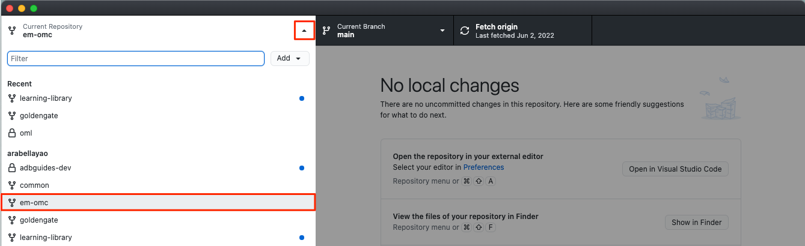

  3. Make sure you perform the following steps **off VPN**. Otherwise, your GitHub Desktop may be stuck.

  4. Click **Fetch origin**.
  

  5. Select **Branch > Merge into Current Branch...** to display the **Merge into main** window.

    

  6. Under the **Default Branch**, the main branch is selected by default. This indicates the local clone on your PC.
    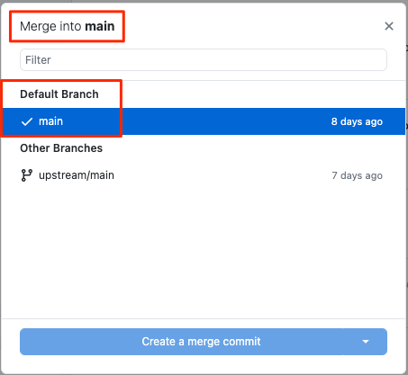

  7. Scroll down the **Merge into main** window, select **upstream/main** (this is your production repository which is oracle-livelabs/repository), and then click **Create a merge commit**. In this example, this will merge 1 commit by other people from the **upstream/main** into the clone on the local PC.

    

  8. When the merge is completed, a **"Successfully merged upstream/main into main"** message is displayed. To push the new commits from the local clone to your forked location, click **Push origin**. If you get an *Authentication failed* error, refer to the Troubleshooting section at the end of this lab.

    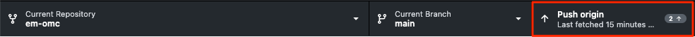

    >**Note**: To determine if your clone is up-to-date with **upstream/main** (production), repeat Steps 4 to 7. If both repositories are synchronized, then the following message is displayed: "This branch is up to date with **upstream/main**".

    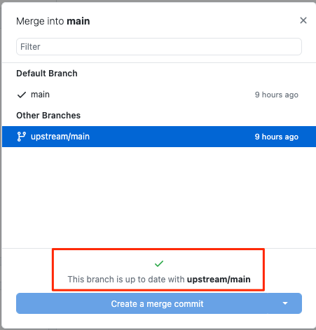

  In the **GitHub Desktop** UI, notice that the **Push origin** is replaced by **Fetch origin** after the push origin operation is completed.  The local clone and fork repositories are now synchronized with the main repository.

  

## Task 4: Create Your Labs and Workshop Content
Leverage the content from the **sample-livelabs-templates\sample-workshop** folder to start creating lab and workshop content for your project.

> **Note:** Ensure to update your clone from the **upstream/main** repository (detailed in **Task 3**) regularly whenever we are working on the markdown files.

To create your lab and workshop content:
1. Submit your workshop to the [LiveLabs Workshop Management System](http://bit.ly/oraclelivelabs) BEFORE you begin development.  No GitHub requests will be approved without an approved WMS ID.

2. Open your cloned repository using Windows Explorer (Windows) or Finder (Mac).

3. Create your project folder anywhere in your cloned repository. If a folder already exists for the product you work on, then you can create your project folder within that.

4. Go to **sample-livelabs-templates\sample-workshop**. This has a few lab folders, such as **provision**, **query**, etc. Every lab folder contains the following: a **files** folder, an **images** folder, and the respective `.md` file. You can use **Live Server** to open up **sample-workshop\workshops\tenancy\index.html** to see how a workshop will show up in production, and play with it.

5. Copy any lab folder (except the folder named `workshops`), such as the **query** folder, to your project folder. In your project folder, rename the folder **query** and the respective `.md` file within it as per your requirement.  Based on the sample **query** folder, you can create and rename as many labs (folders) and the respective `.md` files as per your requirement.

      >**Note:** The **files** folder within every sample lab folder is currently not required and is reserved for future use. You can remove it if you don't need it.

      
      After you copy the sample folder to your project folder, you can delete your copy of the **files** folder from your project folder.
      Your lab will look similar to this example:
      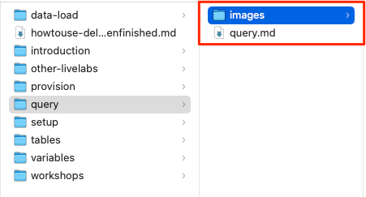

6. Similarly, copy the **workshops** folder along with its contents from **sample-livelabs-templates\sample-workshop** to your project folder. For example, **sample-livelabs-templates\create-labs\labs**.

7. To edit the `.md` file of your lab, open your text editor (in this case, we're using Atom), click **File > Open Folder** to display the **Open Folder** dialog box. In VSCode, you would click **File > Open**.
  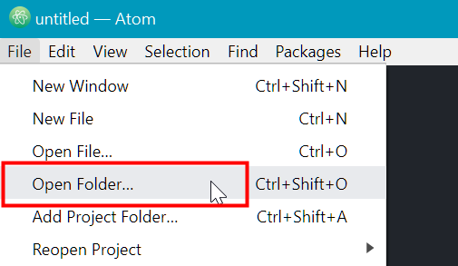

8. Navigate to your project folder and click **Select Folder** to open your project folder.
  

  The project folder along with the labs and **workshops** folder will then be displayed in your text editor.
    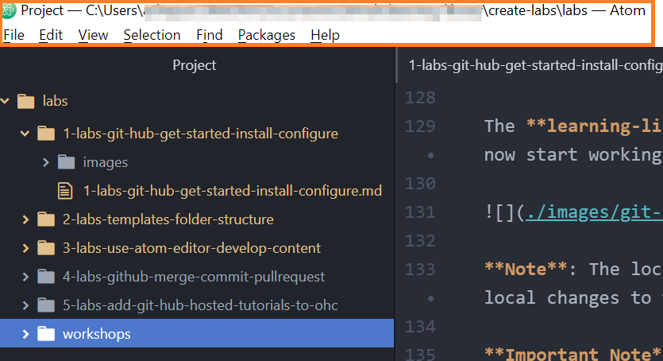

9. Select the `.md` file you want to edit, for example, select the `1-labs-git-hub-get-started-install-configure.md` file and edit your lab content. Similarly, edit the `.md` files of the rest of your labs.
    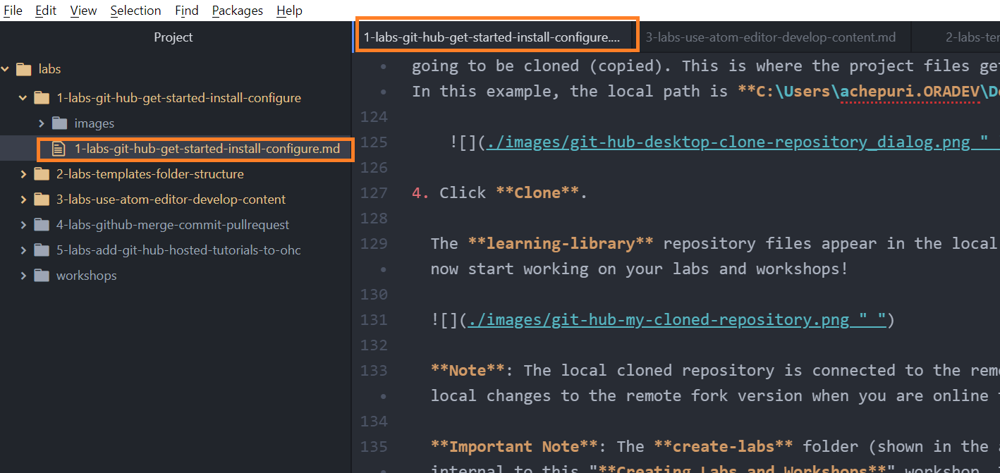

10. If you want to add images in your lab, then include them within the **images** folder. You can insert images in the respective `.md` file.

11. Similarly to edit your workshop content, expand the **workshops\tenancy** (if you are creating a workshop running on users' tenancies), **workshops\sandbox** (if you are creating a sandbox/green button workshop), and/or **workshops\desktop** (if you are creating a noVNC workshop) folder in your text editor. Edit the `manifest.json` to list the labs you have added to your workshop (or plan to add) and update the title of the workshop. The `manifest.json` is like your book map file in SDL.

  Besides the list of labs, also update the `workshoptitle` field, and update the `help` field to point to the workshop's stakeholders group email. If the `include` and `variables` field do not apply to your workshop, please remove them, otherwise, your workshop will not render properly.

  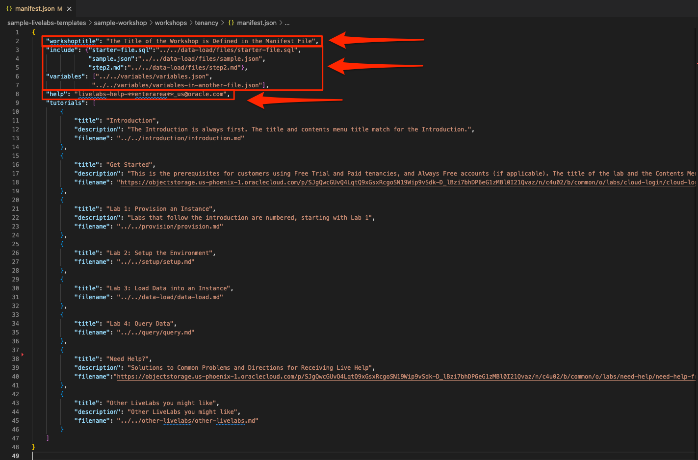

12. If you want to add an introduction to your workshop, then navigate to **sample-livelabs-templates\sample-workshop** and copy the `introduction` folder to your project folder, for example, **create-labs\labs**. You can rename the introduction folder if you would want to.

13. You can also create a `README.md` file within **workshops\freetier**, and update the `README.md` with a summary of your workshop. Note that the `README.md` file is optional for your workshop.

## Task 5: Security

1. Blur all personal information (IP addresses, intranet URLs, email addresses, OCIDs, usernames, and passwords) from images.
  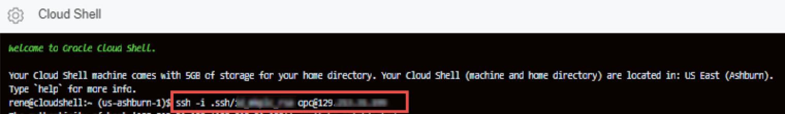

2. Every image must have a description: ![DESC] (…/…/name.png “ “)

  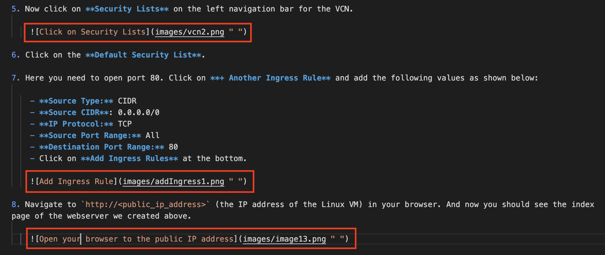

3. Do not use any IP addresses, intranet URLs (for example links to a Confluence page), email addresses, OCIDs, usernames, or passwords in the text. Do not provide a demo password. 


## Task 6: Preview Your Workshop and Labs Using Live Server
### **Option 1: Using Atom**

1. First, start the **atom-live-server**. In the Atom editor, select **Packages > atom-live-server > Start server**.
  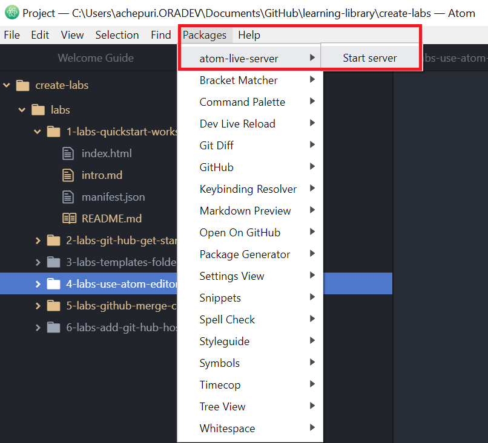

  By default, the **atom-live-server** opens a browser window that displays the folders inside your project (**labs**) folder.
2. Click the **workshops** folder and then click the **freetier** folder that contains the workshop you want to view.
  

  The Workshop is displayed along with the labs. You can make content changes in the **Atom** editor to the workshop and lab files, save the changes, and the updated content gets automatically refreshed in the browser window.

  

3. To stop the **atom-live-server**, go back to **Atom**, select  **Packages > atom-live-server > Stop folder-path-at-port-#**.

### **Option 2: Using Visual Studio Code**

1. Within the directory of any workshop you want to view, click the **workshops** folder and then click the **freetier** folder.
  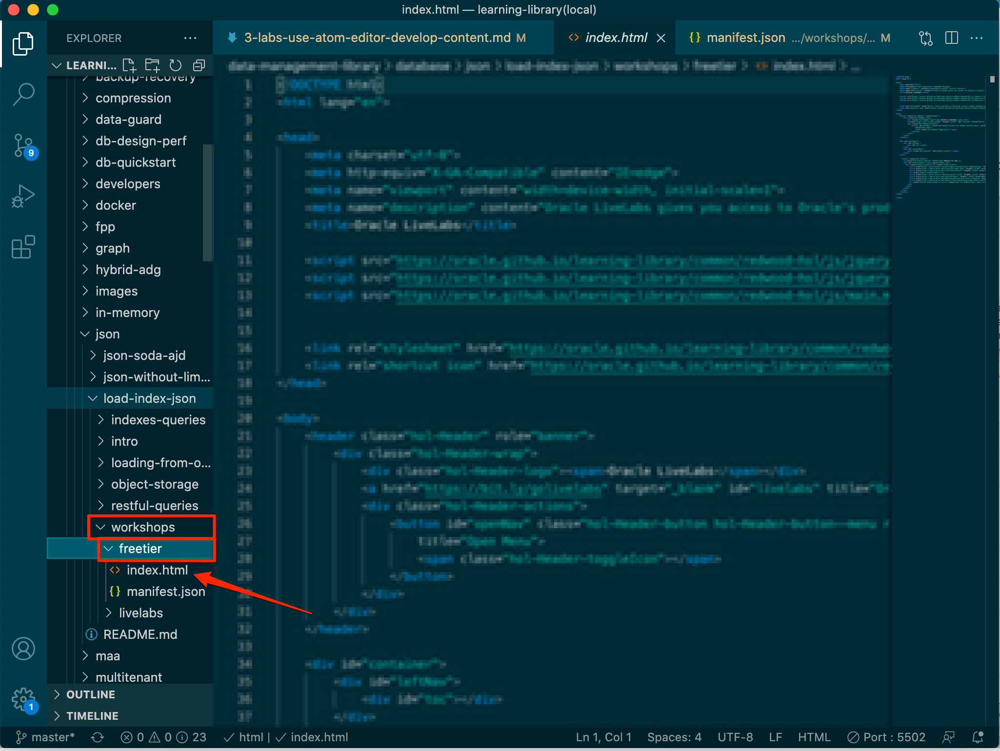
2. Right-click on the index.html file and select "Open with Live Server".
  
3. The local version of your workshop will then be launched in your web browser.

## Task 7: (Optional) Helpful resources and extensions for Visual Studio Code

1. [Showdown Editor](http://demo.showdownjs.com/) is a Javascript Markdown to HTML converter that LiveLabs uses in the background to convert Markdown files to HTML. This documentation is a helpful resource while developing content in markdown files. This document provides a quick description of the markdown syntax supported on the left side and the output in HTML format on the right side. Showdown Editor shows the syntax of writing, paragraphs, headings, block and italics, code formatting, creating lists, tables, adding links, images, escaping entities, etc.

  

2. Set up tab spacing in Markdown files in Visual Studio Code - To have a fixed indentation and consistency in all the markdown files among the images, code snippets, and between the numbers in each task with the line starting, you need to set spaces to tabs (size 4).

  To set spaces to tabs size 4, click on spaces, choose indent with tabs, and select 4 as configured size, which sets the tab spacing to 4.

    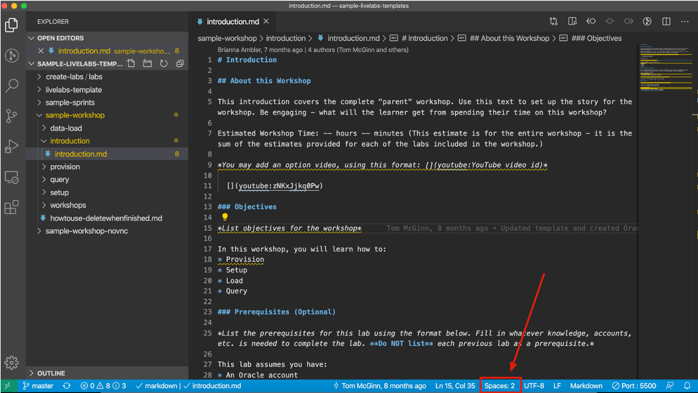

    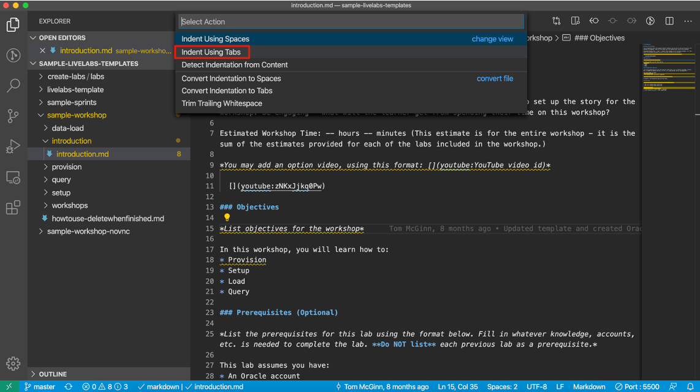

    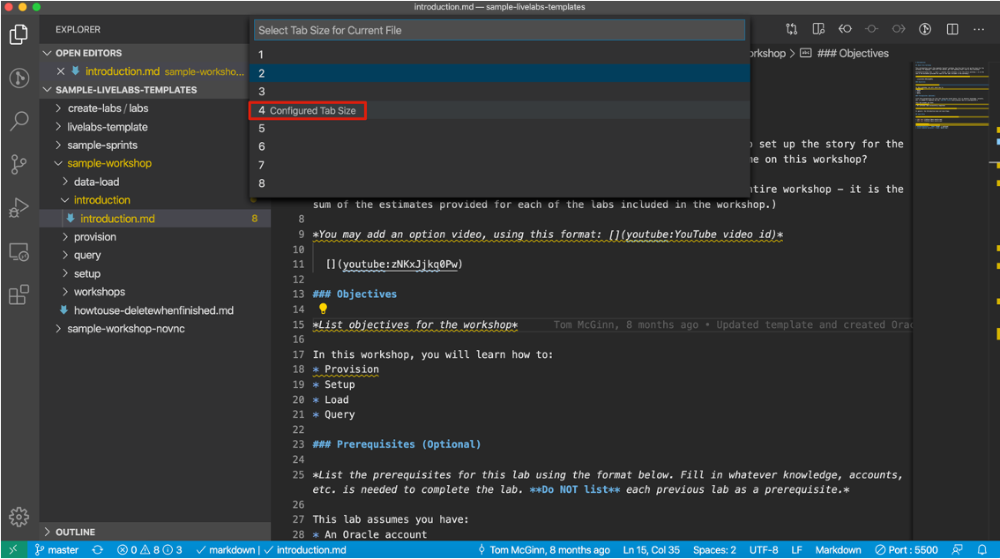

    

3. Install Markdownlink Extension in Visual Studio Code - This extension is helpful to check markdown files linting and styling in VS Code. This extension has a library of rules to encourage standards and consistency for markdown files. 

  To install this extension, search for markdownlint in the VS Code marketplace, select the first one and click on Install to install it.

    

4. Install Code Spell Checker Extension in Visual Studio Code - This extension is helpful to check spellings in the files.

  Search for the code spell checker in the VS Code marketplace, select the first one that doesn’t specify any language in the title, which is the English spell checker, and install it.

  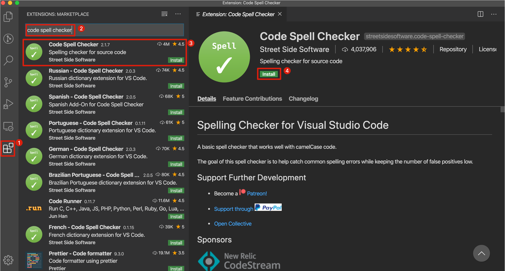

5. Install Delete Trailing Spaces Extension in Visual Studio Code - Trailing space is all whitespace(s) located at the end of a line, without any other characters following it. This extension is helpful to resolve code blocks, copy and paste issues, and sometimes merge conflicts.

  To highlight trailing spaces, in the VS Code marketplace, search for trailing spaces and select the first trailing spaces, not the one with a fork, and click on Install. Once the extension is installed, you can see that whitespace(s) are highlighted in red to delete them.

  

6. Install Path Intellisense Extension in Visual Studio Code - since repositories in the Oracle LiveLabs GitHub project have many files, you may want to access files in different folders of your workshop or sometimes in a different directory. To know the file, you are pointing to in the manifest.json file, you can use the path intellisense extension.

  To install this extension, search for path intellisense in VS Code marketplace, select the first extension and install it.

  

  Use Path Intellisense Extension in manifest.json file - After typing the backslash, hit enter to view or choose the folder(s) or file(s)

  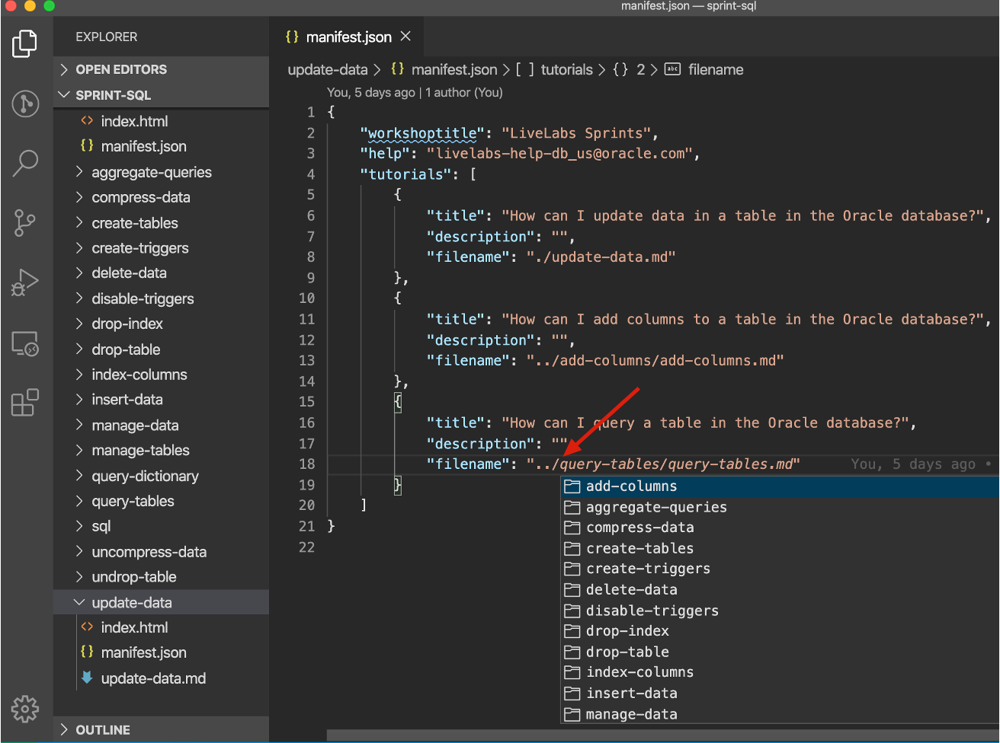

  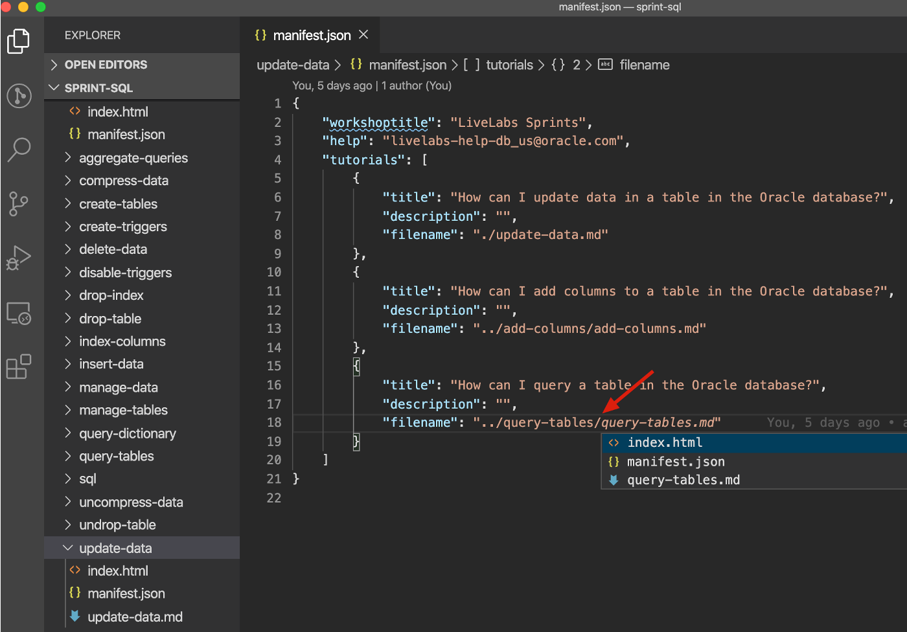

This concludes this lab. You may now proceed to the next lab.

## Troubleshooting

### Issue 1: Authentication error.

  

First, make sure that you are logged into your GitHub account in GitHub Desktop. If it still does not solve the error, try the following steps.

If you have already created an SSH key in your local computer and added the key to your GitHub account, you can go directly to Step 5.

1. If you have not generated SSH keys in your local computer, first follow the *(Optional) Lab 5: Generate SSH keys* on the left to generate SSH keys in your local computer.

2. Now you have your public and private SSH keys. Go to your GitHub account in a browser. Click the arrow next to your profile picture on the upper right, and click **Settings**. Click **SSH and GPG keys**. If you have not added any SSH keys to your GitHub account, you will not see any SSH keys displayed. Then click **New SSH key**.
  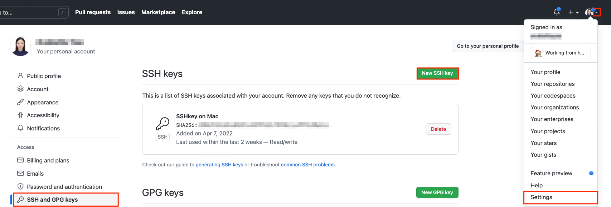

3. For **Title**, give your SSH key a name. In the **Key** field, copy and paste your public SSH key. Then, click **Add SSH key**.
  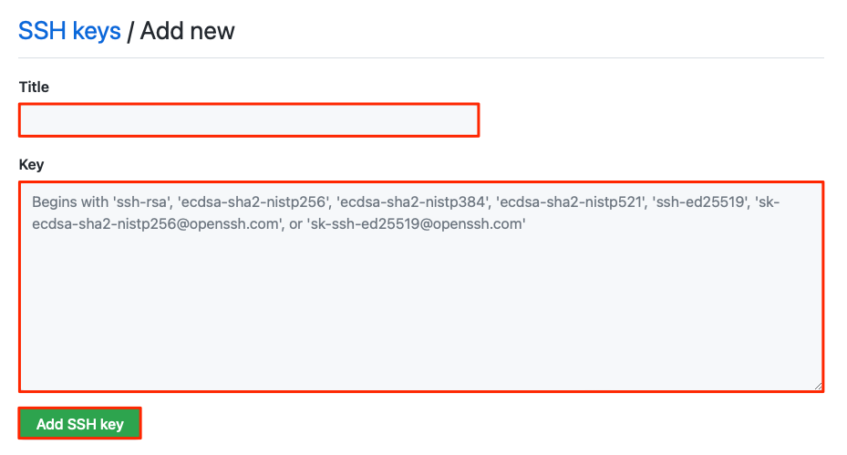

4. After the SSH key is added, you can see it under SSH keys on your GitHub page.
  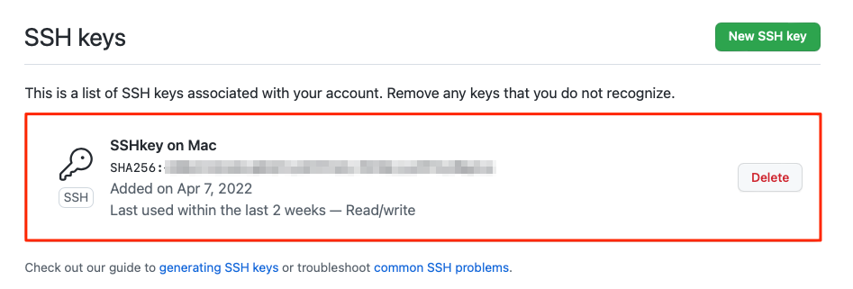

5. Open up your terminal. Go to where *you cloned your GitHub repository* (which may be different from the example below). In this case, I am using the **em-omc** repository as an example, but the process is the same for other repositories.

    ```
    user@user-mac ~ % cd Documents/oracle-livelabs/em-omc
    user@user-mac em-omc %
    ```
6. Run the ssh-agent command.

    ```
    user@user-mac em-omc % <copy> ssh-agent -s </copy>
    SSH_AUTH_SOCK=/var/folders/sl/pt8rm4rd4tl_f8yyd8n6jd640000gn/T//ssh-vkOzi3x2qhp7/agent.82390; export SSH_AUTH_SOCK;
    SSH_AGENT_PID=82391; export SSH_AGENT_PID;
    echo Agent pid 82391;
    ```

7. Run the ssh-add command. Append your private SSH key after the ssh-add. Yours may be different from what is shown below.
    ```
    user@user-mac em-omc % <copy> ssh-add ~/.ssh/sshkey </copy>
    Identity added: /Users/user/.ssh/sshkey (user@user-mac)
    ```

8. Finally, go back to **GitHub Desktop** UI, and click **Push origin**. This should solve the authentication issue, and you can continue the lab.
  

### Issue 2: Workshops or labs do not show up using Live Server

If you see a blank page, check the manifest.json file.
1. Expand the navigation menu on the left, if you can navigate to other labs, then the problem is with a particular lab. Find that lab's location in the manifest.json file.

2. If no labs are showing up, then it is possibly the issue with the workshop. In the manifest.json file, make sure you remove the *include* and *variables* if they do not apply to your workshop.


## Acknowledgements
* **Author:**
    * Anuradha Chepuri, Principal User Assistance Developer, Oracle GoldenGate
* **Contributors:**
    * Lauran Serhal, Principal User Assistance Developer, Oracle Database and Big Data User Assistance

* **Reviewed by:**
    * Aslam Khan, Senior User Assistance Manager, ODI, OGG, EDQ
    * Kay Malcolm, Database Product Management
    * Arabella Yao, Database Product Management
    * Andres Quintana
    * Brianna Ambler

* **Last Updated By/Date:** Arabella Yao, Jun 2022