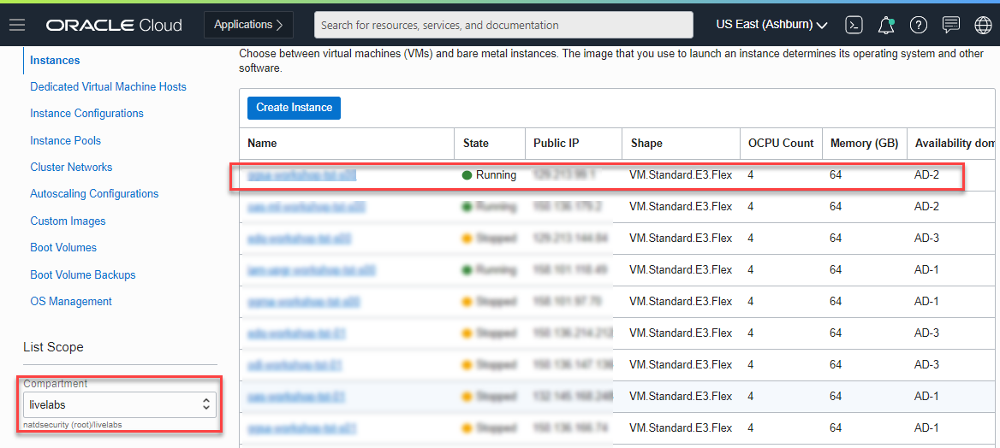
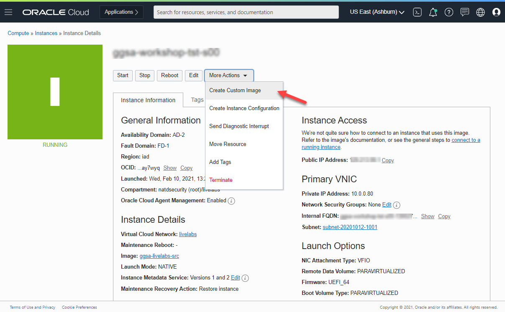
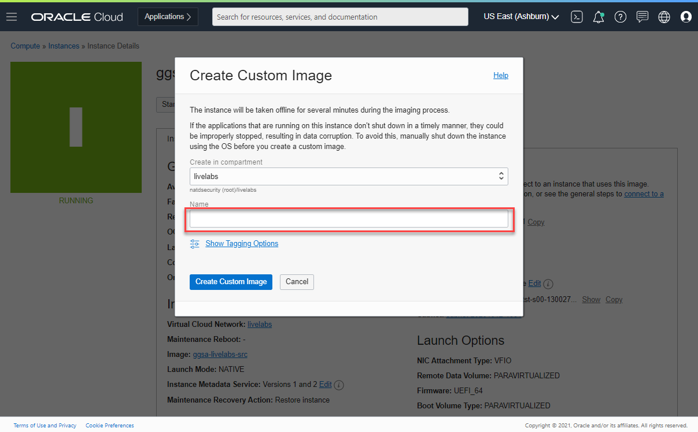
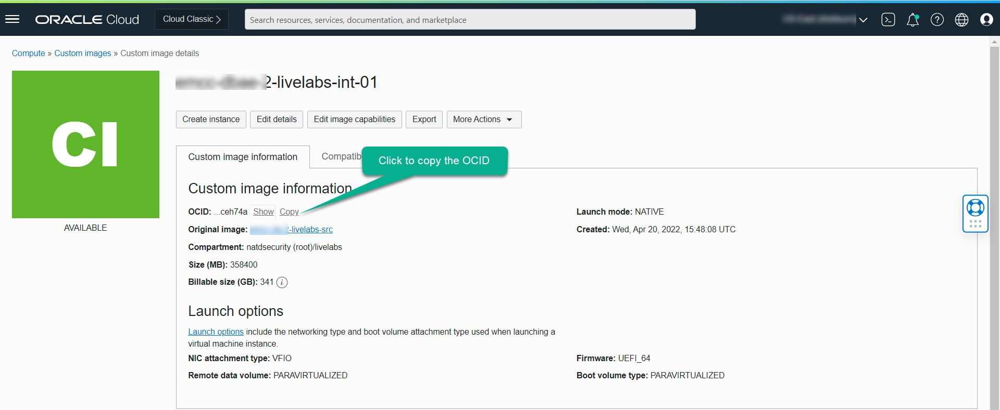
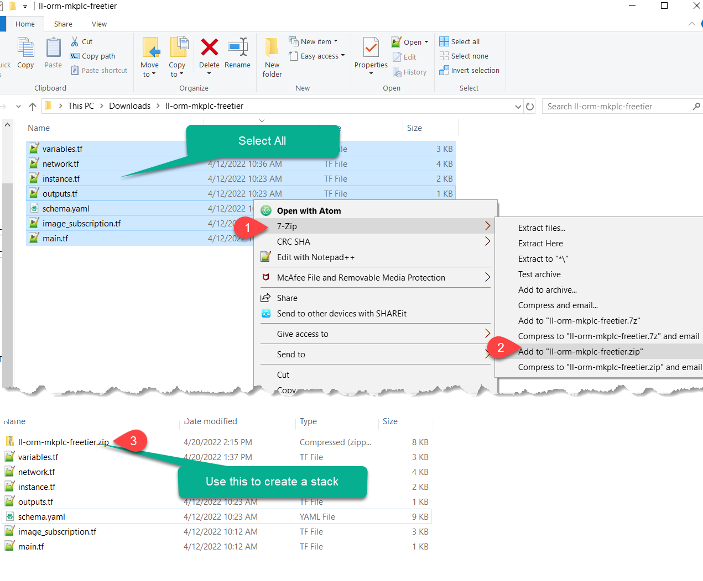
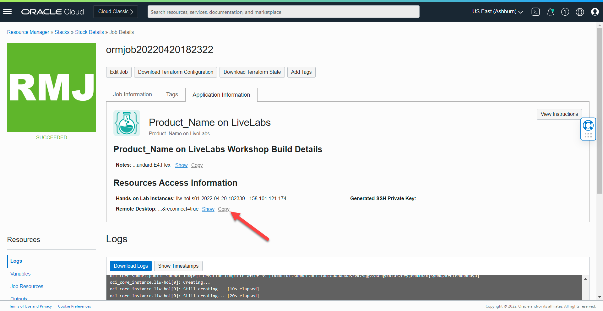
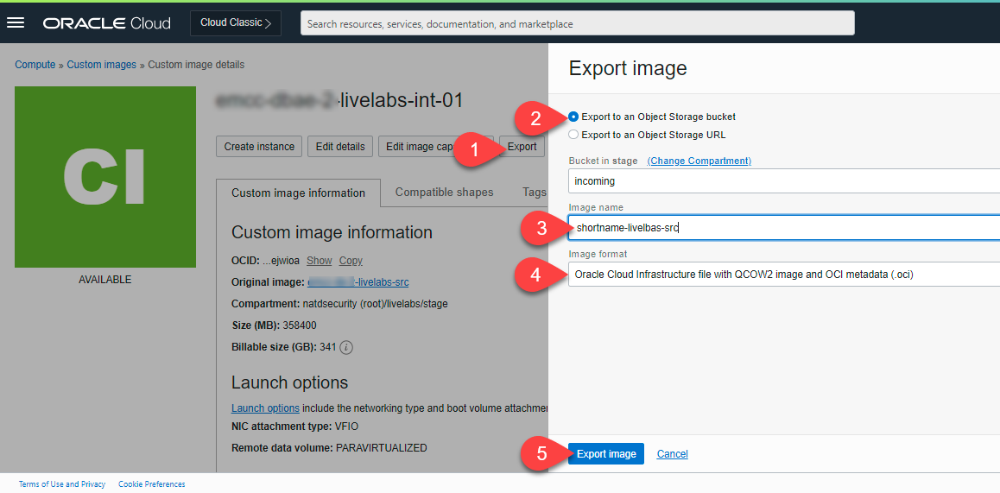
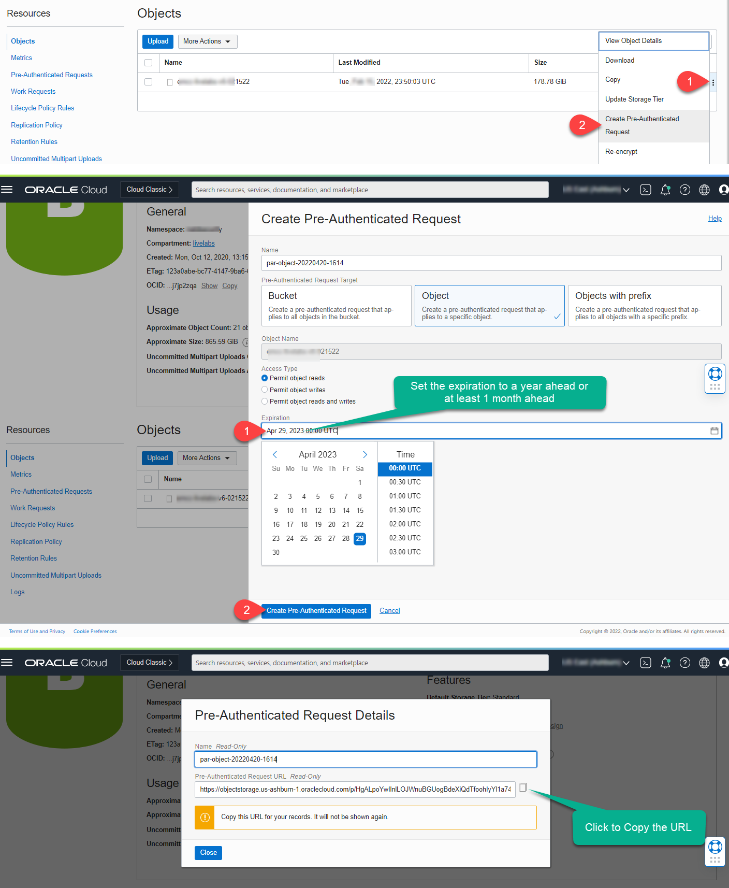

# Create Custom OCI Compute Image for Marketplace Publishing

## Introduction
This lab will show you how to prepare a host for custom image capture and create the custom image that meets stringent OCI marketplace requirements.

### Objectives
- Perform cleanup tasks to get the image in the desired state for custom image capture
- Create Custom Image

### Prerequisites
This lab assumes you have:
- An Oracle Enterprise Linux (OEL) that meets requirement for marketplace publishing

## Task 1: Cleanup Instance for Image Capture   

1. As user *opc*, Download the latest *oci-image-cleanup.sh* script.

    ```
    <copy>
    cd /tmp
    wget https://raw.githubusercontent.com/oracle/oci-utils/master/libexec/oci-image-cleanup -O /tmp/oci-image-cleanup.sh
    chmod +x oci-image-cleanup.sh
    </copy>
    ```

2. Stop VNC Service to preserve the remote desktop layout before proceeding with custom image creation.

    ```
    <copy>
    cat > /tmp/stopvnc.sh <<EOF
    #!/bin/bash

    #Drop existing chrome browser sessions
    ll_windows_opened=\$(ps aux | grep 'disable-session-crashed-bubble'|grep -v grep |awk '{print \$2}'|wc -l)

    if [[ "\${ll_windows_opened}" -gt 0 ]]; then
      kill -2 \$(ps aux | grep 'disable-session-crashed-bubble'|grep -v grep |awk '{print \$2}')
    fi

    #Stop VNC
    cd /etc/systemd/system
    for i in \$(ls vncserver_*@*)
    do
      systemctl stop \$i
    done
    EOF
    chmod +x /tmp/stopvnc.sh
    sudo /tmp/stopvnc.sh
    </copy>
    ```

2. Create and run script */tmp/cleanup.sh*

    ```
    <copy>
    cat > /tmp/cleanup.sh <<EOF
    #!/bin/bash
    systemctl stop rsyslog
    sh -c 'yes| /tmp/oci-image-cleanup.sh'
    sed -i -e 's|^.*PermitRootLogin.*\$|PermitRootLogin no|g' /etc/ssh/sshd_config
    sed -i -e 's|root:x:0:0:root:/root:/bin/bash|root:x:0:0:root:/root:/sbin/nologin|g' /etc/passwd
    ln -sf /root/bootstrap/firstboot.sh /var/lib/cloud/scripts/per-instance/firstboot.sh
    ln -sf /root/bootstrap/eachboot.sh /var/lib/cloud/scripts/per-boot/eachboot.sh
    rm -f /u01/app/osa/non-marketplace-init/system-configured
    rm -rf /home/oracle/log/*
    rm -rf /home/opc/log/*
    rm -f /var/log/audit/audit.log
    EOF
    chmod +x /tmp/cleanup.sh
    sudo /tmp/cleanup.sh

    </copy>
    ```

## Task 2: Create Custom Image   

Your instance at this point is ready for clean capture. Proceed to OCI console to perform the next steps

1. Launch your browser to OCI console, then navigate to *"Compute > Instances"*

    

2. Select the instance on which you just performed the prior cleanup steps. Make sure to select the right compartment

    

3. Click on *"More Actions"* and select *"Create Custom Image"*

    

4. Enter a name for the image and click *"Create Custom Image"*

    

5. Edit image details and select all shapes except *BM.Standard.A1.160* and *VM.Standard.A1.Flex*

    

## Task 3: Test Custom Image   

1. Download the sample ORM stack zip archive

    - [ll-orm-mkplc-freetier.zip](https://objectstorage.us-ashburn-1.oraclecloud.com/p/Ma3anAntwyF54E289zRxemySTIA2RZcOcq1jPZ_ZRiV3lhedYJSw3qCRnnU9K__M/n/natdsecurity/b/stack/o/ll-orm-mkplc-freetier.zip)

2. Unzip it locally on your computer to *ll-orm-mkplc-freetier*.
3. Delete the downloaded file *ll-orm-mkplc-freetier.zip*.
4. Copy the OCID of the new image

    

5. Navigate to *ll-orm-mkplc-freetier* and open the file *variables.tf*

6. Search and replace the string below with the OCID of the newly created custom image copied above

    ```
    <copy>
    replace-with-valid-image-OCID
    </copy>
    ```

    

7. Save *variables.tf*
8. Repackage the entire content of *ll-orm-mkplc-freetier* as  *ll-orm-mkplc-freetier.zip*

    

9. Using the new zip file above, navigate to "*Developer Services > Stacks*" and create a test instance with Oracle Resources Manager (ORM).

    *Notes:* For more details on how to provision with ORM, refer to [setup-compute](https://oracle-livelabs.github.io/common/sample-livelabs-templates/sample-workshop-novnc/workshops/freetier/?lab=setup-compute-novnc-ssh) lab guide.

10. After successful instance creation, get the remote desktop URL and logon to validate

    

11. Launch a browser session and navigate to the copied URL to validate

    

    *Notes:* If the setup was successful you should see two sample Google-chrome browser windows preloaded.

## Task 4: Share with LiveLabs Team   
1. Export the custom image to an Object Storage Standard bucket (Do not an Archive bucket)

    - Select *Export to an Object Storage bucket* unless you have a remote bucket URL with the right permissions to accept your export
    - Update the image name field
    - Set format to *Oracle Cloud Infrastructure file with QCOW2 image and OCI metadata (.oci)*
    - Click *Export image*

    

2. Navigate to the bucket, select the exported object, and Create a pre-authenticated URL

    - Set the expiration to a year ahead or at least 1 month ahead

    

3. Draft an email to *`livelabs-help-db_us@oracle.com`* and *`livelabs-help-license_us@oracle.com`* with the following content

    - Pre-authenticated URL created and copied above
    - **`desktop_guide_url`**: Link to github.io guide ending with "*../workshop/desktop*".
      ```
      e.g.
      https://oracle-livelabs.github.io/em-omc/enterprise-manager/emcc/workshops/desktop/
      ```
    - **`desktop_app1_url`** (Optional): Link to any webapp that should be loaded on the desktop on noVNC boot.
      ```
      e.g. Enterprise Manager Console
      https://emcc.livelabs.oraclevcn.com:7803/em
      ```
    - **`desktop_app2_url`** (Optional): Same as above a second webapp loaded on the second Google-Chrome browser tab


## Learn More
* [Oracle Cloud Marketplace Partner Portal Documentation](https://docs.oracle.com/en/cloud/marketplace/partner-portal/index.html)
* [Oracle Cloud Marketplace Partner Portal Videos](https://docs.oracle.com/en/cloud/marketplace/partner-portal/videos.html)


## Acknowledgements
* **Author** - Rene Fontcha, LiveLabs Platform Lead, NA Technology, February 2021
* **Last Updated By/Date** - Rene Fontcha, LiveLabs Platform Lead, NA Technology, April 2022
