# Title of the Lab

## Introduction

In this Lab we will obtain code needed for our Flask application. We'll run our application and observe the application flow in order to better understand how they interact with Oracle REST APIs. 
Estimated Time: 20 minutes

### About Oracle REST Data Services (ORDS)

This lab will cover topics including: 
- Oracle REST Data Services (ORDS) APIs
- GitHub and repositories 
- The Flask framework 
- Database Actions

### Objectives

In this lab, you will:
* Obtain all code necessary to complete this Workshop
* Review the Flask application's core functions/operations
* Review the application's reliance on Oracle REST APIs 

### Prerequisites
* A text editor (such as Visual Studio Code or Sublime Text)
* Flask Installation 
* Virtual Environment Installation

This lab assumes you have:
* All previous labs successfully completed

## Task 1: Obtain code for this Workshop

1. Navigate to [this repository]().
2. If you have an existing GitHub account you may choose to fork the repository for this Workshop. 
    - Alternatively, you may choose to download the contents of this Workshop as as `.ZIP` file. 

  

3. Once you have forked the repository (or installed locally through the ZIP option), the contents should look similar to this: 

    

    At a <i>minimum</i> you'll want to ensure you have a `static` folder, `templates` folder, and the Python application `app.py`.

:bulb: <i>For details on how to run a Flask application in a Virtual Environment (venv), refer to the [Installation](https://flask.palletsprojects.com/en/2.2.x/installation/) and [Quick Start](https://flask.palletsprojects.com/en/2.2.x/quickstart/) steps in the Flask documentation.</i>

## Task 2: Activate the Flask application

While the main focus of this Workshop is not Flask, we will periodically review certain helpful actions for the developer. If you have limited experience with the Flask framework, this may be beneficial. If you do get stuck, we encourage you to review the [Flask](https://flask.palletsprojects.com/en/2.2.x/installation/#) documentation first, <i>then</i> return to this Lab once you are more comfortable with Flask operations. 

1. Activate your virtual environment from your terminal. 

    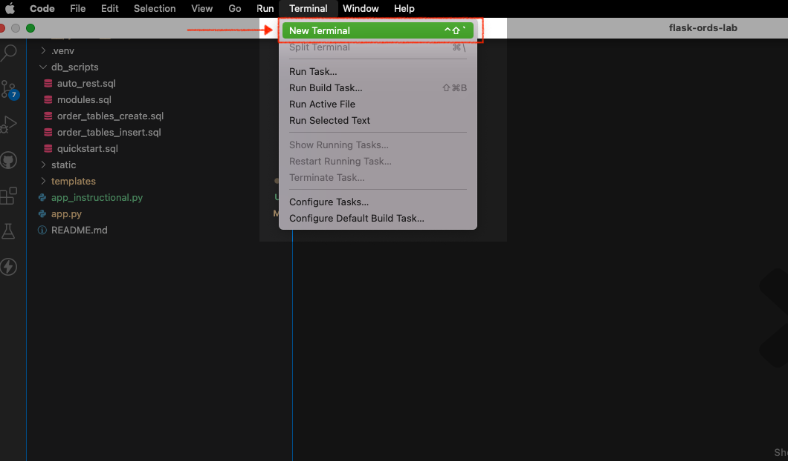

    Commands are different for MacOS/Linux and Windows. Alternatively, VS Code (if using) may automatically recognize the Flask application and activate the Virtual environment for you. Refer to the "Learn More" section of this Lab for more details on Virtual Environments in VS Code. Use the following to activate your Virtual Environment 

    - MacOS/Linux: ```$<copy>. venv/bin/activate</copy>```
    - Windows: ```><copy>venv\Scripts\activate</copy>```
    
    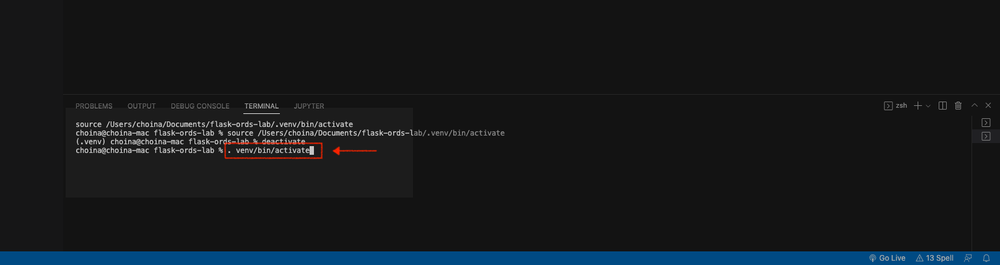

    You should now see a the prefix (or similar to) `(.venv)` in your terminal:
    
    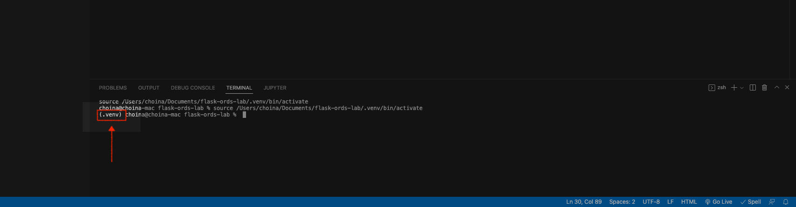

2. Next we'll start the Flask Application 

    There are various ways you can start your Flask application, this is the more manual method. If you'd like to review or learn about automated options for setting environment variables, you may refer to the "Learn More" section of this Lab. 
    
    Enter the following commands: 
    1. ```<copy>export FLASK_ENV=development</copy>```
    
        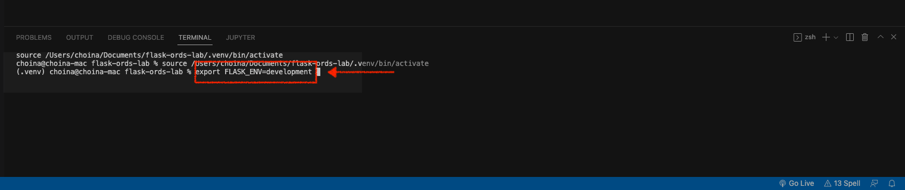
    
    2. ```<copy>export FLASK_APP=app.py</copy>```

        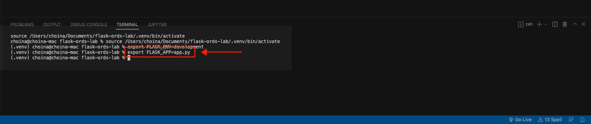
    
    3. ```<copy>flask run</copy>```
    
        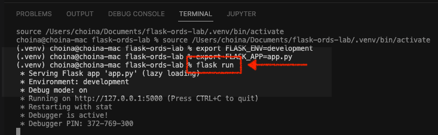

    4. Finally, you'll right-click the development server IP address to open the Flask application. It will open automatically in your default browser. 

        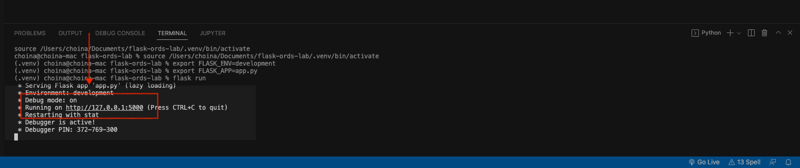

### Task 3: Review the basic HTTPS operations of the Flask application

1. Review the `index.html` page.

    When the Flask application first loads, you'll see this screen. You may explore the navigation tab (hamburger icon on upper right-hand corner). 

    But we'll first explore the Folium map at the bottom of the `index` page. 
    
    :bulb:  <i>We'll conduct a more in-depth review in a later Lab. But you should know that Folium "makes it easy to visualize data that’s been manipulated in Python on an interactive Leaflet.js map. To expand your knowledge of Folium and Leaflet.js, visit the "Learn More" section for more details.</i>

    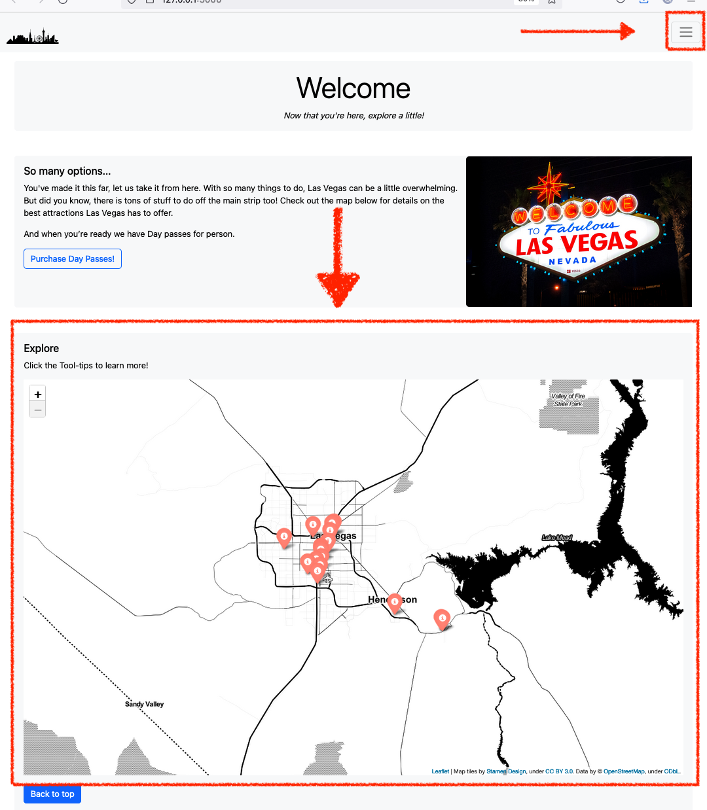

2. While focused on the Folium map, we can interact with location markers - these represent various attractions in the downtown Las Vegas area. In this application we are focused on venues such as museums and art installations.  

    Each marker will have a "Tool-tip"; when hovered over, suggesting the user clicks to reveal additional information:

    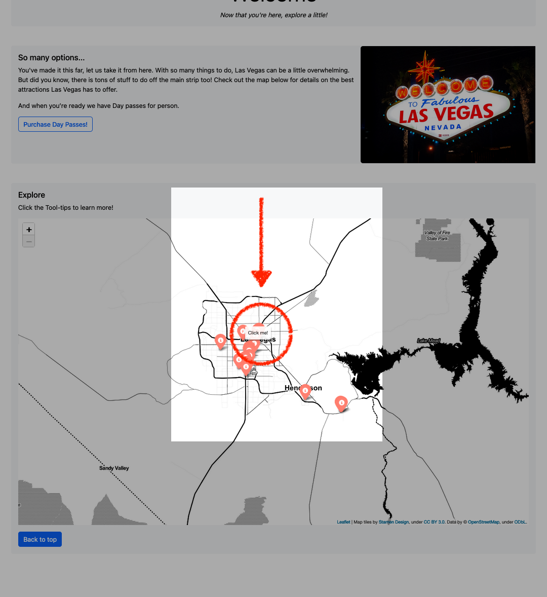

    When clicked, they reveal additional details about the location. In case you are curious, here is where first encounter Oracle REST APIs. You'll see the code in a later Lab, but for now, you can very easily retrieve the request information in your browser.

    Copy the following URI: <copy>https.[].com</copy> and place it into your browser's address bar. You should see the `items` from the `GET` request.

    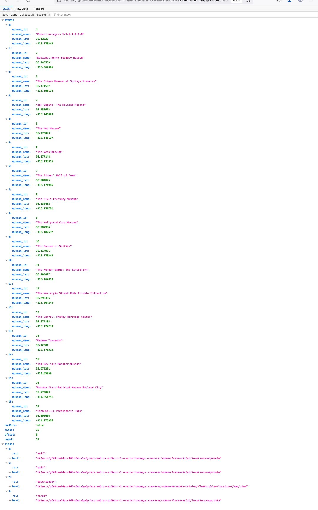

    <i>This</i> is where the Folium map gets its input from.

3. Manipulating the `GET` request

    1. But let's say you are a developer, and you've been provided with a set of Oracle REST APIs like this one. On the surface, they are simple enough. But you actually wield much more power than you may realize - with query parameters.

        Try this. Take the URI we just used, add this to the end ```<copy>?q={"$orderby":{"museum_lat" : "ASC"}}</copy>```, and then enter it into your browser's address bar. You'll see something like this: 

        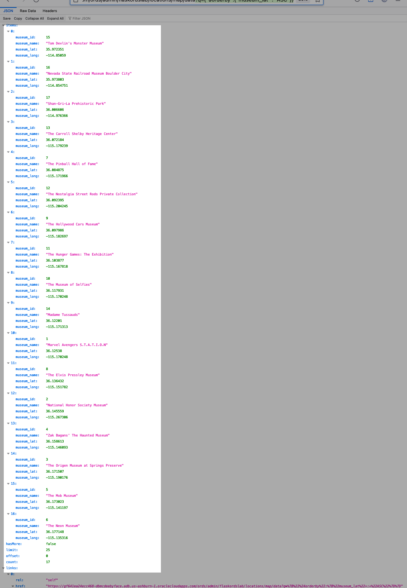

        What do you notice? If you caught that the venues are all ordered in ascending order, according to their latitudes, you'd be correct!

    2. Let's try one a little trickier one. Take that original URI, and then add this to the end: 
    ```<copy>?q={"museum_lat":{"$between": [36.05,36.15]}}</copy>```

        Now enter it into your browser's address bar. What do you see?

        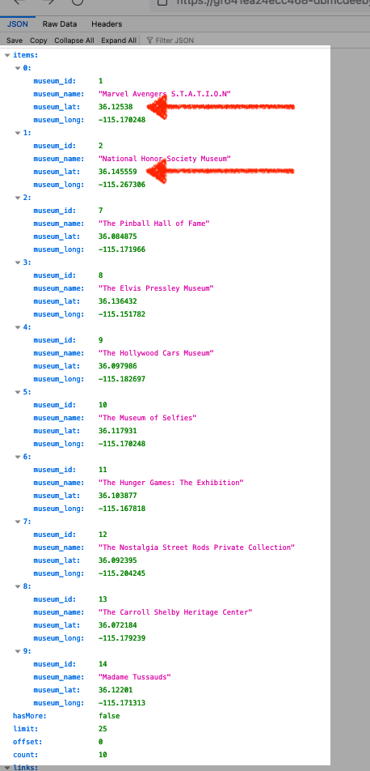
            
        You can probably tell by now, but we restricted our results to a very narrow window of latitudes. We have only scratched the surface with filtering in queries. But once you understand how your data is structured, and what is available, the possibilities are endless.

    3. The ability to perform myriad `GET` requests with a single API + query parameters is powerful. But its not just the `GET` operation. Lets take a look at a`POST` request.

4. Remixing the `POST` request

    We've created a Resource Handler for this table that can be used for the `POST` operation/method. 

    Let's say you'd like to add another location to this table. You as the developer can do that. This is <i>your</i> application, you should be able to make changes on-the-fly, as you deem necessary. Once the logic is set up on the database end, anything you feed to the table (that fits that logic) is fair game.

    1. First, begin by copying the cURL command that is appropriate for your environment. 

        1. Command Prompt:
            ```
            <copy>curl -v -X POST ^
            -H "Content-Type: application/json" "https://[Place your ORDS REST API here]" ^
            -d "{\"MUSEUM_NAME\":\"<VALUE>\",\"MUSEUM_LOCATION\":\"<VALUE>\",\"MUSEUM_LAT\":\<VALUE>\,\"MUSEUM_LONG\":\<VALUE>\}"</copy>
            ```
        2. Power Shell:
            ```
            <copy>curl.exe -v -X POST `
            -H "Content-Type: application/json" "https://[Place your ORDS REST API here]" `
            -d "{\"MUSEUM_NAME\":\"<VALUE>\",\"MUSEUM_LOCATION\":\"<VALUE>\",\"MUSEUM_LAT\":\<VALUE>\,\"MUSEUM_LONG\":\<VALUE>\}"</copy>
            ```
        3. Bash:
            ```
            <copy>curl --location --request POST \
            'https://[Place your ORDS REST API here]' \
            --header 'Content-Type: application/json' \
            --data-binary '{
            "MUSEUM_NAME": "<VALUE>",
            "MUSEUM_LOCATION": "<VALUE>",
            "MUSEUM_LAT": <VALUE>,
            "MUSEUM_LONG": <VALUE> 
            }'</copy>
            ```
    2. Then add whatever values you'd like, as long as they adhere to the datatypes ORDS expects. You may want to choose something unique so you can easily identify it. In this case we'd expect: 

        |Key              |Value's Data Type |Example Value                   |
        |---------------- | ---------------- | ------------------------------ |
        |`MUSEUM_NAME`    |VARCHAR2(500 BYTE)|"Henry's Old Time Saloon Museum"|
        |`MUSEUM_LOCATION`|VARCHAR2(500 BYTE)|"123 Tipsy Ave."                |
        |`MUSEUM_LAT`     |NUMBER(8,6)       |50.000000 <sup>a<sup>            |
        |`MUSEUM_LONG`    |NUMBER(9,6)       |100.000000 <sup>b</sup>          |

        <sup>a</sup> We've specified "Precision" and "Scale for the latitude. That's 8 digits in the number; 6 of them to the <i>right</i> of the decimal. 

        <sup>b</sup> We've also specified "Precision" and "Scale for the longitude. Here we have 9 digits in the number; 6 of them to the <i>right</i> of the decimal. 

        <i>An example <b>Bash</b> cURL Command:</i>
        ```<copy>
        curl --location --request POST \
        'https://[Place your ORDS REST API here]' \
        --header 'Content-Type: application/json' \
        --data-binary '{
        "MUSEUM_NAME": "test1",
        "MUSEUM_LOCATION": "test1",
        "MUSEUM_LAT": 50.000000,
        "MUSEUM_LONG": 100.000000 
        }'</copy>
        ```
    3. Enter your cURL Command in your terminal. 

        
    
    4. Then, using the URI from that first/previous `GET` request, enter it into your browser's address bar. You should now see the new record added to your list.  

        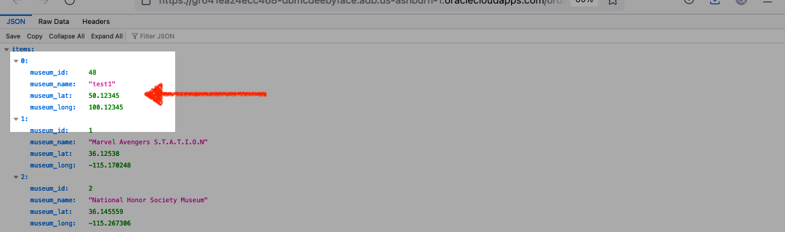
    
        - You're probably wondering how this actually gets added to the database. Well, you as the developer may never see this part but the logic for this `POST` Resource Handler actually looks like this: 

            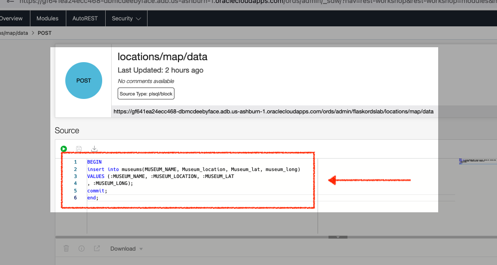

        - But you as the developer may never even see this. However, when provided credentials to Oracle Cloud Infrastructure you may one day use the Database Actions interface to create your very own custom APIs. 

5.  Congratulations! You've sent a `POST` request with the help of ORDS. By now you should have a better understanding of what occurs "under the covers" on the database.

### Task 4: Review the remainder of application

1. With your application open, click the "Purchase Day Passes" button.

    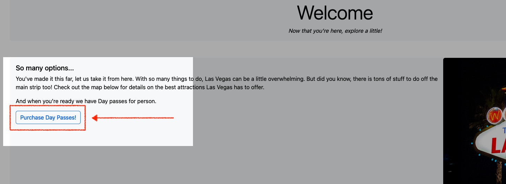

2. You should see the `orderform.html` page load. Yet again, we have information provided to us by ORDS. The "choose an option" dropdown has already been populated with choices. This was done upon page load, and the information came from our database and was handled exclusively by our Oracle REST APIs.

    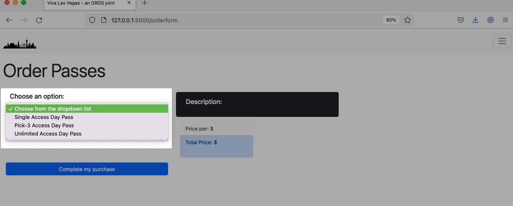

3. When you make a selection, you'll see the "Description" <i>and</i> "Price per" fields change to reflect your product selection. If you thought "Oracle REST APIs" just then, you'd be correct. We have <i>yet another</i> REST API for requesting product description and pricing information.  

    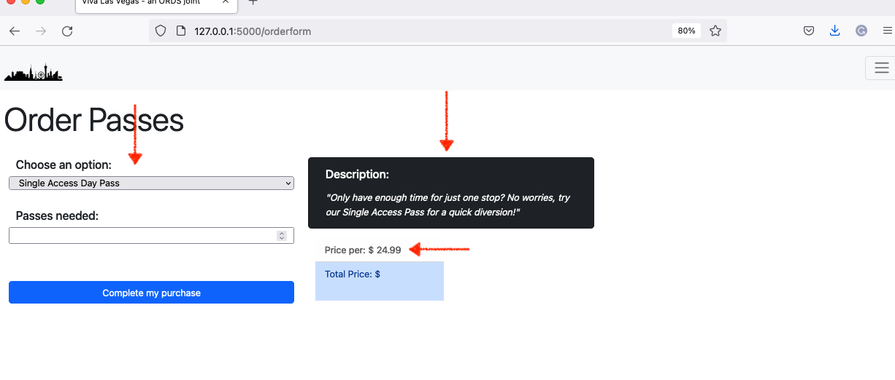

4.  Next, update the "Passes needed", you'll see the "Total Price" field update. When you're satisfied with your selections click the "Complete my purchase" button. 

    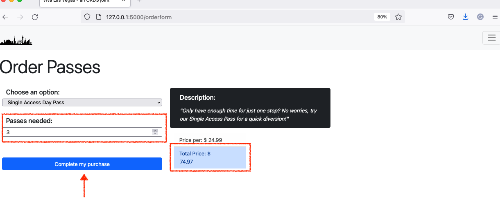

5. You'll then see the `orderhistory.html` page load. To keep this simple, we've omitted the payment gateway step, but since you have access to the code, you <i>could</i> always add that in later. 

    A table with our previous orders will appear. Yet again, we have been served this data through another Oracle REST API. You'll see how all this works in our `app.py` file. But for now, its important to understand what is happening as we step through the next few Labs. 
    
    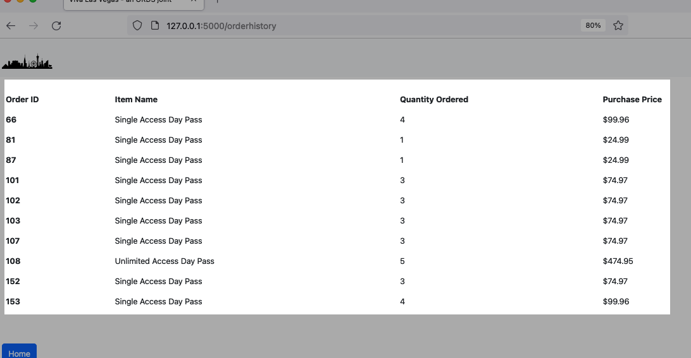 

6. You made it! Continue to the next Lab for more.

## Learn More
* [A minimal application in Flask](https://flask.palletsprojects.com/en/2.1.x/quickstart/#a-minimal-application)
* [About the Flask "Application Object"](https://flask.palletsprojects.com/en/2.1.x/api/#application-object)
* [Python Virtual Environments in VS Code](https://code.visualstudio.com/docs/python/environments)
* About environment variables in Flask:
    * [The `python-dotenv` library](https://github.com/theskumar/python-dotenv#readme)
    * [Flask documentation - Environment variables](https://flask.palletsprojects.com/en/2.2.x/cli/#environment-variables-from-dotenv)
* [About Folium](https://python-visualization.github.io/folium/)
* [About Leaflet.js](https://leafletjs.com/)

## Acknowledgements
* **Author** - Chris Hoina, Senior Product Manager, Database Tools
* **Contributors**
  - Jeff Smith, Distuinguished Product Manager, Database Tools
  - Justin Biard, Senior Member of Technical Staff, Database Tools 
  - Zachary Talke, Product Manager, Database Tools
  - Brian Spendolini, Principal Product Manager
* **Last Updated By/Date** - Chris Hoina, August 2022
