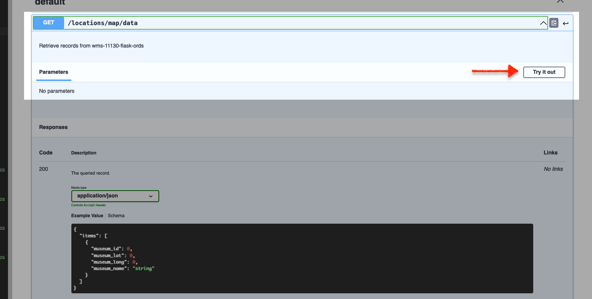

# Title of the Lab

## Introduction

In this lab we will explore the Oracle REST Data Services (ORDS) APIs used within the OpenAPI Swagger editor.

Estimated Time: 20 minutes

### About OpenAPI and Swagger
This lab will discuss a variety of Enterprise and open source technologies, including: 
- Oracle REST Data Services (ORDS)
- Oracle Clould Infrastructure (OCI) <i>Always Free</i> Tier Tenancy
- Datbase Actions
<!-- I'm actually not sure about cURL, but I don't want to forget it -->
<!-- Make sure any changes here are also included in the Learn More section - we'll want to include those resources as well  -->
- cURL
- Python 3.10.x and later 
- Python packages (libraries) such as: 
  - Flask 
  - Folium 
  - Json
 - Requests 
- <i>select</i> JavaScript functions 
- Bootstrap HTML and CSS frameworks
- Microsoft Visual Studio Code 

We will discuss and explore these technologies and solutions in a practical sense. However, should you wish explore above what this workshop covers, we encourage you to refer to the "Learn More" section of this page. 

### Objectives

In this lab, you will:
* Inspect the provided ORDS API
* Review the available Paths and HTTPS Operations

### Prerequisites
This lab assumes you have:
* All previous labs successfully completed

## Task 1: Navigate to Swagger Editor 

For this lab we'll rely on Swagger's Open Source Editor to review our ORDS Base URI, as well as the available API <i>Paths</i> and <i>Operations</i>. 

:bulb: <i>You may skip straight to the [Swagger Editor](https://editor.swagger.io/), or follow along below.</i>

1. Navigate to the [Swagger home page](https://swagger.io/) and select the Swagger editor link (located under the <b>Tools</b> dropdown):

    

2. Next, select "Live Demo"; a blank Swagger Editor session should load. 

    

3. If a new Editor session page does not appear, navigate to the `File` menu option, and select `Clear Editor`. A new blank session should then appear.

    

4. Next, navigate to `File` then `Import URL`.

    Copy the following ORDS Base URI: 

    ```
    <copy></copy>
    ```


    
    
    Paste it into the input field, click `OK`.

    

5. Locate Swagger documentation, available Paths and their Operations.

    Once loaded, Swagger documentation will appear on the left, along with a list of the available ORDS Paths and their Operations on the right of your screen. These few Paths and Operations are all you will need for our Flask application to work properly.

      

## Task 2: Review the OpenAPI 3.0 definitions

1. First, collapse the Swagger documentation tree: 
 
    

2. We'll briefly review the tree, before reviewing the ORDS Paths and their Operations.

    - `openapi` - this particular ORDS API adheres to the OpenAPI 3.0 specification for API documentation. To learn more about OpenAPI specifications, you may refer to the resources provided in the "Learn More" section of this lab.

      

    - `info` - here you can see the `title` and `version` of the ORDS API <i>Base URI</i>.

      

    - `servers` - this is the actual Base URI for this ORDS API. All Paths and parameters will be added to this existing <b>U</b>niversal <b>R</b>esource <b>I</b>dentifier (URI), referred to as a **URL** here. 
    
      

    - `paths` - here you'll see an example of one of our Paths. Of the two, you can see all properties of the first `/products/info/{product_id}`. You'll also see the HTTPS Operations for both - `GET` methods.

      

    - `components` - here you can review the Components;<i>globally-defined</i> parameters that may be shared across the various Paths and their HTTPS Operations.

      

## Task 3: Explore ORDS Templates and Handlers

1. Locate the Paths

    Under the "default" section of the browser (on the right side of your window), you'll see the <i>Paths</i> available to us: 
    - `GET` `/locations/map/data` 
    - `GET` `/products/info/{product_id}`
    - `GET` `/products/value/{product_id}`
    - `POST` <i>and</i> `GET` `/purchases/history`

        

    While these are all considered Paths, ORDS would also consider that these are **four** different <i>Resource Templates</i>. All are unique, with the exception of the `/purchases/history` Resource Template. This Resource Template has a Resource <i>Handler</i> for `GET` <i>and</i> `POST` Operations. Please refer to the "Learn More" section of this Lab to learn more about Resource Templates and their relationship to Resource Handlers. 

2. Explore the Paths

    Here we'll review selected Paths (recall there are <i>four</i> Resource Templates) and discuss their importance to the Flask application.

      1. `GET` `/locations/map/data`

          1. Hover over this Path and a dropdown arrow will appear. Click this to expand the window. 
          
              :bulb: <i>You'll follow similar actions for subsequent Paths.</i>

              

          2. Click "Try it out".

              
          
          3. The "Execute" button will appear, click it to issue a `GET` request.

              

          4. Scroll down slightly, to see the <b>Response Body</b> of the `GET` request. What does this payload look like it could be used for? If you guessed a map rendering, than you're correct. We'll use this information to populate a Folium map for our Flask application's main page (aka `index.html`)

              

              :bulb: <i>Folium is a Python library, based on the Lealflet.js, used for visualizing data on interactive Leaflet maps. Refer to the "Learn More" section for details.</i>

      2. `GET` `/products/info/{product_id}`

          1. Once you've expanded this window, click `Try it out`. Notice the input field for an Implicit Parameter; we'll be updating this shortly. 
          
              

          2. Your Flask application has three different products, each with their own Product ID (i.e. `product_id`). For testing this Path, input the number`1`. And then click `Execute`.
          
              

          3. Notice how the Request URL has changed slightly, to include the `product_id` we included. Next, take a look at the Server response. You'll see the `product_description` for this product.

          You'll see this `product_description` later in the HTML page for ordering/purchasing. Each time a product is selected/changed a separate API call is executed to return back the description for that product.

          A similar Path has been created for `GET` `/products/value/{product_id}`. But instead of a product description, the unit price for a product is returned. 
          
              

      3. `POST` `/purchases/history`

          1. Next we'll review the `/purchases/history` Path. Recall this Path has both a `GET` and a `POST` request. We'll review the `POST` request for this example. 
          
              Expand the window and click `Try it out`. Notice the Example Value - Schema. This is what a JSON object would look like when `POST` requests are send.
          
              

          2. After clicking `Try it out` the Request body will expand and have a placeholder array. We'll remove this for our test `POST` request. 
          
              

          3. You may leave the `{}` in place, and click `Execute`. We have included SQL in our database to accept an empty array for testing purposes. This way, the `POST` request will be a success (as indicated by our `200` Server Response Code).
                        
              

          4. Once the `POST` completes, you'll see in the Response body, a `201` Server Response code which indicates that a new resource was created. The action we just performed mirrors what customer would do should they complete a transaction in our sample Flask application.

              

                :bulb: <i>Recall that the `/purchases/history` Path has both a `GET` and a `POST` Operation. The steps for the `GET` of this Path are similar to what we explored in the `/locations/map/data` Path.</i>

            5. You may now proceed to the next Lab.

## Learn More

* [About ORDS](https://www.oracle.com/database/technologies/appdev/rest.html)
* [About OpenAPI Specifications](https://swagger.io/docs/specification/basic-structure/)
* [About ORDS Resource Templates and Handlers](https://docs.oracle.com/en/database/oracle/oracle-rest-data-services/22.2/orddg/developing-REST-applications.html#GUID-50E24524-32BB-470D-8015-6C25C9B47A44)
* [About Folium](http://python-visualization.github.io/folium/)
* [About Leaflet.js](https://leafletjs.com/)

## Acknowledgements
* **Author** - Chris Hoina, Senior Product Manager, Database Tools
* **Contributors**
  - Jeff Smith, Distuinguished Product Manager, Database Tools
  - Justin Biard, Senior Member of Technical Staff, Database Tools 
  - Zachary Talke, Product Manager, Database Tools
  - Brian Spendolini, Principal Product Manager
* **Last Updated By/Date** - Chris Hoina, August 2022
