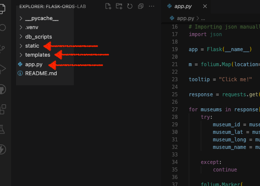
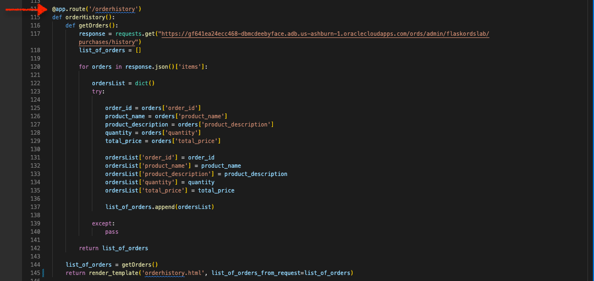

# Review the Application and routes

## Introduction

In this Lab we will obtain the Python application and related contents for this Workshop. We will then briefly explore our Flask application's routes and their contents. 

Estimated Time: 20 minutes

### About Oracle REST Data Services (ORDS) and Developer Tools 
This lab will discuss a variety of Enterprise and open source technologies, including: 
- Oracle REST Data Services (ORDS)
- Oracle Cloud Infrastructure (OCI) <i>Always Free</i> Tier Tenancy
- Database Actions
<!-- I'm actually not sure about cURL, but I don't want to forget it -->
<!-- Make sure any changes here are also included in the Learn More section - we'll want to include those resources as well  -->
- cURL
- Python 3.10.x and later 
- Python packages (libraries) such as: 
  - Flask 
  - Folium 
  - Json
 - Requests 
- <i>select</i> JavaScript functions 
- Bootstrap HTML and CSS frameworks
- Microsoft Visual Studio Code 

We will discuss and explore these technologies and solutions in a practical sense. However, should you wish explore above what this workshop covers, we encourage you to refer to the "Learn More" section of this page. 

### Objectives

In this lab, you will:
* Inspect the provided Python application 
* Review the provided HMTL and CSS
* Review the provided JavaScript Functions

### Prerequisites
<!-- At least for this lab, do we even need prerequisites? -->
* A text editor (such as Visual Studio Code or Sublime Text)

This lab assumes you have:
* All previous labs successfully completed

## Task 1: Obtain code for this Workshop

1. Navigate to [this repository]().
2. If you have an existing GitHub account you may choose to fork the repository for this Workshop. 
    - Alternatively, you may choose to download the contents of this Workshop as as `.ZIP` file. 

  

3. Once you have forked the repository (or installed locally through the ZIP option), the contents should look similar to this: 

    

    At a <i>minimum</i> you'll want to ensure you have a `static` folder, `templates` folder, and the Python application `app.py`.

:bulb: <i>For details on how to run a Flask application in a Virtual Environment (venv), refer to the [Installation](https://flask.palletsprojects.com/en/2.2.x/installation/) and [Quick Start](https://flask.palletsprojects.com/en/2.2.x/quickstart/) steps in the Flask documentation.</i>

## Task 2: Review the Python application and functions

1. Locate your Python application.

    Once you have located the Workshop contents (either forked or saved locally), open the <b>app.py</b> file in your preferred editor. This Workshop uses Visual Studio Code (VS Code or VSC) for file editing/review.

    

2. Review the libraries included in this application. 

    Once the application loads into your editor, notice the libraries we've imported to allow this application to work: 

    

    You may have used these libraries in other projects as they are popular in Python application development. Libraries include: 
    - Folium
      - plugins
      - JavaScriptLink
      - Tooltip
      - Icon
    - Flask
      - Flask 
      - json
      - render_template
      - request
      - redirect
      - jsonify
    - requests
    - json 

3. Python application overview

    Beginning with the first line in our code you'll see we have created an instance of the `Flask` class: 

      ```app = Flask(__name__)```

    You may have seen this before, here the argument `(__name__)` is sufficient for such a small scale application. You may review the selected documentation on this subject in the "Learn More" section of this lab. 

    

4. Review the Folium contents of the application

    Here you'll see several parts to the Folium section of the application. 

    

    1. We set the initial, base Folium map = `m`
        - You'll also notice we've included starting coordinates, set minimum and maximum zoom properties, as well as a visual presentation option (i.e. "Stamen Toner")
    2. We include a tooltip; which you'll see later when we load the application 
    3. Next we rely on the "Requests" library to `GET` json from our Autonomous Database, via ORDS APIs
        - We perform an iteration to gather the necessary information for populating our map
    4. We'll then create individual markers for the museum locations we retrieved from our database 
        - Here we'll pass the latitude and longitude coordinates
        - We'll then include information pop-ups for all the museums
          - Notice how we include the `museum_name` as HTML, the icon color and type, along with `tooltip`

      :bulb: <i>**Note:** The tooltip generates a helpful bubble when hovered over that reads "Click me!"; you'll see it soon enough.</i>

    5. Finally you'll see the line: 
    `lvmap = m._repr_html_()`
    We include this to temporarily save our map as a HTML iframe (this includes all necessary HTML and JavaScript properties), which we'll later use as an argument in our application's index page (in Flask)

5. Review our application routes

    If you are familiar with Flask, then you'll know all about routes. You may skim this section to become acquainted with the behavior of the application. If not, here is the primer: application routes (aka `app.route()`) are triggered when actions are performed in the application. 
    
    In some cases the results of a function may be passed back to the user, in other cases a new HTML page may load, in other cases the user may be redirected to a new page.
    
    In all cases, you'll notice that an ORDS endpoint is used for either a `GET` or `POST` method.

## Task 3: Review the Routes 
    
1. `@app.route('/')`
        
    

    This route contains the `index()` function. When a user navigates to the home page they'll be presented with the `index.html` page. We are also including our newly constructed Folium map, `lvnmap` as an argument. 
    
    We'll review the HTML pages shortly so you can view all functions and their output in context.

2. `@app.route('/get_price')`

    

    The function of this route `getPrice()` appends `a` to an ORDS endpoint. From there we retrieve product prices from a product table. This will be one of the fields we'll use in a drop-down menu (found on the `orderform.html` page).
    
    You'll notice the final line in this function `return jsonify(product_price)` which takes the response and converts it to the JSON format while also assigning it a mimetype of "application/json". Later, we'll review this route along with a JavaScript function, to learn how they work in tandem with our ORDS endpoint. 

3. `@app.route('/get_description')`

    

    Much like the `get_price` app route, this function requests product description information from our database. It uses a similar syntax as before. We then `return jsonify(product_description)` which takes the response and converts it like before. 

4. `@app.route('/orderform')`

    

    Using a separate ORDS endpoint, our application performs a more typical `GET` request. Here we return a list of products, along with the `orderform.html` page. Notice how we create new variables, which we'll use for with our JavaScript functions. We'll review our three JavaScript functions in the next lab. 

5. `@app.route('/orderhistory')`

    

    Performing a `GET` request to this endpoint will return the items in a table that stores customer order history. While this particular application doesn't cover credentialing of individual customers, the aim is to showcase the ease of retrieving <i>specific</i> customer data with relative ease.

    You'll see how this app route is triggering in the `orderform.html` page. 

6. `@app.route(/result', methods = ['POST', 'GET'])`

    

    Using the same ORDS endpoint as the `orderhistory` app route, we can infer that this route expects a `POST` request originating from the Flask application. This function also performs actions such as establishing the key:value pairs of the incoming data, and the JSON payload headers well. 

    In short, this function is triggered by the submit action on the `orderform.html` page. But rather than staying on that page, the user is redirected to the `orderhistory.html` page. 
    
7. You may now proceed to the next Lab.

## Learn More
* [A minimal application in Flask](https://flask.palletsprojects.com/en/2.1.x/quickstart/#a-minimal-application)
* [About the Flask "Application Object"](https://flask.palletsprojects.com/en/2.1.x/api/#application-object)

## Acknowledgements
* **Author** - Chris Hoina, Senior Product Manager, Database Tools
* **Contributors**
  - Jeff Smith, Distuinguished Product Manager, Database Tools
  - Justin Biard, Senior Member of Technical Staff, Database Tools 
  - Zachary Talke, Product Manager, Database Tools
  - Brian Spendolini, Principal Product Manager
* **Last Updated By/Date** - Chris Hoina, August 2022
